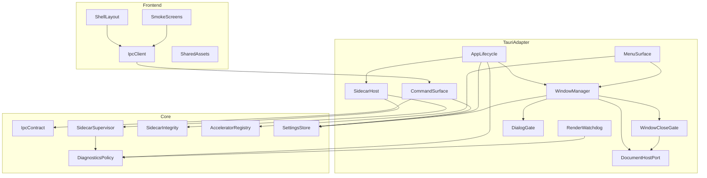
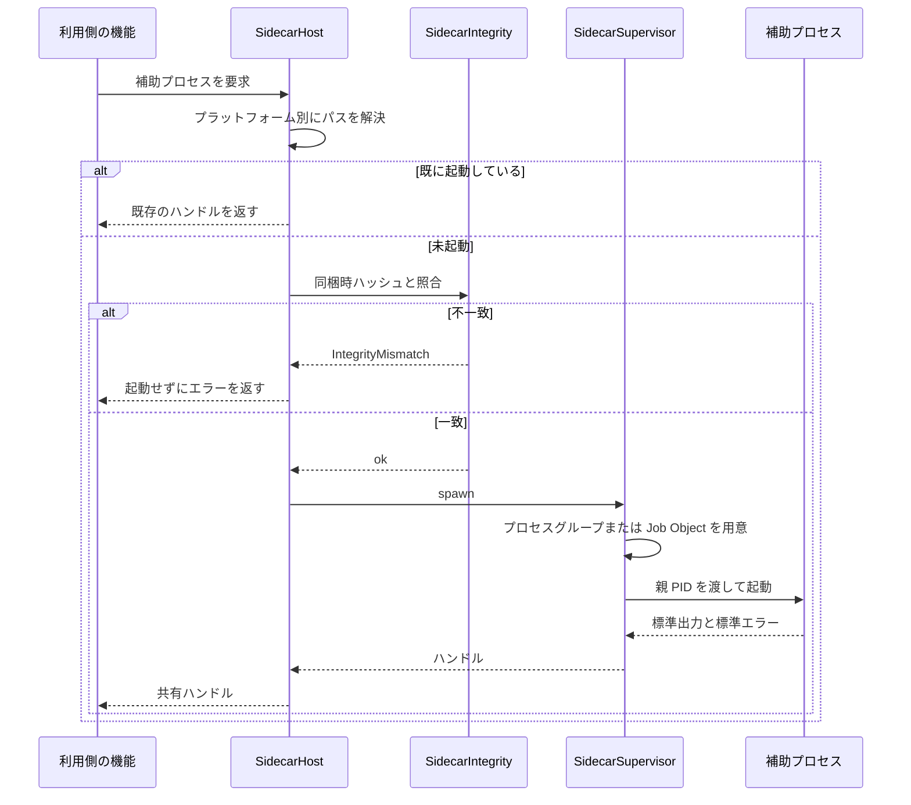
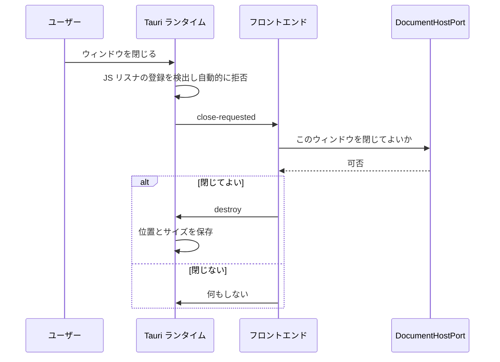
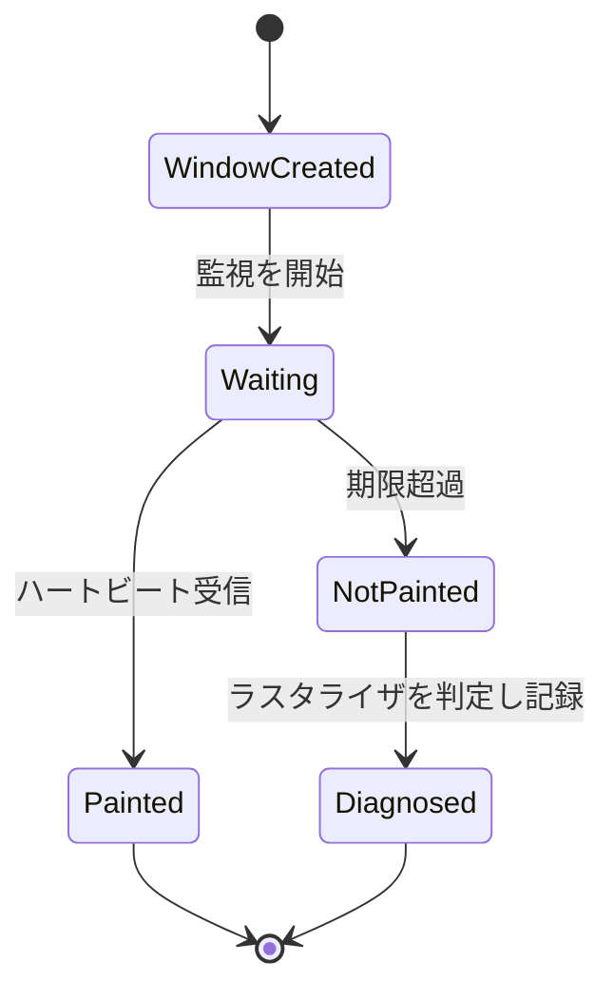

# Design Document: app-shell

## Overview

**Purpose**: 本機能は jxcel の「器」を提供する。Windows / macOS / Linux のいずれでも単一のファイルを実行するだけで立ち上がるデスクトップアプリケーションと、後続 13 スペックがその上に乗るための共通基盤 — 型付き IPC 境界、ウィンドウのライフサイクル、補助プロセスの起動基盤、画面が差し込まれるシェル構造 — を確立する。

**Users**: 直接の利用者は jxcel を受け取って起動するユーザーであり、同時に後続スペックの実装者が本機能の契約の上で作業する。器がなければどの機能もユーザーに届かず、境界がなければ届いた頃には保守できなくなっている。

**Impact**: 現在このリポジトリは `crates/document-format/` という GUI 非依存のライブラリ 1 本しか持たない。本機能は `crates/app-shell/`（Tauri 非依存のコア）、`src-tauri/`（Tauri アダプタ）、`src/`（フロントエンド）を新設し、既存の 3 OS CI を Tauri ビルドまで拡張する。`document-format` には手を触れず、依存もしない。

### Goals

- 3 OS で単一ファイルとして起動し、操作可能なウィンドウが 2 秒以内に現れる
- フロントエンドとドメインの間に、型が単一定義から導かれ不一致がビルドを落とす通信境界を 1 本だけ引く
- 10 万行規模のデータを 1 回の呼び出しで運べる経路を、上記の型体系を壊さずに用意する
- 補助プロセスを同梱・検証・起動・共有・確実に終了させる基盤を、Tauri のプラグインが埋めていない欠落を自前で埋める形で持つ
- Linux で「無言の白画面」が起きない — 描画の失敗を検出して記録する
- 後続スペックがメニュー項目・画面・コマンドを差し込める登録口を定義する

### Non-Goals

- ドキュメントの読み書き・検証・型の意味論（`document-format` / `schema-engine` が所有）
- 個別画面の中身（`data-grid` / `schema-editor` / `macro-editor-lsp` / `form-builder` が所有）
- 言語サーバそのものの選定と実装（`macro-editor-lsp` が所有）。本機能は「どの実行ファイルでも同梱・起動できる機構」だけを持つ
- 自動更新、署名配布、認証、権限管理
- グリッド実装の選定（`data-grid` が所有）。本機能は React + Vite までしか約束しない

## Boundary Commitments

### This Spec Owns

- **配布物の形と生成**: 3 OS それぞれの単一ファイル成果物と、それを生成・検証するパイプライン
- **プロセスとウィンドウのライフサイクル**: 単一インスタンス制御、ウィンドウの生成と終了、終了拒否の仲介、最後の 1 枚の扱い
- **型付き IPC 境界の機構**: 境界を越える型の単一定義、TypeScript への生成、ドリフト検査、エラー封筒、呼び出し元ウィンドウの識別、大きなペイロードの経路
- **補助プロセス基盤**: 同梱・整合性検査・パス解決・起動・ウィンドウ間共有・終了保証・出力の取得
- **登録口の定義**: メニュー項目、コマンド、画面領域を後続スペックが差し込むための契約
- **設定ストア**: キー空間の機構、原子的な永続化、未知キーの保持、破損時の既定値起動
- **診断**: ログの保持方針、秘匿規則、クラッシュ記録、書き出し
- **フロントエンドのシェル**: レイアウト領域、遷移、外観、画面単位のエラー隔離
- **描画健全性の検出**: 初回描画のハートビートとソフトウェアラスタライズの判定

### Out of Boundary

- **個々のコマンドの実装**。本機能はコマンドが載る面と規約を持つが、`document-format` を呼ぶコマンドも `schema-engine` を呼ぶコマンドも所有しない
- **個々のメニュー項目と個々の設定キー**。登録口と既定値の機構だけを持つ
- **ドキュメントの内容の解釈**。ウィンドウにドキュメントを関連付けるが、その中身を読まない
- **言語サーバの選定**。ただし Linux で追記型ペイロードを持つ実行ファイルが使えないという制約は本機能が申し送る
- **実用的な補助プロセスの同梱**。本機能の実装時点で言語サーバは存在しない。したがって本機能は `crates/sidecar-smoke/` として**機構検証専用の最小の補助プロセスを自ら所有し**、同梱・整合性検査・起動・共有・終了・出力取得のすべてをそれで検証する。実物を登録するのは `macro-editor-lsp` である
- **実用水準の画面**。3 OS 描画確認のための最小画面のみを持ち、育てるのは各機能

### Allowed Dependencies

- **`crates/app-shell/` は tauri に依存してはならない**（推移的依存も含む）。`document-format` を含む他の jxcel ドメインクレートにも依存しない。roadmap における本スペックの依存は none である
- **`src-tauri/` は `crates/app-shell/` にのみ依存する**。業務ロジックを持たない
- **`src/shared/` は Tauri の通信境界に依存してはならない**。`window.__TAURI__` への参照が現れたら誤りである
- 依存の向きは **`crates/app-shell/`（コア） → `src-tauri/`（アダプタ） → `src/`（フロント）** の一方向であり、逆流を許容しない
- 外部依存の下限: `tauri >= 2.11.3`、`tauri-plugin-single-instance >= 2.4.3`

### Revalidation Triggers

以下の変更は、依存する各スペックに統合の再確認を強いる。

- **IPC の型定義またはコマンド名の変更** — 生成される `bindings.ts` が変わり、フロント側の全利用者が影響を受ける
- **コマンド登録の根（`src-tauri/src/commands/mod.rs`）の構造変更** — 全機能スペックが自分のコマンドをここに列挙するため、共有の継ぎ目である
- **サイドカーの配置方式の変更** — `macro-editor-lsp` の配布形態の前提が変わる
- **`DocumentHost` ポートの契約変更** — ウィンドウとドキュメントを結ぶ機能が影響を受ける
- **capability / permission の追加** — フロントエンドの到達範囲が広がるため、要件 4.7 の機械検査を再確認する
- **フロントエンドのシェル領域の定義変更** — 全 UI スペックが差し込み先を失う
- **`tauri` メジャーバージョンの更新、または `dynamic-acl` feature の無効化** — 権限モデルの前提が変わる

## Architecture

### Architecture Pattern & Boundary Map



**Architecture Integration**:

- **選定パターン**: Tauri 非依存コア + 薄いアダプタ。steering の「エンジンと UI の分離」をディレクトリ構造で強制する規則をそのまま適用した。`Core` の 6 コンポーネントはすべて GUI を起動せずにテストできる
- **依存の向き**: `Core → TauriAdapter → Frontend`。左のレイヤーのみを import する。`SharedAssets` はどこにも依存しない（図に流入辺がないことが契約である）
- **境界の分離理由**: プロセス監督・整合性検査・ショートカット競合検査・設定の原子的書き込みはいずれも Tauri の不具合と独立に検証したい対象である。Tauri のプラグインがこれらを埋めていない（後述）以上、自前実装は避けられず、ならば GUI 非依存の場所に置く
- **`SharedAssets` が孤立している理由**: フォームレンダラのようにデスクトップ内と LAN 配信の Web ページの両方で動く資産の置き場である。ここに IPC 依存が入ると `form-web-server` が成立しない（要件 9.6）
- **`DocumentHostPort` の存在理由**: 要件 2.1 / 2.6 は「ドキュメントを所有する機能」への委譲を要求するが、その機能はまだ存在しない。ポートを本機能が定義し、常に許可する既定実装を同梱する。下流スペックが差し替える

### Technology Stack

| Layer | Choice / Version | Role in Feature | Notes |
|---|---|---|---|
| Frontend | React 19 + Vite 7 + TypeScript 5 | シェル構造、遷移、外観、スモーク画面 | SPA。Tauri は SSR 非対応。React の選定理由は決定 8（`monaco-languageclient` の一次ラッパが React のみ） |
| Frontend 型 | `ts-rs` 12.0.1 の生成物 | 境界を越える型の TypeScript 表現 | 生成物をコミットする。lint の `no-explicit-any` 対象外にはしない（生成物に `any` は入らない） |
| Shell | `tauri` 2.11.5（下限 2.11.3） | ウィンドウ、IPC、バンドル | 2.11.1 に security fix 2 件。2.11.3 で起動性能改善 |
| Shell プラグイン | `tauri-plugin-single-instance` 2.4.4（下限 2.4.3）、`tauri-plugin-dialog` 2.7.3、`tauri-plugin-log` 2.9.1 | 単一インスタンス、ファイル選択、ログ | `tauri-plugin-fs` と `tauri-plugin-shell` は**依存に入れない**（決定 3） |
| Core | Rust 2021、`serde` / `serde_json`、`sha2`、`thiserror` | 監督・整合性・設定・診断 | `crates/app-shell/`。tauri 非依存 |
| Core プラットフォーム | `windows-sys`（Job Object）、`libc`（プロセスグループ） | サイドカーの終了保証 | `cfg` で分岐。決定 5 |
| Infrastructure | GitHub Actions（既存 `ci.yml` を拡張） | 3 OS ビルド、整合性検査、起動時間計測 | 新設しない（要件 6.2） |

`tauri-plugin-store` と `tauri-plugin-window-state` は採用しない（決定 6 および Risks を参照）。詳細な比較は `research.md` にある。

## File Structure Plan

### Directory Structure

```
crates/sidecar-smoke/               # 機構検証専用の最小の補助プロセス（bin クレート）
└── src/main.rs                     # 親 PID を監視して自己終了し、標準出力へ応答するだけ

sidecars/                           # 同梱する補助プロセスの原本の置き場
└── .gitkeep                        # ビルドが成果物をターゲットトリプル接尾辞付きで配置する

crates/app-shell/                   # Tauri 非依存のコア。GUI なしでテストできる
├── build.rs                        # サイドカー原本の SHA-256 を compile-time const として発行
├── src/
│   ├── lib.rs                      # 公開 API の再輸出と層の宣言
│   ├── ipc/
│   │   ├── mod.rs                  # 境界を越える型。ts-rs derive を持つ唯一の場所
│   │   ├── command_names.rs        # コマンド名の単一配列。ハンドラ登録と TS 生成の共通の源
│   │   └── error.rs                # 型付きエラー封筒
│   ├── bin/
│   │   └── generate-bindings.rs    # 生成物を書く唯一の入口（開発用バイナリ。配布物には含めない）
│   ├── sidecar/
│   │   ├── mod.rs                  # SidecarSupervisor の公開 API
│   │   ├── supervisor.rs           # 起動・共有・再起動・終了・出力の取得
│   │   ├── group_unix.rs           # プロセスグループと killpg
│   │   ├── job_windows.rs          # Job Object と KILL_ON_JOB_CLOSE
│   │   ├── orphan_sweep.rs         # 起動時の残留プロセス掃除。PID と実行ファイル名で照合
│   │   └── integrity.rs            # 同梱時ハッシュとの照合
│   ├── settings/
│   │   ├── mod.rs                  # キー空間・既定値・未知キー保持・変更通知
│   │   └── atomic.rs               # temp + rename + fsync
│   ├── accelerator.rs              # ショートカットの一意性検査
│   └── diagnostics.rs              # ログ保持方針・秘匿規則・書き出し束ね
└── tests/
    ├── bindings_drift.rs           # export_to_string とコミット済み .ts のバイト比較
    ├── sidecar_lifecycle.rs        # 終了保証と孤児不在の検証
    ├── sidecar_integrity.rs        # 改変の検出
    ├── settings_store.rs           # 原子性・未知キー保持・破損時の既定値
    └── accelerator_conflict.rs     # 競合の検出

src-tauri/                          # Tauri アダプタ。業務ロジックを書かない
├── Cargo.toml
├── build.rs
├── tauri.conf.json                 # externalBin / appimage.files / CSP / removeUnusedCommands
├── capabilities/default.json       # core:default のみ。fs と shell を含めない
├── permissions/app.toml            # __app-acl__ を有効化し自前コマンドを ACL 対象にする
└── src/
    ├── main.rs                     # 環境変数 → single-instance → Builder → run の順序を固定する
    ├── lifecycle.rs                # RunEvent / ExitRequested / Reopen
    ├── window/
    │   ├── mod.rs                  # 生成は async。ラベル規約とレジストリ
    │   ├── close.rs                # 終了拒否の仲介。destroy のみを使う
    │   └── geometry.rs             # 位置とサイズの記憶と復元
    ├── menu.rs                     # macOS はアプリ全体、その他はウィンドウ単位
    ├── commands/
    │   ├── mod.rs                  # invoke_handler の根。全機能スペックの共有継ぎ目
    │   ├── shell_cmds.rs           # app-shell 自身のコマンド
    │   └── bulk.rs                 # 生バイト応答の経路
    ├── sidecar_host.rs             # プラットフォーム別パス解決と supervisor の束ね
    ├── dialog.rs                   # 親ウィンドウを指定したネイティブダイアログ
    ├── watchdog.rs                 # 初回描画ハートビート
    └── ports.rs                    # DocumentHost ポートと既定実装

src/                                # フロントエンド
├── main.tsx
├── shell/
│   ├── Layout.tsx                  # 画面が差し込まれる領域の定義
│   ├── router.tsx                  # 遷移を扱う単一の仕組み
│   ├── theme.ts                    # 明暗と OS 追随
│   └── ScreenBoundary.tsx          # 画面単位のエラー隔離
├── ipc/
│   ├── bindings.ts                 # ts-rs 生成物。手で編集しない
│   └── client.ts                   # 薄い invoke ラッパ。生成された名前定数を参照する
├── shared/                         # 配信先中立。Tauri の通信境界に依存してはならない
│   └── README.md                   # この制約を破ると form-web-server が成立しないことの明記
└── features/
    └── smoke/                      # 要件 10.4 の 3 OS 描画確認用
        ├── TableSmoke.tsx          # 多数の要素を持つ表形式の描画
        └── EditorSmoke.tsx         # 文字編集を伴う描画

scripts/
├── check-capabilities.sh           # gen/schemas/capabilities.json の機械検査
├── check-shared-assets.sh          # src/shared/ が通信境界に依存していないことの検査
├── check-startup-budget.sh         # 起動 2 秒予算の判定
└── check-sidecar-integrity.sh      # バンドル後のサイドカーが同梱前と一致するかの検証
```

### Modified Files

- `Cargo.toml`（ワークスペース） — `members` に `crates/app-shell` と `src-tauri` を追加。既存の「tauri 依存禁止」コメントは `crates/document-format` に対する規則として維持し、適用範囲を明記する
- `.github/workflows/ci.yml` — 既存の 3 OS マトリクスに Tauri ビルド、配布物検証、整合性ゲート、起動時間計測を追加する。ジョブを新設せず既存マトリクスを拡張する（要件 6.2）
- `.gitignore` — `src-tauri/gen/`（生成物のうちコミット不要なもの）と `src/ipc/bindings.ts` の扱いを明記。**`bindings.ts` はコミットする**（決定 2 の検査対象であるため）

## System Flows

### サイドカーの起動と整合性検査



整合性検査を**起動の前**に置くのは要件 5.3 の要求である。AppImage は読み取り専用の squashfs であり、不一致を検出してもその場で修復できない。したがって検出は起動の中止と報告に接続され、修復には接続しない。

### ウィンドウの終了拒否



拒否の判定は非同期であるが、ランタイムは拒否の可否を非ブロッキングに読む。したがって「待ってから拒否する」ことはできない。Tauri は JS リスナが登録されているだけで自動的に拒否する機構を持っており、非同期の往復はこの経路に載せる。確定後は `close` ではなく `destroy` を使う — `close` は終了要求を再発火し、拒否に再突入する。

### 初回描画の監視



描画の失敗を検出する API は存在しない。「白いウィンドウ」と「アセットの読み込み失敗」は外から区別できないため、フロントエンドがマウント後の描画フレーム内から通知する形をとる。期限超過時は診断情報に記録し、ソフトウェアラスタライズかどうかを判定して、要件 10.3 の代替経路の適用判断に使う。回避策の環境変数は**検出された場合にのみ**適用する — 無条件適用は一部の環境の問題を全環境の性能低下と引き換えに直すことになる。

## Requirements Traceability

| Requirement | Summary | Components | Interfaces | Flows |
|---|---|---|---|---|
| 1.1 | 3 OS の単一ファイル配布物 | BuildPipeline | CI 成果物 | — |
| 1.2 | 追加インストール不要で起動 | AppLifecycle | — | — |
| 1.3 | 起動 2 秒以内 | BuildPipeline, AppLifecycle | `check-startup-budget.sh` | — |
| 1.4 | 前提不成立でも無言終了しない | AppLifecycle | `StartupError` | — |
| 1.5 | 二重起動の引き継ぎ | AppLifecycle | single-instance コールバック | — |
| 1.6 | 外部ネットワーク通信をしない | AppLifecycle, CommandSurface, BuildPipeline | CSP の `connect-src` 制限 + `check-capabilities.sh` | — |
| 2.1 | 1 ウィンドウに高々 1 ドキュメント | WindowManager, DocumentHostPort | `WindowRegistry` | — |
| 2.2 | 未指定起動で空ウィンドウ | WindowManager | `WindowManager::open_empty` | — |
| 2.3 | 別ドキュメントは新ウィンドウ | WindowManager | `WindowManager::open_for` | — |
| 2.4 | ネイティブファイル選択 | DialogGate | `DialogGate::pick_document` | — |
| 2.5 | 全ウィンドウが 1 プロセス | WindowManager | `WindowRegistry` | — |
| 2.6 | 閉じる前の可否問い合わせ | WindowCloseGate, DocumentHostPort | `DocumentHost::may_close` | 終了拒否 |
| 2.7 | 位置とサイズの記憶と復元 | WindowManager, SettingsStore | `geometry` | 終了拒否 |
| 2.8 | 最後のウィンドウで終了 | AppLifecycle | `RunEvent` 処理 | — |
| 2.9 | 常駐慣習を持つ環境では常駐 | AppLifecycle | `RunEvent::ExitRequested` | — |
| 2.10 | 生成失敗が他に波及しない | WindowManager | `WindowError` | — |
| 3.1 | メニューの登録口 | MenuSurface | `MenuRegistry::register` | — |
| 3.2 | 登録項目の表示と通知 | MenuSurface | `MenuRegistry` | — |
| 3.3 | ショートカットの割当と表示 | MenuSurface, AcceleratorRegistry | `Accelerator` | — |
| 3.4 | 競合の検出と報告 | AcceleratorRegistry | `AcceleratorRegistry::insert` | — |
| 3.5 | 操作対象ウィンドウにのみ適用 | MenuSurface | ウィンドウ単位のイベント | — |
| 3.6 | プラットフォームの配置慣習 | MenuSurface | `MenuSurface::install` | — |
| 4.1 | 単一の通信境界 | CommandSurface, IpcContract, IpcClient | `command_names` | — |
| 4.2 | 型は単一定義から | IpcContract, IpcClient | `bindings.ts` | — |
| 4.3 | 不一致でビルド失敗 | IpcContract, BuildPipeline | `bindings_drift.rs` + `tsc --noEmit` | — |
| 4.4 | 失敗を成功と区別できる形で返す | IpcContract, CommandSurface | `IpcError` | — |
| 4.5 | 10 万行を 1 回の呼び出しで | CommandSurface | `BulkResponse` | — |
| 4.6 | 呼び出し元ウィンドウの識別 | CommandSurface, WindowManager | `WindowContext` | — |
| 4.7 | 任意のファイル・プロセス経路を与えない | CommandSurface, BuildPipeline | `check-capabilities.sh` | — |
| 5.1 | 補助プロセスの同梱 | SidecarIntegrity, SidecarHost | `tauri.conf.json` | サイドカー起動 |
| 5.2 | 実行可能な状態で起動 | SidecarHost | `SidecarHost::resolve` | サイドカー起動 |
| 5.3 | 不一致を起動前に検出 | SidecarIntegrity, SidecarHost | `verify` | サイドカー起動 |
| 5.4 | 起動失敗を区別して報告 | SidecarSupervisor | `SpawnError` | サイドカー起動 |
| 5.5 | ウィンドウ間で共有 | SidecarSupervisor, SidecarHost | `SidecarHandle` | サイドカー起動 |
| 5.6 | 終了時に孤児を残さない | SidecarSupervisor, AppLifecycle | Job Object / プロセスグループ | — |
| 5.7 | 予期せぬ終了を通知し巻き込まない | SidecarSupervisor | `SidecarEvent::Exited` | — |
| 5.8 | 再度必要になれば起動を試みる | SidecarSupervisor | `SidecarSupervisor::ensure` | サイドカー起動 |
| 5.9 | 出力を診断情報として取得 | SidecarSupervisor, DiagnosticsPolicy | `SidecarEvent::Output` | — |
| 6.1 | 3 OS の配布物生成 | BuildPipeline | `ci.yml` | — |
| 6.2 | 既存マトリクスの拡張 | BuildPipeline | `ci.yml` | — |
| 6.3 | 脆弱性検査ゲートの継続 | BuildPipeline | 既存 `audit` ジョブ | — |
| 6.4 | 配布物から取り出して起動検証 | BuildPipeline | `check-sidecar-integrity.sh` | — |
| 6.5 | バンドルで内容が変われば失敗 | BuildPipeline, SidecarIntegrity | `check-sidecar-integrity.sh` | — |
| 6.6 | 配布物サイズの記録 | BuildPipeline | `ci.yml` | — |
| 6.7 | 3 OS 分の成果物保存 | BuildPipeline | `upload-artifact` | — |
| 6.8 | 起動時間の計測とゲート | BuildPipeline | `check-startup-budget.sh` | — |
| 7.1 | 設定の永続化 | SettingsStore | `SettingsStore::get` / `set` | — |
| 7.2 | OS 標準のアプリケーションデータ領域 | SettingsStore | `SettingsStore::open` | — |
| 7.3 | 全ウィンドウが同一値を参照 | SettingsStore | `Arc<RwLock<_>>` | — |
| 7.4 | 変更を他ウィンドウへ反映 | SettingsStore, CommandSurface | `SettingsChanged` イベント | — |
| 7.5 | 読み取り失敗でも既定値で起動 | SettingsStore | `SettingsStore::open` | — |
| 7.6 | 未知の項目を破棄しない | SettingsStore | `unknown` 保持 | — |
| 7.7 | ドキュメント内容を保存しない | SettingsStore | キー空間の制約 | — |
| 8.1 | 出来事の記録と場所の確認 | DiagnosticsPolicy, AppLifecycle | `DiagnosticsPolicy::log_dir` + 記録機構の登録 | — |
| 8.2 | 異常終了の記録 | DiagnosticsPolicy, AppLifecycle | panic hook | — |
| 8.3 | 外部へ送信しない | DiagnosticsPolicy | — | — |
| 8.4 | セル値とスキーマを出力しない | DiagnosticsPolicy | `Redacted` 型 | — |
| 8.5 | 合計 50 MB 以下 | DiagnosticsPolicy, AppLifecycle | 方針値の定義と既定値の上書き | — |
| 8.6 | 1 ファイルへの書き出し | DiagnosticsPolicy | `DiagnosticsPolicy::export` | — |
| 8.7 | 詳細度の変更 | DiagnosticsPolicy, SettingsStore | ログ水準の設定キー | — |
| 9.1 | 画面が差し込まれる領域 | ShellLayout | `ShellRegion` | — |
| 9.2 | 単一の遷移機構 | ShellLayout | `router` | — |
| 9.3 | 明暗の外観と OS 追随 | ShellLayout | `theme` | — |
| 9.4 | 明示選択が OS 設定に優先 | ShellLayout, SettingsStore | `theme` 設定キー | — |
| 9.5 | 画面のエラーが全体を止めない | ShellLayout | `ScreenBoundary` | — |
| 9.6 | 配信先中立な資産に IPC 依存を持ち込まない | SharedAssets, BuildPipeline | `check-shared-assets.sh` | — |
| 10.1 | 3 OS で画面要素を描画 | RenderWatchdog, SmokeScreens | ハートビート | 初回描画の監視 |
| 10.2 | 描画不成立を識別できる情報 | RenderWatchdog | `RenderVerdict` | 初回描画の監視 |
| 10.3 | 代替経路での起動と記録 | RenderWatchdog, AppLifecycle | 環境変数の条件付き適用 | 初回描画の監視 |
| 10.4 | 3 OS 描画確認の最小画面 | SmokeScreens | `TableSmoke` / `EditorSmoke` | — |

## Components and Interfaces

| Component | Domain/Layer | Intent | Req Coverage | Key Dependencies | Contracts |
|---|---|---|---|---|---|
| IpcContract | Core | 境界を越える型とコマンド名の単一定義 | 4.1, 4.2, 4.3, 4.4 | ts-rs (P0) | Service |
| SidecarSupervisor | Core | 補助プロセスの起動・共有・終了保証 | 5.4〜5.9 | windows-sys / libc (P0) | Service, Event |
| SidecarIntegrity | Core | 同梱時ハッシュとの照合 | 5.1, 5.3, 6.5 | sha2 (P0) | Service |
| AcceleratorRegistry | Core | ショートカットの一意性検査 | 3.3, 3.4 | なし | Service |
| SettingsStore | Core | 原子的な設定の永続化 | 7.1〜7.7 | serde_json (P0) | Service, State |
| DiagnosticsPolicy | Core | ログの保持方針と秘匿と書き出し | 8.1, 8.3〜8.7 | なし | Service |
| AppLifecycle | Adapter | 起動順序・単一インスタンス・終了・記録機構の登録 | 1.2, 1.4, 1.5, 1.6, 2.8, 2.9, 8.1, 8.2, 8.5, 10.3 | tauri (P0), single-instance (P0), DiagnosticsPolicy (P1) | Service |
| WindowManager | Adapter | ウィンドウの生成とレジストリ | 2.1, 2.2, 2.3, 2.5, 2.7, 2.10, 4.6 | tauri (P0), SettingsStore (P1) | Service, State |
| WindowCloseGate | Adapter | 終了拒否の仲介 | 2.6 | DocumentHostPort (P0) | Service |
| MenuSurface | Adapter | メニューの登録口とプラットフォーム差の吸収 | 3.1, 3.2, 3.5, 3.6 | AcceleratorRegistry (P0), WindowManager (P1) | Service |
| CommandSurface | Adapter | コマンドの面・エラー封筒・一括経路 | 4.1, 4.4, 4.5, 4.6, 4.7, 7.4 | IpcContract (P0) | Service, Event |
| SidecarHost | Adapter | プラットフォーム別パス解決 | 5.1, 5.2, 5.3, 5.5 | SidecarSupervisor (P0) | Service |
| DialogGate | Adapter | 親ウィンドウ付きネイティブダイアログ | 2.4 | tauri-plugin-dialog (P1) | Service |
| RenderWatchdog | Adapter | 初回描画の監視と判定 | 10.1, 10.2, 10.3 | DiagnosticsPolicy (P1) | Service, Event |
| DocumentHostPort | Adapter | ドキュメント所有者への委譲点 | 2.1, 2.6 | なし | Service |
| ShellLayout | Frontend | 領域・遷移・外観・エラー隔離 | 9.1〜9.5 | React (P0) | State |
| IpcClient | Frontend | 生成された型の上の薄いラッパ | 4.1, 4.2, 4.4 | bindings.ts (P0) | Service |
| SharedAssets | Frontend | 配信先中立な資産の置き場 | 9.6 | **依存を持たない** | — |
| SmokeScreens | Frontend | 3 OS 描画確認の最小画面 | 10.4 | IpcClient (P1) | — |
| BuildPipeline | Infrastructure | 生成・検証・計測 | 1.1, 1.3, 4.3, 4.7, 6.1〜6.8, 9.6 | 既存 ci.yml (P0) | Batch |

### Core Layer

#### IpcContract

| Field | Detail |
|---|---|
| Intent | 境界を越えるすべての型とコマンド名を単一の場所で定義し、TypeScript へ生成する |
| Requirements | 4.1, 4.2, 4.3, 4.4 |

**Responsibilities & Constraints**
- 境界を越える型に `ts-rs` の derive を付けられる**唯一の場所**である。他のモジュールで derive してはならない
- コマンド名は定数配列として定義し、`src-tauri` のハンドラ登録と TypeScript の生成物の**両方**がこれを参照する。名前のドリフトはこの単一の源で塞ぐ
- 型は `i64` / `u64` をそのまま公開しない。JavaScript の数値表現との齟齬を避けるため、識別子は文字列表現とする

**Dependencies**
- External: `ts-rs` 12.0.1 — 型生成（P0）

**Contracts**: Service [x] / API [ ] / Event [ ] / Batch [ ] / State [ ]

##### Service Interface

```rust
/// 境界を越えるコマンドの識別子。src-tauri のハンドラ登録と bindings.ts の
/// 生成が同一の配列を参照することで、名前のドリフトを構造的に排除する。
pub const COMMAND_NAMES: &[&str] = &[/* ... */];

/// すべてのコマンドが返す封筒。成功と失敗が型で区別される。
#[derive(serde::Serialize, ts_rs::TS)]
#[serde(tag = "status")]
pub enum IpcResult<T, E> {
    #[serde(rename = "ok")]
    Ok { data: T },
    #[serde(rename = "error")]
    Err { error: E },
}

/// エラーは判別可能な合併型として TypeScript へ落ちる。
#[derive(serde::Serialize, ts_rs::TS, thiserror::Error, Debug)]
#[serde(tag = "kind", content = "detail")]
pub enum IpcError {
    #[error("設定の読み取りに失敗した")]
    Settings { message: String },
    #[error("補助プロセスを起動できない")]
    Sidecar { message: String },
    #[error("ウィンドウを生成できない")]
    Window { message: String },
}

/// 生成物とコミット済みファイルの一致を検査する入口。
pub fn render_bindings() -> Result<String, ts_rs::ExportError>;
```

- Preconditions: なし
- Postconditions: `render_bindings()` の出力は決定的である（同一の型定義から常に同一のバイト列が出る）
- Invariants: `COMMAND_NAMES` に現れない名前でコマンドを登録してはならない

**Implementation Notes**
- Integration: `crates/app-shell/tests/bindings_drift.rs` が `render_bindings()` とコミット済み `src/ipc/bindings.ts` をバイト比較する。差があれば `cargo test` が落ちる（要件 4.3 の前半）
- Validation: フロント側の追随漏れは `tsc --noEmit` が落とす（要件 4.3 の後半）。**片方だけでは要件 4.3 は成立しない**
- Risks: これは確立されたパターンではない。`tauri-specta` 自身の CI も生成物を検査していない。自前で保守する対象である

#### SidecarSupervisor

| Field | Detail |
|---|---|
| Intent | 補助プロセスを起動し、ウィンドウ間で共有し、アプリの終了とクラッシュの双方で確実に終了させる |
| Requirements | 5.4, 5.5, 5.6, 5.7, 5.8, 5.9 |

**Responsibilities & Constraints**
- 種類ごとに高々 1 つのプロセスを保持する。要求が重なっても起動は 1 回である（要件 5.5）
- **終了保証を Tauri のプラグインに委ねない。** `tauri-plugin-shell` の終了時クリーンアップは JS→IPC 経路で起動した子だけを対象とし、Rust から起動した子は対象外である
- Windows は Job Object に `JOB_OBJECT_LIMIT_KILL_ON_JOB_CLOSE` を設定する。**カーネルが強制するため、アプリ側がクラッシュした後も有効な唯一の機構である**
- Unix はプロセスグループを作り `killpg` で送る。孫プロセスまで届く
- ハードクラッシュ（`RunEvent::Exit` が発火しない経路）に対しては、親 PID を補助プロセスへ渡して自己終了させ、加えて起動時に残留を掃除する
- 掃除は PID と実行ファイル名の**両方**で照合する。PID の再利用による誤終了を避ける

**Dependencies**
- Inbound: SidecarHost — 起動要求（P0）
- Outbound: DiagnosticsPolicy — 出力の記録（P1）
- External: `windows-sys`（Job Object）/ `libc`（プロセスグループ）（P0）

**Contracts**: Service [x] / API [ ] / Event [x] / Batch [ ] / State [ ]

##### Service Interface

```rust
pub struct SidecarSpec {
    pub kind: SidecarKind,
    pub executable: PathBuf,
    pub args: Vec<String>,
}

pub trait SidecarSupervisor {
    /// 起動済みなら既存のハンドルを返し、未起動なら起動する。
    /// 予期せず終了していた場合も、この呼び出しで再度起動を試みる（要件 5.8）。
    fn ensure(&self, spec: &SidecarSpec) -> Result<SidecarHandle, SpawnError>;

    /// 起動しているものだけを返す。起動はしない。
    fn get(&self, kind: SidecarKind) -> Option<SidecarHandle>;

    /// すべての補助プロセスを終了させる。孤児を残さない（要件 5.6）。
    fn shutdown_all(&self) -> Result<(), ShutdownError>;

    /// 残留プロセスを掃除する。起動時に一度呼ぶ。
    fn sweep_orphans(&self) -> usize;
}

#[derive(Debug, thiserror::Error)]
pub enum SpawnError {
    #[error("実行ファイルが見つからない")]
    NotFound { path: PathBuf },
    #[error("実行権限がない")]
    NotExecutable { path: PathBuf },
    #[error("整合性検査に失敗した")]
    IntegrityMismatch { path: PathBuf },
    #[error("プロセスの起動に失敗した")]
    Spawn { message: String },
}
```

##### Event Contract

- Published events: `SidecarEvent::Output { kind, stream, line }`（要件 5.9）、`SidecarEvent::Exited { kind, status }`（要件 5.7）
- Ordering / delivery: 同一プロセスの出力は行単位で順序を保つ。`Exited` は当該プロセスの最後の出力の後に届く
- 購読側の責務: `Exited` を受けてもアプリケーション本体を終了させてはならない（要件 5.7）

**Implementation Notes**
- Integration: `SpawnError` は原因を区別できる列挙であり、要件 5.4 の「区別できる形で報告」を型で保証する
- Validation: `tests/sidecar_lifecycle.rs` が、通常終了・強制終了の双方の後に子プロセスが残らないことを実プロセスで検証する
- Risks: `plugins-workspace#1332`（プロセスグループ対応）は未実装のまま open であり、上流の実装を待つ選択肢はない

#### SidecarIntegrity

| Field | Detail |
|---|---|
| Intent | 配布物中の補助プロセスが同梱時と同一であることを、起動の前に確かめる |
| Requirements | 5.1, 5.3, 6.5 |

**Responsibilities & Constraints**
- `build.rs` が同梱元ファイルの SHA-256 を計算し、コンパイル時定数として埋め込む
- 実行時、解決したパスのファイルをハッシュして定数と照合する
- **不一致は修復に接続しない。** AppImage は読み取り専用の squashfs であり、その場で置き換えられない。検出は起動の中止と報告に接続する

**Contracts**: Service [x]

##### Service Interface

```rust
/// build.rs が発行する同梱時ハッシュ。
pub const EXPECTED_DIGESTS: &[(SidecarKind, [u8; 32])] = &[/* ... */];

pub fn verify(kind: SidecarKind, path: &Path) -> Result<(), IntegrityError>;

#[derive(Debug, thiserror::Error)]
pub enum IntegrityError {
    #[error("補助プロセスの内容が同梱時と一致しない")]
    Mismatch { kind: SidecarKind, expected: String, actual: String },
    #[error("補助プロセスを読み取れない")]
    Unreadable { path: PathBuf },
}
```

**Implementation Notes**
- Integration: 同じ定数を `scripts/check-sidecar-integrity.sh` が CI で参照し、**バンドル後**の配布物から取り出したファイルと照合する（要件 6.5）。すなわち実行時の防御と CI のカナリアが同一の値を共有する
- Risks: これは Linux のバンドル処理が実行ファイルを書き換える既知の問題に対する検出器である。回避配置（決定 4）が破れた日に、静かにではなく明確に落ちる

#### SettingsStore

| Field | Detail |
|---|---|
| Intent | 設定を原子的に永続化し、未知の項目を保持し、破損しても起動を止めない |
| Requirements | 7.1, 7.2, 7.3, 7.4, 7.5, 7.6, 7.7 |

**Responsibilities & Constraints**
- 書き込みは同一ディレクトリの一時ファイル → `sync_all` → `rename` の順で行う。truncate-then-write をしない
- **未知のキーを保持する。** 将来の版が書いた項目を、古い版が読み書きしても失わない。`document-format` が確立した「理解できないものを壊さない」原則の継承である
- 読み取りに失敗した場合は既定値で起動し、その事実を診断情報に記録する。起動を中止しない
- **ドキュメントの内容を保存しない。** キー空間はシェルの設定に限られる

**Dependencies**
- Inbound: WindowManager（位置とサイズ）、ShellLayout（外観）、DiagnosticsPolicy（ログ水準）
- External: `serde_json`（P0）

**Contracts**: Service [x] / State [x]

##### Service Interface

```rust
pub trait SettingsStore: Send + Sync {
    fn get<T: serde::de::DeserializeOwned>(&self, key: &SettingsKey) -> Option<T>;
    fn set<T: serde::Serialize>(&self, key: &SettingsKey, value: &T) -> Result<(), SettingsError>;
    /// 変更通知の購読。全ウィンドウへの反映に使う（要件 7.4）。
    fn subscribe(&self) -> Receiver<SettingsChanged>;
}

pub fn open(dir: &Path) -> (Arc<dyn SettingsStore>, Option<RecoveredFrom>);
```

- Preconditions: `dir` は各 OS 標準のアプリケーションデータ領域である
- Postconditions: `open` は必ず利用可能なストアを返す。破損時は `RecoveredFrom` に事実を載せる（要件 7.5）
- Invariants: 保存されたファイルは、書き込みの途中でプロセスが落ちても、直前の完全な内容か新しい完全な内容のいずれかである

##### State Management
- State model: `Arc<RwLock<Map>>` を全ウィンドウが共有する。全ウィンドウは 1 プロセス内にあるため、これで要件 7.3 を満たす
- Persistence: 変更ごとに原子的に書き出す
- Concurrency: 書き込みは直列化される。最後の書き込みが勝つ

**Implementation Notes**
- Integration: `tauri-plugin-store` を採らない理由は、`save()` が原子的でないこと、未知キーの保持と破損時の意味論を持たないことである（`research.md` 決定 6）
- Validation: `tests/settings_store.rs` が、書き込み途中の中断・未知キーの往復・破損ファイルからの起動を検証する

#### AcceleratorRegistry / DiagnosticsPolicy

| Component | Intent | Requirements | 要点 |
|---|---|---|---|
| AcceleratorRegistry | ショートカットの一意性をメニュー構築時に検査する | 3.3, 3.4 | **競合検出を持つ機構は Tauri にも muda にも存在しない。**Windows では競合時の勝者がハッシュマップの反復順で決まり実行ごとに変わりうる。`insert` は重複時に `AcceleratorConflict { chord, existing, incoming }` を返し、呼び出し元は無言で片方を捨ててはならない |
| DiagnosticsPolicy | ログの保持方針・秘匿・書き出しを一箇所で決める | 8.1, 8.3, 8.4, 8.5, 8.6, 8.7 | **方針値だけを持ち、記録機構そのものは持たない**（本コンポーネントは Tauri 非依存であり、記録プラグインの登録と設定は `AppLifecycle` が行う）。合計サイズの上限 50 MB をここで定義する。**採用するプラグインの既定は 40 KB / 1 世代であり、アダプタ側での明示的な上書きが必須である。**外部へ送信しない。ドキュメントのセル値とスキーマは `Redacted` 型を通してのみログ経路に触れられる。書き出しは 1 ファイルにまとめる |

### Adapter Layer

#### AppLifecycle

| Field | Detail |
|---|---|
| Intent | 起動の順序、単一インスタンス、終了の条件を確定する |
| Requirements | 1.2, 1.4, 1.5, 1.6, 2.8, 2.9, 8.2, 10.3 |

**Responsibilities & Constraints**
- **起動順序は固定である**: 環境変数の適用（必要な場合のみ） → 単一インスタンスプラグインの登録 → 診断の初期化 → 残留プロセスの掃除 → `Builder` → `run`
- 単一インスタンスプラグインは**最初に登録**しなければならない
- 環境変数（描画の回避策）は GTK と WebKit のコードが動く前に設定する。**無条件には設定しない**（要件 10.3）
- 最後のウィンドウが閉じたときの既定の終了は 3 OS 共通である。常駐慣習を持つプラットフォームでのみ `code` が指定されていない終了要求を拒否する
- **常駐の拒否を無条件に行わない。** 通常手段でプロセスを終了できなくなるため、明示的な終了操作は必ず用意する
- panic hook を設置して異常終了を記録する（要件 8.2）
- **記録プラグインの登録と保持方針の適用を担う**。`DiagnosticsPolicy` が定義した上限と世代管理をプラグインの既定値に上書きし、適用後の実効設定を起動時に確認する（要件 8.1、8.5）

**Implementation Notes**
- Integration: 二重起動は、2 つ目のプロセスが引数を引き渡して自ら終了する形で成立する。「2 つ目のプロセスが起動しない」のではない（要件 1.5 はこの実測に合わせて記述されている）
- Risks: セッションバスを持たない Linux 環境では単一インスタンス化が成立せず多重起動に落ちる。この場合、設定ファイルへのプロセス間ロックは存在しないため、後勝ちになる

#### WindowManager / WindowCloseGate / DocumentHostPort

| Component | Intent | Requirements | 要点 |
|---|---|---|---|
| WindowManager | ウィンドウの生成とレジストリの保持 | 2.1, 2.2, 2.3, 2.5, 2.7, 2.10, 4.6 | **ウィンドウ生成は非同期でなければならない。**同期コマンドおよびイベントハンドラ内での生成は Windows でデッドロックする。ウィンドウ単位の状態管理機構は Tauri に存在しないため、ラベルをキーとするレジストリを保持する。ラベル規約は `doc-<連番>` と `empty-<連番>` であり、位置とサイズの記憶は**この規約に依存せず単一のキーへ束ねる** |
| WindowCloseGate | 終了拒否の仲介 | 2.6 | 拒否の可否は非ブロッキングに読まれるため、待ってから拒否することはできない。非同期の可否問い合わせはフロントエンド側のリスナ経路に載せる。確定後は `destroy` のみを使う（`close` は終了要求を再発火し拒否に再突入する） |
| DocumentHostPort | ドキュメント所有者への委譲点 | 2.1, 2.6 | `trait DocumentHost { fn may_close(&self, window: &WindowId) -> CloseVerdict; fn attach(&self, window: &WindowId, path: &Path) -> Result<(), AttachError>; }`。**既定実装は常に許可し、パスを受け取っても何もしない。**下流スペックが差し替える。このポートの所有権は本スペックにある |

WindowManager は位置とサイズをウィンドウを閉じた時点で保存する。採用を見送ったプラグインは終了イベントでのみ書き出すため、通常の終了経路以外で失われる。

#### CommandSurface

| Field | Detail |
|---|---|
| Intent | コマンドが載る単一の面を定義し、エラー封筒・ウィンドウ文脈・大きなペイロードの経路を規定する |
| Requirements | 4.1, 4.4, 4.5, 4.6, 4.7, 7.4 |

**Responsibilities & Constraints**
- **コマンド登録の根は全機能スペックの共有継ぎ目である。**ハンドラの一覧はコンパイル時に集中して列挙する必要があり、完全な動的登録はできない。各機能は自分のモジュールにコマンド関数を持ち、根はそれを列挙するだけに留める
- すべてのコマンドは `IpcResult` を返す。例外に頼らない（要件 4.4）
- 呼び出し元ウィンドウは引数として受け取る（要件 4.6）
- **大きなペイロードは JSON を経由しない経路を使う**（要件 4.5）。応答の内容型が JSON でもテキストでもない場合、フロントエンドには `ArrayBuffer` として届く。引数側で生バイトを送る場合、バッファは引数全体でなければならない（入れ子にすると数値配列へ変換される）
- **フロントエンドにファイルシステムとプロセス起動の経路を与えない**（要件 4.7）
- **外部ネットワークへの経路も与えない**（要件 1.6、8.3）。HTTP クライアントのプラグインを依存に入れず、通信内容保護方針の `connect-src` を IPC の宛先だけに限定する。診断情報が外部へ出る経路が構造的に存在しなくなる

**Implementation Notes**
- Integration: 要件 4.7 は 4 段で実現する。(1) ファイルシステムとシェルのプラグインを**依存に入れない** — 既定の権限集合にはどちらも含まれないため到達経路自体が存在しない。(2) 自前コマンドの ACL を有効にする — **既定では自前コマンドは ACL の対象外である**。(3) 未使用コマンドをビルド時に削る。(4) 生成される capability の記述を CI が検査する
- Validation: `scripts/check-capabilities.sh` がファイルシステム・シェル系の権限識別子と全ウィンドウ指定を検出して落とす
- Risks: **通信内容保護方針を設定する場合、IPC の宛先を許可する記述が必須である。**欠けると呼び出しが警告 1 行だけを残して低速な文字列経路へ恒久的に降格する。起動時アサーションで検出する

#### MenuSurface / SidecarHost / DialogGate / RenderWatchdog

| Component | Intent | Requirements | 要点 |
|---|---|---|---|
| MenuSurface | メニューの登録口とプラットフォーム差の吸収 | 3.1, 3.2, 3.5, 3.6 | **要件 3.5 の経路がプラットフォームで異なる。**ウィンドウ単位のメニューを持てる環境では、メニューイベントを発生元ウィンドウとともに受け取る。**アプリ全体で 1 つのメニューしか持てない環境ではウィンドウ単位のメニュー設定が非対応であるため、`WindowManager` が保持する現在フォーカス中のウィンドウへイベントを振り向ける。**同じ理由から、項目の有効・無効はフォーカス移動のたびに更新する。トップレベル項目はすべて部分メニューでなければならない |
| SidecarHost | プラットフォーム別のパス解決と supervisor の束ね | 5.1, 5.2, 5.3, 5.5 | **配置がプラットフォームごとに異なる**（決定 4）。Windows と macOS は標準の同梱機構を使い実行ファイルの隣に置く。macOS ではバンドラが署名する。**Linux は標準の同梱機構を使えない** — バンドル処理が `usr/bin` 配下の実行ファイルを無条件に書き換えるため。`usr/share/jxcel/` に配置し、走査対象の外に置く。通常経路では展開しない |
| DialogGate | 親ウィンドウを指定したネイティブファイル選択 | 2.4 | **親ウィンドウの指定が必須である。**複数ウィンドウのアプリで親を指定しないダイアログは誤ったウィンドウに乗る。選択されたパスは `DocumentHost::attach` へ渡す。本機能はパスを読まない |
| RenderWatchdog | 初回描画の監視とラスタライザの判定 | 10.1, 10.2, 10.3 | **描画失敗を検出する API は存在しない。**ウィンドウ生成時に期限付きの監視を開始し、フロントエンドが描画フレーム内から通知する。期限超過時はソフトウェアラスタライズかどうかを判定して記録する。`RenderVerdict` は `Painted` / `SoftwareRaster` / `NoPaint` の三値である。**代替経路の適用は次回の起動で行う** — 回避策の環境変数は描画基盤の初期化前に設定する必要があり、検出時点では既に手遅れである。`NoPaint` を検出したら設定に印を残し、`AppLifecycle` が次回起動時に `Builder` の前でそれを読んで適用する。適用した事実は診断情報に記録し、`Painted` が観測できたら印を消す |

**Implementation Notes（MenuSurface・タスク 7.5）**
- **tauri 2.11.5 のメニューイベントは項目 id しか運ばず、発生元ウィンドウを渡す API は存在しない**（`MenuEvent { id }`。`Window::on_menu_event` のリスナは全イベントで「自分の」ウィンドウとともに呼ばれるのであって、発生元ではない）。上の表の「ウィンドウ単位の環境では発生元ウィンドウとともに受け取る」はこの版では実現できない。**代わりに、ウィンドウ単位の環境でも発生元は活性化時点のフォーカスから復元している**（メニューバーのアクセシブルなショートカットはフォーカスを持つウィンドウでしか発火しない性質に依拠。`menu.rs` の `activation_target` / `routed_target`）。両環境で振り向け先は活性化時点の操作対象ウィンドウであり、要件 3.5 は満たされる。**10.6 が 3 OS で実キー入力により、作用先がフォーカス中のウィンドウであることを確認する**

### Frontend Layer

| Component | Intent | Requirements | 要点 |
|---|---|---|---|
| ShellLayout | 領域・遷移・外観・エラー隔離 | 9.1〜9.5 | 個別機能の画面は `ShellRegion` に差し込む。遷移は単一の仕組みで扱う。外観は既定で OS に追随し、明示選択があればそれを優先して永続化する。`ScreenBoundary` が画面単位でエラーを隔離し、アプリ全体を止めない |
| IpcClient | 生成された型の上の薄いラッパ | 4.1, 4.2, 4.4 | コマンド名は**生成物の定数を参照する**。文字列リテラルを書かない。戻り値は `IpcResult` の判別可能な合併型であり、`status` で網羅的に分岐できる |
| SharedAssets | 配信先中立な資産の置き場 | 9.6 | **`IpcClient` を含め、Tauri の通信境界に依存してはならない。**この制約を破ると `form-web-server` が成立しない。`BuildPipeline` が機械検査する |
| SmokeScreens | 3 OS 描画確認の最小画面 | 10.4 | 多数の要素を持つ表形式の描画と、文字編集を伴う描画の 2 種。**実用画面ではない。**育てるのは `data-grid` と `macro-editor-lsp` である |

### Infrastructure

#### BuildPipeline

| Field | Detail |
|---|---|
| Intent | 3 OS の配布物を生成し、配布可能であることを機械的に確かめる |
| Requirements | 1.1, 1.3, 4.3, 4.7, 6.1〜6.8, 9.6 |

**Contracts**: Batch [x]

##### Batch / Job Contract
- Trigger: `push` と `pull_request`。既存の `test` / `audit` ジョブを持つワークフローを拡張する（要件 6.2）
- Input: リポジトリ全体。**Linux のビルドは最も古い対象環境で行う** — 新しい環境でビルドすると、同梱した低レベルライブラリが古い環境で動かない
- **前提**: 配布物の起動を伴う検証（要件 1.3, 6.4, 6.8 と E2E）は画面のある環境を必要とする。Linux の検証環境には仮想ディスプレイを用意する。これは省略できない前提である
- Output: 3 プラットフォーム分の配布物（要件 6.7）、配布物サイズの記録（要件 6.6）、起動時間の計測値（要件 6.8）
- ゲート: 脆弱性検査（要件 6.3、既存）、生成物のドリフト（要件 4.3）、capability の逸脱（要件 4.7）、配布物からの補助プロセス取り出しと起動（要件 6.4）、バンドル前後のバイト一致（要件 6.5）、起動時間予算（要件 1.3 / 6.8）、`src/shared/` の依存検査（要件 9.6）
- Idempotency & recovery: すべてのゲートは冪等であり、再実行で同じ判定になる

**Implementation Notes**
- Integration: 既存の 3 OS マトリクスに段を足す。**プラットフォーム別のワークフローを新設しない**（要件 6.2）
- Validation: 起動時間の判定は 3 OS すべてで行う。**予算に対して最も余裕がないのは macOS である**（`research.md` の実測値を参照）
- Risks: 配布物サイズは roadmap の想定を超える見込みである。要件 6.6 の記録で実測に置き換える

## Data Models

### Domain Model

本機能が権威を持つデータは 3 つだけである。いずれもドキュメントの内容を含まない。

- **WindowRegistry**（揮発）— ウィンドウラベルからウィンドウ状態への写像。集約の境界はプロセスである。不変条件: 1 つのラベルは高々 1 つのドキュメントパスに関連付く（要件 2.1）
- **SidecarTable**（揮発）— 種類から実行中のプロセスへの写像。不変条件: 1 つの種類につき実行中のプロセスは高々 1 つである（要件 5.5）
- **Settings**（永続）— キーから値への写像。不変条件: 既知のキーの値は型が定まる。**未知のキーは値をそのまま保持する**（要件 7.6）

### Logical Data Model

**Settings の構造**

| 属性 | 型 | 説明 |
|---|---|---|
| `schema_version` | 整数 | 設定ファイルの版。未知の版は既定値で起動する |
| `window.geometry` | オブジェクト | 直近に閉じられたウィンドウの位置とサイズ（要件 2.7） |
| `appearance.theme` | 列挙 | `system` / `light` / `dark`（要件 9.3, 9.4） |
| `diagnostics.level` | 列挙 | ログの詳細度（要件 8.7） |
| `render.fallback` | 真偽 | 前回の起動で描画が成立しなかった印。次回起動時に代替経路を適用する（要件 10.3） |
| （未知のキー） | 生の値 | 解釈せずに保持し、書き戻す（要件 7.6） |

**Consistency & Integrity**
- 書き込みの原子性: 一時ファイル → `sync_all` → `rename`。プロセスが途中で落ちても、直前の完全な内容か新しい完全な内容のいずれかが残る
- 読み取り失敗時: 既定値で起動し、事実を記録する。設定ファイルを削除しない（利用者が内容を確認できるようにする）

## Error Handling

### Error Strategy

失敗は 3 つに分類し、それぞれ異なる扱いをする。

- **起動を継続できない失敗** — 前提の不成立。無言で終了せず、満たされなかった前提を特定できるメッセージを提示する（要件 1.4）
- **機能を縮退させる失敗** — 補助プロセスの起動失敗、描画の代替経路。アプリケーション本体は動作を続ける（要件 5.4, 5.7, 10.3）
- **呼び出し単位の失敗** — コマンドの失敗。型付きの封筒でフロントエンドへ返し、成功と区別できるようにする（要件 4.4）

### Error Categories and Responses

| 分類 | 例 | 応答 |
|---|---|---|
| 起動時の前提不成立 | 設定ディレクトリを作成できない | メッセージを提示して終了。無言終了はしない（1.4） |
| 補助プロセスの整合性不一致 | バンドル処理による書き換え | 起動を試みずに報告。**修復しない**（読み取り専用マウントのため）(5.3) |
| 補助プロセスの起動失敗 | 実行ファイル不在、権限不足 | 原因を区別して報告。本体は継続（5.4） |
| 補助プロセスの予期せぬ終了 | 言語サーバのクラッシュ | 利用側へ通知。本体は継続。次の要求で再起動（5.7, 5.8） |
| 設定の読み取り失敗 | 破損した JSON | 既定値で起動。記録する。中止しない（7.5） |
| ウィンドウ生成失敗 | ランタイムの拒否 | 提示する。他のウィンドウを中断させない（2.10） |
| ショートカットの競合 | 同一の組み合わせの二重登録 | 登録時に検出して登録元へ報告。**無言で片方を捨てない**（3.4） |
| 描画の不成立 | 白いウィンドウ | 記録し、ラスタライザを判定して提示（10.2, 10.3） |

### Monitoring

診断情報の保存先は各 OS 標準のアプリケーションデータ領域である。合計 50 MB を上限とし、超過分を古いものから破棄する。**外部へ送信しない。**ドキュメントのセル値とスキーマは記録しない。

## Testing Strategy

### Unit Tests
- `AcceleratorRegistry` が同一の組み合わせの二重登録を競合として返し、片方を黙って捨てないこと（3.4）
- `SettingsStore` が未知のキーを往復させても失わないこと（7.6）
- `SettingsStore` が破損したファイルから既定値で起動し、その事実を返すこと（7.5）
- `SidecarIntegrity::verify` が 1 バイトの改変を検出すること（5.3）
- `IpcError` が判別可能な合併型として TypeScript へ落ちること（4.4）

### Integration Tests
- `render_bindings()` の出力とコミット済み `src/ipc/bindings.ts` がバイト一致すること。不一致で `cargo test` が落ちること（4.3）
- `SidecarSupervisor` が通常終了の後に子プロセスを残さないこと（5.6）
- `SidecarSupervisor` が**強制終了の後にも**子プロセスを残さないこと。Windows は Job Object、Unix は自己終了経路で検証する（5.6）
- 同一種類の補助プロセスへの要求が重なっても起動が 1 回であること（5.5）
- `SettingsStore` の書き込みを途中で中断しても、直前の完全な内容が残ること（7.1）

### E2E Tests
- 3 OS それぞれで配布物を起動し、ウィンドウが現れ、スモーク画面が描画されること（1.1, 1.2, 10.1, 10.4）
- 配布物から補助プロセスを取り出して起動できること。取り出したバイト列が同梱前と一致すること（6.4, 6.5）
- アプリケーション起動中に配布物を再度実行すると、2 つ目が常駐せず、既存のアプリケーションにウィンドウが増えること（1.5）
- ドキュメントを開くとウィンドウが増え、既存のウィンドウが閉じないこと（2.3）
- 終了拒否を返すと、ウィンドウが閉じないこと（2.6）

### Performance Tests
- 起動から操作可能なウィンドウまでの時間を 3 OS で計測し、2 秒を超えたら失敗させること（1.3, 6.8）
- 10 万行規模のデータを 1 回の呼び出しで受け渡せること。行ごとの呼び出しを必要としないこと（4.5）

## Security Considerations

本機能に固有の判断のみを記す。基盤的な方針は steering にある。

- **フロントエンドの到達範囲を最小に保つ。**ファイルシステムとシェルのプラグインを依存に入れない。既定の権限集合にはどちらも含まれないため、依存を持たない限り到達経路が存在しない。これが第一の制御であり、権限設定の調整より強い
- **自前コマンドの ACL を明示的に有効にする。**既定では自前コマンドは ACL の対象外であり、局所的なページから任意に呼び出せる
- **補助プロセスは Rust 側から起動する。**フロントエンドにプロセス起動の経路を与えないため、シェルの権限付与が一切不要になる。要件 4.7 と要件 5 系を同時に満たす唯一の構成である
- **診断情報を外部へ送信しない。**クラッシュ記録も同様である。製品方針としてインターネット公開を持たない
- **診断情報にドキュメントの内容を出力しない。**セル値とスキーマは利用者のデータであり、暗号化もアクセス制御も持たない以上、ログに残さない
- 敵対的コードに対する防御は本機能の目標ではない（steering の非目標）。整合性検査は改竄対策ではなく**破損検出**である

## Performance & Scalability

- **起動 2 秒**（要件 1.3）。支配的なコストは OS の WebView 初期化であり、Rust 側でも Tauri 自体でもない。**予算に対して最も余裕がないのは macOS である**（`research.md` の公式ベンチ実測を参照）。Windows の初回起動は WebView ランタイムがページキャッシュに乗っていないため定常状態より悪い
- **10 万行を 1 回の呼び出しで**（要件 4.5）。JSON を経由しない生バイトの応答経路を使う。行ごとに境界を越えることを禁じる規則は steering の性能規則の適用である
- 進捗通知の機構を一括転送に転用しない。閾値を超えるメッセージは追加の往復を生むため、1 回の応答より遅くなる
- 配布物サイズは要件 6.6 で記録し、実測で管理する
