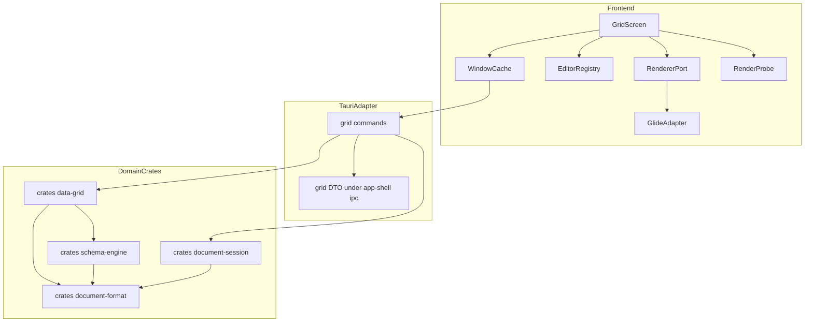
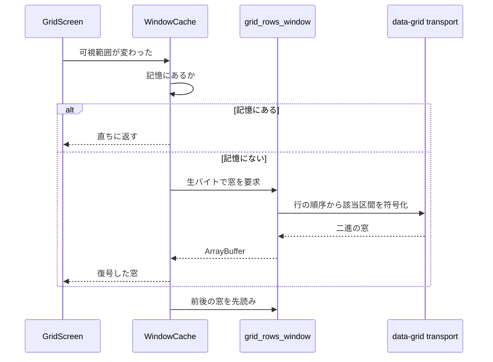
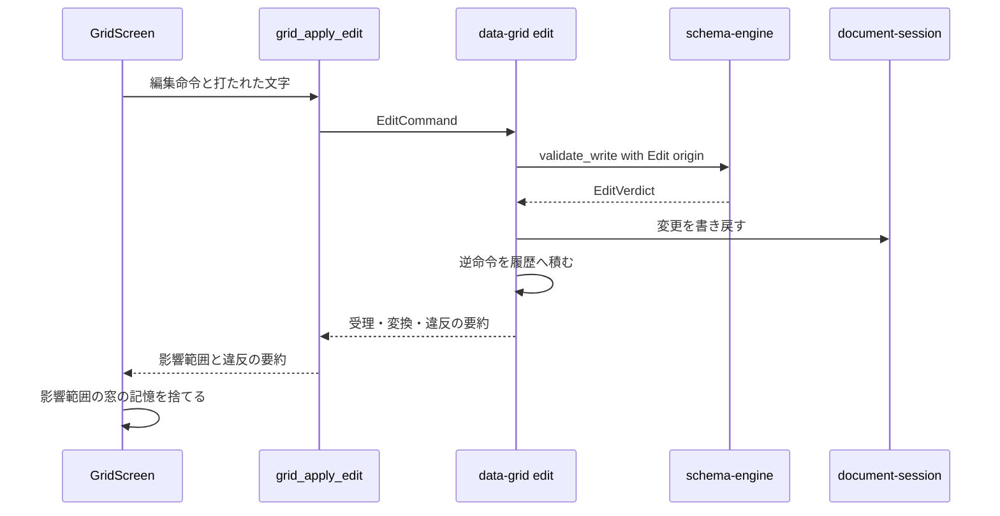
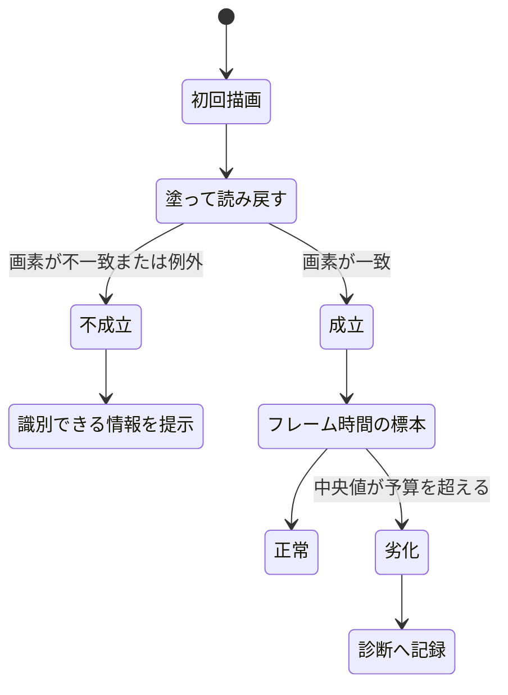

# Technical Design: data-grid

## Overview

**Purpose**: 本機能は、型付きのシートを人が読み書きするための実用水準の画面を提供する。10 万行の走査・セルの編集・違反の提示・入れ子の表現の 4 つが揃うことで、既に成立しているドキュメント形式と型システムが初めて道具になる。

**Users**: 10 万行規模の台帳を日常的に開き、直接打ち替え、他の表から貼り付けて移行するユーザー。

**Impact**: 現在フロントエンドにある表形式の画面は、3 OS の描画確認のための最小画面 1 つだけである（`src/features/smoke/TableSmoke.tsx`。それ自身が「実用水準へ育てるのは data-grid スペック」と書いている）。本機能はこれを置き換えず、実用水準の画面を新たに加え、確認用の最小画面は検証専用の経路に残す。加えて本機能は、後続の 3 スペックが乗る拡張点を 2 つ確定させる — 取り消し履歴（`formula-engine` / `macro-runtime` が加わる）と、セル入力手段の登録簿（`custom-types` が登録する）。

### Goals
- 10 万行 × 30 列のシートを、毎秒 60 回の描画更新を保ったまま走査・編集できる画面を提供する
- 値の正否の判断を一切持たず、`schema-engine` の判定結果の提示に徹する
- 取り消し履歴とセル入力手段の登録簿を、後続スペックが形を変えずに乗れる契約として確定させる
- 並べ替え・絞り込み・列順の変更を表示に閉じ、保存される順序を一切変更しない
- 3 OS のいずれでも実用水準のグリッドが描画されることを、実際に起動した観測で示す

### Non-Goals
- 値が型に適合するかの判断、型強制の規則（`schema-engine` が所有）
- スキーマの宣言と変更の画面（`schema-editor` が所有）
- 数式の入力・依存グラフ・再計算（`formula-engine` が所有）
- マクロの実行と実行トリガ（`macro-runtime` が所有）
- ドキュメントの読み込み・保持・保存・未保存の追跡（`document-session` が所有）
- 変更履歴と差分（`version-control` が所有）
- ユーザー定義型ごとの入力手段の実装（`custom-types` が登録側として所有）
- 添付ファイルの実体の選択と管理
- 表示対象のシートを選ぶ画面遷移

## Boundary Commitments

### This Spec Owns
- **シート 1 枚の表示と操作**: 走査、選択、現在位置、列の表示制御（幅・順・並べ替え・絞り込み）
- **セルの編集の意味論**: 編集の開始・確定・取消、`schema-engine` への判定依頼、判定結果と型強制の提示、違反値の保持
- **行の構造操作**: 追加・削除・複製と、既定値の適用
- **範囲の複製と貼り付け**: 表形式テキストとセル値の相互変換、貼り付け時の一括判定
- **取り消し履歴（拡張点・所有者）**: ドキュメント単位の命令スタック。`formula-engine` と `macro-runtime` が後から同じ履歴に加わる。**所有者はウィンドウのグリッドの保持である**（10.2。`GridSession` は所有せず `&mut UndoStack` を受け取る — 要件 9.5）
- **セル入力手段の登録簿（拡張点・所有者）**: 型 → 入力手段の対応表。`custom-types` が登録する
- **表示状態**: 列幅・列順・並べ替え・絞り込み・展開状態。**ドキュメントに保存されない、画面に閉じた状態**
- **行データの窓単位の転送**: どの範囲を、どの形で、いつ運ぶか
- **グリッド自身の描画成立の検査**: 塗って読み戻す検査と、フレーム時間の標本

### Out of Boundary
- 値の正否と型強制の規則の実装（`schema-engine`。本機能は判定を依頼し結果を写すだけで、独自の判定分岐を持たない）
- スキーマ宣言の変更（列の追加・削除・型変更・制約変更は `schema-editor`）
- ドキュメントの読み込み・保持・保存・未保存の追跡・終了拒否（`document-session`）
- 起動時の描画経路の切り替えと環境変数の判定（`app-shell` の要件 10.3 が所有。**本機能は重複して持たない**）
- ウィンドウ・レイアウト・遷移・配色・例外の隔離（`app-shell` の画面の契約に従う）
- 数式の評価、マクロの実行、添付の実体、シート間参照をたどる遷移

### Allowed Dependencies
- `schema-engine`: 型カタログ、検証、型強制、違反の報告。**判定の唯一の源**
- `document-format`: 行・セル値・識別子のドキュメントモデル
- `document-session`: ウィンドウに対応する `Document` への参照と、変更を書き戻す手段。**能力の水準でのみ依存し、API の形を本設計で先に決めない**
  - **再検証（2026-09-14。`document-session` の実装完了を受けて）**: 公開面が確定した。本機能が依存するのは次の 3 つだけであり、**いずれも能力の水準の想定と一致した**（Revalidation Trigger「`document-session` の design 確定」の決着）。
    - **変更の適用**: `DocumentSessionsApi::edit(&self, window, &mut dyn FnMut(&mut Document) -> R) -> Result<Edited<R>, SessionError>`。**閉包の内側で `EditCommand` を適用する**形であり、本設計の `GridSession::apply(&mut self, doc: &mut Document, command)` は「`doc` を受け取る」という前提をそのまま保てる（所有者から可変参照を借りる閉包の中で呼ぶ）。**閉包の内側から同じセッションを呼び返してはならない**（再入禁止。ロックを保持したまま呼ぶのでデッドロックする）— `GridSession` の `apply` は記録を要する問い合わせ（`state` / `may_close` / 保存）を内部で呼ばないこと。
    - **一括の書き換え**: `Document::set_cells(sheet: SheetId, cells: &[(RowId, usize, CellValue)]) -> Result<(), CellWriteError>` が上流 `document-format` に入った（1 回の呼び出しで 10 万行 × 30 列 = 全 300 万セルを 1 秒以内に置き換えることを実測済み。予算 1 秒に対して **0.117 s**）。**`document-session` が本機能より先にこの口を必要としたため、本設計の「上流への最小の追加」（`remove_rows` / `insert_row_at`）を待たずに実装された** — 本設計のその口は依然として本機能の群 1 が実装する（**2026-09-14 に実施済み: 3 メソッドとも `crates/document-format` の `Document` に入った**）。**重複する行・列は「入力順の last-wins」**であり（仕様書に明記が無くテストも無い。`document-session` の 1.2 の申し送り）、貼り付けが重複を生成しうるなら本機能側で契約として明記するか重複を弾くこと。
    - **境界の型**: `crates/app-shell/src/ipc/document.rs` に 4 コマンド（`document_state` / `document_save` / `document_new` / `document_discard`）ぶんの応答型が入った。**64 ビット整数を出さず・位置を出さない・他のドメインクレートの型を参照しない**という本設計の境界の前提はそのままである（シートの件数は `u32`、識別子は文字列）。`GridCommands` が組み立てる境界型もこの規約に従う。
    - **10.7 が見つけた隙間（上流への申し送り）**: `DocumentSessionStatus` / `DocumentStateResponse` は**版（世代）を運ばない**。したがって本機能は「文書が差し替わった・無くなった」ことは検出できるが、**同じシートのまま内容だけが外の経路で変わった**ことは検出できない（要件 1.7 の残り）。保持側の `Slot` は既に版を持つので、境界へ版を足すのが筋である — 再検証の相手は下の Revalidation Triggers に記録した。
- `app-shell`: 画面登録簿、IPC 境界、コマンド登録の根、メニュー登録口、診断の記録
- **制約**:
  - `crates/data-grid` は `tauri` に依存しない（`scripts/check-core-deps.sh` が固定する）
  - `crates/data-grid` が依存してよい兄弟ドメインクレートは `document-format` と `schema-engine` のみ。`app-shell` には依存しない（境界用の型の組み立ては `src-tauri` の適応層が行う）
  - フロントエンドは `src/ipc/` の生成物経由でのみ境界を越える。`schema-engine` の判定を写した分岐をフロントエンドに作らない

### Revalidation Triggers
| 変更 | 再検証を要する相手 |
|---|---|
| 取り消し履歴の命令の形（何が 1 操作か、何を復元するか） | `formula-engine`, `macro-runtime` |
| **取り消し履歴の所有者と、履歴を渡す signature**（10.2 が `GridSession` からウィンドウの保持へ降ろし、`apply` / `undo` / `redo` が `&mut UndoStack` を受け取る形にした） | **`formula-engine`, `macro-runtime`** — 同じ 1 つの `UndoStack` に乗る側である。`UndoStack::push` の形（拡張点の契約）は変えていないが、**履歴の寿命と所有者が変わった**: 履歴はセッションではなく**ウィンドウの保持**が持ち、文書が差し替わると捨てられる（要件 9.5）。数式の再計算とマクロの実行が履歴へ積む口を足すときは、**どの保持へ積むのか**（誰がその `&mut UndoStack` を握るのか）を本節の規則に合わせること |
| セル入力手段の登録簿の登録インターフェース | `custom-types` |
| **本機能の外の経路が文書へ直接書くようになる**（要件 9.7 の数式の再計算・マクロの実行。**いまのコマンド面では到達しない**） | **`formula-engine`, `macro-runtime`** — 履歴の 1 歩が**別のシート**を名乗る合成（`HistoryCommand::Composite`）は、いまは「すべての部分が表示中のシートを名乗るときだけ適用し、そうでなければ何も書かずに拒む」ことで部分適用を防いでいる（10.2 が実測して足した）。**この規則は「履歴の対が組まれた時点の文書が、適用の時点でも同じである」ことに依存している** — 保持している文書を変更する経路が `documents.edit` の 2 箇所（`grid_apply_edit` / `grid_history`）だけであり、両方が同じ保持の履歴を通るため、いまは成り立っている。**外の経路が同じ文書へ直接書くと、合成の途中で `UnknownRow` になり、部分適用が起きうる**（前半の復元だけが届く）。数式・マクロが文書へ書くようになった時点で、この前提を再検証し、必要なら合成の適用を「1 つの臨界区間で全部か無か」にする |
| **境界に選択肢・参照先・ユーザー定義型の識別子を足す**（7.4 が記録した隙間 1〜3） | 8.3 の画面（`ColumnConstraints` の組み立て）と 7.4 の面 |
| **確定の文字の運び手を登録に足す設計の改訂**（7.4 が記録した隙間 4。入れ子は `SetNested` でなければ適合しない） | 8.3 の画面、`custom-types`、7.4 の面 |
| 窓の転送単位・符号化の形 | 要件 11 の予算の再測定 |
| **境界の `document_state` が版（世代）を運ぶようになる**（10.7 が記録した隙間。要件 1.7 の「本機能の外の経路が**内容だけ**を変えた」場合を画面が検出できない） | **`document-session`**（保持している `Slot` は既に版を持つ。境界の `DocumentSessionStatus` / `DocumentStateResponse` へその版を足す）と、**本機能の追随**（`GridScreen.gridScreenSessionChanged`）— 版を足した暦では、**同じシートの通知でも版が変われば提示を組み直す**（いまは「先頭のシートの識別子が同じなら何もしない」である。下の「10.7 が確定させたもの」） |
| `schema-engine` の判定 API の形 | 本機能の編集経路 |
| **`document-session` の design 確定** | **本設計（能力の水準で依存しているため、API の形が決まった時点で整合を取り直す）** — **2026-09-14 に実施済み**（`document-session` が実装完了。確定した公開面は「Allowed Dependencies」の `document-session` の項に記録した。想定と一致し、設計の変更は要らなかった） |
| `document-format` への 3 メソッド追加の形 | `document-format` の決定的出力の契約は不変。行の集合と並びのみ |
| 画面の契約（`ScreenProps`・配色変数・例外隔離） | `app-shell` 側の変更として全 UI スペック |

## Architecture

### Existing Architecture Analysis

本機能が載る土台はすべて実装済みであり、以下は**既に固定されている制約**である。

| 事実 | 出典 | 本設計への帰結 |
|---|---|---|
| 画面は `SHELL_SCREEN_REGISTRY` に 1 件足すだけで差し込まれる。受け取るのは `ScreenProps` のみ | `src/shell/router.tsx` / `Layout.tsx` | グリッド画面は 1 エントリ。自前のレイアウト・遷移・配色を持たない |
| `ScreenBoundary` は **イベントハンドラと非同期の失敗を捕まえない** | `src/shell/ScreenBoundary.tsx` | 走査・編集・IPC の失敗は**画面内で処理する**。器に落とせない |
| 外観変数は 10 本のみで、**グリッド専用の色は存在しない** | `src/shell/theme.ts` | 既存変数の範囲で配色する。選択は `--jxcel-control-active-background`、罫線は `--jxcel-control-border`、副次の文字は `--jxcel-screen-muted` |
| ts-rs の derive は `crates/app-shell/src/ipc/` の下だけ。境界に 64 ビット整数を出さない | `ipc-contract.md` | `CellValue::Int` と `RowId` は**そのまま越えられない** |
| 生バイト経路は封筒も `WindowContext` も運べない。**行指向の API を足してはならない** | `src-tauri/src/commands/bulk.rs` の module doc | 行データは窓単位で運ぶ。1 行ごとのコマンドを作らない |
| `Row` は `Serialize` も `Clone` も持たず、`Violation` も `Serialize` を持たない。`CellValue` は `Serialize` / `Deserialize` を持つ（`crates/document-format/src/value.rs`）が、それでも境界を越えられないのは 64 ビット整数（`CellValue::Int`）と識別子を出せず、ts-rs の derive が `crates/app-shell/src/ipc/` の下だけに許されるため | `crates/document-format`（`Row` / `CellValue`） / `crates/schema-engine`（`Violation`） | 境界用の型を別に定義する。ドメイン型を直接運ばない |
| `add_row` は末尾追加のみ | `crates/document-format/src/model/mod.rs` | **2026-09-14 に解消済み**: 下記の 3 メソッド（`remove_rows` / `insert_row_at` / `insert_rows_at`）が実装され、`document-format` の公開面に入っている（下記「上流への最小の追加」） |
| 開いた `Document` の持ち主が存在しない | `document-format` の被依存は `schema-engine` のみ | `document-session` に依存する（新設） |

### 上流への最小の追加

要件 6.1・6.2 は当時の公開面では実現できなかった（`add_row` ＋ `reorder_rows` での代替は 10 万行の並びを毎回渡すことになり要件 11 の予算に入らない）。本設計は `document-format` に次の 3 つだけを追加し、**2026-09-14 に実装済みである**（`crates/document-format/src/model/mod.rs`。呼び出し側は群 3・群 4）。

```rust
// crates/document-format/src/model/mod.rs の Document impl へ追加
pub fn remove_rows(&mut self, sheet: SheetId, rows: &[RowId]) -> Result<Vec<Row>, RowRemovalError>;
pub fn insert_row_at(&mut self, sheet: SheetId, index: usize) -> Result<RowId, RowInsertionError>;
// 3 つ目は要件 6.6 / 9.2 が要求する復元の口である（下記）。
pub fn insert_rows_at(&mut self, sheet: SheetId, index: usize, rows: Vec<Row>) -> Result<(), RowInsertionError>;
```

- `remove_rows` が**取り除いた行を返す**のは、取り消しに値と識別子の両方が要るためである（`Row` は `Clone` を持たない）
- 一括で受けるのは、範囲削除が 1 操作であり、行ごとに呼ぶと並びの作り直しが繰り返されるため
- **決定的な出力と往復の契約には触れない。**変わるのは行の集合と並びだけである
- **3 つ目の `insert_rows_at` が要る理由**: 取り消し（データモデル表「編集命令と逆命令の対応」の `RemoveRows` → 復元用の内部命令、および要件 6.6 / 9.2）が戻さねばならないのは**同じ `RowId`・同じ値・同じ位置**である。`insert_row_at` は**新しい識別子の空の行しか作れない**（`Row` は `Clone` を持たず、既存行の識別子・値を書き換える口も無い）ため、取り除いた行の識別子と値を戻せない。したがって `remove_rows` が返した `Row` をそのまま受け取る挿入の口を分けて置く。**外から `Row` を得られないからではない**（`parts::RowsCodec::decode` + `parts::SheetRows::into_rows` が公開面にあり、任意の識別子・値を持つ `Row` をクレート外で作れる。だからこそ `insert_rows_at` は受け取った識別子を文書内の現存集合とバッチ内の重複に対して検査する）。
- 誤り型は `CellWriteError` / `ReorderError` と同じ規律の判別可能な列挙体とし、診断に必要な文脈だけを持ち、表示用の文言を持たない（`RowRemovalError { UnknownSheet, UnknownRow }` / `RowInsertionError { UnknownSheet, IndexOutOfRange, DuplicateRow }`）

### Architecture Pattern & Boundary Map

選定した型は **「ドメインが状態と意味論を持ち、画面は窓と入力だけを持つ」**。`structure.md`「Tauri を必要とするスペックは 2 つに割る」と「性能はドメイン側で守る」の双方から導かれる。



**Key Decisions**:
- **行データは窓単位で運ぶ。**全件をフロントエンドへ送る案は、ドキュメントが Rust と webview に二重に載り要件 11.6 に反するため却下した
- **並べ替え・絞り込み・違反の集計はすべて Rust 側**にある。フロントエンドは行の集合を持たないので、表示上の並びが保存に漏れる経路が構造的に存在しない（要件 8.5）
- **描画層は移植口の背後**にある。Glide Data Grid の上流が止まっているという実測に対する退路であり、投機的な抽象ではない
- `DataGrid` は `app-shell` に依存しない。境界用の型の組み立ては `GridCommands`（適応層）が行う

### Technology Stack

| Layer | Choice / Version | Role in Feature | Notes |
|-------|------------------|-----------------|-------|
| Frontend | React 19.3 + Vite 7.3（既存） | 画面と入力 | 既存の構成。変更なし |
| Frontend | `@glideapps/glide-data-grid` **6.0.4-alpha24** | canvas の描画・当たり判定・文字計測・クリップボードの配管 | **stable 6.0.3 は React 19 を受け付けない**（peer が 18.x 止まり、issue #1189 が open）。MIT。フロントエンド初の重い依存 |
| Backend | 新設 `crates/data-grid` | 表示状態・編集命令・取り消し履歴・窓の符号化 | `tauri` 非依存。依存してよい兄弟は `document-format` と `schema-engine` |
| Backend | `crates/schema-engine`（既存） | 型カタログ・検証・型強制・違反 | 判定の唯一の源 |
| Backend | `crates/document-format`（既存 + 3 メソッド） | 行とセル値の保持 | `remove_rows` / `insert_row_at` / `insert_rows_at` を追加 |
| Backend | `crates/document-session`（別スペック） | `Document` の保持と変更の書き戻し | 能力の水準で依存 |
| Infrastructure | 既存の Tauri IPC 境界 | 封筒つきコマンド 5 本 + 生バイト 1 本 | `ipc-contract.md` の規約に従う |

### 内部の依存の向き

`crates/data-grid` は 6 層とし、左の層だけを参照する（`structure.md`「ドメインクレートの内部構造」）。この鎖の文言は各層の `mod.rs` 冒頭に置く。

```
error / types → view → edit → history → transport → api
```

| 層 | 責務 | 参照してよい層 |
|---|---|---|
| `error` / `types` | 誤り型、座標、範囲、表示位置と `RowId` の対 | なし |
| `view` | 並べ替え・絞り込みの適用結果としての行の順序。**ドキュメントを変更しない** | types |
| `edit` | 編集命令の定義と適用。`schema-engine` の判定を呼び `document-format` を変更する | types, view |
| `history` | 取り消し履歴。命令と逆命令の対を積む | types, edit |
| `transport` | 窓の行データと違反の符号化 | types, view |
| `api` | 公開面の再輸出と、画面 1 枚ぶんの操作口 | すべて |

## File Structure Plan

### Directory Structure
```
crates/data-grid/
├── Cargo.toml              # tauri 非依存。依存は document-format と schema-engine のみ
├── benches/
│   └── large_grid.rs       # 窓の符号化・並べ替え・絞り込み・貼り付けの計測（4 本。予算の判定器が読むのは `paste_10k` の 3 秒だけ）
└── src/
    ├── lib.rs              # 層の鎖の宣言と公開面の再輸出
    ├── error.rs            # GridError。宣言の誤りと値の不適合を混ぜない
    ├── types/mod.rs        # CellAddress, CellRange, RowOrdinal, ColumnIndex の再輸出
    ├── view/mod.rs         # ViewState と RowOrder の導出（並べ替え・絞り込み）
    ├── view/violations.rs   # 可視行の序数に対する違反の索引。編集の結果で差分更新する
    ├── edit/mod.rs         # EditCommand とその適用。schema-engine の判定を呼ぶ
    ├── edit/paste.rs       # 表形式テキストとセル値の相互変換
    ├── history/mod.rs      # UndoStack。命令と逆命令の対
    ├── transport/mod.rs    # 窓の二進符号化。64 ビット整数を数値として出さない
    └── api.rs              # GridSession: 画面 1 枚ぶんの操作口

src-tauri/src/commands/
└── grid.rs                 # 薄い適応層。ドメイン型 ⇄ 境界用の型の変換はここだけ

crates/app-shell/src/ipc/
└── grid.rs                 # 境界用の型（ts-rs derive）。他のドメインクレートを参照しない

src/features/grid/
├── GridScreen.tsx          # 画面本体。SHELL_SCREEN_REGISTRY に 1 件登録される
├── gridClient.ts           # invokeCommand / invokeRaw の薄いラッパ
├── cellEdit.ts             # 入力手段の 2 つの口（確定・取消）と境界の間の 1 枚。**8.3 が足した**
├── windowCache.ts          # 窓の記憶と先読み。破棄の方針を持つ
├── windowCache.test.ts     # 窓の記憶と二進形式の検査（vitest。7.3）
├── displayState.ts         # 列幅と表示上の列順のみ。窓の中身を変えない状態
├── editorRegistry.ts       # 拡張点: 型 -> 入力手段。重複登録を検出する
├── editors/index.ts        # 組込の入力手段 10 種の登録
├── editors/*.tsx           # text / number / decimal / bool / date / datetime / enum / ref / nested / any
├── nestedInspector.tsx     # 入れ子の値の詳細表示と編集
├── violations.ts           # 違反の提示と巡回の論理（境界の答え → バーが持つ値。**8.4 が足した**）
├── violations.test.ts      # 同 module の検査（vitest。7.1 と同じ規律）
├── violationBar.tsx        # 違反の総数と次の違反への移動（提示。**8.4 が足した**）
├── violationBar.test.tsx   # 同成分の検査（vitest。`renderToStaticMarkup`）
├── renderer/port.ts        # 描画層の移植口（インターフェース定義）
├── renderer/fakeRenderer.ts   # 偽の実装 2 つ（テスト専用。7.1。本物ではない: 引くだけで塗らない）
├── renderer/interactionDriver.ts  # 操作の並びを注ぎ、外へ出た呼び出しを記録する駆動器（テスト専用。7.1）
├── renderer/port.test.ts   # 移植口の契約（vitest。7.1）
├── renderer/glideAdapter.tsx  # 移植口の Glide Data Grid 実装
└── renderProbe.ts          # 塗って読み戻す検査とフレーム時間の標本
```

### Modified Files
- `Cargo.toml` — `members` に `crates/data-grid` を追加
- `crates/document-format/src/model/mod.rs` — `remove_rows` / `insert_row_at` / `insert_rows_at` を追加（本機能が上流へ加える唯一の変更）
- `crates/app-shell/src/ipc/command_names.rs` — コマンド名の定数 6 本と `COMMAND_NAMES` への追加
- `crates/app-shell/src/ipc/mod.rs` — `render_bindings()` の `declarations` に境界用の型を追加
- `src-tauri/src/commands/mod.rs` — `command_root!` に 6 行追加
- `src-tauri/permissions/app.toml` — 権限ブロック 6 つと、`app-shell` の集合への所属
- `src/ipc/bindings.ts` — 生成物。`cargo run -p app-shell --bin generate-bindings` で再生成（手で編集しない）
- `src/shell/Layout.tsx` — `SHELL_SCREEN_REGISTRY` にグリッド画面を 1 件追加
- `package.json` — `@glideapps/glide-data-grid` を追加
- `package.json` / `package-lock.json` / `vitest.config.ts` / `.github/workflows/ci.yml` — フロントエンドのテストの走らせ手（`vitest`）と、その段（タスク 7.1）。群 7・群 8 のフロントエンドのタスクは「テストで示す」ことを要求するため、走らせ手ごと導入した。**ジョブもワークフローも新設しない** — 既存の `test` ジョブへ段を 1 つ足す（要件 6.2、タスク 1.4 の申し送り）。走らせる環境は `node` であり、追加の依存も表示先も要らない
- `scripts/ci/` — `check-core-deps.sh data-grid` の段、ベンチ予算への `large_grid/*` の追加、および 3 OS で 10 万行の走査と編集を観測する台本（要件 12.1, 12.4）。**既存の 3 OS 検証マトリクスを拡張し、独立した系統を新設しない**
- `scripts/check-bench-budget.sh` / `.github/workflows/bench.yml` — 9.1 が `large_grid/paste_10k` を要件値（3 秒）の判定へ足し、計測を残す `cargo bench` に `-p data-grid` と `paths:` の `crates/data-grid/**` を足した（**ワークフローは新設しない**。`research.md`「実測と固定: 性能の計測と予算のゲート（タスク 9.1）」）

## System Flows

### 窓の取得と先読み



先読みの幅と窓の大きさは計測で決める。走査中に記憶が外れたセルは**空白ではなく読み込み中として描く** — 空白は「値なし」と区別がつかないため。

### 編集の適用と判定



`WriteOrigin::Edit` は**決して拒否しない**（`schema-engine` 要件 6.1）。違反は値を保持したまま報告される。したがってこの流れに「編集の失敗で値が戻る」分岐は存在しない。取り消しは利用者の明示的な指示でのみ起きる。

### 描画成立の検査



`app-shell` の要件 10.3 が既に**起動時の描画経路の切り替えと環境変数の判定**を所有する。本機能はその下流で、**グリッド自身が実際に塗れたか**だけを確かめる。WebKit は WebGL のレンダラ文字列を伏せるため、素性を問う手段は使えない（`research.md`）。

## Requirements Traceability

| Requirement | Summary | Components | Interfaces | Flows |
|-------------|---------|------------|------------|-------|
| 1.1, 1.2, 1.3, 1.4 | 10 万行の表示と走査、位置の提示、端への直接移動 | WindowCache, RendererPort, GlideAdapter, WindowCodec | `encode_window`, `GridRendererPort.mount` | 窓の取得と先読み |
| 1.5, 1.6 | 行なし・列なしの提示 | GridScreen, GridSession | `GridOpenResponse.row_count`, `columns` | — |
| 1.7 | 外部経路の変更を表示へ反映 | WindowCache, GridScreen（`cellEdit.ts`。**文書の差し替え・破棄は `documentRequests.ts` と `GridScreen.gridScreenSessionChanged`（10.7）**） | `WindowCache.invalidate`（`EditOutcome.affected` をそのまま渡す）、**`DOCUMENT_SESSION_CHANGED_EVENT` と `document_state`（10.7。同一シートなら開き直さない。内容だけの変更は版が無いため閉じられない — 下の「10.7 が確定させたもの」）** | 編集の適用と判定 |
| 2.1, 2.2, 2.3, 2.4, 2.5, 2.6 | 現在位置・選択・追従・範囲の対象化 | GridScreen（`selection.ts`）, RendererPort | `RendererSpec.selection` / `onSelectionChange` / `onVisibleSpanChange` / `rowMarkers`, `RendererHandle.setSelection` / `scrollTo` | — |
| 3.1, 3.2, 3.8 | 型に応じた入力手段（日時・選択肢・真偽・シート間参照） | EditorRegistry, editors, GridScreen（`CellEditorPanel`）, **ColumnConstraints の組み立て（10.3）** | `CellEditorRegistry.resolve` / `resolveCarrier`（`customTypeId` つき）, `CellEditorProps.constraints`（**10.3 が材料を渡す** — 選択肢・参照先の行・入れ子の宣言・値なしを許すか）, `GridCommands` の `grid_reference_rows` | 3.8 の行の一覧は**頁ごと**に読む（`GRID_REFERENCE_PAGE_LIMIT`） |
| 3.3, 3.4, 3.5 | 判定への送付、変換の提示、違反値の保持 | EditApply, GridCommands, GridScreen（`cellEdit.ts`） | `EditCommand::SetCells`, `GridClient.applyEdit`, `GridEditResponse.coercions` / `violations` / `violation_total` | 編集の適用と判定 |
| 3.6, 3.7 | 編集の取消、値なしへ戻す | GridScreen（`cellEdit.ts`。**取消は境界へ何も送らない**）, EditApply | `CellEditorProps.cancel`, `WindowCache.rowId`（宛先の行の識別子）, 空の文字列＝値なし（`edited_value`） | — |
| 4.1, 4.2, 4.6 | 違反の区別・**指定したセル**の理由・解消 | WindowCodec, GridScreen, ViolationBar, **GridCommands（10.6）** | 窓の違反札, `GridViolationResponse.reason`, **`GridViolationRequest.column`（指したセルの文書の列。10.6）** | 編集の適用と判定 |
| 4.3, 4.4, 4.6 | 違反の総数と次の違反への移動、解消の反映 | ViolationIndex, GridSession, ViolationBar | `violation_total`, `find_violation`, **`find_violation_at` / `cell_at`（10.6 が足した「行と列を指定して引く」口）** | 編集の適用と判定 |
| 4.5 | 入れ子の内側の違反位置 | WindowCodec, NestedInspector, **ViolationIndex** | `Violation.path` の写し, **`CellViolations.paths`（10.6 が指定されたセルから引く）** | — |
| 5.1, 5.2, 5.3, 5.4, 5.6 | 入れ子の展開・折りたたみ・深さの上限・要素数 | ViewState, GridSession, GridCommands, GridScreen | `ViewState.expansion`, `MAX_EXPANSION_DEPTH`, `GridViewResponse.columns`（導出後の構成）, `ColumnSpace`（表示の位置 → 文書の列） | — |
| 5.5, 5.7 | 入れ子の詳細表示とその中の編集 | NestedInspector, EditApply | `EditCommand::SetNested` | 編集の適用と判定 |
| 6.1, 6.2, 6.3, 6.4 | 行の追加・削除・複製と一意違反 | EditApply, document-format の 3 メソッド, GridScreen（`rowOps.ts`） | `EditCommand::InsertRows/RemoveRows/DuplicateRows`, `GridClient.applyEdit`。**対象と位置は `RowTarget` / `RowAnchor` の 2 つの空間で指せる**（10.4 が足した） | 編集の適用と判定 |
| 6.5 | 大量削除の確認 | GridScreen（`rowOps.ts` の `deleteNeedsConfirmation`） | `RendererSpec.onVisibleSpanChange`（**1 画面に見えている行数**の源） | — |
| 6.6 | 行操作が取り消しの対象 | UndoStack | `UndoStack.push` | — |
| 7.1, 7.2 | 範囲の複製と外部への受け渡し | PasteCodec, RendererPort, GridScreen（`clipboard.ts`） | `RendererSpec.onCopy`, `RendererHandle.copySelection`（**8.7 が足した** — 打鍵とメニューの唯一の入口） | — |
| 7.3, 7.4, 7.5, 7.7 | 貼り付けの判定・行の補充・部分的違反・1 万行 | PasteCodec, EditApply | `EditCommand::PasteRange` | 編集の適用と判定 |
| 7.6 | 貼り付けが取り消しの 1 操作 | UndoStack | `UndoStack.push` | — |
| 7.8（複製・打鍵） | メニューとキーボードの双方から複製を実行 | GridScreen（`clipboardRequests.ts`）, GridCommands, メニュー登録口 | `RendererHandle.copySelection`（両者が同じ入口を叩く）, `GRID_COPY_REQUESTED_EVENT`, `MenuRegistry::register` | — |
| 7.8（貼り付け・メニュー） | メニューから貼り付けを実行（**10.8 が閉じた**。打鍵からの貼り付けは 8.7 の時点で成立していた） | GridScreen（`clipboard.ts`, `clipboardRequests.ts`）, GridCommands, メニュー登録口 | `RendererHandle.pasteText`（打鍵とメニューが同じ入口）, `GRID_PASTE_REQUESTED_EVENT`（荷は `GridPasteRequestedEvent.text` ＝ 器が読んだ文字）, `tauri-plugin-clipboard-manager` の読み取り（**Rust 側だけ**）, `MenuRegistry::register`（**アクセラレータ無し**） | — |
| 9.9 | 取り消しとやり直しをメニューとキーボードから実行 | GridScreen（`history.ts`）, メニュー登録口 | `GridClient.readHistory`, `GRID_HISTORY_REQUESTED_EVENT`（**8.9 が結線した**。7.8 の複製が越えた境界と同じ形。荷は生成物の `GridHistoryDirection`）, アクセラレータ（非 macOS `Ctrl+Z` / `Ctrl+Shift+Z`、macOS `Cmd+Z` / `Cmd+Shift+Z`） | — |
| 8.1, 8.2 | 列幅と表示上の列順 | DisplayState | `DisplayState.columnWidths/columnOrder` | — |
| 8.3, 8.4, 8.7 | 並べ替え・絞り込み・隠れた行数 | RowOrder, GridSession | `set_view`, `GridViewResponse` | — |
| 8.5 | 保存される順序を変更しない | RowOrder | 表示順は `Document` を書き換えない | — |
| 8.6, 8.9 | 並べ替え・絞り込み中の編集と貼り付け | RowOrder, EditApply | 表示位置ではなく `RowId` で対象を決める。**行の対象と挿入の位置は可視の序数でも指せ、`RowOrder` が適用の直前に解く**（10.4。画面は写像を持たない） | 編集の適用と判定 |
| 8.8 | 並べ替えの基準列の編集で行が動かない | RowOrder | 順序は明示の指示でのみ再計算する | — |
| 9.1, 9.2, 9.3, 9.4, 9.5, 9.6 | 取り消しとやり直しの対象・復元・破棄・単位・上限 | UndoStack, UndoRedo, **GridCommands の保持（`SheetEntry`）** | `apply` / `undo` / `redo` が `&mut UndoStack` を受け取る（**10.2 が所有者を `GridSession` から降ろした**）、`push`（上限） | UndoRedo が履歴と `EditApply` を借用で束ねてドキュメントへ適用する。**履歴の所有者はウィンドウの保持であり、シートの切り替えを越えて引き継ぎ、文書が差し替わったら捨てる**（要件 9.5） |
| 9.7 | 数式とマクロが同じ履歴に加わる | UndoStack | `UndoStack.push` の公開 | — |
| 9.8 | 取り消し後に対象範囲を見せる | GridSession（`visible_ordinals_of`）, GridScreen（`history.ts`）, RendererPort | **`GridEditOutcome.affected_ordinals`**（影響を受けた行の**表示の序数**。**10.5 が足した** — 適応層が `settle` のあとの `RowOrder` から**1 回の走査で**写す）、`RendererHandle.setSelection` / `scrollTo`（既存の追従が打つ） | **10.5 より前は `WindowCache.ordinalOf` で窓の記憶から引いていた** — 保っていない行（行の追加のやり直し）では引けず、現在位置が移らなかった（8.9 のレビューの実測） |
| 10.1, 10.2, 10.3, 10.4, 10.5, 10.6 | 入力手段の登録簿と既定・重複検出 | EditorRegistry | `CellEditorRegistry` | 拡張型の識別子は**境界が運ぶ**（`ColumnDescriptor.custom_type_id`。10.3 が閉じた） |
| 11.1, 11.2, 11.3, 11.5, 11.6, 11.7 | 応答時間と資源の予算 | WindowCache, WindowCodec, RowOrder | ベンチ `large_grid/*` | 窓の取得と先読み |
| 11.4 | 1 セルの編集で全件検証しない | EditApply, GridSession | `validate_columns` に限定して呼ぶ（差分の入口は `ViolationIndex::apply_report_delta`） | 編集の適用と判定 |
| 12.1, 12.4 | 3 OS での走査と編集の成立 | 3 OS 観測の台本 | `scripts/ci/` の段 | — |
| 12.2, 12.3 | 描画不成立の識別と劣化の記録 | RenderProbe | `probePaint`, `sampleFrameTimes` | 描画成立の検査 |

## Components and Interfaces

| Component | Domain/Layer | Intent | Req Coverage | Key Dependencies | Contracts |
|-----------|--------------|--------|--------------|------------------|-----------|
| GridSession | data-grid api | 画面 1 枚ぶんの操作口。**履歴は所有しない**（10.2 がウィンドウの保持へ移した） | 1, 4, 8, 9 | RowOrder (P0), EditApply (P0), ViolationIndex (P0), UndoStack（**借用で受け取る**） | Service |
| RowOrder | data-grid view | 並べ替え・絞り込みの結果としての行の順序 | 8 | document-format (P0) | Service, State |
| EditApply | data-grid edit | 編集命令の適用と判定の依頼 | 3, 5, 6, 7 | schema-engine (P0), document-format (P0) | Service |
| PasteCodec | data-grid edit | 表形式テキストとセル値の相互変換 | 7 | EditApply (P0) | Service |
| UndoStack | data-grid history | 取り消し履歴。**拡張点の所有者** | 6, 7, 9 | EditApply (P0) | Service, State |
| ViolationIndex | data-grid view | 可視行の序数に対する違反の索引。編集で差分更新する（入口は `apply_report_delta`） | 4 | RowOrder (P0), schema-engine (P0) | Service, State |
| WindowCodec | data-grid transport | 窓の二進符号化 | 1, 4, 11 | RowOrder (P0) | Batch |
| GridCommands | src-tauri 適応層 | ドメイン型 ⇄ 境界用の型 | 全体 | data-grid (P0), document-session (P0) | API |
| WindowCache | frontend | 窓の記憶と先読み | 1, 11 | GridCommands (P0) | State |
| DisplayState | frontend | 列幅と表示上の列順。窓に影響しない | 8 | — | State |
| EditorRegistry | frontend | 型 → 入力手段。**拡張点の所有者** | 3, 10 | — | Service |
| RendererPort | frontend | 描画層の移植口 | 1, 2, 7 | — | Service |
| GlideAdapter | frontend | 移植口の Glide 実装 | 1, 2, 7 | glide-data-grid (P1) | Service |
| RenderProbe | frontend | 描画成立の検査 | 12 | — | Service |
| GridScreen | frontend | 画面本体 | 全体 | 上記すべて (P0) | State |
| NestedInspector | frontend | 入れ子の詳細表示 | 5 | EditorRegistry (P1) | 要約のみ |
| ViolationBar | frontend | 違反の総数と移動 | 4 | GridCommands (P1) | 要約のみ |

### data-grid ドメイン

#### GridSession

| Field | Detail |
|-------|--------|
| Intent | 画面 1 枚ぶんの操作口。表示状態を保持する（**取り消し履歴は保持しない** — 10.2） |
| Requirements | 1.1, 1.3, 1.4, 4.3, 4.4, 8.3, 8.4, 8.7, 9.2, 9.3 |

**Responsibilities & Constraints**
- シートに対する表示状態（行の順序・違反の索引）を所有する
- **`Document` を所有しない。**呼び出しごとに参照または可変参照を受け取る（所有者は `document-session`）
- **取り消し履歴を所有しない**（要件 9.5。10.2 が直した）。`apply` / `undo` / `redo` が
  `&mut UndoStack` を**受け取る**。所有者は**適応層のウィンドウの保持**
  （`src-tauri/src/commands/grid.rs` の `SheetEntry`）である — 本型は開いたシートの計画を
  固定して持つためシートごとに作り直され、履歴を持たせると**シートを切り替えた瞬間に
  文書の履歴が消える**（要件 9.5 は履歴をシートごとではなく**ドキュメント単位**で保つことを
  求める）。`set_view` と `encode_window` は `&Document` だけを受け取るため、**履歴に触れる
  経路が signature の上に無い**
- **古い履歴が差し替え後の文書へ届く経路も、本型が塞ぐ**: 文書を触る 3 つの経路はどれも
  最初に「名指されたシートが文書に在り、列数が計画と一致する」を検査し（`sheet_of`）、
  満たさなければ `SchemaUnusable` で止まる。文書が差し替わると保持しているシートは
  もう無いので、**履歴の材料が何を名乗っていても命令は 1 つも適用されない**
- スキーマは開いた時点の `CompiledSchema` を保持する。スキーマが変わったらセッションを作り直す
- **違反の総数は、索引を組み立てた後（最初の `set_view` の後）は編集・取り消し・やり直しの直後に差分で最新に保つ。**材料は `EditOutcome` が運ぶ違反と再検証した列であり、**全件検証は 1 回も呼ばない**（要件 4.3, 4.6, 11.4。式と、`set_view` の前に据え置く理由は Implementation Notes）。**ただし適用先が表示中のシートでないときは索引に触れない**（履歴はドキュメント単位であり、1 歩が別のシートへ落ちうる。要件 9.5。規則は下の Invariants と「UndoStack」の同項目）
- 公開面は根（`lib.rs`）の再輸出に集める。本型は `api` 層にあり、層の鎖の文言をモジュール冒頭に置く（`structure.md`「ドメインクレートの内部構造」）

**Dependencies**
- Outbound: RowOrder — 行の順序の導出 (P0)
- Outbound: EditApply — 編集の適用 (P0)
- Outbound: ViolationIndex — 違反の索引の組み立てと差分更新 (P0)
- Inbound（呼び出しごとの借用）: UndoStack — 履歴は所有者が持ち、`apply` / `undo` / `redo` へ貸される (P0)
- External: `schema-engine` — 判定と列の情報 (P0)

**Contracts**: Service [x] / API [ ] / Event [ ] / Batch [ ] / State [x]

##### Service Interface
```rust
pub struct GridSession { /* sheet: SheetId, schema: CompiledSchema, view: ViewState, order: RowOrder,
                            apply: EditApply, index: ViolationIndex,
                            layout: ColumnLayout, codec: WindowCodec,
                            query: Arc<dyn EditSchemaQuery>, indexed: bool */ }

impl GridSession {
    pub fn open(sheet: SheetId, schema: CompiledSchema) -> Result<Self, GridError>;
    pub fn with_query<Q: EditSchemaQuery + 'static>(
        sheet: SheetId,
        schema: CompiledSchema,
        query: Arc<Q>,
    ) -> Result<Self, GridError>;
    /// 列の構成（入れ子の展開を含む平坦な並び）。**6.1 の境界型へ写すのはここから**
    pub fn columns(&self) -> &[LayoutColumn];
    pub fn visible_row_count(&self) -> usize;
    pub fn hidden_row_count(&self) -> usize;
    /// 10.5 が足した: 行の識別子の**並び** → **表示の序数の並び**（渡した順。順序に無い行は
    /// 落ち、重複は畳まれる）。**可視の並びを 1 回だけ走る** — 行ごとに引く口は置かない
    /// （置けば「影響行数 × 可視行数」の費用が戻る。10.5 の費用の節）
    pub fn visible_ordinals_of(&self, rows: &[RowId]) -> Vec<RowOrdinal>;
    pub fn violation_total(&self) -> usize;
    pub fn generation(&self) -> Generation;
    pub fn set_expansion(&mut self, state: ExpansionState);
    pub fn expansion(&self) -> &[ExpansionState];

    pub fn set_view(&mut self, doc: &Document, spec: ViewSpec) -> Result<ViewSummary, GridError>;
    pub fn encode_window(&self, doc: &Document, span: RowSpan) -> Result<Vec<u8>, GridError>;
    /// 履歴は**所有者**（ウィンドウの保持）が持ち、呼び出しごとに貸す（要件 9.5。10.2）
    pub fn apply(
        &mut self,
        doc: &mut Document,
        history: &mut UndoStack,
        command: EditCommand,
    ) -> Result<EditOutcome, GridError>;
    pub fn undo(
        &mut self,
        doc: &mut Document,
        history: &mut UndoStack,
    ) -> Result<Option<EditOutcome>, GridError>;
    pub fn redo(
        &mut self,
        doc: &mut Document,
        history: &mut UndoStack,
    ) -> Result<Option<EditOutcome>, GridError>;
    pub fn find_violation(&self, from: RowOrdinal, direction: SearchDirection) -> Option<CellAddress>;
    /// 10.6 が足した: **行と列を指定して引く**（要件 4.2、4.5）。列の指定がある要求の宛先で
    /// あり、**行の最小の列へ落とさない**。返るのは行の識別子（理由を引く側が、報告の中の
    /// 違反をその行へ絞る鍵である — 同じ列・同じ内側の位置の違反は複数の行にありうる）と、
    /// そのセルの違反（`view::CellViolations`。**入れ子の内側の位置を保つ**）。指定したセルが
    /// 違反していなければ `None`（**別の列の違反を名乗らない**）
    pub fn find_violation_at(
        &self,
        at: RowOrdinal,
        column: ColumnIndex,
    ) -> Option<(RowId, &CellViolations)>;
}

pub const DEFAULT_UNDO_LIMIT: usize = 1_000;
```
- Preconditions: `schema` は同一シートを `compile` したものであること（列の添字は `Row::values()` に対する位置である）。`open` / `with_query` は列 0 本の計画を `GridError::SchemaUnusable` で拒む（要件 1.6 の提示はセッション無しに画面が行う）
- Preconditions: `history` は呼び出し元（ウィンドウの保持）が所有する**そのドキュメントの**履歴であること。**本型はこれを検査しない** — 差し替え後の文書を名指す履歴は、`sheet_of` の検査（列の 1 つ目の不変条件）で止まる
- Postconditions: `apply` / `undo` / `redo` は `EditOutcome.affected` に影響を受けた `RowId` を必ず含める
- Postconditions: `apply` は適用が対を組んだとき、**渡された履歴**へ `UndoStack::push` で 1 件積む（要件 9.1。状態を変えない適用は積まない）
- Invariants: `set_view` と `encode_window` は `Document` を変更しない。**履歴にも触れない**（signature が `&Document` だけを受け取る — 10.2）
- Invariants: `violation_total` は**索引を組み立てた後（`set_view` を 1 度呼んだ後）**は `apply` / `undo` / `redo` の直後につねに最新である。**全件検証の再実行ではなく、判定が返した違反との差分で索引を更新する**（要件 11.4 が全件検証を禁じているため）。**`set_view` の前は据え置き（0 のまま）である** — これは実装の逃げではなく**固定の前提**である: `open(sheet, schema)` は**文書を受け取らない** signature であり、索引はシートを読まなければ組み立てられないため、`set_view(&doc, spec)` が文書を渡すまで物理的に作れない（据え置きの規則は Implementation Notes「索引をまだ組み立てていないセッション」）
- Invariants: **`find_violation_at` は「行と列を指定して引く」口であり、`find_violation` が行う「行の最小の列への集約」を行わない。**指定したセルが違反していなければ `None` であり、`find_violation` の答え（同じ行の最小の違反列）を代わりに返すことはない（要件 4.2 の「指定したセルの理由」はそれでは満たない。10.6）
- Invariants: **適用先が表示中のシートでないとき（`EditOutcome.sheet != self.sheet`）は、索引にも順序にも 1 つも触れない。**そのときの `violation_total` と `find_violation` は**表示中のシートの答えのまま**である — 表示中のシートの中身は 1 つも変わっておらず、`set_view` が組み立てた総数・据え付け・鍵がそのまま最新だからである。別のシートの報告で据え直せば**表示中のシートの違反が黙って消える**（10.2 のレビューが実測した欠陥。実装は `GridSession::settle` が `EditOutcome.sheet` を見て早期に返る）。規則と限界は「UndoStack」の同項目にある
- **`columns` の戻り値は `view` 層の `LayoutColumn` である。**design.md の `ColumnDescriptor` は 6.1 の境界型であり、本クレートに写しを足さない — `LayoutColumn` が写しに要るもの（列の添字・内側の位置・表示名・葉の型の札・要素数の能力・展開の可否）を全部持つためである。**6.1 はここから境界型へ写す**
- **判定の縫い目を差し替える `with_query` を公開する。**要件 11.4 の観測（編集・取り消し・やり直しの経路で `validate_sheet` が 0 回であること）は、本番の縫い目を包んだ実装を差し込んで**呼び出しの形を数える**ことでしか取れない（`open` は本番の縫い目で開く薄い入口である）
- **入れ子の展開（`set_expansion` / `expansion`）と世代（`generation`）も公開する。**展開は表示状態の一部であり（要件 5.3）、境界（6.1）が展開の指定を運ぶにはセッションに指定口と読み口が要る

**Implementation Notes**
- Integration: `GridCommands` がウィンドウごとに 1 つ保持する。ウィンドウが閉じたら破棄する。
  **その保持が履歴も持ち**（本型は所有しない。10.2）、置き換えのときに引き継ぐか捨てるかを
  決める（規則は下の「GridCommands」の Implementation Notes）
- Validation: `visible_row_count` と `encode_window` の範囲の整合を型で守る（`RowSpan` は可視行の序数で表す）
- **差分の入口は `ViolationIndex::apply_report_delta`**（`view` 層）。`EditOutcome.revalidated_columns` が**全列**を覆っていれば `EditOutcome.violation_total` をそのままシートの総数とする（行の構造を変える命令と、補充を伴う貼り付けは全列を再検証する。長さが宣言の列数に等しいことで全列と判定する — `revalidated_columns` は昇順・重複なしである）。**一部の列**に閉じているときは `索引の旧総数 − ViolationIndex::violations_in_columns(覆った列) + EditOutcome.violation_total` とする。被減数は「索引が**載せている**その列の違反の数」であり、索引は `set_view` で `ValidationOptions::unlimited` の全件検証から組み立てるため、覆った列について「編集前のシートのその列の違反」に一致する（触っていない列は編集で変わらない）。`apply_report_delta` は行を鍵とする保持の載せ替え・据え付け（`ViolationPresence`）の作り直し・**変わった行だけ**の序数の修正までを行い、順序が変わったときだけ `ViolationIndex::rekey` を足で呼ぶ。索引をまだ組み立てていないセッション（`set_view` の前）は総数を据え置く
- Risks: スキーマ変更時のセッション再作成を忘れると列の添字がずれる。`schema-editor` との継ぎ目として記録する

#### RowOrder

| Field | Detail |
|-------|--------|
| Intent | 並べ替えと絞り込みの結果としての行の順序を保持する。**ドキュメントを変更しない** |
| Requirements | 8.3, 8.4, 8.5, 8.6, 8.7, 8.8, 8.9 |

**Responsibilities & Constraints**
- `Vec<RowId>`（可視行の順）と、隠された行数だけを持つ
- **`Document` の行の並びを書き換える経路を持たない。**これが要件 8.5 を構造で満たす根拠である
- 順序の再計算は `set_view` でのみ起きる。編集では起きない（要件 8.8）

**Contracts**: Service [x] / State [x]

##### Service Interface
```rust
pub struct ViewSpec { pub sort: Vec<SortKey>, pub filters: Vec<FilterSpec> }
pub struct SortKey { pub column: ColumnIndex, pub descending: bool }
pub enum FilterSpec {
    Equals { column: ColumnIndex, text: String },
    Contains { column: ColumnIndex, text: String },
    IsEmpty { column: ColumnIndex },
    IsNotEmpty { column: ColumnIndex },
    HasViolation { column: Option<ColumnIndex> },
}
pub struct ViewSummary { pub visible: usize, pub hidden: usize }

impl RowOrder {
    pub fn recompute(&mut self, doc: &Document, sheet: SheetId, spec: &ViewSpec) -> ViewSummary;
    pub fn row_at(&self, ordinal: RowOrdinal) -> Option<RowId>;
    pub fn ordinal_of(&self, row: RowId) -> Option<RowOrdinal>;
    pub fn span(&self, span: RowSpan) -> &[RowId];
}
```
- Invariants: 同一の `Document` と `ViewSpec` からは常に同一の順序が出る（並べ替えは安定であり、同値の行は `RowId` の順で並ぶ）

**Implementation Notes**
- Integration: 並べ替えの比較はセルの表示文字列ではなく**値の変種ごとの順序**で行う（数値は数値として比較する）
- Risks: 10 万行 × 複数の基準列の並べ替えが要件 11 の予算に入るかは計測で確かめる。`benches/large_grid.rs` の対象とする — **計測済み**（`large_grid/recompute_order`: 10 万行 × 2 基準列の並べ替えと絞り込みが 11.45 ミリ秒。`research.md`「実測と固定: 性能の計測と予算のゲート（タスク 9.1）」）。要件に絶対値が無いため予算の判定器へは足さない

#### EditApply

| Field | Detail |
|-------|--------|
| Intent | 編集命令を適用し、`schema-engine` に判定を依頼する唯一の経路 |
| Requirements | 3.3, 3.4, 3.5, 3.7, 5.7, 6.1, 6.2, 6.3, 6.4, 7.3, 7.4, 7.5, 11.4 |

**Responsibilities & Constraints**
- **判定の分岐を持たない。**`validate_write` に `WriteOrigin::Edit` で委ね、返った `EditVerdict` を写すだけである
- `WriteOrigin::Edit` は決して拒否しない（`schema-engine` 要件 6.1）。したがって「編集が失敗して値が戻る」経路は存在しない
- 1 セルの編集では `validate_columns` を**当該列に限定して**呼ぶ。全件検証は行わない（要件 11.4）
- 行の追加は `CompiledSchema::default_row()` を使う（要件 6.1）
- **行の対象と挿入の位置の解決は、適用の直前で 1 回だけ行う**（10.4 が決めた所有者）。
  `EditApply::apply` / `apply_with_inverse` / `apply_history` は `&RowOrder` を受け取り、
  `RowTarget::Ordinals` を識別子へ、`RowAnchor::Before` / `After` を文書の位置へ解く。
  `RowOrder` を持つのは `GridSession`（`api.rs`）だけであるため、**画面も適応層も写像を
  持たない**（写しが 2 つあれば、並べ替え・絞り込みの下で食い違う。要件 8.6）。
  解いた後の道は 1 つであり、`Ids` / `Document` の腕はそのまま通る。
  **逆命令とやり直しの命令は識別子（`Ids`）だけを運ぶ** — 取り消しの時点では可視の序数が
  別の行を指すためである（索引が変わるたびに `RowOrder` は別の行へ写す）
- **履歴の合成（`HistoryCommand::Composite`。複数の書き込みを連ねる唯一の経路）は、適用の
  前にすべての部分が名乗るシートを照合する**（`EditApply::ensure_parts_share_target`。
  10.2 の 2 度目のレビューが実測した欠陥）。1 つでも適用先（`self.sheet`）と食い違えば
  **何も書かずに** `GridError::SchemaUnusable`（その部分が名乗るシート）を返す — 部分を
  順に適用すると、材料が名乗るシートへ書ける前半だけが文書へ届く（規則は「UndoStack」の
  限界 ②）。**別のシートを名乗る部分が混ざったまま部分適用になる経路は、これで残らない**

**Contracts**: Service [x]

##### Service Interface
```rust
pub enum EditCommand {
    SetCells { cells: Vec<(CellAddress, String)> },
    SetNested { cell: CellAddress, json: String },
    InsertRows { at: RowAnchor, count: usize },
    RemoveRows { target: RowTarget },
    DuplicateRows { target: RowTarget },
    PasteRange { anchor: CellAddress, rows: Vec<RowId>, text: String },
}

/// 10.4 が足した: 行の集合（削除・複製の対象）の指し方。
///
/// `Ids` は**文書の同一性**（表示の指定に依らない）、`Ordinals` は**可視の序数の半開区間**で
/// ある。後者は適用の直前に `RowOrder` で識別子へ解く。範囲外は
/// `GridError::SpanOutOfRange` であり、**1 行も変えない**。
pub enum RowTarget {
    Ids(Vec<RowId>),
    Ordinals { from: usize, count: usize },
}

/// 10.4 が足した: 挿入の位置の指し方。
///
/// `Document` は**文書の行順に対する位置**（従来の意味。`at == 行数` は末尾への追加）、
/// `Before` / `After` は**可視の序数**（その行の直前・直後）、`End` は**文書の末尾**である。
/// 可視の序数は適用の直前に解く（存在しない序数は `GridError::SpanOutOfRange`）。
pub enum RowAnchor {
    Document(RowOrdinal),
    Before { ordinal: usize },
    After { ordinal: usize },
    End,
}

pub struct EditOutcome {
    /// 10.2 が足した: **この結果が記述するシート**（適用先）。
    ///
    /// 編集（`EditCommand`）では開いた対象シートであり、履歴の命令では**材料が名乗る
    /// シート**（`HistoryCommand::RestoreValues` / `RestoreRows`）である。履歴は
    /// ドキュメント単位であるため（要件 9.5）、取り消し・やり直しの 1 歩は表示している
    /// シートとは別のシートへ落ちうる — そのとき呼び出し側はこの欄で見分ける
    /// （索引に触ってはならない。規則は「UndoStack」の同項目と `GridSession::settle`）。
    pub sheet: SheetId,
    pub affected: Vec<RowId>,
    pub coercions: Vec<CoercionNotice>,
    pub violation_total: usize,
    /// 5.2 が足した: 再検証した列が持つ違反の一覧（差分の材料であり、追加の検証は呼ばない）
    pub violations: Vec<Violation>,
    /// 5.2 が足した: 再検証した列の索引（昇順・重複なし。空の命令では空）
    pub revalidated_columns: Vec<ColumnIndex>,
    pub row_count: usize,
}
pub struct CoercionNotice { pub cell: CellAddress, pub before: String, pub after: String }
```
- Preconditions: `CellAddress` の列は `CompiledSchema` の範囲内であること
- Postconditions: 適用後、`UndoStack` に逆命令が 1 つ積まれる
- **`violations` と `revalidated_columns` は 5.2 の差分更新（要件 4.6, 11.4）のために足した欄であり、`violation_total` と同じ範囲を覆う**（`SetCells` / `SetNested` は編集した列だけ、行の構造を変える命令と補充を伴う貼り付けは全列）。**埋めるために追加の検証は 1 回も呼ばない** — 適用の経路が既に得ている報告を写すだけである
- **`EditOutcome` は `Eq` を導出しない**（`violations` が `schema_engine::Violation` を運び、その `PartialEq` までしか持たない。`Violation` は `CellValue` を運び、`CellValue` は浮動小数を持つため `Eq` を持たない）。`PartialEq` は導出したままであり、`EditOutcome` を集合や写像の鍵にする経路は無い

**Implementation Notes**
- Integration: 打たれた文字は `String` として受け取り、型解釈は `schema-engine` に委ねる。**フロントエンドは値を数値として扱わない**
- Validation: 一意制約の違反は複製（要件 6.4）と貼り付け（要件 7.5）の双方で「中止せず違反として報告」になる。これは `WriteOrigin::Edit` の性質から自動的に従う
- Risks: 入れ子の値は `document-format` の `to_json_bytes` / `from_json_bytes` を通す。ここだけ文字列が JSON になる

#### UndoStack（拡張点の所有者）

| Field | Detail |
|-------|--------|
| Intent | 取り消し履歴。`formula-engine` と `macro-runtime` が後から同じ履歴に加わる |
| Requirements | 6.6, 7.6, 9.1, 9.2, 9.3, 9.4, 9.5, 9.6, 9.7 |

**Responsibilities & Constraints**
- 命令と**逆命令の対**を積む。逆命令は適用時に生成する（適用後には作れないため）
- 履歴は**ドキュメント単位**であり、シートごとではない（要件 9.5）。`macro-runtime` の実行が複数シートに跨るため
- **所有者は適応層のウィンドウの保持である**（`src-tauri/src/commands/grid.rs` の
  `SheetEntry`。10.2 が決めた）。`GridSession` は履歴を所有せず、文書を触る 3 つの経路
  （`apply` / `undo` / `redo`）が `&mut UndoStack` を**受け取る**。理由は要件 9.5 と
  `GridSession` の寿命である — セッションは開いたシートの計画を固定して持ち、**シートごとに
  作り直される**ため、履歴を持たせると**シートを切り替えた瞬間に文書の履歴が消える**
- したがって**引き継ぎと破棄の規則は所有者の側にある**: 同じ文書のシートの切り替えでは
  置き換えを越えて引き継ぎ、**文書が差し替わった**（新規・開く・破棄）ら捨てる。判定は
  「保持しているシートが差し替え後の文書に無い」であり、`grid_find_violation` が使う照合と
  同じ 1 つの経路に揃えてある（規則の本体は下の「GridCommands」の Implementation Notes）
- **古い履歴が差し替え後の文書へ適用される経路は残らない**: 文書を触る 3 つの経路が最初に
  `GridSession` の側でシートを照合するため、保持しているシートが無ければ
  `GridError::SchemaUnusable` で止まる（履歴の材料が名乗るシートは
  `EditApply::apply_history` も照合する — 二重に閉じている）
- **1 歩が表示しているシートと別のシートへ落ちたときの規則**（10.2 が閉じた）: 履歴が
  ドキュメント単位である以上（要件 9.5）、取り消し・やり直しの 1 歩は**表示していない
  シート**を指しうる。適用先は結果が名乗る（`EditOutcome.sheet`）ので、呼び出し側はそれで
  見分けられる。**表示中のシートの中身は 1 つも変わっていない**ため、その表示の状態
  （違反の索引・順序）は 1 つも触らない — 触れば別のシートの報告で据え直すことになり、
  **表示中のシートの違反が黙って消える**（10.2 のレビューが実測した欠陥。実装は
  `GridSession::settle` が `EditOutcome.sheet != self.sheet` で早期に返る）。層ごとの答えは
  次の 3 つである:

  | 層 | 別のシートへ落ちた 1 歩でどうするか |
  |---|---|
  | ドメイン（`GridSession::settle`） | 索引（`close_total` / `apply_report_delta` / `install` / `rekey`）にも順序の導出（行数の構造判定）にも触れない。`violation_total` と `find_violation` は**表示中のシートの答えのまま** |
  | 適応層（`grid_history` の応答） | 応答は**表示中のシートを記述する**: `violation_total` は索引の値（表示中のシートの数）、`affected` / **`affected_ordinals`**（10.5） / `coercions` / `violations` / `revalidated_columns` は**空**（別のシートの行・位置であり、画面は印と巡回と現在位置の移動に使う）、`row_count` は**表示中のシートの行数**（画面はこれを表示中の表の行数として採用する） |
  | 画面（**既存の経路のまま**。変更しない） | 現在位置を動かさず（`affected` も `affected_ordinals` も空である。要件 9.8 の「移す先が無ければ動かさない」）、窓の記憶も作り直さない（`WindowCache.clear` は `affected` が空でなければ呼ばれる）。違反のバーの数は応答の `violation_total`（＝表示中のシートの数）で置き換わり、**その数は変わらない** |

  **限界（申し送り）**: ① 別のシートを**参照する**列（`Expected::RowsOf`）を持つときは、
  参照先の行が変わることで表示中のシートの違反も変わりうるが、本規則はそれを反映しない
  （別のシートの材料で据え直すより、反映しないほうが害が小さい）。② **合成
  （`HistoryCommand::Composite`）は、すべての部分が表示中のシートを名乗るときだけ適用され、
  そうでなければ何も書かずに拒まれる** — `EditApply::ensure_parts_share_target` が
  `EditApply::apply_parts` の**適用の前**に照合し、食い違う部分があれば
  `GridError::SchemaUnusable`（その部分が名乗るシート）を返す。拒まないと、材料が名乗る
  シートへ書ける前半（`RestoreValues`）だけが届き、シートを運ばない後半
  （`Edit(RemoveRows)`）が表示中のシートで `UnknownRow` に当たって止まる — 行の補充を伴う
  貼り付けの逆命令がまさにその形であり、**台帳が 5 行のまま値だけ戻る**（10.2 の 2 度目の
  レビューが実測した欠陥。10.2 が履歴をシートを跨がせたことで新たに到達可能になった）。
  シートを名乗らない**単独の**命令（`HistoryCommand::Edit`。逆方向が `EditCommand` で表せる
  もの）は**表示中のシート**へ書く — その材料の行識別子は元のシートにしか無いため、別の
  シートで適用すると `UnknownRow` で止まり **1 つも書かない**（黙って別の行へ書く経路は
  無い）。③ 世代は「適用が何かを書いた」ときに
  進む（`GridSession::apply` / `undo` / `redo` の規則）— 別のシートへ落ちた 1 歩でも進むが、
  表示中のシートの窓の内容は変わらないため、画面は同じ内容を取り直すだけである
- 上限を持ち、超えたら古い側から捨てる（要件 9.6）。**上限 0 は「1 件も保持しない」**
- **公開する登録口は `push` 1 つ**に絞る。乗る側が履歴の内部構造に触れない
- 取り消し・やり直しの**適用**は `UndoRedo`（履歴と `EditApply` を借用で束ねた口）が担う。
  `UndoStack` 自身は `Document` を持たず、適用の経路も持たない（この分離が層の鎖を閉じたまま
  にする）

**Contracts**: Service [x] / State [x]

##### Service Interface
```rust
pub struct UndoStack { /* entries: Vec<UndoEntry>, cursor: usize, limit: usize */ }
pub struct UndoEntry { pub label: UndoLabel, pub inverse: HistoryCommand, pub redo: HistoryCommand }
pub enum UndoLabel { CellEdit, RowInsert, RowRemove, RowDuplicate, Paste, Recalculation, MacroRun }

impl UndoStack {
    pub fn new(limit: usize) -> Self;
    pub fn push(&mut self, entry: UndoEntry);
    pub fn undo(&mut self) -> Option<&HistoryCommand>;
    pub fn redo(&mut self) -> Option<&HistoryCommand>;
    pub fn depth(&self) -> usize;
}

/// 履歴と適用の経路を**借用の対**として束ね、取り消し・やり直しをドキュメントへ適用する
/// （要件 9.2, 9.3）。`history` 層に置く — 本層は `edit` 層を参照してよい（鎖の向きのまま）。
pub struct UndoRedo<'a> { /* stack: &'a mut UndoStack, apply: &'a mut EditApply */ }

impl<'a> UndoRedo<'a> {
    pub fn new(stack: &'a mut UndoStack, apply: &'a mut EditApply) -> Self;
    pub fn undo(&mut self, doc: &mut Document) -> Result<Option<EditOutcome>, GridError>;
    pub fn redo(&mut self, doc: &mut Document) -> Result<Option<EditOutcome>, GridError>;
}
```
- Invariants: `push` は `cursor` 以降のやり直し対象を破棄する（要件 9.4）。そのうえで**上限を
  超えた分を古い側から捨て**、`cursor` を捨てた件数だけ手前へ寄せる（要件 9.6）— 寄せなければ
  取り消しが捨てた対の位置を指し、保持している対を飛ばす
- Invariants: `limit == 0` は**「1 件も保持しない」**（「無制限」ではない。無制限が要るなら
  上限を持たない型が正しい表現であり、10 万行を扱う道具で有界でない記憶の伸びる経路を既定で
  開かない）。専用の分岐は無く、追い出しの一般の規則の帰結である
- Invariants: `undo` / `redo` は位置を動かすだけで、**履歴へ積まない**（積むと「取り消しの
  取り消し」になり、同じ操作が 2 回適用される経路ができる）。したがって `depth()` はこれらで
  変わらない（変わるのは `push` と追い出しだけである）
- Invariants: `UndoRedo::undo` / `redo` は**適用が失敗したとき位置を動かさない**（先に読んで
  適用し、成功してから位置を進める）。戻る／進む対が無ければ `Ok(None)`（失敗ではない）
- Invariants: 取り消し・やり直しの結果は `EditOutcome` であり、**影響を受けた行**
  （`affected`）を運ぶ（要件 9.2, 9.3 の「結果」）
- `HistoryCommand` / `RestoredRow` は **`edit` 層**の型である（適用の経路が復元の材料を名指すため。層の鎖 `error / types → view → edit → history` を閉じたままにする）。`entries` は `Vec` である（`VecDeque` ではなく、積んだ並びを借用の切片として読める必要がある）

**Implementation Notes**
- Integration: `UndoLabel::Recalculation` と `MacroRun` は本機能では生成されない。**後続スペックのために先に場所を空けてある**（拡張点は所有者が形を決める、`structure.md`）
- Integration: 逆命令は `EditApply::apply_with_inverse` が**適用と同じ本体の中で**組む（適用の後には変更前の値・取り除かれた行・位置が存在しない）。`apply` は対を捨てるだけの委譲である
- Risks: 行の削除の逆命令は取り除いた行の値と `RowId` と位置を保持する必要がある。`document-format::remove_rows` が `Vec<Row>` を返す理由がこれである
- Risks: その逆命令は**`EditCommand` では表せない** — `Row` は `Clone` を持たず、公開の構築子も `document-format` の外に無い（`Row` を得る公開経路は `remove_rows` と `parts::RowsCodec::decode` + `SheetRows::into_rows` だけである）。したがって **`edit` 層に履歴専用の命令型 `HistoryCommand`** を置き、復元用の内部命令はその `RestoreValues` / `RestoreRows` が運ぶ（**公開の `EditCommand` は 1 変種も増えない**）。`RestoreRows` の適用は行データの wire 形式を組み立てて復号の正規の入口を通す

#### WindowCodec

| Field | Detail |
|-------|--------|
| Intent | 可視範囲の行を、境界を越えられる二進形式へ符号化する |
| Requirements | 1.1, 1.2, 4.1, 4.5, 11.2, 11.6 |

**Responsibilities & Constraints**
- **64 ビット整数と ULID を数値として出さない。**セルは表示文字列・変種の札・違反の有無で表す
- 窓は可視行の序数の区間で指定する。絞り込み後の序数であり、`Document` の物理位置ではない

**Contracts**: Batch [x]

##### Batch / Job Contract
- Trigger: `grid_rows_window` コマンド（生バイト経路）
- Input: 要求の頭（シート・開始序数・行数・世代）を含む二進の引数 1 つ
- Output: 二進の窓。`application/octet-stream` として返る
- Idempotency & recovery: 同じ世代・同じ区間の要求は常に同じ結果を返す。世代が古い要求は**空の窓**を返し、呼び出し側が再要求する

**Implementation Notes**
- Integration: 生バイト経路は封筒を運べないため、**失敗は空の窓で表す**（`bulk_echo` が確立した規律と同じ）
- Risks: 符号化の費用が要件 11.2 の 1 秒に入るかを計測する。`benches/large_grid.rs` の対象とする — **計測済み**（`large_grid/encode_window`: 可視 1 窓 256 行 × 30 列の符号化が 106.30 マイクロ秒であり、要件 11.2 の 1 秒に対して 4 桁の余裕がある。行数を 10 分の 1 にした `large_grid/encode_window_10k` は 105.61 マイクロ秒であり、**費用は行数に比例しない**（要件 11.6 の材料）。`research.md`「実測と固定: 性能の計測と予算のゲート（タスク 9.1）」）

### 適応層とフロントエンド

#### GridCommands

| Field | Detail |
|-------|--------|
| Intent | ドメイン型と境界用の型の変換を行う唯一の場所 |
| Requirements | 全体 |

**Contracts**: API [x]

##### API Contract
| Command | Request | Response | 経路 |
|---------|---------|----------|------|
| `grid_open_sheet` | `GridOpenRequest` | `GridOpenResponse` | 封筒 |
| `grid_set_view` | `GridViewRequest` | `GridViewResponse` | 封筒 |
| `grid_rows_window` | 二進の引数 1 つ | 二進の窓 | **生バイト** |
| `grid_apply_edit` | `GridEditRequest` | `GridEditResponse` | 封筒 |
| `grid_history` | `GridHistoryRequest` | `GridEditResponse` | 封筒 |
| `grid_find_violation` | `GridViolationRequest` | `GridViolationResponse` | 封筒 |
| `grid_reference_rows` | `GridReferenceRequest` | `GridReferenceResponse` | 封筒 |

**`grid_reference_rows` は 10.3 が足した 7 本目である**（要件 3.8。7.4 の申し送り 2）。
参照先のシートの行を**頁ごとに**読み、**件数の上限を境界が強制する**
（`GRID_REFERENCE_PAGE_LIMIT` = 200）— 参照先が 1 万行でも一度に全部を読まない。**参照先は要求では
なく列の宣言から決まる**（要求は文書の列の添字だけを運ぶ）ので、画面はシートの識別子を持ち回らない。
参照の型でない列・宣言に無い列の添字・**参照先のシートが文書に無い**場合は経路の失敗である
（「行が無い」は正常な結果であり、混同しない）。

**Implementation Notes**
- Integration: コマンド名は `command_names.rs` の定数。権限ブロック 7 つと `app-shell` の集合への所属を同時に足す（片方だけでは**ビルド時に静かに削除される**）
- Validation: `scripts/check-command-acl.sh` が登録 ⊆ 許可を固定する。`src/ipc/client.ts` の `RawCommandName` に `grid_rows_window` を加える
- Risks: 境界用の型は `crates/app-shell/src/ipc/grid.rs` に置く（ts-rs の derive が許される唯一の場所）。この型は**他のドメインクレートを参照してはならない**ため、すべて文字列と 32 ビット以下の整数で構成する

##### 荷の型（6.1 が確定させたもの）

封筒（要求・応答の型）は本節のコマンドが持ち、**荷（payload）の型は 6.1 の
`crates/app-shell/src/ipc/grid.rs` が持つ** — 6.2 / 6.3 はここに並ぶ型を組み合わせるだけで
足りる（荷の型を新設しない）。`app-shell` は他のドメインクレートに依存しないため、写すのは
`src-tauri` の適応層である。

| 6.1 の型（生成物 `src/ipc/bindings.ts` に出る） | 写す元 |
|---|---|
| `TypeKindTag`（14 種。`ALL` が閉じた集合の唯一の源） | `schema-engine::TypeKind::ALL`（一致の検査は `src-tauri` に置く） |
| `ColumnDescriptor` / `ColumnElementCount` / `ColumnExpandability` / `GridPathSegment` | `view::LayoutColumn` / `ElementCount` / `Expandability` / `types::NestedPathSegment` |
| `GridSheetSummary`（列の構成とシートの行数） | `ColumnLayout` とシートの行数 |
| `GridViewSpec` / `GridSortKey` / `GridFilterSpec` / `GridExpansionState` | `ViewSpec` / `SortKey` / `FilterSpec` / `ExpansionState` |
| `GridEditCommand` / `GridCellEdit` / `GridCellAddress` | `EditCommand` / （`SetCells` の 2 つ組） / `CellAddress` |
| `GridRowTarget` / `GridRowAnchor`（**10.4 が足した**） | `RowTarget` / `RowAnchor`（行の対象と挿入の位置の 2 つの空間。要件 6.1、6.2、8.6） |
| `GridEditOutcome` / `GridCoercionNotice` | `EditOutcome` / `CoercionNotice`。**`affected_ordinals` は `EditOutcome` に無い欄である**（10.5 が足した）— 影響を受けた行の**表示の序数**であり、写すのは `RowOrder` を持つ適応層である（`EditOutcome` は行の識別子しか運ばない。要件 9.8） |
| `GridViolationLocation` | `Violation` の位置（行・列・内側の経路） |
| `ColumnChoice` / `ColumnMemberDescriptor`（**10.3 が足した**） | `ColumnDeclaration.choices` / `LayoutMember`（宣言の材料。要件 3.2、3.7、3.8、5.5、10.1、10.4） |
| `GridReferenceRequest` / `GridReferenceRow` / `GridReferenceResponse`（**10.3 が足した**） | 参照先の行の頁（`view::reference_page` の結果。要件 3.8） |

- **要件 1.5 と 1.6 は列の数で区別する。** `GridSheetSummary` が列の構成と行数を同じ型に載せる
  ため、「列が 1 本も無い（表を描かない）」と「列はあるが行が無い（列の構成を示す）」が形の上で
  分かれる。**絞り込みで可視の行が 0 件になった状態は要件 1.5 ではない**（行が在って隠れている）
  ため、可視行数と隠された行数は `GridViewResponse` が別に運ぶ（要件 8.7）
- **展開は `GridViewSpec` が運ぶ。** 並べ替え・絞り込み・展開はどれも窓が運ぶ行と列を変えるため
  （「表示状態」の割り方の根拠）、要求の口は `grid_set_view` の 1 つで足りる
- **`ColumnDescriptor` は宣言の材料も運ぶ（10.3）。** 選択肢・参照先のシートの**名**・ユーザー定義型の
  識別子・値なしを許すか・入れ子の内側の宣言であり、いずれも**宣言から写す**（推測しない）。
  値なしを許すかは**定数ではなく宣言どおり**であり、参照先のシートの名への写しだけは文書を見られる
  適応層が行う（宣言は識別子しか持たない）。材料が無い欄は空／`null` のまま運び、**面はそのとき既定へ
  落ちる**（要件 10.4 の道を塞がない）
- **違反の理由（`ViolationReason`）は 6.1 の荷に無い。** `GridViolationResponse.reason` は
  6.2 / 6.3 が定義する（要件 4.2）
- **理由は「答えたセル」のものである（10.6）。** `GridViolationRequest.column` を指定した要求に
  対しては、適応層が**そのセルの違反**を報告から選んで文言へ写す（列に閉じた 1 回の判定。
  `SchemaEngineApi::validate_columns`）。したがって `reason` と `location` はつねに**同じセル**を
  指す — 指定が無い要求では従来どおり行の最小の違反列であり、こちらは探索の答えである（要件 4.4）
- **値は打たれた文字として運ぶ。** 境界にセル値の型を置かない（窓の二進形式も「数値としての
  値を一切含まない」）。`SetNested` の構造表現と `PasteRange` の表形式テキストは文字列である

##### 封筒の形（6.2 が確定させたもの）

タスク 6.2 が 5 つのコマンドの要求と応答を `crates/app-shell/src/ipc/grid.rs` に置き、
`src-tauri/src/commands/grid.rs` の適応層と結線した。設計が名指ししていた型の**中身**は
次のとおりである（荷は 6.1 の型をそのまま使う）。

| コマンド | 要求の中身 | 応答の中身 |
|---|---|---|
| `grid_open_sheet` | `sheet`（**シートの識別子の文字列**。`DocumentSheet.id` をそのまま渡す） | `context`、**この応答を組み立てた時点の世代**（10 進の文字列。10.1）、`GridSheetSummary` |
| `grid_set_view` | `view: GridViewSpec`（並べ替え・絞り込み・展開の**完全な記述**） | `context`、**この応答を組み立てた時点の世代**（10.1。1 つの呼び出しの内側で複数回進みうる）、**導出後の列の構成**（`ColumnDescriptor` の並び。左から右への表示順）、可視行数、隠された行数、違反の総数 |
| `grid_apply_edit` | `command: GridEditCommand` | `context`、**この応答を組み立てた時点の世代**（10.1）、`GridEditOutcome`（`null` は取り得ない） |
| `grid_history` | `direction`（`undo` / `redo` の閉じた列挙） | `context`、**この応答を組み立てた時点の世代**（10.1）、`GridEditOutcome \| null`（`null` は「進める履歴が無い」） |
| `grid_find_violation` | `from`（可視行の序数）と `direction`（`forward` / `backward`）、**`column`（指定したセルの文書の列。任意。10.6）** | `context` と、見つかった違反（位置と理由）または `null` |

6.2 が決めた点と、その根拠:

- **シートは識別子の文字列で選ぶ。** 1 つのドキュメントは複数のシートを持ちうるが、表示する
  シートを選ぶ手段は本機能の外にあり（Out of Boundary）、境界を越える識別子は文字列である
  （64 ビット整数を出さない規約）。`grid_open_sheet` を同じウィンドウで 2 度呼ぶと**前の保持を
  置き換える**（シートの切り替えである）
- **取り消し履歴はウィンドウの保持が所有し、置き換えを越えて引き継ぐ**（要件 9.5。10.2 が
  直した）。`GridSession` は履歴を所有しない — セッションは開いたシートの計画を固定して持つ
  ため**シートごとに作り直され**、持たせると**シートを 1 度切り替えただけで文書の履歴が消える**
  （10.2 の直前の実装がまさにその形であり、`switching_sheets_keeps_the_history_of_the_document`
  が落ちる）。したがって `grid_open_sheet` の本体は、置き換えの前に表示していたシートの識別子を
  控え、**それが差し替え後の文書にも在るとき**だけ前の保持から履歴を**持ち出して**次の保持へ
  渡す（無いときは空の履歴を作る）。判定に使う照合は `grid_find_violation` の
  「保持しているシートが文書に無い」と同じ 1 つであり、シートの識別子は発行のたびに変わるため
  新しい文書が同じ識別子を持つことは無い（＝「文書が差し替わった」の判定として使える）。
  `grid_apply_edit` / `grid_history` は保持の履歴を `GridSession::apply` / `undo` / `redo` へ
  `&mut UndoStack` として**貸す**（セッションは所有しない）。**古い履歴が差し替え後の文書へ
  届かない**ことは 2 重に閉じている — 文書を触る 3 つの経路は最初に `GridSession` の側で
  保持しているシートを照合し、履歴の材料が名乗るシートは `EditApply::apply_history` も照合する。

  **履歴の持ち出しは保持のロックの下で行い、据え付け（`GridSessions::store`）まで握る**
  （10.2 のレビューの Suggestion）。持ち出しと据え付けの間に同じウィンドウの `grid_open_sheet`
  が割り込むと、その経路も「前の保持」から履歴を持ち出し、**先に据え付けた側の履歴が表から
  消える**（持ち出した跡は空の履歴で埋めるためである）。ロックを握れば 2 つ目は表の項目が
  入れ替わるまで待ち、**引き継いだ履歴の側**（いま表にある保持）から持ち出す。ロックの順序は
  既存のままである（保持 → 文書。`SheetEntry` のロックは文書のロックより先に取る）。

  **同じウィンドウの 2 つの `grid_open_sheet` が並行して走ることは前提にしない。**画面は開く
  要求を 1 つずつ待って送る（開いたあとに表示の指定を送る。`./GridClient` の `openSheet`）。
  この前提が破れたときに失われうるのは 1 点だけである — **先に表を読んだ側が持つ `Arc` が
  古い保持を指すこと**（ロックは古い保持を守るため、2 つ目の持ち出しが空の履歴を引き継ぎうる）。
  前提を型で保証する仕組みは本機能に無い ── 保証が要るなら、ウィンドウごとのコマンドの直列化を
  `GridSessions` に足す（本ラウンドは**規則として記録する**方を選んだ）。

  **限界（申し送り）**: 判定は「保持していたシートの識別子が差し替え後の文書に在るか」であり、
  シートの識別子は**保存された文書のもの**である。したがって**同じファイルを開き直した**場合は
  識別子が一致し、**履歴は引き継がれる**（文書の差し替えであるのに捨てない）。規則としては
  受け入れる — 履歴の材料は行の識別子と値であり、その行が新しい文書に無ければ `edit` 層が
  `UnknownRow` で止め（**黙って別の行へ書かない**）、在ればその行の直前の値へ戻すという
  意味でそのまま妥当だからである。**同じファイルかどうか**を判定する材料（文書の同一性）は
  境界にも `document-session` にも無いため、区別が要るなら `document-session` が文書の
  世代を出す必要がある — 本ラウンドでは直さない（申し送り）。
- **`grid_history` の応答は `grid_apply_edit` と同じ型である**（設計の API Contract の
  とおり）。「進める履歴が無い」ことは `outcome: null` という**成功腕の結果**であり、封筒の
  失敗腕へは載せない（利用者の操作が失敗したことではない）。**ただし 1 歩が表示中のシートと
  別のシートへ落ちたときは、応答は表示中のシートを記述する**（要件 9.5）—
  `affected` / `coercions` / `violations` / `revalidated_columns` は空（別のシートの行・
  位置である）、`violation_total` は索引が持つ表示中のシートの数、`row_count` は**表示中の
  シートの行数**である。規則と層ごとの答えは「UndoStack」の同項目にある
- **違反の理由は `GridViolation`（位置と理由の対）にまとめる。** 位置だけを `location`、
  理由だけを `reason` という 2 つの `null` 許容の欄に分けると、「位置はあるが理由が無い」という
  状態が型の上で表現できてしまう。理由の文言は**適応層が組み立てる**（`ViolationReason` の
  12 変種と `Expected` の 11 変種を書き分ける。ドメインは表示用の文言を持たない）
- **`GridViolationResponse` 以外は空の結果を持たない。** 「これ以上違反が無い」だけが
  `null` であり、`grid_open_sheet` の 2 つの空の状態（列が無い・行が無い）は
  `GridSheetSummary` の形が表す（要件 1.5、1.6）
- **3 つの応答が世代を運ぶ**（`generation`。10.1 が足した）。**1 つのコマンドの内側で世代は
  複数回進む** — `grid_set_view` は要求に現れない展開の折りたたみと要求された展開の適用で
  それぞれ進める。したがって「呼び出し側が成功ごとに +1 で数える」形は**原理的に一致しない**
  （数え上げを信じた画面は、展開を 1 件適用した時点で恒久的に遅れ、以後の窓の要求が空の窓を
  受け取る）。源は `GridSession::generation()` ただ 1 つであり、適応層は**応答を組み立てる
  直前に写す**（呼び出しの途中の値を控えない）。**10 進の文字列で運ぶ**のは境界の規約
  （文字列と 32 ビット以下の整数）であり、u64 を数値として出すと生成物の TS の数（2^53 まで）
  で上位のバイトが消える — 詳しくは 7.3 の「世代を進めるのは境界である」と 8.5 の表
- **`grid_set_view` の応答が導出後の列の構成を運ぶ**（`GridViewResponse.columns`。8.5 の
  申し送り 2 の修復。下の「申し送り 2 の修復」節）。**構成を導出するのは `grid_set_view`
  そのもの**（`GridSession::set_view` と展開の適用）であるため、その結果を運ぶのは同じ
  コマンドの応答でなければならない — 別のコマンドの応答に載せると、**どの指定に対する
  構成なのかが要求と応答の対応から読めなくなる**。とくに `grid_open_sheet` の応答に載せる
  経路は成立しない: **開く時点では展開の指定がまだ存在しない**（画面は開いたあとに
  `grid_open_sheet` → 空の指定の `grid_set_view` → 利用者の操作による展開、の順に進む）ため、
  開き直しても展開後の構成は得られず、`grid_open_sheet` が前のセッションの表示の指定を
  保ったとしても**構成が変わる瞬間に画面へ届く経路が 1 つも無い**。導出は既にドメインが
  正しく行っている（`GridSession::columns()` が `set_view` と `set_expansion` のあとの
  `ColumnLayout` を返す）ので、適応層がするのは**それを写して載せること**だけである
- **載せるのは列の並びであって、「表示の指定」ではない。** 窓（`grid_rows_window`）が運ぶ
  セルは**文書の列**であり、表示の位置ではない（`WindowCodec::encode`）。画面が要るのは
  「どの表示の位置にどの列が描かれるか」そのものであり、それは `ColumnDescriptor` の並びが
  表す（`GridSheetSummary.columns` と同じ形・同じ意味である）。画面はこの並びから
  **表示の位置 → 文書の列**の写像（`ColumnSpace`）を組み直す — 8.5 が確定させた「写像は
  1 つ」の規律はそのままである（写像の源が 2 つになるのではなく、**同じ 1 つの写像を
  新しい構成から組み直す**）

##### 適応層が担う 5 つの仕事（6.2）

1. **違反の総数をシート全体へ閉じる。** `EditOutcome::violation_total` は再検証した列に
   閉じた数であるため、境界へ載せるのは `GridSession::violation_total()` の値である
   （差分で最新に保たれている。**検証を呼び直さない** — 要件 11.4）
2. **型の種別の札の一致検査。** `TypeKindTag`（`app-shell`）と `TypeKind::ALL`
   （`schema-engine`）の双方を見られる唯一のクレートが `src-tauri` である。写像は
   ワイルドカードの無い `match`（総関数 ＝ `TypeKind` に変種が増えればコンパイルが壊れる）であり、
   像が `TypeKindTag::ALL` と綴り・件数・並びの 3 点で一致することを 1 つのテストが固定する
   （境界にだけ札が増えた場合も落ちる）
3. **ウィンドウごとの `GridSession` の保持と破棄。** 表はラベル → `GridSession` の写像であり、
   ロックは参照と挿入・除去のためだけに取る（10 万行の適用が他のウィンドウを待たせない）。
   破棄の購読はセッションの層と同じ縫い目（`WindowDestroyEvents`）を通し、
   **登録できないときは保持を置かない**。**起動時の `manage` は行わない** — `lifecycle::run` は
   6.2 の境界の外にあるため、最初のコマンドが管理状態を作る（`Mutex` で直列化する）
4. **`document-format` の名前を書かない。** `src-tauri` は `document-format` を通常依存に
   持たない（`session/verification.rs` と同じ規律）ため、シート・行数・識別子は
   `document-session` の公開面（`read` / `edit` の閉包）と推論だけで扱う。計画
   （`CompiledSchema`）は `schema-engine` のものであり、通常依存に足した
5. **封筒を返す 5 つとも `#[tauri::command(async)]` である**（同期の本体を主スレッドの外で
   走らせる印。**生バイトの `grid_rows_window` はこれに当てはまらない** — 下の「実行モデル」を
   参照）。
   設計はグリッドのコマンドの実行モデルを定めていないが、`grid_set_view` の初回は
   シート全体の検証（10 万行 × 30 列で約 255 ミリ秒）を、`grid_apply_edit` と `grid_history` は
   1 万行の貼り付けとその取り消し（要件 11.5 の予算 3 秒）を運びうる。**主スレッドをその間
   占めると、要件 11 の目的（どの操作でも待たされない）が壊れる。** `State` を引数に取らない
   のはこのためである（借用はスレッドを跨げない）— 管理状態は本体の中で `app.state` から取る

##### 生バイト経路の要求の頭（6.3 が確定させたもの）

`grid_rows_window` の引数の配置は、設計の Input の 1 行（「要求の頭（シート・開始序数・行数・
世代）を含む二進の引数 1 つ」）を**バイトの並びへ落としたもの**であり、`src-tauri` の
`commands/grid.rs`（モジュール docs「生バイト経路」と `decode_window_argument`）が唯一の源である。

```text
引数 = 頭 || シートの識別子

頭（33 バイト。数の欄はすべて u64 リトルエンディアン）:
  0       版        u8      = WINDOW_REQUEST_VERSION（1）
  1..9    世代      u64     要求が名乗る世代
  9..17   開始序数  u64     可視行の序数（文書の位置ではない）
  17..25  行数      u64     要求する行の数
  25..33  シート長  u64     シートの識別子の UTF-8 のバイト長
33..     シート    UTF-8   シートの識別子（要求の末尾まで）
```

- **固定部分の幅を固定する**（33 ＝ 窓の `HEADER_LEN` と同じ幅）ため、復号は前へ 1 回走査する
  だけで閉じる。可変長の欄の長さは本体の直前に置く（窓と同じ規律）
- 全体の長さは `33 + シート長` であり、**長い入力も短い入力も拒む**（余りを黙って捨てると、
  壊れた要求が正常に見える）
- 数の欄を u64 にする理由は窓と同じである（符号化の側に「収まらない」経路を作らない）。
  復号の側だけが、32 ビットのホストで表せない値を拒む
- 版は窓の版（`WINDOW_FORMAT_VERSION`）とは**別の体系**である。欄を足すときは版を上げる
- **引数は入れ子にしない。** `invoke("grid_rows_window", buffer)` の形で呼び、構造体や
  `serde` の型で包まない — 包むと Tauri が `Uint8Array` を `Array.from()` で数値の配列へ
  変換し、JSON として送る（`bulk_echo` と同じ罠。要件 4.5）
- **TS 側の符号化は `src/features/grid/windowCache.ts` の `encodeWindowRequest` である**（7.3）。
  呼び出しは `invokeRaw("grid_rows_window", バッファ)` を通り、**引数はバッファ全体**である。
  位置ごとの表明は `windowCache.test.ts` にあり、**要求の側の言語をまたぐ固定ファイルは無い**
  （要求の復号器は本モジュールに閉じており 7.3 の境界の外であるため。理由は下の節
  「7.3 が確定させたもの（窓の記憶と先読み）」にある）

##### シートの解決（設計の入力と 5.1 の `WindowRequest` の食い違い。6.3 が決めた）

設計の Input は要求の頭が**シート**を運ぶと定めるが、5.1 の `WindowRequest` は**シートを
持たない** — `GridSession` は 1 枚のシートに閉じた操作口であり、どのシートを見ているかは
セッションが既に知っているためである。**6.3 はこの 2 つを次の順序で和解させた**:

1. 引数のシートを復号する
2. **保持しているシート（`SheetEntry::sheet`）と突き合わせる**
3. 一致したときだけ世代と区間を `WindowRequest` へ写して `GridSession::encode_window` へ渡す

**一致しなければ空の窓である**（表示していないシートの窓を返す経路を作らない）。文書の
差し替え（メニュー「開く…」→ `DocumentHandOff`）の後に古いシートを名指す要求が来ても、
窓ではなく空の窓が返る。

**世代を比べるのは適応層である。** `GridSession::encode_window` は `WindowRequest` を自分で
組み立てる（世代はつねにいまの世代）ため、要求が名乗る世代を見られるのは呼び出し側だけである。
比較の規則は 5.1 の `WindowCodec::is_stale` が唯一の源であり、適応層は自分で `!=` を書かない。

##### 生バイト経路の失敗の写像（6.3）

| 状態 | 答え |
|---|---|
| 引数が生バイトでない（入れ子の罠） | 空の窓 |
| 引数を読めない（短い・長い・知らない版・UTF-8 でない・桁あふれ） | 空の窓 |
| グリッドがまだ開かれていない | 空の窓 |
| 要求のシートが表示中のシートと違う | 空の窓 |
| 世代が一致しない（古い・**新しすぎる**） | 空の窓 |
| 文書にシートが無い・開始序数が可視行数より後ろ・行を引けない | 空の窓 |
| 可視行の末尾に接する要求（開始序数 ＝ 可視行数） | **行 0 の窓**（空の窓ではない） |

空の窓（長さ 0）と行 0 の窓（頭だけの 33 バイト）を区別するのは、画面が「端に達した」と
「要求が通らなかった（読み込み中のまま再試行する）」を別に扱えなければならないためである。

**実行モデル**: `grid_rows_window` だけが `#[tauri::command(async)]` を**付けない**。引数の
`Request<'_>` は invoke のメッセージを借用する型であり、非同期の本体（`async move`）へ
持ち込めないためである。費用は窓の行数に比例し、シートの行数には依らない
（10 万行のシートの 99,800 番目から 200 行を取る実測は約 139 ミリ秒。要件 11.2 の 1 秒に対する
余裕は `commands/grid.rs` のテストが固定する）。

##### 6.3 が揃えた写像（6.2 のレビューが残した 2 件と、10.6 が足した 1 件）

6 つのコマンドの失敗の写像を一致させ、**要求だけで決まる失敗を適用の閉包の内側へ残さない**。

1. **`grid_find_violation` の写像を他の 5 つと揃えた。** 保持しているシートが文書に無い状態
   （文書の差し替えの後）で `violation: None`（成功腕）を返していたのを、**経路の失敗**へ
   変えた — 「これ以上違反が無い」（要件 4.4 の正常な結果）と「そのシートが文書に無い」を
   同じ答えにしない。`GridSession` は文書を所有しないため、この照合は適応層が 1 回の読みで行う
2. **失敗した適用が未保存の印を立てる経路を閉じた。** 境界は列の範囲を検査しない（範囲の
   判定はドメインが持つ）ため、列 999 の `ColumnOutOfRange` は適用の閉包の内側で起き、
   `DocumentSessions::edit` が「閉包が文書を変えたか」を判定できないまま未保存の印を立てて
   いた（文書の本体は変わらない）。**変換（境界 ⇄ ドメイン）を閉包の外へ出し、列を運ぶ
   3 つの命令は同じ計画の列数で先に弾く**（規則はドメインと同じ数から取るため 2 つ目の規則を
   作らない）。閉包の内側に残る失敗は「文書の現在の内容」に依るもの（`SchemaUnusable` /
   `UnknownRow`）だけである
3. **`grid_find_violation` の `column` の有無で、可視の序数が外のときの答えが変わる**（10.6 が
   足した意図的な非対称。**利用者に見える矛盾は無い** — 指定を送るのは、いまのセルの理由を
   引く `./violations` の 1 経路だけで、探索（`column: None`）は巡回が末尾を越えたことを
   「これ以上違反が無い」（成功腕）として受け取る）。`column: None` は従来どおり
   **`violation: null`**（探索であり、末尾を越えるのは正常な結果である）。`column: Some(..)`
   は**経路の失敗**にする — 「そのセルが存在しない」は要求の前提が崩れていることであり、
   上の 1（「シートが文書に無い」を失敗にする）と同じ規律である

#### EditorRegistry（拡張点の所有者）

| Field | Detail |
|-------|--------|
| Intent | 型と入力手段の対応表。`custom-types` が登録する |
| Requirements | 3.1, 3.2, 3.8, 10.1, 10.2, 10.3, 10.4, 10.5, 10.6 |

**Contracts**: Service [x]

##### Service Interface
```typescript
export type TypeKindTag =
  | "Int" | "Float" | "Decimal" | "Text" | "Bool" | "Date" | "DateTime"
  | "Enum" | "Ref" | "Attachment" | "Object" | "Array" | "Any" | "Custom";

export interface CellEditorProps {
  readonly initialText: string;
  readonly constraints: ColumnConstraints;
  readonly commit: (text: string) => void;
  readonly cancel: () => void;
}

export interface CellEditorRegistration {
  readonly kind: TypeKindTag;
  readonly customTypeId?: string;
  readonly component: ComponentType<CellEditorProps>;
}

export interface CellEditorRegistry {
  register(registration: CellEditorRegistration): void;
  resolve(kind: TypeKindTag, customTypeId?: string): ComponentType<CellEditorProps>;
}
```
- Preconditions: `kind` が `"Custom"` のときのみ `customTypeId` を伴う
- Postconditions: `resolve` は必ず成分を返す。未登録は既定の文字入力へ落ちる（要件 10.4）
- Invariants: 同一の鍵への重複登録は `register` が投げる（要件 10.6）

**Implementation Notes**
- Integration: 組込の 10 種は `editors/index.ts` が登録する。**グリッド側に型ごとの分岐を書かない**（要件 10.3、`structure.md`「拡張点は所有者と実装者を分ける」）
- Risks: `TypeKindTag` は `schema-engine` の `TypeKind::ALL`（14 種）と対応する。片方が増えたときに気づけるよう、生成された境界用の型から導く

**7.4 が定めた `ColumnConstraints`（本設計では名前だけだった型）**

`CellEditorProps.constraints` の型は本設計に定義が無かったため、7.4 が**面が必要とする最小**を定めた
（実装は `src/features/grid/editorRegistry.ts`）。

```typescript
export interface ColumnConstraints {
  readonly kind: TypeKindTag;              // 葉の型の札（同じ面が札で振る舞いを変える）
  readonly nullable: boolean;              // 値なしを許すか（3.7）
  readonly choices?: readonly EnumChoice[];    // { value, label }（3.2）
  readonly reference?: ReferenceSource;        // { sheet, rows: { id, label }[] }（3.8）
  readonly members?: readonly ColumnMember[];  // 入れ子の位置ごとの宣言（5.1、5.5）
}
```

`kind` が要るのは、`CellEditorProps` が札を別に持たないためである（`Int` と `Float` が数値の面を
共有し、刻みだけが違う）。`nullable` が要るのは、キーだけで取り消せない面（暦・一覧・二値・参照）が
値なしへ戻る道を持てるようにするためである（空の文字列が値なしである — `data-grid` の `edited_value`）。
**どの欄も渡されないことは誤りではなく**、面はそのとき値をそのまま扱う既定へ落ちる（要件 10.4）。

**申し送り（境界と設計に足りないもの。7.4 の時点で判明。2026-09-17 に 1・2・3・5・6 を閉じた）**

| # | 足りないもの | 要件 | どこへ | 状態 |
|---|---|---|---|---|
| 1 | 選択肢の一覧（`Enum`）。`ColumnDescriptor` は `kind` しか運ばない | 3.2 | 境界用の型に欄を足す（`crates/app-shell/src/ipc/grid.rs` → 生成物を再生成） | **閉じた**（10.3 が `ColumnDescriptor.choices` を足した） |
| 2 | 参照先のシートと、その行を一覧する経路（`Ref`）。6.1 のコマンド 6 本に無い | 3.8 | 欄 1 つと**コマンド 1 本** | **閉じた**（10.3 が `reference_sheet` と `grid_reference_rows` を足した） |
| 3 | ユーザー定義型の識別子。`kind` は `"Custom"` しか運ばないため `resolve` の `customTypeId` の出所が無い | 10.1, 10.4 | 境界用の型に `custom_type_id` | **閉じた**（10.3。`editors/index.ts` の `columnEditor` が登録簿へ渡す） |
| 4 | **確定の文字の運び手。**`commit(text)` は経路を 1 本しか持たないのに、入れ子の列は `SetNested`（構造表現）でなければ適合しない（`Text` → `object` / `array` の変換の行が無い）。このままだと画面が**列の札で経路を選ぶ**ことになり、要件 10.3 と衝突する | 5.5, 10.3 | **本設計の改訂**（登録に経路の札を足すなど） | 8.5 が閉じた（`CellEditorRegistration.carrier`） |
| 5 | **値なしを許すか**（`nullable`）。`ColumnDescriptor` に欄が無いため、画面は「値なしの道」を出すかどうかを決められない（**8.3 が実測**） | 3.7 | 境界用の型に欄を 1 つ足す（欄 1〜3 と同じ経路） | **閉じた**（10.3 が `nullable` を足し、**宣言から写す**） |
| 6 | **入れ子の位置ごとの宣言**（`members`）。`ColumnDescriptor.path` は展開された列の位置であり、位置の一覧ではない | 5.1, 5.5 | 境界用の型、または位置の一覧を返す経路 | **閉じた**（10.3 が `members` を足し、**展開していない列でも読める**） |

**10.3 が閉じた 5 件は、境界の欄が 1 つ増えただけではない** — 材料は**宣言から写し**（`data-grid` の
`ColumnDeclaration`）、境界が運び（`ColumnDescriptor`）、画面が**型の札で分岐せずに**面を組み立てる
（`src/features/grid/columnConstraints.ts`）。とくに `nullable` は**つねに真ではなく宣言どおり**に
なったので、値なしを許さない列では「値なしへ戻す」道が出ない（要件 3.7）。

**入れ子の宣言（`members`）は深さの上限で切る** — 列として展開する上限（要件 5.4 の
`MAX_EXPANSION_DEPTH`）と同じ規律であり、どれだけ深い宣言でも材料は有限である。位置は
**セル直下からの絶対の位置**であり、`ColumnDescriptor.path` と同じ空間に属する（違反の位置
（要件 4.5）と直接突き合わせられる）。

**参照先の行は頁ごとに読む**（要件 3.8、11 の目的）。7.4・8.3 の申し送り 2 が「コマンド 1 本」と
書いたのはこの 1 本であり、**件数の上限を境界が強制する**（`GRID_REFERENCE_PAGE_LIMIT` = 200）ため、
参照先が 1 万行でも一度に全部を読まない（頁の切り出しは `data-grid` の `view::reference` が唯一の源で
あり、画面は `src/features/grid/referenceRows.ts` の頁を送る）。

#### RendererPort と GlideAdapter

| Field | Detail |
|-------|--------|
| Intent | 描画・当たり判定・文字計測・クリップボードの配管だけを担う移植口とその実装 |
| Requirements | 1.1, 1.2, 1.3, 1.4, 2.1, 2.2, 2.3, 2.4, 7.1, 7.2 |

**Responsibilities & Constraints**
- 移植口は**描画と入力の受け渡しだけ**を扱う。編集の意味論・判定・履歴を知らない
- 実装は `@glideapps/glide-data-grid` `6.0.4-alpha24`。**stable 6.0.3 は React 19 を受け付けない**ため版を固定する

**Dependencies**
- External: `@glideapps/glide-data-grid` — canvas の描画基盤 (P1)

**Contracts**: Service [x]

##### Service Interface
```typescript
export interface RenderCell {
  readonly text: string;
  readonly variant: TypeKindTag;
  readonly violated: boolean;
  readonly loading: boolean;
}

export interface RendererSelection {
  readonly current: CellPosition;          // 現在位置（要件 2.1）。つねに range の中にある
  readonly range: CellRange;               // 選択されている矩形（両端を含む）
}

export interface ColumnSpan {
  readonly start: ColumnIndex;
  readonly count: number;
}

export interface VisibleSpan {
  readonly rows: RowSpan;                  // 半開区間
  readonly columns: ColumnSpan;            // 半開区間
}

export type RowMarkerMode = "none" | "clickable-number";

export interface RendererSpec {
  readonly columns: readonly RenderColumn[];
  readonly rowCount: number;
  readonly selection: RendererSelection | null;                            // マウントの時点の選択（8.2）
  readonly rowMarkers: RowMarkerMode;                                     // 行見出し列（8.2）
  readonly getCell: (position: CellPosition) => RenderCell;
  readonly onSelectionChange: (selection: RendererSelection | null) => void;  // 実装が起こした変化（8.2 が広げた）
  readonly onVisibleSpanChange: (span: VisibleSpan) => void;              // 見えている区間（8.2）
  readonly onActivateEditor: (position: CellPosition) => void;               // 編集の起動（7.1 のまま。8.3 も広げていない）
  readonly onColumnResize: (column: number, width: number) => void;
  readonly onColumnMove: (from: number, to: number) => void;
  readonly onCopy: (range: CellRange) => Promise<string>;
  readonly onPaste: (anchor: CellPosition, text: string) => Promise<void>;
}

export interface RendererHandle {
  readonly setSelection: (selection: RendererSelection | null) => void;  // 選択を下ろす（8.2）
  readonly scrollTo: (position: CellPosition) => void;
  readonly invalidate: (span: RowSpan) => void;
  readonly copySelection: () => Promise<void>;   // 選択の範囲の複製（8.7。打鍵とメニューの唯一の入口）
  readonly pasteText: (text: string) => Promise<void>;  // 読んだ文字の貼り付け（10.8。打鍵とメニューの唯一の入口）
  readonly destroy: () => void;
}

export interface GridRendererPort {
  mount(container: HTMLElement, spec: RendererSpec): RendererHandle;
}
```
- Invariants: `getCell` は**同期であり例外を投げない**。未取得の行は `loading: true` を返す
- Invariants: `RendererSelection.current` はつねに `range` の中にある。表を描いている間は
  選択が 1 つある（`RendererSpec.selection` は `null` を許すが、それは表を描かない経路だけである）

**この block は 8.2 が広げた**（上の 4 つと `onSelectionChange` の引数の変更）。7.1 の逐語の写しと
その検査（`port.test.ts` の `Exactly<keyof RendererSpec, …>`）は 8.2 が同じ変更で直した。
**8.3 はこの面を 1 欄も広げていない。**編集の起動は `onActivateEditor(position)` のままであり、
入力手段の初期値は**画面の側の仕様組み立て（`GridScreen` の `createGridRendererSpec`）が
`getCell` から取る** — 描かれている値の源は 1 つ（`getCell`）であり、面を広げる必要が無い
（`port.ts` と `glideAdapter.tsx` は 8.3 で 1 バイトも変わっていない）。

**8.7 は `RendererHandle` に `copySelection` を 1 つ足した**（`RendererSpec` は 1 欄も広げて
いない）。理由は**打鍵とメニューの 2 つの入口を 1 つへ着ける**ことであり、範囲の決定に要る
「いまの選択」を移植口が持つため、画面（TS）から触れる唯一の口が移植口だからである
（下の「8.7 が確定させたもの」）。`Exactly<keyof RendererHandle, …>` の検査を同じ変更で直した
（欄が増えれば `npm run typecheck` が落ちる）。

**10.8 が同じ形で `pasteText(text)` を 1 つ足した**（`RendererSpec` は 1 欄も広げていない）。
理由も同じである — 打鍵（DOM の `paste`）とメニューの活性化（器が読んだ文字）の 2 つの入口を
1 つへ着けるためであり、**錨（起点）の決定に要る「いまの選択」を移植口が持つ**ので、画面から
触れる唯一の口が移植口になる（下の「10.8 が確定させたもの」）。複製との違いは、**本文を引数に
取ること**（本文は器だけが読める）と、**錨を引数に取らないこと**（錨は移植口が持つ選択から
決まる）の 2 点だけである。**同じ変更で `Exactly<keyof RendererHandle, …>` の検査
（`port.test.ts`）を `pasteText` を含む形へ直した** — 宣言と検査が食い違えば
`npm run typecheck` が落ちる。

**Implementation Notes**
- Integration: Glide の `getCellContent` は引きに来る形であり、窓単位の記憶とそのまま噛み合う。並べ替えと絞り込みは Glide が持たないが、本設計ではいずれも Rust 側にあるため欠点にならない
- Risks: **上流が止まっている**（stable は 2024-02、最終コミットは 2026-01）。MIT なので取り込みは合法であり、移植口が触る面を小さく保つことで退路を確保する。**タスク最初期の実測で毎秒 60 回に届かない場合、同じ移植口の背後に自前 canvas を置く**

**本設計が名前だけ挙げて形を決めていなかった型（タスク 7.1 が決めた）**

`RendererSpec` は `RenderColumn` / `CellPosition` / `CellRange` / `RowSpan` を名指ししているが、形は
本文に無い。7.1 が `src/features/grid/renderer/port.ts` で次のように決めた。**いずれも表示の空間の
型であり、`crates/data-grid/src/types/mod.rs` の同名の型と同じ意味である** — 写す側（8.x）が
取り違えないよう、名前と成分を揃えてある。

| 型 | 形 | 何を指すか |
|---|---|---|
| `CellPosition` | `{ readonly row: RowOrdinal; readonly column: ColumnIndex }` | 可視行の序数と列の添字。**文書の位置ではない**（要件 8.6） |
| `CellRange` | `{ readonly start: CellPosition; readonly end: CellPosition }` | 両端を含む矩形。正規化（左上・右下へ揃える）は作る側の責任 |
| `RowSpan` | `{ readonly start: RowOrdinal; readonly count: number }` | 可視行の半開区間（上の WindowCodec 節と同じ規約） |
| `RenderColumn` | `{ readonly title: string; readonly width: number }` | 見出しの文字列と、描く幅（ピクセル） |

- `RowOrdinal` / `ColumnIndex` は `number` の別名である。**branded type にしない** — 番号に札を
  付けると、8.x が表示状態や行の順序から受け取った値をそのつど変換することになり、`onColumnResize`
  / `onColumnMove`（上の interface が素の `number` で書いている）と形が食い違う。混同を防いで
  いるのは型ではなく名前である（`row` と `column`、`start` と `count`。位置と文字を名前のある欄へ
  分けた境界型の `GridCellEdit` と同じ判断）。
- **`RenderColumn` に型の札（`kind`）を載せない。**描き手は見出しの描画に型を要さず、入力手段の
  選択（要件 3.1、10.1）は `EditorRegistry`（7.4）が列の位置から行う。載せると、移植口が「どの型に
  どの入力を割り当てるか」を知る経路が生まれる。**`width` を載せるのは要件 8.1 のためである** —
  列幅を変更できるとは、変更された幅で描けることであり、`onColumnResize` は外向きの知らせに過ぎない
  （移植口自身は幅を変えない）。幅の入力はこの欄の他に無い。
- **`TypeKindTag` は生成物（`src/ipc/bindings.ts`）からの型だけの取り込みである**（7.1 の
  Implementation Notes が禁じている写しの定義をしない）。したがって移植口の module は実行時の値を
  1 つも輸出せず、判定・履歴・命令の運び手がここに現れる余地が無い（`port.test.ts` が機械検査する）。

**Implementation Notes（7.2 / 8.x への申し送り）**
- **`mount` が仕様を受け取る唯一の口である。**`RendererHandle` は `scrollTo` / `invalidate` /
  `destroy` しか持たない（8.2 が `setSelection` を足した。下の「8.2 が広げた面」）ため、
  **列幅・列順**の変化を表示へ反映する経路は、この面では**次に
  `mount` へ渡す仕様**しかない。7.2 が実装を選ぶとき、この制約（変更のたびに `mount` し直すのか、
  `spec` の同一性を観測するのか）を明示に扱うこと。8.8 が列幅・列順の操作を結線するときに効いてくる。
  **8.8 が結線した** — 幅と並びの変化は `layoutKey` を合図に**次の `mount` に載る**（下の
  「8.8 が確定させたもの」）。
  **選択と現在位置はこれに当てはまらない**（8.2 が決めた）。`RendererSpec` に選択を**下ろす**欄が
  無いままだと、`onSelectionChange` は外向きの知らせ（正規化した矩形）だけになり、選択と現在位置は
  **実装が持ち、外へ報せる一方通行**になって、列幅・列順のように仕様の側から押し戻せなくなる
  （7.1 のレビューが指摘。実装が持つ選択と画面の写しが食い違いうる）。**8.2 は欄を足してこの向きを
  逆にした** — 画面が選択を持ち、`RendererSpec.selection`（マウントの時点）と
  `RendererHandle.setSelection`（以後の更新）で下ろす。詳細は下の「8.2 が広げた面」。
- **呼び出しの並びの契約は 7.1 が固定した。**`src/features/grid/renderer/port.test.ts` が
  決められた操作の並びを逐語で持ち、内部の作りが違う 2 つの偽の実装と 2 通りの行の出所の
  4 通りで同じ並びが観測されることを示している。7.2 は実物の通知に `RendererEventSource`
  （テスト専用の面）をかぶせ、**同じ並びと突き合わせる 1 行を足した**（下節）。

**7.2 が決めたこと（`GlideAdapter` の実装。`src/features/grid/renderer/glideAdapter.tsx`）**

移植口は 7.1 のまま動かしていない。7.2 が決めたのは**その背後**である。

| 論点 | 決定 | 理由 |
|---|---|---|
| 層の分け方 | **DOM を持たない配線**（`createGlideWiring`）と、**`DataEditor` を描く面**（`GlideSurface`）と、**移植口として出す口**（`createGlideAdapter`）の 3 つ | 移植口の契約（仕様 → Glide の props、Glide の通知 → 移植口の callback）は純粋な論理であり canvas を要さない。canvas を要するのは「描く」ことだけである。したがって配線は `vitest`（`environment: "node"`）が検査し、**見え方は実物の起動で観測する** |
| 選択の所有 | **配線が唯一の持ち主**（`GlideWiring.selection`）。面は `useSyncExternalStore` で購読し、`DataEditor` の制御選択の props（`gridSelection` + `onGridSelectionChange`）へ渡す | 移植口に選択を下ろす欄が無いため、実装が持つほかない。**写しを 2 つ持たない**（所有者を 1 つにする） |
| 選択の正規化 | 矩形は `current.range` をそのまま、**列の全体・行の全体は全行／全列にまたがる矩形**へ写す（要件 2.3 の 3 つの選択が同じ 1 つの形になる）。飛び飛びの選択は最小〜最大の 1 つの矩形へ潰れる | 移植口は矩形 1 つしか運べない。数えるのは写す側である |
| 知らせの重複 | 正規化した範囲が**変わったときだけ** `onSelectionChange` を出す | Glide は同じ選択を何度も通知しうる。移植口の契約は「選択が変わった」である |
| 列幅・列順の反映 | **次の `mount` の仕様に載る**（`onColumnResize` / `onColumnMove` は外向きの知らせに徹する） | `RendererHandle` に幅や順を押し込む口が無い（7.1 の申し送りのとおり）。8.8 が操作を結線するときに効く |
| 読み込み中の描き方（`loading: true`） | Glide の `GridCellKind.Loading` に写し、**列の幅から決めた骨組みの棒の幅**（`skeletonWidth`）を与える | ライブラリは `skeletonWidth` が 0 のとき何も塗らない。**空白のセルで代用しない**（「値なし」と区別がつかない。要件 1.4） |
| 違反の印（`violated`） | 地色の上書き（`themeOverride.bgCell`）で示す。色は写しが既定を 1 つ持つ | 移植口に色を運ぶ欄が無い。印を**落とさない**（要件 4.1）。配色そのものは移植口の実装の既定であり、**8.4 がそれを維持すると決めた**（下の「8.4 が確定させたもの」） |
| 型の札（`variant`） | **右寄せの判断にだけ**使う（`Int` / `Float` / `Decimal`）。値は表示文字列のまま運ぶ | 数値へ解釈すると 64 ビット整数が壊れる（「境界に数値を出さない」）。入力手段の選択は `EditorRegistry`（7.4）の仕事である |
| セルの編集 | 常に `readonly` として描き、Glide 自身の編集器を開かせない。起動は `onActivateEditor` で外へ報せるだけ | 移植口は編集の意味論を知らない。入力手段は 7.4 の登録簿が列の位置から選ぶ |
| クリップボード | **Glide 自身の複製・切り取り・貼り付けを止め**（`keybindings` で 3 つとも偽）、DOM の `copy` / `paste` を面が捕獲の段で受けて移植口へ渡す | Glide の経路は移植口を通らない（独自に表形式を組み立て、貼り付けでは中身を解釈する）。移植口の契約は逆であり、**表形式の規則を 1 箇所に保つ** |
| `invalidate` の写し | `RowSpan` を**行 × 全列のセル**へ展開して `damage` へ渡す | Glide の `damage` はセル単位であり区間を受けない（窓は数十行 × 数十列なので行数に比例しない。要件 11.4 と同じ規律） |
| 行の高さ・見出しの高さ | 実装の既定（34 / 36 px）。移植口に高さを運ぶ欄が無い | 面を広げる判断（8.1 が高さを決めるなら移植口の改訂）への申し送りである |
| 行見出し列（`rowMarkers`） | **足さない。**行の全体の選択（要件 2.3）は画面（8.1）が行見出し列を要求したときに成立する | 移植口の列は `RendererSpec.columns` が表す表示順そのものであり、写しが列を足すと仕様の意味が変わる。**Glide は行見出しの分の添字を内部で補正する**（`getCellContent` / `onCellResize` / `onColumnMoved` / 選択の正規化のいずれも）ので、8.1 が `rowMarkers` を渡すだけで成立する |

**見え方の主張は実物の起動で観測した（タスク 7.2 の受け入れ）。** 単体テストが固定するのは
写像と配管だけであり、3 つの主張（10 万行の走査・選択の視覚的な区別・列幅と列の位置の操作）は
使い捨ての画面 `smoke-port-probe`（`src/features/smoke/portProbe*`）が**移植口を実際に駆動して**
観測する（`scripts/check-port-interaction.sh` と `scripts/ci/*/verify-port-interaction.*`。
**1.6 の段と同じく一時的であり、9.2 / 9.3 が入った時点で取り除く**）。実測値は
`research.md`「実測: 移植口の実装（GlideAdapter）の操作の観測（タスク 7.2）」にある。

**8.2 が広げた面（移植口の改訂）**（`src/features/grid/renderer/port.ts` / `glideAdapter.tsx`）

8.1 は 3 つの点を開いたまま残した（同節の「8.1 が開いたままにした点」）。**そのうち 2 つが 8.2 の
担当である**（残る 1 つ、違反の色は **8.4 が閉じた** — 移植口を広げないと決めた。下の「8.4 が
確定させたもの」）。8.2 は移植口を 4 点広げ、`onSelectionChange` の引数を
変え、**選択の所有の向きを逆にした**。広げた範囲は下の表がすべてであり、それ以外は 7.1 のままである。

| 論点 | 決定 | 理由 |
|---|---|---|
| **可視の区間を知らせる口**（開いた点 3） | `RendererSpec.onVisibleSpanChange(span: VisibleSpan)` を足す。**行と列の両方**を運ぶ（`RowSpan` だけでは右へ動いた現在位置に追随できない）。Glide の `onVisibleRegionChanged` の `Rectangle` を写す（Glide の矩形は**データの座標**であり、行見出しのぶんは Glide が内部で補正する） | 追随（要件 2.4）は「現在位置が可視の区間の外へ出たか」を画面が知らないと決まらない。既存の callback から導く道は無い（選択・起動・列幅・列順・複製・貼り付けのどれも可視の区間を運ばない）。**同じ知らせが 7.3 の窓の先読みの材料にもなる**（`setVisibleSpan` へ渡す）ので、口は 1 つで足りる |
| **行見出し列**（開いた点 2） | `RendererSpec.rowMarkers: RowMarkerMode`（`"none"` \| `"clickable-number"`）を足し、画面は `"clickable-number"` を渡す | 要件 2.3 の「行の全体」には**ポインタの操作**（行見出しのクリック）が要る。Glide の `"number"` は**クリックできない**（`rowMarkers === "number"` のとき行見出しの操作は何もしない — 7.2 の実装を読んで確認した）ので、使える値だけを並べる。Glide が行見出しのぶんの添字を補正するので、写しは値を渡すだけでよい（7.2 の表の行見出し列の行）。**行の番号が見えることは要件 1.2 の提示にも重なる**が、2.3 の操作の成立が主である |
| **現在位置と選択の所有**（7.1 のレビューが名指しした危険） | **画面が持ち、移植口へ下ろす。**マウントの時点は `RendererSpec.selection`、以後は `RendererHandle.setSelection` | 選択の意味論（要件 2.2 の隣接と端の扱い、2.3 の 3 つの選択）が**製品の要件**であり、移植口の背後（ライブラリの打鍵処理）に置くと差し替えのたびに要件を写し直すことになる。加えて 4.4 / 9.8 の「違反の位置へ現在位置を移す」には**外から現在位置を指定する口**が要り、実装が持つ形では作れない。`selection.ts`（画面側の純粋な module）が移動・拡張・行/列の全体・数え上げ・追随の判断を持つ |
| 食い違い（写しと描画のずれ）の防ぎ方 | 選択の値は**表を描く状態の `selection` 1 つ**であり、その同じ値が数え上げの表示と `handle.setSelection` の両方へ渡る。実装は選択を自分で変えず、**実装が起こした変化だけ**を `onSelectionChange` で報せる。報せる値は**いま描いている選択から導く**（別の値を持たない）。**`setSelection` は下ろした値を「実装が最後に知っている選択」としても書き戻す**（報せは返さない） | **値が 1 つであるだけではずれないと言えない**（8.2 のレビューが実測した）。報せる側と下ろす側が**同じ基準を見る**ときだけずれない — 下ろした値を基準へ書き戻さないと、利用者が**下ろした値と同じ位置**を指したときに通知が同一判定で飲み込まれ、描かれているのは利用者が指した位置・画面の写しは下ろした位置という食い違いが残る（要件 2.1 の提示・2.5 の数え上げ・2.6 の対象が古くなる）。経路を消しているのは**基準の更新**であり、構造だけでは消えない |
| 下ろした選択の扱い | `setSelection` は**報せ返さない**（`onSelectionChange` を呼ばない）。報せるのは実装が起こした変化だけである | 報せ返すと画面の状態と実装の状態が往復し、ずれの種になる（`port.test.ts` の並びの比較が往復を検出する — 下ろした指示が返れば `onSelectionChange` がもう 1 つ現れる） |
| 実装が起こした変化の形 | `onSelectionChange` の引数を `CellRange` から `RendererSelection`（**現在位置と矩形**）へ広げる。現在位置は Glide の `current.cell` から取る（無い選択では矩形の始点へ落とす） | 現在位置は矩形の左上とは限らない（右下から左上へ引いた選択では錨が右下にある）。矩形だけを運ぶと、画面が現在位置を推し量ることになり、**動かしていたセルが別のセルになる** |
| **移動・範囲の広げ・行/列の全体の打鍵** | 実装の側の束縛を**切る**（`glideAdapter.tsx` の `GLIDE_KEYBINDINGS`。`go*Cell` / `selectGrow*` / `*RetainSelection` / `selectRow` / `selectColumn`）。画面が器の打鍵の受け口で扱う | 上と同じ理由（意味論を製品の側に保つ）。**切らないもの**（端への移動・ページ・表の全体・Tab・編集の起動）は画面が引き受けないので、そのまま働かせる（止めれば機能が黙って消える） |
| 打鍵の受け口の場所 | 画面の表の器（`GridSurface` の `div`。React の合成イベント）。**扱った打鍵だけ `preventDefault` する** | `ScreenBoundary` は**イベントハンドラの例外を捕まえない**ので、ハンドラは全域でなければならない（`selection.ts` の関数は投げない）。扱わない打鍵はそのまま流し、Glide の束縛を生かす |
| 端の扱い（要件 2.2 の解釈） | 行・列・シートの端で**止まる**（巻き戻さない） | 巻き戻すと**隣接しないセルへ動く**（最終列で右 → 次の行の先頭は「隣接するセル」ではない）。止まれば端に居ることが位置の提示（要件 1.3）から読める。先頭・末尾への直接移動（要件 1.4）は本 module の担当ではない |
| 追随の判断 | `followTarget(span, selection)` が**現在位置が可視の区間の外にあるときだけ**その位置を返し、画面が `handle.scrollTo` を呼ぶ。両軸を見る。区間を知らないうち（`null`）と空の区間では動かさない | 要件 2.4 は「見える状態になるまで追従させる」である。軸を選ばないのは `scrollTo` の契約（その位置が見えるところまで）と同じである。何も見えていないのに走査を起こさない |
| 解除（選択が `null`）の扱い | 画面は**取り下げず、いまの選択を置き直す**（値は同じで、新しい値として下ろし直す） | 要件 2.1 は「現在位置となるセルを 1 つ持つ」と言っており、表を描いている間はつねに 1 つでなければならない。取り下げると、器に解除が描かれたまま画面の写しが残る（上の「食い違いの防ぎ方」が破れる） |

**数を数えるのは画面である**（`selectionCounts`）。移植口は矩形 1 つと現在位置 1 つしか運ばないので、
行数・列数・セル数（要件 2.5）は画面が数える。3 つの選択（矩形・行の全体・列の全体）は**同じ 1 つの
形**（矩形）であり、数え方は 1 つで足りる。

**単体テストで観測できないもの**（実物の起動で観測する。8.1 の起動観測と同じ規律）: 現在位置が
**焦点の環として描かれる**こと、追随が**実際にスクロールを起こす**こと、打鍵が**実際の
イベントとして器へ届く**こと、選択が変わっても**器が組み直されない**こと（`GridSurface` の
マウントの効果の依存に選択を入れていない）。単体テストは移動・拡張・数え上げ・追随の判断と、
写像・配管（`glideAdapter.test.ts` が DOM を持たない配線を叩く）までである。

#### WindowCache

| Field | Detail |
|-------|--------|
| Intent | 窓の記憶と先読み。`getCell` の同期契約を満たす |
| Requirements | 1.1, 1.4, 1.7, 11.1, 11.2, 11.6 |

**Contracts**: State [x]

##### State Management
- State model: 序数の区間を鍵とする窓の表と、現在の世代
- Persistence & consistency: 記憶は画面に閉じる。`EditOutcome.affected` を受けて該当する窓を捨てる（要件 1.7）
- Concurrency strategy: 同じ区間への要求は 1 本にまとめる。世代が変わった応答は捨てる

**Implementation Notes**
- Integration: 走査方向を見て前後の窓を先読みする。幅は計測で決める
- Risks: 先読みが外れると走査が引っかかる。フレーム時間の標本を `RenderProbe` と共用して監視する
- **8.9 が口を 1 つ足した**（要件 9.8）: `ordinalOf(rowId)` ＝ **行の識別子 → 表示の序数**。
  **保っている窓**の行だけを答え、引けない行（削除された行・まだ届いていない行）は `null`
  である（推測で答えてはならない。`WindowCache.rowId` と同じ規律）。
  **10.5 以降、移動先の解決には使われていない** — 序数を運ぶのは**境界の応答**
  （`GridEditOutcome.affected_ordinals`）であり、写すのは `RowOrder` を持つ適応層である。
  8.9 がこの口を使っていたのは、当時**境界が序数を運ばなかった**ためであり、`clear` が
  全部を捨てる以上、**行の追加のやり直しで戻ってくる行は引けなかった**（8.9 のレビューが
  実測した穴）。順序（捨てる前に引く）も `ordinalOf` への依存も消え、`./history` が記憶から
  要るのは `clear` だけである。**本口は本機能の経路からは使われていない**（能力そのものは
  本記憶の検査が持つ）。**10.5 は「残す」と決めた** — ① 序数と行の対応を本記憶の側で固定して
  いる 7.3 の検査（`windowCache.test.ts` の 3 件）が能力を保っており、② 消せばその記録の
  書き換えを伴うためである。あわせて **`windowCache.ts` の doc を実態へ直した**（「取り消しと
  やり直しの移動先のための口である」「捨てる前に引くこと」は 10.5 が消した経路の記述であり、
  偽になっていた）。**次に窓の記憶を触るときに、消すかどうかを決め直すこと**（消すなら 7.3 の
  検査とこの記録を追随させる。10.5 の申し送り）

##### 7.3 が確定させたもの（窓の記憶と先読み）

実装は `src/features/grid/windowCache.ts`、検査は `windowCache.test.ts` である。実測と固定の
記録は `research.md`「実測と固定: 窓の記憶と先読み（タスク 7.3）」にある。

**状態の模型**（上の State model の具体化）:

| 何を | どう持つか | なぜ |
|---|---|---|
| 窓の表 | 区間の鍵 → 窓。上限 12（`MAX_WINDOWS`。最も使われていない窓から捨てる） | 要件 11.6。資源を行数に比例させない |
| 要求の区間 | `WINDOW_ROWS` = 256 行へ**量子化**した区間 | 可視の区間は走査で 1 行ずつ動く。そのまま鍵にすると記憶が 1 度も当たらず、先読みが追いつかない |
| いまの世代 | 数 1 つ | 5.1 の `WindowCodec::is_stale` と同じ「一致を見る」規律（大小では見ない） |
| 進行中の要求 | 区間の鍵の集合 | 「同じ区間への要求は 1 本にまとめる」（本節の Concurrency strategy） |
| 可視の区間と走査の向き | 直前の可視の開始序数との比較 | 先読みする側を決める（要件 1.4 の先読み） |
| 観測した可視行の終端 | 数 1 つ（窓の切り落としで下がり、`clear(rowCount)` が新しい行数へ作り直す） | 窓が要求より短い ＝ 可視行の末尾に接した。覚えないと、存在しない序数を毎フレーム要求し続ける。行数が増える編集では、この数を**引数で作り直さない限り**増えた行へ届かない（要件 1.7 / 11.3） |

**`RenderCell.variant`（移植口の「葉の型の札」）は列の宣言から取る**: 窓が運ぶのは**値の変種**
（`CellValue` の変種 = wire の札。`Int` / `Text` / `Nested` など 8 種）であり、`Date` / `Enum` /
`Ref` / `Object` / `Array` / `Any` のような**宣言の葉の型**ではない。したがって記憶は
**いまの構成**の `[i].kind`（生成物の `ColumnDescriptor.kind`。`null` は `Any` へ落とす）を
列の添字で受け取り、`variant` へ載せる。構成が届く経路は 2 つである — 開いたときは
`GridOpenResponse.columns`、展開・折りたたみのあとは `GridViewResponse.columns`（同じ形・同じ
意味であり、画面は後者を採用して写像を組み直す。下の「申し送り 2 の修復」）。窓の札は
`DecodedCell.variant` としてそのまま取れる（7.4 が値の変種を要る場合の材料である — 8.1 が
いまの構成から `variants` を組み立てる）。

**先読みの幅**（設計は「幅は計測で決める」とし、7.6 がフレーム時間の標本を `RenderProbe` と
共用して監視する）: 窓を 256 行、先読みを**向きの先に 1 窓**、反対側に 1 窓とする。根拠は
4 つである — ① 移植口の行の高さ（34 px）で 1080p に見えるのは 30〜40 行であり、256 行は
その 6〜8 画面ぶんである、② 窓の符号化の費用は**窓の行数に比例**し、実測は 10 万行のシートの
末尾 200 行で約 139 ミリ秒である（「生バイト経路の失敗の写像」の節）ため、速い走査（毎秒
100 行）でも 1 窓ぶんの猶予は 2 秒以上ある、③ 最初の窓も同じ幅なので要件 11.2 の 1 秒の
予算に対して 1 往復で収まる、④ 窓の数は上限で頭打ちなので要件 11.6 を満たす。
**7.6 / 9.x がフレーム時間の標本を入れたら、この 2 つの数をそこから決め直すこと。**

**世代を進めるのは境界である**（10.1 が 7.3 の申し送りを閉じた）: 要求の頭は世代を運び、
**境界の型も世代を運ぶ**（6.1 の `GridOpenResponse` / `GridViewResponse` / `GridEditResponse` の
`generation`。**10 進の文字列**である — u64 を数値として境界へ出すと、生成物のフロントエンド
（TS の数は 2^53 まで）で上位のバイトが消える。`document-format` の窓の世代と同じ規約）。源は
`GridSession::generation()` ただ 1 つであり、適応層が**応答を組み立てる直前に写す**。**画面は
それを採用するだけである** — 数え直す規則を持たない。

**かつては画面が数えていた**（7.3 が申し送りとして残し、8.5 が「`grid_set_view` の成功ごとに +1」
として実装した）。その規則は**1 つのコマンドの内側で世代が複数回進む**ことを表せない:
`answer_set_view` は要求に現れない展開の折りたたみ（手順 1）と要求された展開の適用（手順 3）で
それぞれ進めるので、**展開を 1 件適用した時点で画面の世代は恒久的に遅れる**。以後の窓の要求は
一致しない世代を名乗り、Rust 側は空の窓を返す（`WindowCodec::is_stale`）— セルは永久に
読み込み中のままになる。10.1 がこれを閉じた（層をまたぐ検査は `src-tauri/src/commands/grid.rs` の
`the_generation_travels_with_the_response` と `the_window_after_applying_an_expansion_is_not_empty`。
画面の側は `GridScreen.test.ts` と `windowCache.test.ts`）。

**フロントエンドは世代を 10 進の文字列のまま持ち回る**: 状態（`ready.generation`）も窓の記憶
（`WindowCache` の `generation`）も文字列であり、要求の頭へ載せるときだけ `BigInt(...)` で u64 へ
戻す（`setBigUint64`）。記憶は応答の窓が名乗る世代を**文字列として**比べる — 数へ落とす経路を
作らない（2^53 を越える世代でも丸めない）。

記憶は世代が変わっても**影響を受けていない窓を捨てない**（捨てるのは `invalidate` の
通知が名指す行の窓だけである）— 世代は「応答を受け入れるか」の判断にだけ使う。

**世代の判断材料は窓そのものである**: 記憶は、応答が**窓の頭に書いた世代**がいまの世代と
一致するときだけ、その窓を入れる。要求の時に名乗った世代を持ち回る必要は無い（古い世代を
名乗る要求には、そもそも Rust 側が空の窓を返すため、名乗りの側は判断を足さない）。

**破棄（要件 1.7）は行の識別子で行う**: `EditOutcome.affected` は識別子の**文字列**（正準の
26 文字）を運び、窓は識別子を**生 16 バイト**で運ぶ。突き合わせは ULID の規格どおりの写し
（128 ビットを 5 ビットずつ 26 文字へ、先頭に 2 ビットの詰め物）で行い、**その行を含む窓だけ**を
捨てる（他の窓は残る）。落ちた窓が可視のものであれば、その場で取得し直す（次の走査を待たずに
要件 11.3 の反映を始める）。

**行数が変わる編集（行の追加・削除・貼り付けの補充・取り消し）は画面が `clear` を呼ぶ**:
`affected` の行を含む窓を捨てるだけでは、削除された行より後ろの窓が「別の行を指したまま」
残る（窓は可視行の**序数**の区間を鍵にしている）。合図は `GridEditResponse` の `row_count` の
変化であり、**画面はその値をそのまま `clear(rowCount)` の引数に渡す**（`WindowCache.clear`。
値の源は境界の型の `row_count` であり、画面が数え直さない）。**行数は記憶の組み立て時にしか
決まらない**ため、引数の無い `clear` は開いたときの数へ戻る — 増えた行は渡された数まで要求の
対象に入り（渡さなければ、元の行数の先は**永久に読み込み中**のままになる）、減った先は範囲の
外として扱われ、要求も配りもしない。`clear` は進行中の応答も捨てる（古い対応の窓を記憶へ
戻す経路を閉じる）。

**空の窓は記憶に入れない**（失敗と世代違いの表現。`transport` のモジュール docs「空の窓の
表現」）: 未取得のまま残し、読み込み中として描き、次の引きが再試行する。**行 0 の窓
（頭だけの 33 バイト）は端に達したことを表す**ので記憶に入れ、再試行しない（両者は別の
状態である — 設計の誤り表「経路の失敗」の行と同じ扱いである）。

**言語をまたぐ固定**: 本 module の復号は、**本物の Rust の符号化器が出したバイト列**を読む —
`crates/data-grid/tests/fixtures/window_protocol.txt`（16 進。Rust 側は
`tests/window_protocol_fixture.rs` が「符号化器はいまもそれを書く」ことを表明し、TS 側は
`windowCache.test.ts` が「そのバイト列をそう読む」ことを表明する）。**TS 側だけで符号化と復号を
往復させると、両方が同じ誤り（バイト順など）を共有していても緑になる**ため、真のバイト列を
読むことが要る。**要求の側は固定ファイルに無い** — 要求の復号器は 6.3 の適応層（`src-tauri`）に
閉じており本課題の境界の外であるため、TS 側の**位置ごとの表明**（同じファイルの
`windowCache.test.ts` の表）で固定する。

#### RenderProbe

| Field | Detail |
|-------|--------|
| Intent | グリッド自身が実際に塗れたかを確かめる |
| Requirements | 12.2, 12.3 |

**Contracts**: Service [x]

##### Service Interface
```typescript
export interface RenderProbeResult {
  readonly painted: boolean;
  readonly medianFrameMs: number | null;
}
export function probePaint(canvas: HTMLCanvasElement): boolean;
export function sampleFrameTimes(durationMs: number): Promise<number>;
```

**Implementation Notes**
- Integration: 既知の図形を塗って 1 画素を読み戻す。これが「DOM はあるが何も塗られない」症状を捕まえる唯一の実用的な手段である（`research.md`）
- Validation: **WebGL の素性を問う手段は使わない。**WebKit が指紋対策でレンダラ文字列を伏せるため、本製品の Linux と macOS では機能しない
- Risks: `app-shell` の要件 10.3 が起動時の経路切り替えを既に所有する。**本機能はそこへ踏み込まず**、グリッドの描画結果だけを見る

##### 7.6 が確定させたもの（描画成立の検査と走査の標本）

**上の interface が設計であり、下は 7.6 が実装として決めたことである**（`src/features/grid/renderProbe.ts`。
記録は `research.md`「実測と固定: 描画成立の検査と走査のフレーム時間の標本（タスク 7.6）」）。

| 論点 | 決定 | 根拠 |
|---|---|---|
| 標本が 1 本も無いこと | `sampleFrameTimes` は **`NaN`** を返し、設計の `RenderProbeResult` の `null` へ移すのは `toRenderProbeResult` の**1 か所**である | 2 つの signature は数の型しか持たないため `null` を返せない。**`NaN > 予算` は偽**であり、生の数を比べると「測定不能」が「予算内」と読める — `null` へ移す場所を 1 つにして、9.3 が記録する形（`RenderProbeResult`）でその罠を塞ぐ |
| 検査の面 | **渡された面に塗る。本 module は面を作らない**（`document.createElement` を呼ばない）。塗るのは左上の 2×2 画素、読み戻すのは (0,0) の 1 画素である | signature が面を受け取るので、どの面を問うかは呼び出し側の決定である（1.6 は貼らない面を自分で作っていた）。グリッドの canvas を渡されたときに覆う面積を最小にする |
| 面の内容 | **`countDistinctColors(canvas)` を公開する**（1 なら一様＝何も塗られていない。判定は 2 以上） | `probePaint` は**自分が塗った画素**を読むので、それだけでは「グリッドが描かれている」ことの証拠にならない。1.6 が両方を組で記録した理由であり（実測: 塗られた面は 52〜59 色、一様な面は 1 色、起動観測は 10 色）、12.2 の「無内容の領域を提示したまま留まらない」はこの 2 つで満たす |
| フレームが 1 度も来ない面 | 期限に **250 ms**（60 Hz の 15 フレームぶん）を足した時計を置き、そこまでに来なければ「測定不能」を返す | 隠れた面では `requestAnimationFrame` が発火しない（1.6 の実測）。余白が無いと**約束が永久に解決せず**、12.3 の記録が最も悪い場合（何も描かれず滑らかでもない）に何も残らない |
| フレーム間隔の標本の取り方 | `requestAnimationFrame` の間隔をそのまま標本にし、**最初の 1 本は標本にしない**（走査を始めるまでの待ちである） | 1.6 の計測器と同じ規律。中央値がそのまま「毎秒何回の描画更新を維持できたか」の尺度になり、閾値 16.67 ms（1.6 の実測 17.00 ms）と比べられる |
| 素性の読み | **`navigator` を 1 度も読まない。**版を記録する `readWebkitVersion` に当たるものを持たない | Implementation Notes の明文（指紋対策で伏せられる）。`probePaint` の signature は真偽値しか返さないので、UA を読む場所が無い（1.6 の段では版の記録が必要だったが、あちらは使い捨てである） |

**7.6 が持たないもの（9.3 が担う）**: 中央値と閾値（16.67 ms）の比較、劣化の診断への記録、走査の駆動、
画面への提示（12.2 の「識別できる情報」）。本 module は**判定と標本だけ**を返す。

#### GridScreen / NestedInspector / ViolationBar（要約）

- **GridScreen**: `ScreenProps` だけを受け取り、`SHELL_SCREEN_REGISTRY` に 1 件登録される。**`ScreenBoundary` はイベントハンドラと非同期の失敗を捕まえない**ため、IPC の失敗・キーボード操作の失敗は画面内の状態として扱う。配色は `var(--jxcel-*)` の 10 本のみを参照する。要件 6.5 の確認、要件 9.8 の移動を持つ。要件 7.8 のメニュー登録は**器の層**（`src-tauri/src/commands/grid.rs`）が持ち、画面は**その活性化を購読して移植口の入口を呼ぶ**（`clipboardRequests.ts`。9.5 の診断の導線と同じ分担である）。要件 9.9 のメニュー登録は 8.9 が同じ形で足した（`history.ts`。荷は生成物の `GridHistoryDirection`、キーボードの経路はアクセラレータである）。**要件 1.7 の文書の差し替え・破棄への追随は 10.7 が同じ形で足した**（`documentRequests.ts`。荷は `DOCUMENT_SESSION_CHANGED_EVENT` であり、購読側で `document_state` を取り直す — 下の「10.7 が確定させたもの」）
- **NestedInspector**: 入れ子の値の構造を各フィールドの型とともに示し、その中の編集を `EditCommand::SetNested` へ流す（要件 5.5, 5.7）
- **ViolationBar**: 違反の総数を示し、次の違反へ移動させる（要件 4.3, 4.4）

##### 8.1 が確定させたもの（グリッド画面の骨格。`src/features/grid/GridScreen.tsx` / `gridClient.ts`）

**画面は `SHELL_SCREEN_REGISTRY` へ `grid` の 1 件だけを足し、`initial` は動かしていない**
（既定の初期画面は 9.6 の空ウィンドウの画面のまま。`src/shell/Layout.tsx`）。**移植口の実装
（`GlideAdapter`）は配布物に入ってよい**（それが製品の描画層である）ため、9.7 のスモーク画面と
違って `__JXCEL_VERIFICATION__` の分岐の外へ直接足した。記録は
`research.md`「実測と固定: グリッド画面の骨格と 2 つの空の状態（タスク 8.1）」。

| 論点 | 決定 | 根拠 |
|---|---|---|
| 画面の引数 | 引数を 1 つも宣言しない（`ScreenProps` の 2 つをこの画面は使わない） | 画面の契約 1。`ScreenDefinition.component` の型が「余分な props を要求しない」ことを型で強制する（源の走査でも固定する）|
| 表示するシート | `document_state` が運ぶ**先頭のシート** | シートを選ぶ手段は本機能の外（Out of Boundary）。窓が運ぶのは 1 シートぶんだけである |
| **要件 1.6（列 0 本）の判定** | **`grid_open_sheet` を呼ばず**、`document_state` の `DocumentSheet.columns === 0` で決める | 列 0 本の計画を `GridSession::open` は `SchemaUnusable` として拒む。したがって 1.6 は**開く呼び出しの応答では届かない** — 画面が「表を描かない」をセッション無しで示す（起動観測で実測: 記録に `grid_open_sheet` が現れない）|
| **要件 1.5（列はあるが行 0 件）の判定** | `grid_open_sheet` の応答の `GridSheetSummary.row_count === 0`（かつ `columns` が非空） | 6.1 の `GridSheetSummary` の doc と同じ規則（**列の数が 2 つを区別する**）。行数だけでは区別できない |
| **可視行の順序の導出** | 開いた直後に **`grid_set_view` に空の指定を 1 度だけ**渡す | `GridSession` は可視行の順序をこの呼び出しで導出する（`set_view` が `recompute_order` を行う）。**呼ばないと窓はつねに行 0 件（頭だけの 33 バイト）で返り、表は読み込み中のまま**になる（起動観測で実測: 呼ぶ前 33 バイト → 呼んだ後 4773 バイト）。操作ではないので 8.8（並べ替え・絞り込み）と重ならない |
| 世代の整合 | **境界の応答が運ぶ値をそのまま入れる**（`grid_open_sheet` の応答は 0 を運ぶが、**状態が持つのはその直後の `grid_set_view` の応答が運ぶ値**である — 開いた直後に必ず 1 度送るので 0 は状態へ入る前に置き換わる。10.1） | 1 つの `grid_set_view` の内側で世代は複数回進む（折りたたみ・順序の導出・展開の適用）ため、**画面が数える規則は存在しない** — かつての「成功ごとに +1」は展開を 1 件適用した時点で遅れる（10.1）。境界は**10 進の文字列**で運ぶ（u64 を数値で出さない） |
| 記憶へ渡す行数 | `grid_set_view` の応答の**可視行数**（シートの行数ではない） | 窓の区間は可視行の序数である（`RowSpan` の doc）。空の指定では両者は一致するが、絞り込みが効けば食い違う |
| 取り込み口 | `./gridClient` の口（`readDocumentState` / `openSheet` / `setView` / `readWindow`。**8.3 が `applyEdit` を足して 5 つ**）| 画面は `invoke` もコマンド名も知らない。**要求は `request` という名前の引数で包む**（Tauri が縛る鍵は引数の名前である。包まないと**コマンドへ届く前に復号が失敗**し、封筒の失敗ではなく `invoke` の拒否として現れる — 起動観測で実測した誤りであり、`gridClient.test.ts` が固定する）|
| 移植口の 5 つの操作 | **結線しない**（8.3〜8.9）。届いた通知は**画面内の告知 1 行**へ流す（内容は消さない。再試行も出さない） | 黙って何もしない実装にしない（`onCopy` が空文字を返せばクリップボードが空になり、`onPaste` が黙って捨てれば貼り付けが消える）。**選択の 3 つは操作ではない**（`selection` / `onSelectionChange` / `onVisibleSpanChange`）— 8.1 は選択を使わないが、**8.2 が結線した**（下の「8.2 が広げた面」）。**編集の起動（`onActivateEditor`）は 8.3 が結線した**（下の「8.3 が確定させたもの」）。残る 4 つは 8.4〜8.9 である |
| 配色 | `APPEARANCE_VARS` の 10 本のみを参照し、色の値を 1 つも書かない | 画面の契約 4。源の走査で固定する（走査は**画面が持つ源の一覧**に当たる。8.4 が表示を `violationBar.tsx` へ分けたのに合わせて 2 つになった — 1 つに戻すと、**分けた側へ色を書いても緑のまま**になる）|

**8.1 が開いたままにした点（後続タスクが決めること）**

- **違反の印の色**は移植口の実装が既定を 1 つ持つ（`glideAdapter.tsx` の `VIOLATION_THEME`）。
  `RendererSpec` に色を運ぶ欄が無いため、**配色を画面から決めることは 8.1 にはできない** —
  8.4 が面を広げるか、移植口へ外から渡す口を作る判断である（**8.2 は閉じていない**）—
  **8.4 が閉じた。移植口は広げない**（色は実装の既定のまま。理由は下の「8.4 が確定させたもの」）
- **行見出し列（`rowMarkers`）**も同じ理由で渡せない（`RendererSpec` に欄が無い）。要件 2.3 の
  行の全体の選択は 8.2 が面を広げてから成立する — **8.2 が閉じた**（`RendererSpec.rowMarkers`。
  上の「8.2 が広げた面」の表）
- **可視の区間を知らせる口**が移植口に無い。8.1 は開いた直後の先頭の窓ぶんを `setVisibleSpan` へ
  渡すだけであり、**走査に追随する更新は 8.2** の担当である（引かれた行は `getCell` がその場で
  要求するので、表示は成立する）— **8.2 が閉じた**（`RendererSpec.onVisibleSpanChange`）

##### 8.2 が確定させたもの（現在位置・選択・追随。`src/features/grid/selection.ts`）

**選択と現在位置は画面が持ち、`ready` の腕（表を描く状態）が `selection` を持つ。**型が
「表を描いている間は現在位置が 1 つある」（要件 2.1）を表し、他の腕（読み込み中・失敗・列 0 本・
行 0 件）は選択を持たない。**この 1 つの値だけが、数え上げの表示（要件 2.5）と移植口へ下ろす選択
（`handle.setSelection`）の両方へ渡る。**

| 論点 | 決定 | 根拠 |
|---|---|---|
| 計算の置き場 | 純粋な module `selection.ts`（`moveCurrent` / `extendSelection` / `selectWholeRow` / `selectWholeColumn` / `selectionCounts` / `followTarget` / `selectionForKey`）。DOM も canvas も要さない | 要件 2.2 の移動と端の扱いは**製品の要件**であり、ライブラリの打鍵処理の中に置けない（移植口を差し替えると要件が消える）。純粋なら `vitest`（`environment: "node"`）がそのまま検査できる |
| 打鍵の割り当て | ↑↓←→ = 移動（範囲は 1 つへ畳まれる）／ shift + ↑↓←→ = 錨から現在位置までの矩形／ shift + 空白 = 行の全体／ ctrl（または meta）+ 空白 = 列の全体。**修飾キーの付いた矢印は引き受けない**（Glide の端への移動に譲る） | 表計算と同じ束縛である（shift + 空白と ctrl + 空白は Glide の既定と同じ綴りであり、利用者の指の記憶を変えない）。譲る打鍵は**そのまま流す**ので、Glide の束縛（端・ページ・表の全体・Tab）が生き続ける |
| 打鍵の受け口 | 画面の表の器（`GridSurface` の `div`）。**扱った打鍵だけ `preventDefault` する** | `ScreenBoundary` は**イベントハンドラの例外を捕まえない**ので、ハンドラは全域でなければならない（`selection.ts` の関数は投げず、範囲の外の入力は範囲へ寄せる） |
| 端の扱い（要件 2.2） | **止まる**（巻き戻さない）。行は `0..可視行数-1`、列は `0..列数-1` へ寄せる | 巻き戻すと**隣接しないセルへ動く**（最終列で右 → 次の行の先頭）。止まれば端に居ることが位置の提示（要件 1.3）から読める |
| 錨（範囲の広げ） | 錨は**現在位置の対角の角**である（現在位置が範囲の左上なら右下、右下なら左上）。逆向きへ広げれば範囲は縮み、錨を越えれば向きが反転する | 表計算と同じ振る舞いである。錨を選択の外に持たないので、**選択の値だけで広げの状態が決まる**（新しい状態を足さない） |
| 行の全体・列の全体（要件 2.3） | 現在位置の行（列）の全体を矩形にし、**現在位置は動かさない** | 利用者が居たセルはその行（列）の中にあり、要件 2.1 の「現在位置は 1 つ」もそのまま保たれる。3 つの選択が**同じ 1 つの形**（矩形 + 現在位置）になるので、数え方も 1 つで足りる |
| 数え上げ（要件 2.5） | 表の上に 1 行出す（行数 × 列数 = セル数）。1 つのセルは 1 × 1 = 1、行の全体は 1 × 列数、列の全体は 行数 × 1 | 表計算の数え方である。**利用者に見える数は 1 起点**（内部の序数は 0 起点）— 現在位置の表示だけは人が読む数にする |
| 追随（要件 2.4） | 現在位置が可視の区間の外へ出たときだけ `scrollTo` を呼ぶ（**両軸**を見る）。区間を知らないうち（`null`）と空の区間では動かさない | 見えている位置で毎回動かすと、利用者の走査と争う。軸を選ばないのは `scrollTo` の契約と同じである |
| 要件 2.6 の口 | `ready.selection`（`RendererSelection`）が**その口である**。8.6 / 8.7 / 8.9 が読む | 本 module は複製・貼り付け・削除・取り消しを**実装しない**（対象を指す値だけを定める）。9.8 / 4.4 の移動も同じ値を入れ替えるだけで足りる |
| 可視の区間の初期値 | 開いた直後は「先頭の窓ぶん（行 0〜min(可視行数, 256)）と全列」と見積もり、**実装の知らせが届いた時点で置き換える** | 実装はマウントの直後に本当の区間を知らせる。それまでの推測で走査を起こさない |

**単体テストが観測しないもの**（実物の起動で観測する。8.1 の起動観測と同じ規律）: 現在位置が
**焦点の環として描かれる**こと、追随が**実際にスクロールを起こす**こと、打鍵が**実際のイベント
として器へ届く**こと、選択が変わっても**器が組み直されない**こと。9.2 / 9.3 が画面全体の観測を
引き受けるまでの間は、8.1 と同じ使い捨ての画面（`smoke-port-probe`）の段で見る。

##### 8.3 が確定させたもの（セルの編集と型強制の提示。`src/features/grid/cellEdit.ts`）

**入力手段の 2 つの口（`commit` / `cancel`）は `settleCellEdit` 1 つへ集まる。**取消は
**境界へ 1 つも送らない**（取消の腕は `GridClient` も窓の記憶も触らない）— 要件 3.6 の
「値が戻り、ドキュメントが変わらない」は、**文書を変えるのが適用の 1 命令だけであること**と、
画面が窓の記憶を捨てないことから出る。実測と固定の記録は
`research.md`「実測と固定: セルの編集と型強制の提示（タスク 8.3）」。

| 論点 | 決定 | 根拠 |
|---|---|---|
| 入力手段の選択（要件 3.1、10.3） | **登録簿（`editorRegistry.resolve`）だけが解決する。**画面に型ごとの分岐を 1 つも書かない（札が読めない列は `"Any"`、未登録の札は登録簿の既定へ落ちる） | 要件 10.3「入力手段の追加は登録簿への登録のみで成立する」。`editorRegistry.test.ts` の源の走査が、画面が入力手段の成分を名指ししていないことを固定する |
| 編集するセル | **現在位置の 1 セルだけである**（`SetCells` の 1 件）。範囲へ書く経路（`PasteRange`）は 8.7 の担当であり、本タスクは作らない | 範囲の編集は表示の並びと文書の位置の写像を伴う（要件 8.9）。1 セルなら `ready.selection.current` がそのまま宛先になる |
| 宛先（文書の位置） | **`WindowCache.rowId` を足して行の識別子を引き、列は表示の位置をそのまま使う**（いまの並びは恒等である）。引けなければ**送らない** | `GridCellAddress` は行の識別子と列の添字であり、可視行の序数ではない（要件 8.6「取り違えると別の行を編集する」）。**恒等が崩れるのは 8.8 の列順と 8.5 の入れ子の展開の 2 つである**（展開すると `ColumnDescriptor` の並びが文書の列の添字と一致しなくなる — `view/mod.rs` の `push_column`）。どちらが入るときも、この写像と窓の記憶の列の添字を同じ 1 箇所で揃えること |
| 編集の面の位置 | **表の面の中、数え上げの行と表の器の間**。位置を属性と文言で名乗る | 移植口に「セルの上へ DOM を重ねる」口は無い（`RendererSpec` に欄が無い）。覆われたセルを探させるより、どのセルを編集しているかを名乗る方が読める |
| 初期値 | **開いた時点の `getCell` の写し**を `ready.editing` に入れる | 窓の到着で表が描き直されても、入力中の値が足元で変わらない（要件 3.5 の「値を捨てない」は、打っている最中に足元が変わることでも壊れる） |
| 確定（要件 3.3、3.4、3.5） | `{ command: "SetCells", cells: [{ cell, text }] }` を `grid_apply_edit` へ。結果の `coercions` と `violations` / `violation_total` を**表の上の報告 1 つ**として出す（**変換前の値を落とさない**） | 打たれた文字を解釈するのは `schema-engine` であり、適合しない値も破棄されずに返る（`WriteOrigin::Edit` は決して拒否しない）。**型強制は起きた出来事**でありセルの状態ではないので、窓のセルの印にはしない（`RenderCell` に欄が無い） |
| 値なし（要件 3.7） | **空の文字列をそのまま送る**（`edited_value` が `Null` へ写す）。画面は「値なし」という別の表現を作らない | 境界の宛先は「打ち込まれた文字」である（`GridCellEdit.text`）。**10.3 が `nullable` を境界へ足した**ので、値なしの道は**宣言どおり**に出る（値なしを許さない列では出ない。下の「申し送り」） |
| 適用のあとの作り直し（要件 1.7） | `EditOutcome.affected` をそのまま `WindowCache.invalidate` へ渡す | 窓が取り直され、到着の通知が `RendererHandle.invalidate` を呼ぶ（8.1 の `onArrival` の結線）。`SetCells` は行数を変えないので `clear` は要らない（行数を変える命令は 8.6 / 8.7 / 8.9 であり、**8.6 が `clear(row_count)` を実装した**。下の「8.6 が確定させたもの」） |
| 適用できなかったとき | **入力手段を開いたままにする**（適用されていないので、打たれている値を閉じて捨てる理由が無い）。理由は 8.1 の告知として出す | 画面内の失敗の扱いは 8.1 の表のままである（内容の領域を置き換えない） |
| 要件 3.5 の残り | **バー・巡回・理由の文言は 8.4**。本タスクが出すのは「どこで何件か」まで（理由は `grid_find_violation` が組み立てる） | `GridEditOutcome.violations` は位置だけを運ぶ（理由の写像を持たない）。**`violation_total` はシート全体の数である** — 適応層が `GridSession::violation_total()` から写すためであり、再検証した列に閉じるのは位置の一覧のほうである（8.3 のレビューが実測。以前ここに「総数をシート全体へ広げるのは 8.4」と書いてあったのは誤りで、6.2 の時点で既にシート全体である） |

**単体テストが観測しないもの（3 つ。実物の起動で観測する）**: ① **編集の面が実際に現れること**
（表は canvas であり、`node` の環境では描かれたものを観測できない。canvas の中のセルを打鍵で
起動する操作は a11y からは起こせない）、② **焦点が入力手段へ移り打鍵が届くこと**、③ **確定の往復が
実物の Rust を相手に成立すること**（単体テストの境界は偽の実装である）。観測の場所は 9.2 の台本
（`scripts/ci/`）と、8.1 が使った段（検証用のビルドを `JXCEL_VERIFICATION_INITIAL_SCREEN=grid` で
起動し、a11y の木と `jxcel.log` を読む）である。**本タスクは起動の観測を行っていない**ので、
この 3 つは未確認であり、残るリスクとして `research.md` に明示してある。

**申し送り（境界に足りないもの。8.3 が実測した。**1・2・3・5・6 は 10.3 が閉じた**）**

| # | 何が足りないか | どの要件か | どこへ足すか |
|---|---|---|---|
| 1 | 選択肢の一覧（7.4 の申し送り 1） | 3.2 | 境界用の型（`crates/app-shell/src/ipc/grid.rs`）→ 生成物を再生成。**閉じた**（10.3 が `choices` を足した） |
| 2 | 参照先のシートと行（7.4 の申し送り 2） | 3.8 | 欄 1 つと**コマンド 1 本**。**閉じた**（10.3 が `reference_sheet` と `grid_reference_rows` を足した） |
| 3 | ユーザー定義型の識別子（7.4 の申し送り 3） | 10.1、10.4 | 境界用の型に `custom_type_id`。**閉じた**（10.3） |
| 4 | **確定の文字の運び手**（7.4 の申し送り 4。入れ子は `SetNested` でなければ適合しない） | 5.5、10.3 | **設計の改訂**（登録に「どの命令へ載せるか」の札を足す）。**8.5 が閉じた**（`CellEditorRegistration.carrier`。入れ子の面は `structure` を宣言し、画面は列の札で経路を選ばない） |
| 5 | **値なしを許すか**（`ColumnDescriptor` に欄が無い。8.3 が実測） | 3.7 | 境界用の型に欄を 1 つ足し、生成し直す。**閉じた**（10.3 が `nullable` を足し、**宣言から写す** — つねに真を渡す経路は消えた） |
| 6 | 入れ子の位置ごとの宣言（`members`。`ColumnDescriptor.path` は展開された列の位置であり、位置の一覧ではない） | 5.1、5.5 | 境界用の型、または位置の一覧を返す経路。**閉じた**（10.3 が `members` を足した。**展開していない列でも読める**） |

##### 8.4 が確定させたもの（違反の提示と巡回。`src/features/grid/violations.ts` / `violationBar.tsx`）

**違反の提示は 4 つに割れる。**それぞれ源が別であり、1 つの経路へ畳まない（`GridScreen.tsx` の
「8.4 が確定させたもの」の表）。実測と固定の記録は `research.md`「実測と固定: 違反の提示と巡回
（タスク 8.4）」にある。

| 論点 | 決定 | 根拠 |
|---|---|---|
| **違反の印の色**（8.1 の開いた点 1） | **移植口を広げない。**色は実装（`VIOLATION_THEME`）の既定のままである | ① 移植口が保証するのは**印を落とさないこと**であり（4.1 は「区別できる形で示す」を求める）、色そのものは Glide の `Theme` という**ライブラリ固有の型**に属する。`RendererSpec` へ載せると、移植口を差し替えるたびにその写しを書き直すことになる。② 画面は**自前の配色を持たない**ので（8.1 の表「配色」）、色を渡す口を作っても渡せる色が無い — `APPEARANCE_VARS` の 10 本に違反の色は無い（足すのは器の設計の変更である）。③ 実装を差し替えても「違反が区別できること」は要件として残るが、**色の値**は要件ではない |
| 理由（4.2）の文言の源 | **`grid_find_violation` の `reason` だけである**（画面は 2 つ目の文言を作らない） | 文言を組み立てるのは適応層であり（`ViolationReason` の 12 変種と `Expected` の 11 変種を書き分ける。6.2 が確定）、ドメインは表示用の文言を持たない。画面が写しを作ると、同じ違反が経路によって別の言い方になる |
| **指定したセルの違反を引く（10.6 が足した）** | 要求が**指したセルの文書の列**を運び（`GridViolationRequest.column`）、境界は**そのセルの違反**を答える（`GridSession::find_violation_at`）。そのセルが違反していなければ `violation: null` であり、**同じ行の別の列の理由を名乗らない**。列を写せないときは指定を送らず（`null`）、境界は従来どおり行の最小の違反列を返す | 索引は行ごとに最小の列の違反しか返さないため（`crates/data-grid/src/view/violations.rs` の `find`）、10.6 の前は**利用者が指したのが右のセルでも左のセルの理由**になっていた（位置を名乗るだけでは「指したセルの理由」にならない。要件 4.2）。写像は `./columnSpace` の**順方向**（表示の位置 → 文書の列）1 箇所であり、画面は推測した列を送らない |
| 返る位置を名乗って出す | 境界が答えた位置を名乗る（列を写せずに従来の答えが返ったときは、**利用者が指した列と違うことがある**） | 位置を名乗らなければ、**別のセルの理由を、指したセルの理由として見せる**ことになる |
| **提示と巡回の列は表示の位置である**（境界修復が露わにした是正） | 境界が運ぶ**文書の列**を `./columnSpace` の `ColumnSpace.displayPosition`（文書の列 + 内側の位置 → 表示の位置）で落としてから名乗る／着く。落とせなければ**名乗らない**（`reasonInRow` は取り下げ、`nextViolation` は現在位置を動かさずに失敗を返す） | `GridViolationLocation.column` は**文書の列**であり、`CellPosition` の列（バーの「M 列目」＝ `./violationBar` が 1 を足す数、巡回の着地点＝ `selectionAt` へ渡す数）は**表示の位置**である。8.5 の展開が 2 つを離す（`push_column` は内側の位置を親と同じ文書の列の下へ並べる）ため、写像を通さないと**描かれている列と違う列**を名乗る。**行は写像しない** — 可視行の序数は 1 つの空間しか持たず、序数の解決（上の行）で既に畳んである |
| 理由を出す門番 | **窓の印である**（`RenderCell.violated`。未取得は「不明」であって「違反していない」ではない） | 印の無いセルで境界へ問い合わせると、矢印で動くたびに往復が起きる（`schema-engine` の実測が全件 255 ms / 1 列 31 ms である。本節の Performance の表）。未取得のセルは窓の到着で引き直す |
| **違反の位置（可視行の序数）** | 行の識別子から**二分探索で解く**（`./violations` の「序数の解決」） | **境界が序数を運ばない**（応答は行の識別子と列だけである。`GridViolationResponse`）。使える問い合わせは「起点の序数以降で最初の違反の行」だけであり、そこから序数を確定するには**行数の対数**回の問い合わせが要る（10 万行で 17 回）。**行数を走査する経路を作らない**（要件 11 の目的） |
| 巡回の向きと起点 | **前向きだけである。**起点は現在の行の次（`+1`） | 要件 4.4 は「次の違反への移動」である。いまの行の違反を返すと、違反の上で押しても動かない（操作が壊れて見える） |
| これ以上違反が無いとき | **正常な結果**（`exhausted`）としてバーに出す。告知（`notice`）には載せない | 生成物の `GridViolationResponse` が「`violation: None` は**正常な結果である**」と定めている |
| 総数が 0 でも巡回の操作を残す | 残す（無効にしない） | 総数は**行を持たない違反**（列そのものの問題）も数えるが、探索はそれを移動先にしない — 総数と探索の対象は同じ集合ではない |
| 適用のあとの反映（4.6） | 総数は `GridEditOutcome.violation_total`（シート全体）で置き換え、**提示は取り下げる。**印そのものの更新は 7.3 の経路（`affected` → `invalidate` → 取り直し → `onArrival`）が担う | 解消されたかどうかは遷移では分からない（窓の印の取り直しと境界への問い合わせで分かる）。取り下げておけば、解消された違反の提示が残らない。窓の違反の札は索引から作られる（`transport`）ので、適用が索引を差分更新すれば取り直した窓の印は新しい — **この経路の実測は `windowCache.test.ts`「捨てて取り直した窓は、新しい内容になる」である** |
| 確定の報告（8.3）とバーの関係 | **別のものである**（報告は確定のたびに出て閉じられる記録、バーは表を描いている間つねに出る提示） | 数を出すのはどちらも同じ源（シート全体の総数）をそのまま置くので、食い違いようがない |
| 4.5（入れ子の内側の位置） | **8.5 である。**本タスクは移植口も境界も広げない | 窓はセルごとに内側の位置の札を運ぶ（`transport` の `marks`）が、移植口の `RenderCell` は `violated` の 1 ビットしか運ばない。広げると、8.5 が入れ子の詳細表示を設計するときに 2 つの案がぶつかる |

**単体テストが観測しないもの（実物の起動で観測する。8.1 / 8.2 / 8.3 と同じ規律）**: ① **印の色**
（地色が実際に塗られること）、② **追随が実際にスクロールを起こすこと**（本タスクの検査は
`followSelection` が `scrollTo` へ渡す位置までである）、③ **`grid_find_violation` が表示範囲の
外の違反へ実際に到達すること**（Rust 側の索引の性質）。観測の場所は 9.2 の台本と、8.1 が使った段
（`smoke-port-probe`。**標本の面は既に違反の帯を描いている** — `probeCell` が `row % 7 === 3` を
違反として返すので、帯の中の画素を 1 つ読めば色の主張を足せる）である。**本タスクは起動の観測を
行っていない**（この 3 つは未確認であり、`research.md` に残るリスクとして明示してある）。

**申し送り（境界に足りないもの。8.4 が実測した）**

| # | 何が足りないか | どの要件か | どこへ足すか |
|---|---|---|---|
| 1 | **違反の可視行の序数**（`GridViolationResponse` は行の識別子と列と理由しか運ばない） | 4.4 | `crates/app-shell/src/ipc/grid.rs` の `GridViolation` に欄を 1 つ足し、`src-tauri/src/commands/grid.rs` の `answer_find_violation` で埋める。**値は既にそこにある** — `ViolationIndex::find` は序数を鍵とする写像（`ordinals`）から引いており、いまは行の識別子へ写して捨てている（`crates/data-grid/src/view/violations.rs`）。**足せば画面の二分探索（10 万行で 17 往復）が 1 往復になる** |
| 2 | 行ごとの違反の**列の一覧**（索引は行の最小の列しか返さない） | 4.2 | 索引の保持（`RowViolations.columns`）は既に列の並びを持つので、応答の型を広げれば足りる。**10.6 が閉じた** — 要求が**文書の列**を運び（`GridViolationRequest.column`）、索引の口（`ViolationIndex::cell_at`）が**指定されたセル**の違反を返す（行の最小の列へ落とさない）。一覧を応答で運ぶのではなく**指定して引く**形にしたのは、画面が要るのが**指した 1 セル**の理由だけだからである（一覧を運べば、指していないセルの分まで運ぶことになる） |

##### 8.5 が確定させたもの（入れ子の展開と詳細表示。`src/features/grid/nestedInspector.tsx` / `columnSpace.ts`）

**2 つの申し送りをここで閉じた**（8.3 の「宛先の文書の位置」の写像と、7.4 の申し送り 4 の
「確定の文字の運び手」）。実測と固定の記録は `research.md`「実測と固定: 入れ子の展開と詳細表示
（タスク 8.5）」にある。

| 論点 | 決定 | 根拠 |
|---|---|---|
| **表示の位置と文書の列の写像**（8.3 の申し送り） | **`./columnSpace` の `ColumnSpace` が唯一の源である。**`WindowCache` がそれを受け取り（`columns` の指定）、`getCell` の読みも `documentColumn` の答えも**同じ 1 つの写像**から引く。`./cellEdit` の宛先の列も `WindowCache.documentColumn` を通す | 入れ子の展開は `ColumnDescriptor` の並びを文書の列の添字から離す（`crates/data-grid/src/view/mod.rs` の `push_column` は内側の位置を親と同じ文書の列の下へ並べる）。恒等を仮定した写像が 2 つあると、**片方だけが直り、描かれている値と編集の宛先が別の列を指す**（要件 8.6）。`windowCache.test.ts` / `cellEdit.test.ts` が**離れた構成で**（表示の位置 2 が文書の列 1 を指す）固定する |
| **逆向きの写像**（境界修復が露わにした是正。**8.4 が使う**） | `ColumnSpace.displayPosition(documentColumn, path?)` が**文書の列 + 内側の位置**から表示の位置を答える。内向きは**関数ではない**（展開したオブジェクトは複数の表示の位置を 1 つの文書の列へ写す）ので、曖昧さは**内側の位置**で解く: 描かれた列のうち**その位置の祖先を表示しているもの**（空の位置はすべての位置の祖先 ＝ 折りたたんだ列）がちょうど 1 つならそれを返し、0 個・2 個以上なら `null`（**推測しない**） | 素の数どうしの写像であり、型検査では取り違えを防げないので**名前と 1 箇所性**で防ぐ（`ColumnSpace` の module doc）。逆向きを 8.4 の各所で書くと、`(column, path)` の対の作り方が経路ごとに食い違う（8.5 の `sameLayout` が列の同一性を対で見るのと同じ考えであり、**同じ鍵を再利用する**）。`null` を返す 2 つの場合はどちらも「描かれているセルを特定できない」であり、そこで最初の候補を選ぶと**違反していないセル**を名乗る／そこへ現在位置を動かす |
| **確定の文字の運び手**（7.4 の申し送り 4。**設計の改訂**） | `CellEditorRegistration` に `carrier: EditCarrier`（`"text"` = `SetCells` / `"structure"` = `SetNested`）を**必須**で足し、`CellEditorRegistry.resolveCarrier` が答える。`editors/index.ts` が `Object` / `Array` を `"structure"` と宣言し、`./cellEdit` が運び手で命令を選ぶ。**画面は列の札で経路を選ばない**（`editors/index.ts` の `columnEditor` が成分と運び手を 1 度に引く） | 入れ子の面が組み立てる構造表現を `SetCells` に載せると、`Text` → `object` / `array` の変換の行が無いため**必ず違反になる**。画面が型で分岐すると要件 10.3 と衝突するので、**登録が宣言する**形にした（design.md の Revalidation Triggers「確定の文字の運び手を登録に足す設計の改訂」の決着。`custom-types` は自分の登録で宣言する） |
| **展開の状態の置き場**（要件 5.3） | **`ready` の腕が `view: GridViewSpec` を持つ**（並べ替え・絞り込み・展開の完全な記述）。押された 1 件は `./nestedInspector` の `withExpansion` が**いまの指定へ足す** | ドメインは**要求に現れない展開を折りたたみへ戻す**（`answer_set_view` の規約）ので、押された 1 件だけを送ると前に展開した列が黙って折りたたまれる。走査（現在位置の移動・窓の取り直し）は `view` に触れないので、要件 5.3 はこの構造で満たされる |
| **列ごとの操作の源**（要件 5.1、5.2、5.4、5.6） | `./nestedInspector` の `nestedColumnControls` が記述の印（`expandability` / `element_count`）**だけ**から導く。`available` は展開（内側の位置では段数を 1 つ深くする）、`capped` は**「詳細表示へ」**、`element_count` は要素数の宣言 | **型の札（`kind`）を見ない** — ユーザー定義型の列も同じ扱いになる（要件 10.3）。移植口に見出しの操作を受け取る口が無いので、表の上の 1 行に並べる |
| **世代**（8.5 が足した是正を 10.1 が差し替えた） | `ready` の腕が `generation`（**10 進の文字列**）を持ち、**境界の応答が運ぶ値をそのまま入れる**（`grid_set_view`・適用・履歴・行の操作・貼り付け・開くのすべて）。`GridSurface` が**組み直さずに**記憶へ下ろす（`setGeneration`） | 入れないと、以後の窓の要求が古い世代を名乗り、Rust 側が `WindowCodec::is_stale` で**空の窓を返す** — 取り直した窓は永久に読み込み中のままになる。**8.5 の数え上げ（`grid_set_view` の成功ごとに +1 と `./cellEdit` の `generationAfterEdit`）は誤りだった**: 展開の適用は 1 つのコマンドの内側で 2 回進むので、画面は恒久的に遅れる（10.1 が閉じた。7.3 の「世代を進めるのは境界である」）。**単体テストの偽の移送は世代を強制しないので見えない** — 層をまたぐ検査（`src-tauri`）が要った |
| **構成が変わったときの詳細表示**（申し送り 2 の修復が露わにした論点） | **開いたままにする。**位置（`CellDetail.position`）は**表示の位置**であり、構成の変化で指す列が変わりうる。閉じる規則は足さない | 8.5 の時点では構成が変わらなかったため、この帰結は現れなかった。展開のあとの詳細表示は**そのとき表示の位置にある列**（画面は新しい構成から名前と面を引く）を詳しく見せるので、**描かれている値と食い違わない**。閉じる側に倒すと、利用者が開いた面を構成の変化だけで奪うことになる（閉じるのは利用者の操作である） |
| 詳細表示の中の編集の規律（要件 5.7） | **`gridScreenDetailEditSettled` が `gridScreenEditSettled` をそのまま呼ぶ**（報告・告知・世代・取消の扱いを 2 度書かない）。違いは、面を初期状態へ戻す鍵（`CellDetail.edit`）を進めることだけである | 確定では報告が出て面が戻り、取消では何も送られず面が戻り、失敗では**面が開いたまま**である（セルの編集と同じ規律） |

**申し送り（境界に足りないもの。8.5 が実測した）**

| # | 何が足りないか | どの要件か | どこへ足すか |
|---|---|---|---|
| 1 | **値の構造そのもの**（本設計は「構造そのものは詳細表示の要求時に JSON として別途取得する」と定めているが、6.1 の 6 本のコマンドに読む口が無い） | 5.5 | 境界に読み口を 1 本足す（`grid_nested_json` など。`crates/app-shell/src/ipc/grid.rs` の型と `src-tauri/src/commands/grid.rs` の適応）。**それまでは詳細表示の編集の初期値も空であり、確定は構造表現の打ち込みに限る**（値を捨てないための制限である） |
| 2 | **展開の結果の列の構成**（8.5 の時点では、`grid_set_view` の応答は可視行数・隠れた行数・違反の総数だけで、導出後の構成を運ばなかった。`grid_open_sheet` はセッションを作り直す（`answer_open` が `GridSession::open` で新しいセッションを置く）ので、開き直しても展開後の構成は得られない） | 5.1、5.2、5.4 | **閉じた**（下の「申し送り 2 の修復」。`GridViewResponse.columns` に導出後の列の構成を足し、画面が `grid_set_view` の成功ごとに採用する） |
| 3 | **内側の位置ごとの宣言**（7.4 の申し送り 6。`members`） | 5.1、5.5 | 境界用の型（`ColumnDescriptor.members`）。**閉じた**（10.3 が `members` を境界へ足した。展開していない列でも読める） |

**単体テストが観測しないもの（実物の起動で観測する。8.1〜8.4 と同じ規律）**: ① **展開・折りたたみ
の操作が実際に押せること**（移植口の見出しではなく画面の 1 行に出る）、② **詳細表示の面が実際に
現れ、打鍵がその面へ届くこと**、③ **`SetNested` の往復が実物の Rust を相手に成立すること**。
観測の場所は 9.2 の台本（`scripts/ci/`）と、8.1 が使った段（検証用のビルドを
`JXCEL_VERIFICATION_INITIAL_SCREEN=grid` で起動し、a11y の木と `jxcel.log` を読む）である。
**本タスクは起動の観測を行っていない。**（申し送り 2 は後の修復で閉じたので、展開の結果そのものは
境界の応答として観測できるようになったが、**押せること・打鍵が届くことは依然として起動の観測の
領分である**。）

##### 申し送り 2 の修復（境界が導出後の列の構成を運ぶ。要件 5.1、5.2、5.4）

8.5 の申し送り 2 を、**境界（6.1 の型・6.2 の適応）と画面の側で閉じた**。ドメインは
`GridSession::columns()` が `set_view` と展開の適用のあとの `ColumnLayout` を返しており
（`crates/data-grid/src/view/mod.rs` の `derive_layout`）、**導出そのものは最初から正しい** —
欠けていたのは**それを画面まで運ぶ経路**である。

| 論点 | 決定 | 根拠 |
|---|---|---|
| 運ぶ型 | `GridViewResponse.columns: ColumnDescriptor[]`（左から右への表示順。展開を含む） | 構成を導出するのは `grid_set_view` であるため、結果は同じコマンドの応答に載る（「封筒の形」節の同じ論点）。`GridSheetSummary` を丸ごと載せないのは、`row_count` が**シートの行数**であり表示の指定で変わらないためである（可視行数・隠された行数は既に別の欄が運ぶ）。荷は 6.1 の既存の型を再利用する（境界の規約 — 文字列と 32 ビット以下の整数 — は `ColumnDescriptor` が既に満たす） |
| 描く列への反映 | `ready` の腕の `summary.columns` を、応答が運んだ構成で置き換える（`gridScreenViewSettled` の「適用された」の腕） | 表の面（`GridSurface`）は `summary` を依存に持つ 1 つの効果で器・窓の記憶・移植口を組む。**構成が変われば同じ 1 つの経路で組み直る**ので、列の並びを別経路（移植口へ押し込む口）で更新する第 2 の道を作らない（`RendererSpec.columns` はマウント時にしか渡せない） |
| 写像の一貫性 | 窓の記憶は `createColumnSpace(新しい構成)` から組み直す。**写像は 1 つのままである** | `ColumnSpace` の源は「いまの構成」1 つであり、組み直しは写像を増やすことではない。写像を据え置くと、**展開後の表示の位置が文書の列と食い違い、描かれている値と編集の宛先が別の列を指す**（要件 8.6） |
| 構成が変わらない指定 | 応答の構成が**いまの構成と同じ並び**なら `summary` の同一性を保つ（組み直さない） | 並べ替え・絞り込みは列の構成を変えない（`derive_layout` は展開だけを読む）。同一性を落とすと、**指定のたびに器と窓の記憶を作り直し、走査の位置（表示範囲）と取得済みの窓を捨てる** |
| 展開の深さの上限の印（`Capped`） | 同じ経路で届く | `Capped` は**展開した構成にしか現れない**（`view` 層の `expandability`）ため、構成が届けば印も届く（5.4 の誘導が実物でも成立する） |

**残る限界**: 画面は構成の**並び**を採用するだけであり、`detail`（開いている詳細表示）の
表示の位置は**そのまま**である。展開すると表示の位置が指す列が変わるため、開いたままの詳細表示は
**そのとき表示の位置にある列**を詳しく見せる（上の 8.5 の表の「構成が変わったときの詳細表示」の
行が、この帰結を閉じている）。

##### 8.6 が確定させたもの（行の追加・削除・複製。`src/features/grid/rowOps.ts`）

**判断（純粋）と往復（境界）を 1 つの module に分けて置いた。**8.3 が「確定の 1 往復」を
`cellEdit.ts` へ出したのと同じ形であり、状態を持つのは画面のままである（`GridScreenState` に
`pendingDelete` が 1 つ増え、遷移が 3 つ増えた）。

| 論点 | 決定 | 根拠 |
|---|---|---|
| **行の対象と挿入の位置の座標空間**（要件 8.6 の取り違え。**10.4 が閉じた**） | 画面は**可視の序数だけ**を送る（削除・複製は `GridRowTarget::Ordinals`、挿入は `GridRowAnchor::Before` / `End`）。文書の位置へ解くのは**ドメイン（適用の直前）**であり、`RowOrder` を持つ `GridSession` だけが写す。**写せないことを理由に断る経路は無い** | 画面が指せるのは表示の位置だけであり、境界に写す口は無い（窓が運ぶのは行の識別子であって文書の位置ではない）。**画面に写しを作らない** — 写しが 2 つあれば並べ替え・絞り込みの下で食い違い、利用者が指したのとは別の行を消す。断れば利用者は操作そのものをできない（10 万行で 1 画面に収まらない選択がそれである。tasks.md 10.4）。**一致を仮定して文書の位置を送るのも同じ取り違えである**（`./cellEdit` が識別子を引けないときに送らないのと同じ規律） |
| 削除・複製の対象（要件 6.2、6.3） | **行の識別子**（`WindowCache.rowId`）で決める。識別子が 1 つでも引けなければ**送らない** | 識別子は表示の並びに依らないので、**並べ替え・絞り込みの下でも成り立つ**（要件 8.6 の「表示位置ではなく `RowId` で対象を決める」）。部分的な対象を送ると、利用者が指した選択とは別のものを消す |
| **追加した行の既定値**（要件 6.1） | **画面は値を 1 つも作らない。**`InsertRows` は位置と数だけを運び、既定値を書くのは `CompiledSchema::default_row()`（`crates/data-grid/src/edit`）である。画面の責務は、適用のあとに `clear(row_count)` を呼んで**取り直した窓が既定値を運ぶ**ようにすること | 既定値の源が 2 つになると、宣言が既定値を 1 つ持つという事実が 2 箇所へ現れる（`edit` 層のモジュール docs「既定値の適用」） |
| **削除の確認の閾値**（要件 6.5） | **いま 1 画面に見えている行数**（`RendererSpec.onVisibleSpanChange` が報せる可視の区間の行数）。この数を超えるときだけ、**送らずに**削除する行数を示して尋ねる。**知らないうちは尋ねる** | 仮想化された表に「1 画面」は**描かれている面の高さ**である。先読みの幅（`WINDOW_ROWS` ＝ 256 行）で代用すると、1 画面に収まらない削除が確認を求めなくなる。尋ねないで消した行は戻せないので、判断がつかないときは尋ねる側へ倒す |
| 確認の答え | `confirmDelete`（**閾値を見ない**）。尋ねるのは 1 度だけである | 確認の答えが新しい確認を生むと、答えた利用者が同じ問いを繰り返し見ることになる |
| **確認への取り消し**（要件 6.5） | **境界へ 1 つも送らない。**計画の腕（`cancelled`）であり、送る腕（`send`）へ載らない（`runRowOperationPlan` の振り分けがそれである）。報告・告知も動かさない | 8.3 の取消と同じ規律である。検査は「送る腕を呼べば落ちる偽の受け口」で固定する（`rowOps.test.ts`） |
| **行数が変わったあとの記憶**（要件 1.7。7.3 の申し送り） | 適用が影響を受けた行を持てば `WindowCache.clear(row_count)` を**その応答の行数で**呼ぶ（`GridEditResponse.row_count` をそのまま渡す。画面は数え直さない）。**失敗と、何も変わらなかった適用では捨てない** | 窓の区間は**序数**であるため、`invalidate`（影響を受けた行を捨てる）では削除された行より後ろの窓が別の行を指したまま残る。捨てない側では、取り直しの理由が無いのに届いている窓を失うことになる |
| 提示する数（要件 6.2） | `ready.summary.row_count` を応答の `row_count` で置き換え、`visibleRows` も同じ数にする | **絞り込みが無い間、可視の順序は文書の順序そのもの**である（`RowOrder` の導出は並びを変えない）。境界が運ぶのはシートの行数のほうなので、それを両方へ置く。**8.8 が絞り込みを結線したら、可視行数を別に取り直すこと**（隠れた行を足したときにこの等式は崩れる） — **8.8 が実施**: 表示の指定の適用の応答の `visible_rows` / `hidden_rows` を採用し（`gridScreenViewSettled`）、**行数が変わったときだけ**取り直す（`needsViewRefresh`） |
| 行の位置の提示（要件 6.5） | 適用の反映で**現在位置と選択を `clampSelection` で新しい範囲へ寄せる**。**応答が影響を受けた行の表示の序数を運んでいれば、その先頭へ現在位置を移す**（10.5 が 9.8 の規則をこの 1 つの遷移へ集めた — 足した行が見える）。行が消えた位置に開いている面（入力手段・詳細表示）は閉じる | 寄せが無ければ「現在位置 10 行」と名乗りながら表は 3 行、という**利用者に見える食い違い**になる（8.5 が列の側で実測したのと同じ形の欠陥）。開いたままの面は確定の宛先（行の識別子）を引けず、**理由として誤った**告知（「まだ届いていない」）になる |
| 行が 1 件も無くなったとき | **`ready` のままにする**（`no-rows` へ移さない）。位置の行は「行がありません」と書き、**3 つの操作は残す** | 要件 1.5 の提示（`no-rows`）は**開いたときの判定**であり、そこへ移ると**行を足す手段が無くなる**（要件 6 の目的は記録を足し続けられることである）。位置を名乗らないのは、描かれている行が 0 件なのに「現在位置 1 行」と書く食い違いを閉じるためである |
| **入口の置き場所** | 表の面の上の 1 行（3 つのボタンと行数）。**メニューと打鍵の結線は 8.7**（要件 7.8 / 9.9） | 3 つの操作が要するのは窓の記憶（行の識別子）と選択であり、両方を持つのは表だからである（8.4 が違反の理由を表で読むのと同じ理由） |

**8.7 が足すもの（8.6 からの申し送り。8.7 が受けて処理した結果を併記する）**: ① 器の登録口へ
3 つの操作（追加・削除・複製）と、複製・貼り付けの項目を登録すること — **8.7 が登録したのは
複製の 1 項目だけである**（3 つの行の操作は表の面の上のボタンのままにする。要件 6 はメニューを
求めていない）、② プラットフォームで解決した綴りのショートカットを渡すこと — **実施**
（`Ctrl+C` / `Cmd+C`。8.7 の節を参照）、③ 移植口の `onCopy` / `onPaste` を結線すること —
**実施**（`onCopy` は `RendererHandle.copySelection` に集約した）。**8.6 の入口（`RowOperationTarget` を
渡す 1 つの関数）はそのまま使える** — 打鍵から来る指示も同じ判断（`planRowOperation`）を通すこと。

**単体テストが観測しないもの（8.6。実物の起動で観測する）**: ① **実際に文書へ行が足され・消え、
既定値が入ること**（Rust 側の契約。`crates/data-grid` の検査が担う）、② **確認の面が現れ、押下が
届くこと**（`node` の環境には DOM が無い）、③ **移植口が新しい行数を描くこと**。観測の場所は
9.2 の台本と `smoke-port-probe` である。

##### 8.7 が確定させたもの（範囲の複製・貼り付け。`src/features/grid/clipboard.ts`）

8.7 が結線したのは**移植口の `onCopy` / `onPaste` の 2 つ**である（8.6 の 3 つの操作は表の面の
上のボタンのままであり、この 2 つとは別である）。判断と往復は `./clipboard` が持ち、状態を持つのは
`GridScreen` である（`rowOps.ts` と同じ分担）。

| 論点 | 決定 | 根拠 |
|---|---|---|
| **複製のテキストを作る場所** | **画面が作る**（移植口の `onCopy` は文字列を返す口であり、7.2 の実装は素通しである）。値は**窓の記憶の `getCell`**（表示文字列）から読み、規則は `paste.rs` の写しで書く | ドメインは書く側（`PasteCodec::write`）を持つが、**境界の 6 つのコマンドに「範囲を読む」口が無い**ため画面から到達できない（`grep -rn "PasteCodec" crates/data-grid/src/` は `edit` 層の内側と `lib.rs` の再輸出だけを返す）。**写しを消せるのは境界に口を足す仕事であり、所有は 7.1 / 7.2 の実装（境界の側）である** — 8.7（画面）はそれを足せない |
| テキストの形式（要件 7.2） | 行は LF、列は TAB。区切りと `"` を含む値は囲み、囲みの中の `"` を `""` へ倍にする | 正典は `paste.rs` の module docs「規則（正典）」である。**写しが正典と 1 バイトも違わないことを実測で突き合わせた**（使い捨ての駆動器で `PasteCodec::write` を呼び、標本 7 件の出力を `clipboard.test.ts` の golden として固定。research.md「複製のテキストの往復」） |
| 複製できないとき | **空文字を返さない。**窓が届いていないセルが 1 つでもあれば拒否し、理由を告知へ出す | 空文字を返せば利用者には「複製できた」と見え、クリップボードは空になる（8.1 が「黙って何もしない実装にしない」と決めたのと同じ理由である）。`RenderCell.loading` を値なしとして書かない（8.6 が識別子の `null` を推測で埋めないのと同じ規律） |
| **貼り付けの宛先の座標空間**（要件 8.6、8.9） | 錨は**物理の行（`RowId`）と文書の列**（`WindowCache.rowId` / `documentColumn`）。`rows` は**表示されている行の並び**である | **8.6 の座標空間の取り違えは掛からない** — 貼り付けが渡すのは**行の識別子**と表示の並びそのものであり、可視の序数を文書の位置として読む余地が無い（削除・複製が 10.4 で可視の序数を受け取るようになったのとは別の経路である。あちらはドメインが適用の直前に解く） |
| 行の補充の境目（要件 7.4） | 渡す並びは「矩形の行数」と「錨から先に残る可視行数」の小さい方である | ドメインは**並びが尽きた**と見て行を末尾へ足す（`paste_range_with_inverse`）。したがって短く渡すと、既存の行へ書かずに**行が増える**（利用者から見れば貼り付けたはずの行が増える）。矩形の行数は `split("
")` では出せない（囲みの中の改行は値の文字である）ので、`./clipboard` が行数を数える |
| 貼り付けのテキスト | **1 バイトも変えない**（改行の正規化も、列の解釈もしない） | 解釈の源は 1 つ（`PasteCodec::parse`）であり、画面が解釈すると 8.9 の「表示の位置ではなく `RowId` で対象を決める」規則が 2 箇所へ現れる |
| 行数が変わったあと（要件 1.7） | 影響を受けた行があれば `WindowCache.clear(row_count)`。反映の形は**8.6 と同一の遷移**（`appliedRowOperation`）を通る（**現在位置の移動の規則も同じ 1 つである** — 10.5） | 貼り付けは**行を補充しうる**ので、`invalidate`（影響を受けた行の窓を捨てる）では足りない — 増えた行は永久に読み込み中のままになる（7.3 の申し送り）。形を 2 つに割ると、片方だけが寄せを持つ日が来る |
| **打鍵からの実行**（要件 7.8 の前者） | **移植口の `onCopy` / `onPaste` がその経路である**（7.2 の面が DOM の `copy` / `paste` を捕獲の段で受け、移植口へ渡す）。8.7 は `copy` の着地点を**移植口の `copySelection` 1 つ**にまとめた（2 行下） | 打鍵（Ctrl+C / Ctrl+V）はそのイベントを起こす。7.2 の設計がクリップボードの経路を**移植口の 1 本**に決めたので、画面が打鍵を別に扱う経路は作らない（2 本にすると同じ操作が 2 度走る）。7.2 は**実物の起動でこの経路を観測している**（合成の `copy` / `paste` を canvas へ注ぎ、移植口が範囲と文字列を受け取る） |
| **メニューからの実行（複製）**（要件 7.8 の後者。**8.7 が結線した**） | 器の登録口へ `data-grid.copy`（`編集 > 複製`、非 macOS `Ctrl+C` / macOS `Cmd+C`）を登録し、活性化を `GRID_COPY_REQUESTED_EVENT` として**活性化の対象ウィンドウ**（7.5 の振り向け）へ `emit_to` する。画面（`clipboardRequests.ts`）が購読し、**`RendererHandle.copySelection` を呼ぶ** — 打鍵が着くのと**同じ 1 つ**である | 9.5 の診断の導線と**同じ形**（`emit_to` ＋ 生成物のイベント名の定数）であり、新しい依存も新しい境界の型も要らない。**「TS の画面からは到達できない」は誤りだった** — 画面がメニューの登録 API を持たないことは、器が `emit` で画面へ届ける経路を作れないことを意味しない（9.5 が既にその形で成立しており、複製の入口は画面側にもともと在った）。入口を移植口の `copySelection` に置いたのは、**範囲を決めるのに移植口が持つ選択が要る**ためである — TS の画面から配線に触れる唯一の口が移植口である |
| **メニューからの実行（貼り付け）**（要件 7.8 の後者。**8.7 は登録していない。10.8 が結線した**） | 器の登録口へ `data-grid.paste`（`編集 > 貼り付け`。**アクセラレータ無し**）を登録し、活性化のときに**クリップボードを読んで**（`tauri-plugin-clipboard-manager` の読み取り API。**Rust 側だけ**）荷（[`GridPasteRequestedEvent`] の `text`）として `GRID_PASTE_REQUESTED_EVENT` を対象ウィンドウへ `emit_to` する。画面（`clipboardRequests.ts`）が購読し、**`RendererHandle.pasteText` を呼ぶ** — 打鍵（DOM の `paste`）が着くのと**同じ 1 つ**である | 8.7 の時点の障碍は**クリップボードの読み口が無いこと**だった（下の「8.7 の時点の記録」）。**利用者の決定（2026-09-17）で公式プラグインを足して閉じた** — 読み取りを越える機能は使わず、フロントエンドへ権限も取り込みも足さない（越えるのは生成物のイベントだけである）。**アクセラレータを付けないことが契約である**（付ければ `Ctrl+V` が基盤に取られ、DOM の `paste` が届かなくなる）。詳細は下の「10.8 が確定させたもの」 |

##### 8.7 が加えた入口（`RendererHandle.copySelection`）と、2 つの入口の合流

**打鍵とメニューが同じ 1 つへ着くようにするため、複製の入口を移植口へ 1 つ置いた。**それまで
`copySelection` は `glideAdapter.tsx` の module 内の関数であり、DOM の `copy` を捕獲する面
（`GlideSurface`）だけが呼んでいた。メニューの活性化は画面（TS）が受けるので、画面からその
関数へ届く口が要る。画面が移植口について知っている唯一の面が `RendererHandle` であるため、
`copySelection` をそこへ載せ、**打鍵の面もメニューの面も同じ口を叩く**形にした。

| | 入口 | 何をするか |
|---|---|---|
| 打鍵 | `GlideSurface` の捕獲の段の `copy` → `RendererHandle.copySelection` | 範囲は**移植口が持つ選択**から決める（`currentRange`）。テキストは `RendererSpec.onCopy` が作る（画面の `planCopy`） |
| メニュー | `clipboardRequests.ts` の購読 → **同じ `RendererHandle.copySelection`** | 同上（**同じ関数を呼ぶ** — 範囲の決め方もテキストの作り方も 1 つである） |

- **範囲を引数にしない**（`copySelection()` は引数を取らない）。引数にすると、呼ぶ側が選択から
  範囲を計算することになり、**範囲の決定が 2 箇所**（打鍵は移植口の選択、メニューは画面の
  写し）へ分かれる。移植口は選択を両方向に同期している（`RendererSpec.selection` /
  `setSelection` / `onSelectionChange`）ので、決めるのは移植口 1 つに閉じる
- **拒否の腕は告知へ出る**（`createGridRendererSpec` の `refusePromise` → `onRefused`）。
  したがってメニューの入口も、複製できないときは理由が画面に出る（空文字を渡さない規律は
  打鍵と共通である）
- 移植口の偽の実装 2 つ（`fakeRenderer.ts`）も `copySelection` を持つ。**選択を覚える**
  必要が生じたのはこの入口のためであり、必要になった行だけ引く実装は「覚えるが描かない」に
  変わった（`port.test.ts` の比較表が両方で同じ並びを要求する）

**10.8 が同じ形で 2 つ目の入口（`RendererHandle.pasteText`）を足した。**複製と違うのは、
**本文（クリップボードの文字）を引数に取る**ことと、**錨（起点）を引数に取らない**ことの 2 点
だけである — 本文は器（Rust 側）だけが読める値であり、錨は移植口が持つ選択から決まる
（`currentAnchor`。上の「範囲を引数にしない」と同じ理由である）。打鍵は
`attachPasteKeystroke` が同じメソッドへ結線し（`GlideSurface` は `copy` / `paste` の 2 つを
捕獲の段で受けて、それぞれの入口へ流す）、メニューの購読も同じメソッドを呼ぶ。

##### メニューの複製の結線（タスク 8.7 が越えた境界）

**8.7 は器の層（`src-tauri`）と境界の形（`crates/app-shell/src/ipc/mod.rs`）へ最小の手を入れた。**
これは 8.7 の画面側だけでは要件 7.8 の「メニューからの選択」に届かないためであり、
**9.5 の診断の導線と同じ形**に揃えた（新しい設計ではない）。

| 何 | どこ | 内容 |
|---|---|---|
| イベント名の定数 | `crates/app-shell/src/ipc/mod.rs` | `GRID_COPY_REQUESTED_EVENT = "grid_copy_requested"`。**ペイロード型は持たない**（複製は引数を取らない）。`event_names_constant()` の表へ 1 行足し、生成物（`src/ipc/bindings.ts`）へ定数として出す（ドリフト検査が守る） |
| 項目の登録と活性化 | `src-tauri/src/commands/grid.rs`（`install`） | `data-grid.copy`（`編集 > 複製`）を `MenuRegistry::register` へ登録し、選択時に**活性化の対象ウィンドウ**（7.5）へ `emit_to` する。対象が無ければ送らない（触っていないウィンドウの画面を変えない） |
| ショートカットの綴り | 同上 | **プラットフォーム解決済み**（非 macOS `Ctrl+C` / macOS `Cmd+C`）を `cfg!` で選ぶ（3.6 の「新規」「保存」と同じ形）。**`CmdOrCtrl` は渡さない** — `Accelerator::parse` が意図的に受理せず（`PlatformDependentModifier`）、競合検査が組み合わせを見分けられなくなる |
| 画面の購読 | `src/features/grid/clipboardRequests.ts` | 生成物の定数だけを参照して購読し、入口を呼ぶ（文字列リテラルを書かない） |
| メニュー項目の期待 | `scripts/check-menu-shortcut.sh` | 配置の記録の期待を **10 項目**へ、`編集 > 複製`（`ctrl+KeyC`）の行を足した（項目を 1 つ足せばこの段の期待も動く — **越えた境界の 1 つ**） |

**`Ctrl+C` が打鍵を奪う件（正直な記録）**: 基盤のメニューがアクセラレータを先に処理する環境では、
`Ctrl+C` は DOM の `copy` イベントを起こさずに**メニューの活性化だけ**が走りうる。**複製は
どちらの経路でも同じ入口へ着くので、利用者から見た結果は変わらない**（どちらか一方だけが走れば
1 回、両方走れば同じテキストが 2 回書かれる — 書き込みは冪等であり、利用者に見える差は無い）。
**貼り付けはこの性質が逆向きに効く**（下）。

##### 8.7 の時点の記録: 貼り付けの項目を登録しなかった理由（**10.8 が閉じた**）

**この節は 8.7 の時点の記録である**（何が障碍で、なぜ止めたか）。**10.8 が閉じた** — 障碍だった
読み口は公式プラグイン（`tauri-plugin-clipboard-manager`。**利用者の決定 2026-09-17**）で足し、
項目（`data-grid.paste`）とイベント（`GRID_PASTE_REQUESTED_EVENT`）も本タスクが同じ形で足した。
**閉じた形は下の「10.8 が確定させたもの」にある。**

1. **アプリの読み口は DOM の `paste` イベントだけだった。**7.2 が面（`GlideSurface`）で
   `paste` を捕獲して移植口へ渡す形に決めた。メニューの活性化には `ClipboardEvent` が無いので、
   この経路は使えない
2. **`tauri-plugin-clipboard-manager` は依存に無かった**（`src-tauri/Cargo.toml`）。当時のタスクの
   「新しい依存を足さない」制約があり、`scripts/check-forbidden-plugins.sh` が禁じる 4 つ
   （fs / shell / store / dialog）に**これは含まれない** — 禁じているのは依存方針と制約のほうで
   ある（この区別は 8.7 の記録の訂正である）
3. **`navigator.clipboard.readText()` は実起動で `不可`。**7.2 の実測（`portProbeAdapter.tsx` が
   権限の拒否を `不可` として記録し、research.md が「`不可` を `一致` と読み替えない」と明記）
4. **読み口が無いまま項目を登録すると、いま動いている打鍵の貼り付けを壊す。**`Ctrl+V` を
   アクセラレータとして登録すると、基盤が先に受け取る環境では DOM の `paste` が届かなくなる。
   複製と違い、貼り付けは**メニュー側に代わりの経路が無い**（読めない）ので、その環境では
   貼り付けが丸ごと使えなくなる（**10.8 はこの 4 を契約として残した** — 読み口ができても
   アクセラレータは付けない。読むのは器であり、打鍵の経路とは別だからである）

##### 10.8 が確定させたもの（貼り付けのメニュー項目とクリップボードの読み口。要件 7.8 の後半）

**10.8 は ① 読み口を足し ② 項目を登録し ③ 画面を既存の入口へ繋いだ。**8.7 が「① が無い」ことを
実測で確かめて止めた 3 点（`design.md` の前節「誰が埋めるか」）を、そのままの順で閉じた。

| 論点 | 決定 | 根拠 |
|---|---|---|
| **読み口**（`tauri-plugin-clipboard-manager` を足すか） | **足す**（利用者の決定 2026-09-17）。`src-tauri` の依存に 1 行足し、**Rust 側だけで使う**（`AppHandle::clipboard().read_text()` を呼ぶのは `TauriPasteHost` 1 つだけであり、縫い目は下の行） | 要件 4.7 が禁じるのは「任意のファイルを読み書きする経路」「任意のプロセスを起動する経路」であり、禁止プラグインは `-fs` / `-shell` / `-store` / `-dialog` の 4 つである（`scripts/check-forbidden-plugins.sh`）。**本プラグインはその 4 つを含まず、推移的にも引き込まない**（`cargo tree` の検査が同じ理由で許す）。`navigator.clipboard.readText()`（画面側の道）は 7.2 の実起動で `不可` だったので、**Rust 側から読むのが唯一現実的な道**である |
| **フロントエンドへ権限を与えない** | `capabilities/default.json` は `core:default` のままである（`clipboard-manager:*` を**足さない**）。`@tauri-apps/plugin-clipboard-manager` も取り込まない | 画面が要るのは**読んだ文字だけ**であり、それは生成物のイベント（`GRID_PASTE_REQUESTED_EVENT` の荷 `text`）で届く。取り込めば、画面が任意の時点でクリップボードを読む経路ができる（要件 4.7 の精神 — 境界を越えるのは生成物経由だけである） |
| **読み取った文字の扱い** | **記録（`log`）へは出さない**（文字数のみ記録する）。**解釈も正規化もしない** — 荷にそのまま載せ、画面も解釈せず移植口へ渡す | 記録に文書の内容を書かない規律（要件 8.3 の通信内容保護。9.5 の診断の導線と同じ扱い）。解釈の源は 1 つ（ドメインの `PasteCodec::parse`）であり、2 つ目の解釈者を作らない |
| **読めないとき・空のとき** | **イベントそのものを送らない**（静かに何もしない）。失敗の提示も新しく作らない | 打鍵の経路と同じ扱いである（`RendererSpec.onPaste` に空文字を渡せば、画面は「貼り付けた」と見える何かを出す）。判断は適応層の純粋関数（`paste_event_from`）に 1 つだけ置く |
| **検査の縫い目（読み口と送り口）** | 器の側を**1 つの trait**（`src-tauri/src/commands/grid.rs` の `PasteHost`。読み口 `read_clipboard_text` と送り口 `emit_paste`）へ閉じ、本番は `TauriPasteHost`（`ClipboardExt::read_text` と `emit_to`）、検査は二重を差し込む。`install_paste` / `request_paste` がこの縫い目を引数に取る | **純粋関数だけを固定しても、適応層が読み口を引くことは観測できない** — 初版は実際にそうなっており、「読み口の呼び出しを定数へ置き換える」変異が貼り付けの検査 4 件すべてを緑のまま通過した（レビューが実測。`session/watch.rs` の `WindowDestroyEvents` と同じ形へ直した）。二重は**別の値**を返すので、その置換は「読んだ文字がそのまま荷になる」の表明で落ちる（`cargo test -p jxcel`） |
| **記録の文字数** | `chars().count()` で数える（`String::len` は UTF-8 のバイト長であり、日本語では文字数と一致しない）。**中身は記録へ出さない** | 記録は「何文字を運んだか」を写す（9.5 の診断の導線と同じ扱い。要件 8.3 の通信内容保護） |
| **項目**（`data-grid.paste`） | `編集 > 貼り付け` を `MenuRegistry::register` へ登録する。**アクセラレータは付けない** | 打鍵（DOM の `paste`）の経路を**1 つも奪わない**ためである（上の節の 4）。利用者が打鍵で貼り付ける経路は今までどおりであり、メニューは選ばれたときにだけ動く |
| **画面の入口** | `RendererHandle.pasteText(text)` を**移植口へ 1 つ足す**。打鍵（DOM の `paste`）は `attachPasteKeystroke` が同じメソッドへ結線し、メニューの購読（`clipboardRequests.ts` の `installGridPasteRequests`）も同じメソッドを呼ぶ | **入口を 2 つに割らない**（8.7 が複製で採ったのと同じ形である）。**錨（起点）を引数に取らない** — 錨を決めるのは Glide の選択を持つ移植口 1 つであり（`anchorOfSelection`。Glide の `onPasteInternal` の写し）、呼ぶ側に計算させれば**錨の決定が 2 箇所へ分かれる** |
| **イベントの形** | `GRID_PASTE_REQUESTED_EVENT = "grid_paste_requested"` と荷の型 `GridPasteRequestedEvent { text: String }`（`crates/app-shell/src/ipc/mod.rs`）。生成物（`src/ipc/bindings.ts`）へ定数と型を出し、ドリフト検査が守る | 9.5 の診断の導線・8.7 の複製・8.9 の履歴と**同じ形**である（`emit_to` ＋ 生成物の定数）。**複製と違って荷を持つ**のは、読んだ文字が器にしか無いからである |
| **送り先** | **活性化の対象ウィンドウ 1 つ**（7.5 の振り向け）。対象が無ければ**読まずに何もしない** | 触っていないウィンドウの表を書き換える経路を作らない（要件 3.5。複製と同じ判断である） |
| **メニュー項目の期待** | `scripts/check-menu-shortcut.sh` の `EXPECTED`（配布物・検証用の両方）へ `編集 > 貼り付け`（**キーバインド無し**の対照）を足し、配置の記録の期待を **12 項目 → 13 項目**へ、`scripts/ci/macos/verify-menu-shortcuts.sh` も同じ数と一覧へ動かした | 項目を 1 つ足せば 3 OS の検査器の期待も動く（`structure.md`「メニュー項目の登録口」の規約。**越えた境界の 1 つ**である） |

**打鍵の経路は 1 つも変わらない（契約として固定する）**: `Ctrl+V` を扱う項目を登録していない
ことを `src-tauri` の検査（`no_item_registers_the_paste_keystroke`）と
`scripts/check-menu-shortcut.sh` の期待（`貼り付け` の行が「キーバインド無し」であること）の
両方で固定する。**画面の検査は「打鍵とメニューが同じ関数を通る」ことを数える**
（`clipboardRequests.test.ts` が `RendererHandle.pasteText` の呼び出しを両方の経路で観測し、
`port.test.ts` が取っ手の口の集合に `pasteText` を要求する）。

**歴史的な記録の扱い（申し送り）**: `research.md` の 8.7 の節（1575 / 1660 / 1724 / 1947 行付近）には
「貼り付けのメニュー項目は未達である」「検査が『登録していないこと』を固定する」という**その時点の
記録**が残っている（**削除済みの検査名 `no_paste_item_is_registered` を参照している**）。`research.md`
は**調査の記録**であり、**現在の契約は本節と `tasks.md` の 10.8 が正典**である（10.8 が閉じた）。

##### 8.7 が切り出した画面の面（`createClipboardSurface`）と、覆った 3 つの穴

**8.7 の最初の版は、貼り付けの入口（`planRangePaste` / `runPaste` / `onPasteSettled` の結線）を
`GridSurface` の関数本体の中に置いていた。**そのためレビューが名指しした 3 つの変異が
**どの検査でも捕まらなかった**（実測: ① `documentColumn` を表示の列に差し替える、② `sendPaste`
を何もしない非同期関数にする、③ `onPasteSettled` の呼び出しを消す — いずれも 442 件すべてが
緑のまま通った。理由は `GridSurface` が React の部品であり、`node` 環境の検査から
組み立てられないことである）。

**直した形**: 移植口へ渡す 3 つの口（`copyRange` / `pasteAt` / `sendPaste`）を組む仕事を
`clipboard.ts` の [`createClipboardSurface`](../src/features/grid/clipboard.ts) へ切り出した。
材料（窓の記憶を引く口・可視行数・境界）と行き先（往復の結果・適用のあとの後始末）を引数で
受け取り、**画面は組み立てた 3 つをそのまま `createGridRendererSpec` へ渡すだけ**になる。
`GridSurface` に残るのは「いつ組み立てるか」だけである（8.6 が `planRowOperation` を
`rowOps.ts` へ出したのと同じ形であり、効果の本体を module へ出すのは画面の側の既存の規律でも
ある — `followSelection` と同じ）。

- **表示の列ではなく文書の列**（要件 8.6、8.9）: `pasteAt` は `cache.documentColumn` を通す。
  検査は写像をずらした窓の記憶（表示 1 列目 → 文書 2 列目）で `PasteRange.anchor.column` を
  見るので、恒等な写像では捕まらない取り違えが落ちる
- **送る腕が本当に境界へ行くこと**（要件 7.3）: `sendPaste` は `applyPaste` を呼び、
  `PasteRange` を 1 つ送る。検査は偽の境界が受けた命令そのものを見る
- **往復の結果が画面へ届くこと**（要件 7.3、1.7）: `sendPaste` は結果を `onSettled` へ渡し、
  適用されたときだけ後始末（要件 4.6 の違反の引き直し）を呼ぶ。検査は両方を数える

##### 単体テストが観測しないもの（8.7。実物の起動で観測する）

① **クリップボードとの往復**（要件 7.2 の後半。他の表計算アプリケーションとの間で範囲を往復
できること）は**実機のクリップボードと他のアプリケーション**を要する — 7.2 の実測は、システム
のクリップボードの**読み戻しがこの観測環境では `不可`** であることを記録しており、
「クリップボードへ渡す経路まで届いた」ところまでしか確かめていない。**単体テストでは原理的に
決着しない**（クリップボードは実機にしか無い）。観測の場所は **9.2 の台本（3 OS の実起動）と
9.3（実操作の観測）、および人手の手順**であり、**8.7 は「往復できることを実際に操作して
確かめた」とは主張しない**。② **実機の打鍵**（7.2 が観測したのは合成のイベントである）と
**メニューの活性化が実画面で届くこと**（`scripts/check-menu-shortcut.sh` の段は配布物を要する。
本タスクでは静的な期待（項目数・綴り）までしか確かめていない）、③ **文書へ実際に値が書かれ、
行が補充されること**（`crates/data-grid` の検査）。

##### 8.8 が確定させたもの（表示の操作。`src/features/grid/viewOps.ts` / `viewBar.tsx`）

判断（純粋）は `./viewOps`、描画は `viewBar.tsx`、状態は `GridScreen` が持つ（8.4 / 8.6 / 8.7 と
同じ分担である）。**境界へ渡るのは並べ替えと絞り込みだけであり、列幅と表示上の列順は画面の表示
状態（7.5 の `DisplayState`）に閉じる。**

| 論点 | 決定 | 根拠 |
|---|---|---|
| 4 つの操作の行き先 | 並べ替え・絞り込みは `grid_set_view`（`GridViewSpec.sort` / `.filters`）、列幅・列順は `DisplayState` | 列幅と列順は**窓の中身を 1 つも変えない**（`displayState.ts` の module docs と 7.5 の検査）ので、境界を越える理由が無い。越えれば、**保存される列の順序が変わる経路**が生まれる（要件 8.5） |
| 送る指定の欄 | `sort` / `filters` / `expansion` の**3 つだけ**である（`viewOps.test.ts` が欄の集合をそのまま比べ、`GridScreen.test.ts` は**境界へ届いた値**を控えて同じことをスクリーンの側から見る） | `GridViewSpec` は完全な記述であり、欄を 1 つ足せば「幅が保存へ漏れる」経路ができる（`viewOps.ts` の module docs の表） |
| 幅と並びの反映 | **次の `mount` の仕様に載る** — `layoutKey`（描かれる幅と並びの内容だけから決まる）が変わったときに器を組み直す | 移植口に幅や順を押し込む口が無い（7.1 / 7.2 の申し送り）。既定と同じ幅を明示しても絵は変わらないので、組み直す理由が無い |
| **表示の並びの唯一の源** | `drawnColumns(summary.columns, display)` を 1 度だけ組み、**表（窓の記憶の写像）と 2 つの行（8.5 の列ごとの操作・8.8 の表示の操作）へ同じ値を渡す** | 読み手ごとに組むと、片方だけが並びに追随する — **描かれている値と編集の宛先が別の列を指す**（要件 8.6 が行について名指しした危険の列版） |
| 並べ替え・絞り込みの後の記憶 | `rowOrderKey`（並べ替えと絞り込みだけから決まる）を組み立ての効果の依存に入れ、**器と窓の記憶を組み直す** | 行の集合・並びが変われば、**序数を鍵とする窓は別の行を指す**。`WindowCache.clear` を別に呼ぶのではなく組み直しが同じことをする（合図が 2 つあると、片方だけが古い記憶を残す） |
| 隠れた行の数（要件 8.7） | **応答が運んだ数をそのまま状態へ置き、そのまま出す**（`GridViewResponse.hidden_rows`。画面は数え直さない）。絞り込みが 1 つも無ければ名乗らない | 数え直す画面は**応答と食い違う数**を名乗る（`GridScreen.test.ts` が「数え直すと食い違う応答」で固定する）。「0 行」と名乗ると条件が効いているように読めるので、出すものが無ければ出さない |
| 値だけの編集のあと（要件 8.8） | `needsViewRefresh` は**行数が変わったとき**（かつ行を絞る指定が効いているとき）だけ真になる。したがって**表示の指定を送り直さない** | 送り直せばドメインが順序を導出し直し、**確定と同時に行の表示位置が動く**（要件 8.8 の本体）。絞り込み中に条件へ合う値へ書き換えた行も、数を取り直すと画面から消えてしまう |
| 挿入の位置を写せない件（8.6 の申し送り） | **閉じた**（10.4 が `RowAnchor` / `RowTarget` を足し、画面は可視の序数を送り、**ドメインが適用の直前に解く**）。`hasRowRestriction` は行の増減のあとに表示の指定を当て直すか（要件 8.7 の数の取り直し）だけを見る | 画面に写しを足すのではなく、**解決の所有者をドメインへ置いた** — 可視の並びを持つのは `GridSession` だけであり、写しを境界や画面に置けば規則が 2 箇所に並ぶ（8.8 の当時の判断は「写しを足さない」であり、10.4 はそれを満たしたまま経路を開いた） |

**8.8 が受けた申し送り（7.2 / 7.5 / 8.5 からの分）**: ① 7.2 / 7.5 の「列幅・列順は次の `mount`
に載る」 — **実施**（`layoutKey` を依存に持つ効果が器・窓の記憶・移植口を組み直す）、② 7.5 の
「`onColumnResize` / `onColumnMove` を**そのまま**（表示位置のまま）結線する」 — **実施**（表の面が
2 つを `gridScreenColumnResized` / `gridScreenColumnMoved` へ渡す）、③ 7.5 の「セルを引くときの列は
`columnOrder[表示位置]` である」 — **実施**（`createGridSurfaceCache` が**描かれる並び**から
`ColumnSpace` を組み、読み（`getCell`）と書き（`documentColumn`）の両方がそれを通る。
`GridScreen.test.ts` が「**表示の位置 3 → 文書の列 0**」の構成で、読みが文書の列 0 の値を返すこと
まで固定する）、④ 7.5 の「**並べ替えで窓の記憶を捨ててはならない**」 — **行の**並べ替えでは
記憶の内容が別の行を指すので捨てる側が正しい（`rowOrderKey` の組み直し）。**列順**の変更でも器を
組み直す以上、記憶は組み直しの一部として新しくなる（押し込む口が無いため）— 7.5 の申し送りは
「列の並び順は窓の要求へ漏れない」という主張であり、その主張は 7.5 の検査がそのまま持つ。

**単体テストが観測しないもの（8.8。実物の起動で観測する）**: ① **実際の列幅のドラッグと列の
ドラッグ**（合成の知らせを移植口へ注ぐこと。`node` の環境には DOM と canvas が無い）— 単体テストが
見るのは「知らせが来たときに画面が何をするか」である。観測の場所は **9.2 の台本（3 OS の実起動）**
と `smoke-port-probe` / `smoke-glide-probe`。② **幅・並びの変更が次の `mount` の仕様に載ること**
（器は効果の中で組まれ、`GRID_RENDERER_PORT` は `GridScreen.tsx` の module 定数である — 検査から
差し替える口が無い）。③ **絞り込みの入力欄への打鍵と選択**（`viewBar.test.tsx` が読むのは「何が
DOM へ出るか」と、要素が持つ受け口がどの操作を組み立てるかである）。④ **文書へ実際に値が書かれる
こと**（`crates/data-grid` の検査が担う）。

##### 8.9 が確定させたもの（取り消しとやり直し。`src/features/grid/history.ts`）

取り消しとやり直しは**同じ 1 つの経路**（境界の `grid_history`）を通り、画面の側も入口を 1 つだけ
持つ。往復と移動先の解決は `./history`、状態は `GridScreen` が持つ（8.3 / 8.6 / 8.7 と同じ分担で
ある — 判断を `node` 環境の検査から組み立てられる module へ出し、React の部品には「いつ呼ぶか」
だけを残す）。

| 論点 | 決定 | 根拠 |
|---|---|---|
| 2 つの操作の宛先 | `GridClient.readHistory(direction)` 1 つ（`grid_history`。向きは生成物の閉じた列挙 `GridHistoryDirection`） | 取り消しとやり直しは**別の利用者の指示**だが経路は 1 つである（`GridHistoryRequest` が向きを運ぶ）。口を 2 つ作れば、片方だけが後始末（`clear` と移動）を行う日が来る |
| 適用のあとの作り直し（要件 1.7） | `EditOutcome.affected` が空でなければ **`WindowCache.clear(row_count)`**（応答の行数をそのまま渡す） | 取り消しは**行数を変えうる**（行の追加・削除・複製・貼り付けの補充の逆命令）。`invalidate` では、削除された行より後ろの窓が**別の行を指したまま残る**（`WindowCache.clear` の doc。design.md「行数が変わる編集は画面が `clear` を呼ぶ」が取り消しを名指ししている）。**表示中のシートと別のシートへ落ちた 1 歩では呼ばれない** — 応答の `affected` が空であり（10.2）、表示中のシートは変わっていない（規則は「UndoStack」の同項目） |
| **移動先の解決**（要件 9.8） | **応答が運ぶ表示の序数**（`GridEditOutcome.affected_ordinals`）の先頭へ現在位置を移し、選択をその 1 セルへ畳む。**10.5 が `./history` の `firstResolvableOrdinal` を消した** — 序数を解決するのは表の遷移（`appliedRowOperation`）であり、経路は 1 つである（行の操作・貼り付け・履歴が同じ遷移を通る） | 序数と行の対応を持つのは `RowOrder` を持つ**適応層**だけであり、**10.5 がそこから写して境界に載せた**。10.5 より前は `WindowCache.ordinalOf` で引いており、**記憶がその行を保っていなければ引けなかった**（行の追加のやり直し。8.9 のレビューの実測） |
| 変更された箇所が見えること（要件 9.8） | 移した選択は**既存の追随**（要件 2.4）が `RendererHandle.setSelection` / `scrollTo` へ渡す（8.4 の巡回と同じ道） | 9.8 の「見える状態」は**追随が唯一の実装**である — 経路をもう 1 つ作れば、`scrollTo` へ何を渡すかが 2 箇所に現れる |
| 序数が空のとき | **動かさない**。作り直しと違反の引き直しは行う | **写せない行は序数に載らない**（順序に無い行＝消えた行・絞り込みで隠れた行・別のシートの行。10.5）。推測した序数へ動かすと**無関係な行**を名乗る（要件 8.6 が禁じた推測の行版）。行を消した適用と、**表示中のシートと別のシートへ落ちた 1 歩**がこれに当たる |
| 進める履歴が無いとき（要件 9.2、9.3） | `outcome` が `null` なら**何も動かさない**（作り直しも移動もしない）。失敗としても扱わない | 生成物の `GridEditResponse.outcome` の doc が「進める履歴が無かった」を**正常な結果**と定めている。名乗るものが 1 つも無いので、提示も出さない（8.4 の「これ以上違反はありません」は**操作の結果**であり、本経路は操作が起きていない） |
| 画面の入口 | 表の面の上の 1 行（「取り消す」「やり直す」の 2 つのボタン）と、メニューの活性化が**同じ 1 つの関数**を通る | 8.6 / 8.8 と同じ配置である。メニューの購読は 1 回だけ設置するので、入口は**最新の値を指す参照**（`historyEntryRef`）を通す（`handleRef` と同じ規律） |
| 単体テストが観測しないもの | 実機の打鍵（アクセラレータの配信）と、`scrollTo` が実際にスクロールを起こすこと（下の節） | |

**同じ履歴であること（8.9 の受け入れ）**: 3 種の操作（セルの編集・行の操作・貼り付け）は
**どれも `grid_apply_edit`** へ行き、取り消しとやり直しは**どれも同じ `grid_history`** へ行く。
画面は**操作の種別を 1 つも持たない** — 種別で分ければ、5 つ目の操作（数式の再計算・マクロの
実行。要件 9.7）が来た日に分岐が増える。履歴はドメインの `UndoStack` 1 つであり（4.1 / 4.2。
**所有者はウィンドウの保持である** — 10.2 が `GridSession` から降ろした）、
画面が同じ遷移（`gridScreenHistorySettled` ＝ 8.6 の行の操作と同じ後始末）を通ることで、
**3 種の往復が同じ 1 つの履歴に乗っている**ことが画面の側でも観測できる（`GridScreen.test.ts`
の「同じ履歴の往復」）。

##### メニューの取り消し・やり直しの結線（タスク 8.9 が越えた境界）

**8.9 も 8.7 と同じく、器の層（`src-tauri`）と境界の形（`crates/app-shell/src/ipc/mod.rs`）へ
最小の手を入れた。**画面だけでは要件 9.9 の「メニューからの選択」に届かないためである。

| 何 | どこ | 内容 |
|---|---|---|
| イベント名の定数と荷 | `crates/app-shell/src/ipc/mod.rs` | `GRID_HISTORY_REQUESTED_EVENT = "grid_history_requested"` と `GridHistoryRequestedEvent`（`direction` は 6.2 の閉じた列挙）。`event_names_constant()` の表へ 1 行足し、生成物（`src/ipc/bindings.ts`）へ出す（ドリフト検査が守る） |
| 項目の登録と活性化 | `src-tauri/src/commands/grid.rs`（`install`） | `data-grid.undo`（`編集 > 元に戻す`）と `data-grid.redo`（`編集 > やり直し`）を `MenuRegistry::register` へ登録し、選択時に**同じ 1 つのイベント**を活性化の対象ウィンドウ（7.5）へ `emit_to` する。**どちらの項目かは荷が運ぶ** |
| ショートカットの綴り | 同上 | 非 macOS `Ctrl+Z` / `Ctrl+Shift+Z`、macOS `Cmd+Z` / `Cmd+Shift+Z`（`cfg` で選ぶ。3.6 / 7.4 と同じ形。**`CmdOrCtrl` は渡さない** — 4.6 の構文契約が受理せず、競合検査が組み合わせを見分けられなくなる）。**非 macOS で `Ctrl+Y` を採らない理由**: このアプリの意味論は GTK の慣習（`Ctrl+Z` / `Ctrl+Shift+Z`）に揃っており、`Ctrl+Y` は Windows の一部のアプリの慣習である（両方を登録しても利用者の期待は 1 つに定まらず、競合検査の対象が増えるだけである） |
| 画面の購読 | `src/features/grid/history.ts` | 生成物の定数だけを参照し、荷を**閉じた列挙へ解釈**して（解釈できない値は捨てる）1 つの入口へ渡す |
| メニュー項目の期待 | `scripts/check-menu-shortcut.sh` | `EXPECTED` に `編集 > 元に戻す`（`primary` + `z`）/ `やり直し`（`primary` + `shift` + `z`）を足し、配置の記録の期待を **10 項目 → 12 項目**へ動かした（8.7 が 9 → 10 へ動かしたのと同じ段であり、**越えた境界の 1 つ**である） |

**キーボードの経路はアクセラレータである（DOM の打鍵の聴取を足さない）**: 要件 9.9 の
「キーボードからの指示」は、**項目に載せたアクセラレータ**が担う。画面の側に `Ctrl+Z` を扱う
経路は**存在しない** — `./selection` の `selectionForKey` は空白と矢印だけを引き受け（`z` は
`ARROWS` に無い）、`./renderer` の打鍵の聴取は `copy` / `paste` の 2 つだけである。したがって
アクセラレータは**動いている半分を 1 つも奪わない**。**奪われる経路を作らない**のは 8.7 が
貼り付けの項目を登録しなかった判断（**10.8 が読み口を足した後も同じ契約を保った** — 貼り付けの
項目には `Ctrl+V` を載せていない）と同じであり、ここでは逆に「奪われるものが無い」ことを
確かめて登録した（確かめずに登録すれば、`Ctrl+Z` を先に受け取る環境で DOM の経路が黙って死ぬ）。

##### 単体テストが観測しないもの（8.9。実物の起動で観測する）

① **実機の打鍵がメニューの項目を起こすこと**（プラットフォームがアクセラレータを配信すること）
は GUI を要する。単体テストが固定するのは**登録と綴り**である（`Accelerator::parse` の一致、
`cfg` によるプラットフォーム解決、`scripts/check-menu-shortcut.sh` の期待表）。
② **活性化が実画面へ届き、`scrollTo` が実際にスクロールを起こすこと**（要件 9.8 の見え方）も
同様である。`scripts/check-menu-shortcut.sh` の段は**配布物を要し、グリッド画面を開かない**
（8.7 の起動観測の実測）ので、**8.9 はこの段を拡張しない** — 本タスクが動かすのは静的な期待
（項目・荷・綴り・項目数）までであり、**活性化とスクロールの観測は 9.2 の台本（3 OS の実起動。
実ドキュメントを開いて操作する）へ申し送る**。③ **文書が実際に元へ戻ること**（要件 9.2、9.3 の
本体）は Rust 側の契約である（`crates/data-grid` の検査が担う）。

##### 8.9 が残した申し送り（移動先が引けない場合）— **10.5 が閉じた**

**10.5 の時点で、この申し送りは閉じている。**序数は**境界の応答**が運び
（`GridEditOutcome.affected_ordinals`）、写すのは `RowOrder` を持つ適応層である（下の
「10.5 が確定させたもの」）。したがって画面は**窓の記憶がその行を保っているかどうかに依らず**
現在位置を移せる — 8.9 のレビューが実測した最小の再現（**行の追加のやり直し**）は
`GridScreen.test.ts` の「行の追加のやり直しでも、現在位置が対象の行へ移り、追随が走る」が
本物の経路（`applyHistory` → `gridScreenHistorySettled` → `followSelection`）で固定する。

**残る観測は 9.2 の台本だけである**（実起動の見え方）: **「取り消し・やり直しの後で現在位置が
対象の範囲へ移り、変更された箇所が見えること」**を 3 OS の実起動の受け入れに含めること。
単体テストが観測するのは経路と序数の一致（`GridScreen.test.ts` と `src-tauri` の
`redoing_an_insertion_reports_the_ordinal_of_the_restored_row`）までであり、**実際にスクロールが
起きて対象が見えること**は実起動に属する。**9.2 の受け入れを「メニューが活性化される」と
「取り消し・やり直しが往復する」だけで閉じないこと。**

**以下は 10.5 より前の記録である**（何が穴であったか、なぜ画面側で閉じられなかったか）。

**行の識別子から表示の序数への写像は境界に無かった。**`grid_history` の応答が運ぶのは
`EditOutcome`（行の識別子の並び）であり、序数は運ばれない。`history.ts` の
`firstResolvableOrdinal` が引くのは `WindowCache.ordinalOf` **1 つだけ**であり、これは
**保っている窓を順に見るだけ**で要求を始めない（`windowCache.ts` の `ordinalOf`）。加えて
`applyHistory` は解決の直後に `clear` を呼ぶので、**次**の段では窓は 1 つも残っていない。
したがって**窓の記憶が保っていない行へは移動できなかった** — 8.9 は**推測しない**
（動かさない）ことを選んだ（推測した序数は**無関係な行**を名乗る。要件 8.6 が禁じた取り違えの
行版である）。

**実測（8.9 のレビューが測った穴。要件 9.8 の前半「対象となった範囲へ現在位置が移る」）:**

| 測ったこと | 結果 |
|---|---|
| **行の追加のやり直し**（増える行が窓に保たれていない） | `affectedRow === null` — **現在位置が移らず、追随もスクロールしない**（9.8 の前半が偽になる） |
| 行の削除の取り消し | 引けた（`affectedRow` が返る） |
| 窓に**保たれている**行への移動 | 引ける（画面外でも、保たれていれば引ける） |
| 保たれている行へ引いた序数 | **表示の序数の空間として正しい**（`ordinalOf` は `entry.span.start + offset` を返す。写像そのものは誤っておらず、穴は「保っていない行」だけである） |

同じ実測の中で引けた場合と引けなかった場合が分かれている — **分かれ目は操作の種別ではなく、
解決の時点で窓がその行を保っているかどうか**である。したがって「どの操作なら移せるか」を
操作の種別で語ってはならない（以前の版が「典型は削除の取り消し」と書いていたが、実測は
**行の追加のやり直し**を穴として示した。**訂正する**）。

**所有は境界と窓の層であり、画面は閉じられなかった。**画面ができるのは「引けなければ動かさない」
までであり、**文書全体から 1 行の序数を引く手段を画面は持たない**（`RowOrder` の写像を持つ層は
`view` と `src-tauri` の適応層である）。したがって**画面側の回避策を作らない** — 作れば
推測の行版であり、要件 8.6 が禁じたものと同じ誤りになる。**10.5 は①の道を採った**（境界が
表示の序数を運ぶ）。

##### 10.5 が確定させたもの（影響を受けた行の表示の序数を応答が運ぶ。要件 9.8）

**課題**: 取り消し・やり直しの後に対象となった範囲へ現在位置を移す（要件 9.8 の前半）には、
**影響を受けた行の表示の序数**が要る。序数と行の対応を持つのは `RowOrder` だけであり、
`RowOrder` を持つのは `data-grid` の `GridSession` と、それを借りる `src-tauri` の適応層だけ
である。8.9 は画面が窓の記憶から序数を引く形（`firstResolvableOrdinal`）にしたため、
**記憶が保っていない行**（行の追加のやり直しで戻ってくる行）では移せなかった。

| 論点 | 決定 | 根拠 |
|---|---|---|
| 序数をどこへ載せるか | **境界の型** `GridEditOutcome.affected_ordinals: Vec<u32>`（文字列と 32 ビット以下の整数だけで境界を作る規約の内側である） | `grid_apply_edit` と `grid_history` の**両方**が同じ型を運ぶ（10.4 以降、別シートの適用では `affected` が空になる経路があり、そのとき序数も空である）。境界に載せれば、**画面は写像を 1 つも持たない**（要件 8.6 が写しを禁じている） |
| 誰が写すか | **適応層**（`src-tauri` の `outcome_to_boundary`）が `GridSession::visible_ordinals_of(&outcome.affected)` を**1 回呼ぶ**。**適用・取り消し・やり直しの後**（`settle` が順序を導出し直した後）に呼ぶ | 写像の源は `RowOrder` の可視の並び 1 つだけである。**適用の前の並びから写すと、戻ってくる行は順序に無いので 1 つも写せない** — 行を戻す操作（追加のやり直し）の序数は、整えたあとの並びで初めて定まる（`redoing_an_insertion_reports_the_ordinal_of_the_restored_row` が固定する） |
| 写像の費用 | **口は「並び → 並び」の 1 つだけであり、可視の並びを 1 回だけ走る**（対象の識別子の集合を作り、可視行を先頭から 1 回見る）。1 行だけ写したい呼び出しも 1 要素の並びで呼ぶ — **行ごとに引く口は置かない**（`RowOrder::ordinal_of` へ降りる口を影響行の数だけ呼ぶ形がそれであり、置けば二次の経路が戻る） | 費用は**影響行数 × 可視行数**ではなく、**その和**に比例する。10 万行の可視の並びの末尾 1 万行で、行ごとの形は debug ビルド **3.0 秒**（レビューの実測は 2.84 秒。同じ観測である）— 要件 11.5 が 1 万行の貼り付けへ与えた予算 3 秒のほぼ全部を写像だけで使う。1 回の走査にした後は同じ観測で **18 ミリ秒**（同じ機械・debug ビルドで 18.2 / 18.4 / 18.5 ミリ秒。`crates/data-grid/tests/grid_session.rs` の `visible_ordinals_of_a_trailing_batch_of_a_hundred_thousand_rows_is_one_scan` が実測し、1 秒に収まることを表明する）。**本番の経路（`answer_apply_edit`）でも同じ** — 10 万行のシートの末尾 1 万行を 1 つの `SetCells` で書いた適用は、写像を含めて **117 ミリ秒**（序数 10,000 件。同じ機械・debug ビルドの使い捨ての計測であり、検査としては残していない）。修正前の形ではこの適用が写像だけで 3 秒を超え、**要件 11.5 の予算を割っていた** |
| 写せない行 | **含めない**（写せた行だけを渡した順に詰める） | 順序に無い行は削除で消えた行・絞り込みで隠れた行・別のシートの行である。推測した序数を与えれば、画面は**無関係な行**を名乗る（要件 8.6 の取り違えの行版。`a_row_outside_the_displayed_order_has_no_ordinal` と `the_affected_ordinals_skip_a_row_outside_the_display_and_keep_the_others`） |
| 表の関係 | `affected`（識別子）と `affected_ordinals`（表示の序数）は**どちらも「影響を受けた行」の集合**である。**添字は対応しない**（写せない行を飛ばすため、序数は `affected` の部分列になる）。画面が件数を突き合わせる用途は無い | 対応を契約にすると、写せない行が 1 つ現れた日に「対応が崩れた」ことの判定が要る。2 つの欄はそれぞれ別の用途（窓の破棄と現在位置の移動）を持つ |
| 画面の規則 | **応答の序数の先頭へ現在位置を移し、選択をその 1 セルへ畳む。空なら動かさない。**規則は表を描く状態の遷移（`appliedRowOperation`）に 1 つだけ置く — **行の操作・貼り付け・履歴のどの経路も同じ遷移を通る** | `./history` の `firstResolvableOrdinal` を消し、履歴の依存は `clear` だけになった（`ordinalOf` を呼べば `GridScreen.test.ts` の偽の記憶が落ちる）。追随（要件 2.4）は既存の 1 本のままである |
| セルの編集の経路 | **動かさない。**現在位置のセルを編集するのであり、移す先が既に現在位置である（複数セルの選択を 1 セルへ畳めば、利用者の選択を失う）。序数は応答に載るが、この経路は**使わない** | 9.8 が求めるのは取り消し・やり直しの後であり、要件 3.x は編集のたびに選択を動かすことを求めていない |
| 表示中のシートでない場合 | `untouched_sheet_outcome` が `affected_ordinals` を**空**にする（`affected` と同じ） | 別のシートの行である。空であれば画面は現在位置を動かさない（要件 9.8 の「移す先が無ければ動かさない」） |
| 検査 | ① `src-tauri`: **絞り込みで可視の序数と文書の位置を食い違わせ**、応答の序数を**窓**（`RowOrder::row_at` を通る唯一の経路）と突き合わせる（`the_affected_ordinals_are_the_display_ordinals_of_the_rows`）② `src-tauri`: **行の追加のやり直し**で序数が運ばれる（`redoing_an_insertion_reports_the_ordinal_of_the_restored_row`）③ `src-tauri`: 順序に無い行は載らない（`a_row_outside_the_displayed_order_has_no_ordinal`）④ **`src-tauri`: 複数行が影響する適用と取り消しで、序数が `affected` と同じ順に並び、先頭が最初の写せた行である**（`the_affected_ordinals_follow_the_affected_order` — 可視の序数が文書の順と**逆**になる表示で測るので、表示の順に並べ直す実装も写す順を逆にする実装も落ちる）⑤ **`src-tauri`: 写せない行を混ぜても、その行は載らず他の行の序数は保たれる**（`the_affected_ordinals_skip_a_row_outside_the_display_and_keep_the_others`）⑥ **`data-grid`: 写像の口は渡した順に答え、順序に無い行を落とし、重複を畳み、可視の並びを 1 回だけ走る**（`visible_ordinals_of_answers_in_the_given_order_and_skips_rows_without_a_position` と `visible_ordinals_of_a_trailing_batch_of_a_hundred_thousand_rows_is_one_scan`）⑦ 画面: **序数が 2 つ以上あるときも先頭へ移る**（最小でも末尾でもない。`GridScreen.test.ts`）、**行の操作と貼り付けの経路でも現在位置が移り選択が 1 セルへ畳まれる**（同。10.5 より前はこの 2 つの経路がつねに `null` だった）、**セルの編集の経路は移らない**（同）、本物の経路（`applyHistory` → 遷移 → 追随）で `setSelection` と `scrollTo` がその序数を名乗る | ①②は「文書の位置を写した実装」「適用の前の並びから写す実装」を落とす。④⑤は 10.5 のレビューが実測した生存変異（写す順を逆にする・写せない行を含める）を落とす — これらの検査が入るまで、序数を表明する検査は**すべて要素数 0 か 1** であり、どちらの変異も全緑だった。⑥は費用の表明であり、行ごとの形（3.0 秒）で落ちる |
| 限界（申し送り） | **`WindowCache.ordinalOf`（8.9 が足した口）は残すと決めた。**10.5 以降、本番の経路からは呼ばれていない（序数は応答が運ぶ）が、① 能力そのものは本物であり、② **7.3 の検査がこの口で序数と行の対応を固定している**（`windowCache.test.ts` の 3 件 — `rowId` との往復・綴りの規律・捨てた窓の扱い）。`windowCache.ts` の doc は**実態へ直した**（「取り消しとやり直しの移動先のための口である」「捨てる前に引くこと」という 2 つの記述は 10.5 が消した経路のものであり、偽になっていた）。**次に窓の記憶を触るときに、消すかどうかを決めること**（消すなら 7.3 の検査と記録を追随させる） | 残しても害は無い（本番の経路から呼ばれない）。写像の費用は**上のように 1 回の走査**であり、**行ごとに引く口を置かないこと**が二次の費用を戻さない仕掛けである（行ごとの口が無いので、二次の形は「1 要素の並びで影響行の数だけ呼ぶ」という不格好な形でしか書けず、`outcome_to_boundary` の 1 箇所を見れば分かる）。⑥の検査は**口そのものの費用**を押さえる |

##### 10.7 が確定させたもの（文書の差し替えと破棄への追随。`src/features/grid/documentRequests.ts`）

**要件 1.7 のうち、本機能が閉じられる部分は「文書そのものが差し替わった・無くなった」ことである。**
器（`src-tauri`）は状態を変えた操作（メニューの「開く…」「新規」「保存」）のあと、対象ウィンドウへ
`DOCUMENT_SESSION_CHANGED_EVENT` を 1 回送る（`ipc/documentSession.ts` の module doc）。画面は
それを購読し、**`document_state` を取り直してから**提示を突き合わせる。

| 論点 | 決定 | 根拠 |
|---|---|---|
| 通知の購読 | `./documentRequests` の `installDocumentChangeRequests(onChange)`。**入口は引数を取らず、通知の本文も読まない**。マウントで 1 回だけ設置し、解除では `cancelled` の守りで登録の完了を待つ | 状態の源は `document_state` ただ 1 つである。本文を解釈しないことは最も強い防御であり（本文がどんな値でも取り直しは壊れない）、源が 2 つに割れる余地も残さない。同じ判断が `installDocumentSessionChanged` と `installGridCopyRequests` にある |
| 突き合わせの鍵 | **先頭のシートの識別子**。提示の側は `ready` / `no-rows` / `no-schema` の `sheet`（**10.7 が `no-rows` と `no-schema` へ識別子を足した** — それまでは名前しか持たず、名前は同一性ではない） | 境界は文書の識別子を運ばないが、**シートの識別子はドメインの ULID** である（`sheet_to_boundary` が文字列で運ぶ）ので、**独立に作られた文書のシートと衝突しない**。名前で突き合わせると、別の文書の既定のシート名と衝突して**差し替えを取りこぼす**。**限界**: シートの識別子はファイル形式に永続するため、**同一の系譜の複製（Save As）と同一ファイルの読み直しでは識別子が一致する** — この差し替えは取りこぼし、古い行が残りうる。帰結は下の「内容だけが変わった場合」と同一であり、**境界の型へ版が入れば一緒に閉じる**。境界が運ぶのはシートの識別子だけなので、**現行の境界で取りうる最善**である（名前は衝突し、文書の出所の位置は境界に無い） |
| 同じシートの通知 | **何もしない** — `grid_open_sheet` も `grid_set_view` も呼ばず、**渡された状態機械をそのまま返す**（同じ値の `setState` は React の再描画を起こさない） | メニューの保存など、表の中身が変わらない通知でも表をちらつかせない。読みの回数も検査が呼び出しの形で数える |
| 差し替えの反映 | 提示そのものを差し替える（`state` を組む）。**窓の記憶は新しい面が組む**（`GridSurface` の組み立ては `sheet` を依存に持つ）ので、古い行を映す場所が無い。読み込みの番号（`attempt`）は動かさない — 動かすと開く効果が走り直す | 「古い表を残さない」は**提示の型**で保証する（表を描かない腕へ移れば、古い行の置き場が無い）。再読は 1 通知 1 回であり、取り直した答えをそのまま開く流れへ渡す（**同じ問い合わせを 2 回にしない**） |
| 確認できなかったとき（封筒の失敗） | **提示を動かさない**（告知 1 行に理由を出す） | 何が変わったか分からない状態で表を捨てると、無事な文書の表が消える。次の通知で取り直せばよい |
| 境界の口そのものが拒否したとき | 握って告知へ写す（`gridScreenSessionChanged` は全域であり、投げない） | 購読は `ScreenBoundary` の外側（イベントハンドラ）から呼ばれる。`ScreenBoundary` はイベントハンドラの例外を捕まえない |
| **内容だけが変わった場合（本機能では閉じられない）** | **上流へ差し戻す。**`document_state` の `DocumentSessionStatus` は**版（世代）を運ばない**ため、同じシートのまま中身だけが変わったことを画面は知り得ない。`document-session` の `Slot` は既に版を持っているので、**境界の型へ版を足す**のが筋である（Revalidation Triggers の同項） | **画面側の推測で代用しない** — 定期的な再読・時間による再取得は要件 11.6（予算）に反し、要らない問い合わせを恒常的に積む。版が来るまでは「差し替えと破棄」までが本機能の閉じられる範囲である |
| **内容だけが変わった場合に、画面は何もしないこと** | 版を待たずに縮退しない。**同じシートの通知では 1 度も読み直さない**（差分の検出は取り直した答えの突き合わせだけで行う） | 「取りあえず全件を読み直す」形を 1 つ置くと、要件 11 の予算の下で**観測されない費用**が常態化する。10.7 の検査③がこの不作為を固定する |
| 検査 | `GridScreen.test.ts`「文書の差し替えと破棄を画面が追随する」: ① 文書が無くなった通知で古い表が描かれず「文書なし」へ移る ② シートが差し替わった通知で新しい表が組まれ、前の列が 1 つも残らない ③ 同じシートの通知では `grid_open_sheet` の呼び出しが増えず、**同じ状態機械が返る** ④ 表を描いていない腕（行 0 件）でも同じ規則 ⑤ 失敗の 2 経路（封筒の失敗・口の拒否）がどちらも投げずに告知になる。`documentRequests.test.ts`: 宛先は生成物の定数・1 通知 1 回・解除の取りこぼしなし・設置失敗を投げない | 通知そのものが無い状態（10.7 の前）では、① ② が**落ちる**（`gridScreenSessionChanged` が無い）。③ は「通知でつねに再読する」形の実装（同じシートでも開き直す）を落とす |
| 限界（単体テストが観測しないもの） | 購読の**結線**（`GridScreen` の効果）は走らない — 画面の検査は `GridScreenView` を `renderToStaticMarkup` で**描くだけ**であり（`GridScreen` の実体をマウントしない）、`vitest` の環境も `node` である（7.2 の結論）。**実物の起動で 1 度観測すること**: 文書を差し替えたあと、表が新しいシートへ入れ替わり、古い行が残らないこと（**9.2 の筋書きに含めてある**。起こせる通知は「新規」または別ファイルの「開く…」であり、**「破棄」では通知が飛ばない** — `should_notify` が送り先の無い変化を送らないためである） | 効果を持たない環境で「マウント時に 1 回設置される」ことを表明しても、観測する対象が無い。結線の正しさは実起動の観測と、`documentRequests.test.ts` の module 契約の 2 つで支える（8.7・8.9 の「単体テストが観測しないもの」と同じ規律） |

## Data Models

### 窓の二進形式

自己記述的で、前方から 1 回の走査で復号できる形とする。**数値としての値を一切含まない**。

| 位置 | 内容 |
|---|---|
| 頭 | 版・世代・開始序数・行数・列数 |
| 行ごと | `RowId` の生 16 バイト |
| セルごと | 変種の札（1 バイト）・違反の有無（1 バイト）・表示文字列の長さ・UTF-8 の本体 |

- `CellValue::Int(i64)` と `Decimal` は**表示文字列**として運ぶ。JS の数値へ変換しない
- `RowId` は 16 バイトのまま運び、フロントエンドでは不透明な鍵として扱う
- 入れ子の値は要約文字列（要素数など、要件 5.6）を運び、構造そのものは詳細表示の要求時に JSON として別途取得する

### 表示状態（ドキュメントに保存されない）

表示状態は**窓の中身を変えるか否か**で 2 つに割り、二重所有を作らない。

```rust
// Rust 側（窓の中身を決めるもの）
pub struct ViewState {
    pub spec: ViewSpec,                       // 並べ替えと絞り込み。可視の行集合を決める
    pub expansion: Vec<ExpansionState>,       // 展開。窓が運ぶ列の数を決める
}
pub struct ExpansionState { pub column: ColumnIndex, pub expanded: bool, pub depth: u8 }
pub const MAX_EXPANSION_DEPTH: u8 = 3;        // 要件 5.4
```

```typescript
// フロントエンド側（窓の中身を一切変えないもの）
export interface DisplayState {
  readonly columnWidths: ReadonlyMap<number, number>;   // 要件 8.1
  readonly columnOrder: readonly number[];              // 要件 8.2。描画時の並べ替えのみ
}
```

**割り方の根拠**: 並べ替え・絞り込み・展開は**窓が運ぶ行と列を変える**ため Rust 側になければ符号化できない。列幅と表示上の列順は窓の内容を一切変えないため、境界を越える理由がない。この線引きにより、同じ状態を 2 か所が持つ形を避けている。

**`ViewState` からも `DisplayState` からも `Document` へ到達する経路は存在しない。**要件 8.5 はこの構造で満たされる。

#### `displayState.ts` が定めた細部（タスク 7.5）

**上の interface が設計であり、下は 7.5 が実装として決めたことである**（`src/features/grid/displayState.ts`。
記録は `research.md`「実測と固定: 表示状態（タスク 7.5）」）。

| 論点 | 決定 | 根拠 |
|---|---|---|
| 2 つの欄の添字の空間 | `columnOrder` は**表示位置 → 文書の列の添字**（左から順。`RendererSpec.columns` と同じ向き）。`columnWidths` の鍵は**文書の列の添字** | interface は両方を `number` で書くため、型からは向きが読み取れない。**取り違えが最も起きやすい所**である（巡回する並びでは 2 つの向きが別の並びになる） |
| 並び替えと幅の関係 | **幅は並び替えで動かない** — 幅は列そのものに付く。逆に「表示位置 p に幅を設定する」は**そのとき p にいる列**の幅を変える | 幅の鍵が位置だと、列を運ぶたびに幅が別の列へ移る |
| 操作の口の空間 | `setColumnWidth(表示位置, 幅)` と `moveColumn(from, to)` は**表示位置**を取る（`RendererSpec.onColumnResize` / `onColumnMove` と同じ空間）。文書の添字への翻訳は本 module の中で 1 回だけ行う | 画面が毎回 `columnOrder` を引くと、翻訳が 2 か所に現れて片方だけが狂う |
| 描画層へ渡す列 | `renderColumns(titles)` が**表示順の `RenderColumn[]`** を返す（見出しは文書の列の添字で引く。未設定の幅は `DEFAULT_COLUMN_WIDTH = 120`） | 列の名はスキーマのものであり、本 module に写しを持たせない。幅の源も 1 つに保つ |
| 列数 | **作るときに 1 度だけ**受け取る（0 以上の整数へ均す）。`columnOrder` は常に `0..列数-1` の置換であり、**長さが足りない並びは作れない** | 列の集合はスキーマが供給し、列の追加・削除は本機能の外である。列数が変わったら状態を作り直す（`WindowCache.clear` の「列の構成が変わったとき」と同じ扱い） |
| 範囲の外の入力 | **無視して状態を変えない。投げない**（幅の値そのものも判定しない） | `on*` は知らせであって命令ではない。知らせは描画の途中に届くので、例外は画面を巻き込む |
| 境界への非到達 | `renderer/port.ts` の**型だけ**を取り込み、**値を 1 つも取り込まない**。源と取り込みの閉包を `displayState.test.ts` が走査して固定する | 実行時の経路が生える余地が無い。要件 8.5 はこの構造で満たされる |

### 編集命令と逆命令の対応

| 命令 | 逆命令 | 逆命令が保持するもの |
|---|---|---|
| `SetCells` | `RestoreValues`（復元用の内部命令） | 変更前の**値そのもの**（触れた行の、適用前の値の並び。位置と `RowId` を含む） |
| `SetNested` | `RestoreValues`（復元用の内部命令） | 変更前の**値そのもの**（同上） |
| `InsertRows` | `RemoveRows` | 追加された `RowId`（やり直しは発行済みの行の `RestoreRows`） |
| `RemoveRows` | `RestoreRows`（復元用の内部命令） | 取り除いた `Row` の値（**値の個数＝行の幅も含む**。幅 0 も可）・`RowId`・位置 |
| `DuplicateRows` | `RemoveRows` | 追加された `RowId`（やり直しは発行済みの行の `RestoreRows`） |
| `PasteRange` | `RestoreValues` + `RemoveRows`（`Composite` で 1 操作） | 変更前の値と、補充された行の `RowId` |

**貼り付けの逆命令の材料は「表示されている行の並び」から取る**（要件 8.9 と 9.2 の交わり）: 貼り付けの宛先は錨（物理の行）と表示の並びの 2 つの成分で決まり、絞り込みや並べ替えの下では**表示の位置が文書の位置と一致しない**。材料を文書の位置で引くと別の行を指し、取り消しが実際に書いた行を戻さない。**行の幅も復元の対象である**: 値の並びが列数に満たない行も、値を 1 つも持たない行（幅 0）も正当であり、埋めない。復元は**行の値の並びごと置換**して書く — セル単位の書き込みは行を伸ばすことしかできない（`Row::set_cell` は `resize(column + 1, Null)` であり決して縮めない）ため、編集が短い行を広げていた場合に幅が材料より大きいまま残る。

**セルの編集の逆命令が保持するのは表示文字列ではなく値そのものである**: 表示文字列へ写して書き戻す経路は、添付の列（hex のテキストになる）と入れ子の列（要素数の要約になる）で値の変種を変えてしまい、元の状態を復元できない（要件 9.2）。**貼り付けの逆命令は `Composite` の 1 操作として積まれる**（要件 7.6。「値を戻す → 補充した行を取り除く」の順である）。

## Error Handling

### Error Strategy

`structure.md` の規律に従い、**「宣言・入力が壊れている」と「値が合わない」を別の型にする**。前者は処理を止め、後者は止めない。

```rust
pub enum GridError {
    SchemaUnusable { sheet: SheetId },        // セッションを開けない
    UnknownRow { row: RowId },
    ColumnOutOfRange { column: ColumnIndex, count: usize },
    SpanOutOfRange { span: RowSpan, visible: usize },
    NestedDecode { cell: CellAddress },
}
```
**値の不適合は `GridError` に含まれない。**違反は `schema-engine` の `Violation` として運ばれ、処理を止めない。

### Error Categories and Responses

| 種別 | 例 | 応答 |
|---|---|---|
| 利用者の入力 | 型に合わない値 | **誤りではない。**値を保持し違反として提示する（要件 3.5） |
| 操作の誤り | 範囲外の窓の要求 | `GridError` を封筒の失敗腕で返す。画面は再要求する |
| 経路の失敗 | IPC の不達、生バイト経路の空の窓 | 画面内の状態として扱い、読み込み中のまま再試行する。**`ScreenBoundary` は捕まえない** |
| 描画の不成立 | 何も塗られない | 識別できる情報を提示する（要件 12.2） |
| 描画の劣化 | フレーム時間の中央値が予算超過 | 診断へ記録する（要件 12.3） |

### Monitoring
- 描画の劣化と窓の取得失敗は `app-shell` の診断へ記録する。**新しい記録の仕組みを作らない**

## Testing Strategy

### Unit Tests
- フロントエンド（`src/features/grid/renderer/`）: **移植口の契約を偽の実装 2 つで固定する**（7.1）。走らせ手は `vitest`（`npm run test`。CI は既存の `test` ジョブの段）。走らせる環境は `node` であり、器（DOM）を持たない — 移植口が受け取る `HTMLElement` は、偽の実装が**触れないことを確かめる**代役である（どの属性を読んでも投げる）。**7.2 の Glide の実装は実物の canvas を要するので、環境はそこで見直す**（`vitest.config.ts` に申し送りを書いてある）
- `RowOrder`: 同一の `Document` と `ViewSpec` から常に同一の順序が出ること。同値の行が `RowId` の順に並ぶこと（8.3, 8.5）
- `UndoStack`: 各命令の逆命令が元の状態を復元すること。とくに `RemoveRows` の往復（6.6, 9.2）
- `PasteCodec`: 表形式テキストの解釈と、行と列の区切りを含む値の往復（7.2, 7.3）
- `WindowCodec`: 符号化と復号の往復。`Int` と `Decimal` が文字列のまま保たれること（11.6）
- `EditApply`: 1 セルの編集で `validate_columns` が当該列のみに呼ばれること。**呼び出し回数を数えて固定する**（11.4）

### Integration Tests
- 編集 → 判定 → 履歴 → 窓の無効化が 1 つの流れとして成立すること（3.3, 9.1, 1.7）
- 絞り込み中の編集が、画面上の位置ではなく `RowId` の行へ届くこと（8.6）
- 絞り込み中の複数行の貼り付けが、表示されている行にのみ及ぶこと（8.9）
- 複製で一意制約に重複が生じたとき、複製が成立したうえで違反が報告されること（6.4）
- 並べ替えの基準列を編集しても順序が再計算されないこと（8.8）

### E2E/UI Tests
- 10 万行のシートを開き、末尾へ移動し、セルを編集し、取り消して戻すまでを実際に起動して観測する（1.4, 3.3, 9.2, 12.1）
- 行も列も無いシート・列だけで行が無いシートを実際に起動して開き、**2 つの空の状態の提示**を a11y の木で読む（1.5, 1.6。8.1 が実施済み。`research.md`「実測と固定: グリッド画面の骨格と 2 つの空の状態（タスク 8.1）」）
- 1 万行を貼り付け、違反の件数が提示され、1 回の取り消しで戻ること（7.5, 7.6）
- 違反の総数から次の違反へ移動し、表示範囲外の違反に到達すること（4.3, 4.4）
- 入れ子の列を展開・折りたたみ、詳細表示から編集できること（5.1, 5.2, 5.5）

### Performance/Load
- `large_grid/encode_window` — 10 万行 × 30 列のシートの可視 1 窓（256 行 × 30 列）の符号化
- `large_grid/encode_window_10k` — 同じ符号化を 1 万行の標本で測る（要件 11.6 の比較。10 倍の行数で費用が増えないことを示す材料であり、予算の判定には使わない）
- `large_grid/recompute_order` — 10 万行 × 2 基準列の並べ替えと絞り込み（`GridSession::set_view` のフル経路）
- `large_grid/paste_10k` — 1 万行 × 30 列の貼り付け（要件 7.7, 11.5。**予算 3 秒を機械判定する唯一のベンチである**）
- 走査中のフレーム時間の中央値（要件 11.1）— 実画面の観測として `scripts/ci/` に置く

実体は `crates/data-grid/benches/large_grid.rs` にあり、標本は 1.4 の生成器（`crates/data-grid/tests/common/sample.rs`）を相対パスで取り込んで使う（写しを作らない）。

## Performance & Scalability

| 対象 | 予算 | 要件 | 判定の場 |
|---|---|---|---|
| 走査中の描画更新 | 毎秒 60 回 | 11.1 | 実画面の観測（3 OS） |
| 最初の画面 | 1 秒 | 11.2 | 実画面の観測 |
| 編集の反映 | 100 ミリ秒 | 11.3 | 実画面の観測 |
| 1 万行の貼り付け | 3 秒 | 11.5 | `large_grid/paste_10k`（`scripts/check-bench-budget.sh` が要件値で機械判定する） |
| 表示のための資源 | 行数に比例しない | 11.6 | 窓の記憶の上限を固定し（`windowCache.test.ts` が `WINDOW_ROWS` × `MAX_WINDOWS` で表明する）、10 倍の行数で比較する（`large_grid/encode_window` と `large_grid/encode_window_10k` の実測比。`research.md`「窓の符号化の費用は行数に比例しない」） |

- 予算は**要件値で判定し、CI ランナーの遅さを理由に緩めない**（`verification.md`「ランナーの扱い」）
- **計測が無い状態で予算ゲートだけ先に結線しない。**結線は計測を入れるタスクが行う（`structure.md`）
- **要件に絶対値を持つのは 11.5 だけである。**したがって判定器（`scripts/check-bench-budget.sh`）へ足すのは `large_grid/paste_10k` の 3 秒だけであり、窓の符号化と順序の再計算は**計測値を criterion のレポートに残す**（11.1 / 11.2 / 11.3 の判定の場は実画面の観測であり、ベンチではない）
- `schema-engine` の実測（全件 255 ミリ秒 / 1 列 31 ミリ秒）は本機能の予算の**内側で既に使われている**。編集のたびに全件検証を呼ばないこと（要件 11.4）が予算成立の前提である
