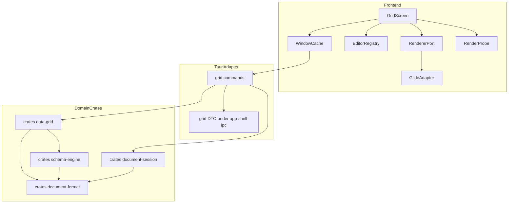
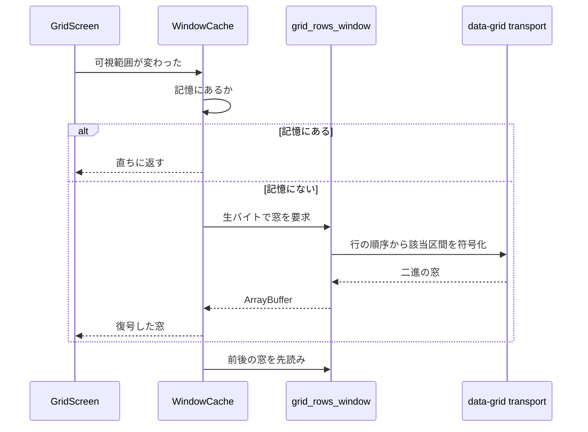
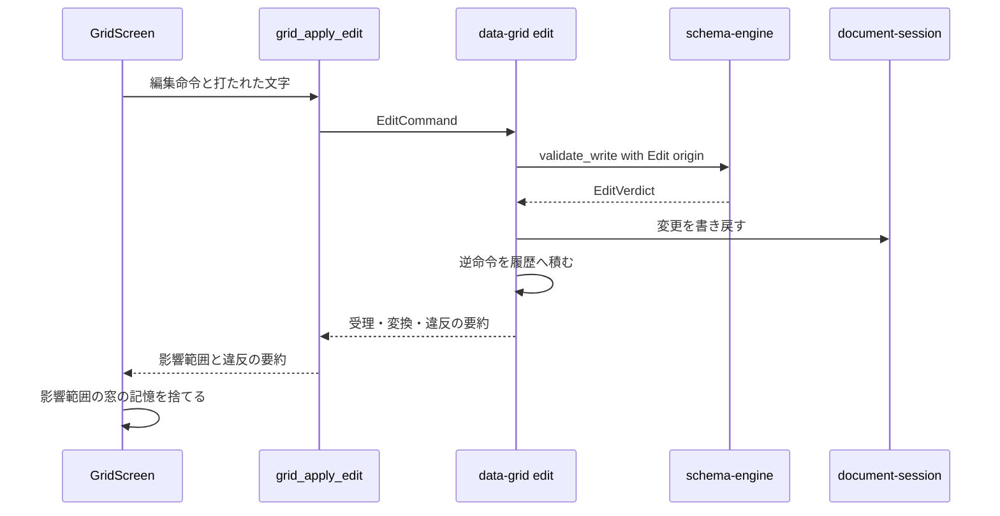
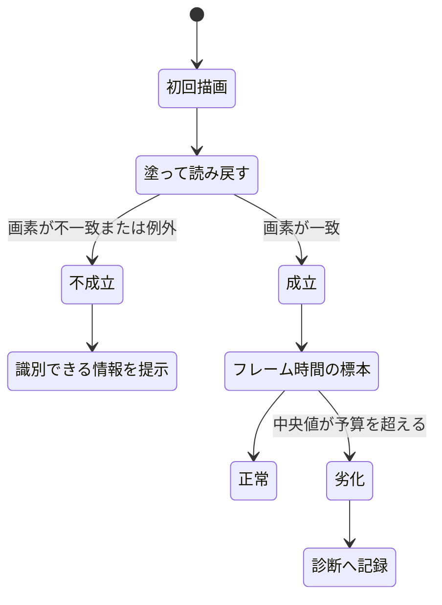

# Technical Design: data-grid

## Overview

**Purpose**: 本機能は、型付きのシートを人が読み書きするための実用水準の画面を提供する。10 万行の走査・セルの編集・違反の提示・入れ子の表現の 4 つが揃うことで、既に成立しているドキュメント形式と型システムが初めて道具になる。

**Users**: 10 万行規模の台帳を日常的に開き、直接打ち替え、他の表から貼り付けて移行するユーザー。

**Impact**: 現在フロントエンドにある表形式の画面は、3 OS の描画確認のための最小画面 1 つだけである（`src/features/smoke/TableSmoke.tsx`。それ自身が「実用水準へ育てるのは data-grid スペック」と書いている）。本機能はこれを置き換えず、実用水準の画面を新たに加え、確認用の最小画面は検証専用の経路に残す。加えて本機能は、後続の 3 スペックが乗る拡張点を 2 つ確定させる — 取り消し履歴（`formula-engine` / `macro-runtime` が加わる）と、セル入力手段の登録簿（`custom-types` が登録する）。

### Goals
- 10 万行 × 30 列のシートを、毎秒 60 回の描画更新を保ったまま走査・編集できる画面を提供する
- 値の正否の判断を一切持たず、`schema-engine` の判定結果の提示に徹する
- 取り消し履歴とセル入力手段の登録簿を、後続スペックが形を変えずに乗れる契約として確定させる
- 並べ替え・絞り込み・列順の変更を表示に閉じ、保存される順序を一切変更しない
- 3 OS のいずれでも実用水準のグリッドが描画されることを、実際に起動した観測で示す

### Non-Goals
- 値が型に適合するかの判断、型強制の規則（`schema-engine` が所有）
- スキーマの宣言と変更の画面（`schema-editor` が所有）
- 数式の入力・依存グラフ・再計算（`formula-engine` が所有）
- マクロの実行と実行トリガ（`macro-runtime` が所有）
- ドキュメントの読み込み・保持・保存・未保存の追跡（`document-session` が所有）
- 変更履歴と差分（`version-control` が所有）
- ユーザー定義型ごとの入力手段の実装（`custom-types` が登録側として所有）
- 添付ファイルの実体の選択と管理
- 表示対象のシートを選ぶ画面遷移

## Boundary Commitments

### This Spec Owns
- **シート 1 枚の表示と操作**: 走査、選択、現在位置、列の表示制御（幅・順・並べ替え・絞り込み）
- **セルの編集の意味論**: 編集の開始・確定・取消、`schema-engine` への判定依頼、判定結果と型強制の提示、違反値の保持
- **行の構造操作**: 追加・削除・複製と、既定値の適用
- **範囲の複製と貼り付け**: 表形式テキストとセル値の相互変換、貼り付け時の一括判定
- **取り消し履歴（拡張点・所有者）**: ドキュメント単位の命令スタック。`formula-engine` と `macro-runtime` が後から同じ履歴に加わる
- **セル入力手段の登録簿（拡張点・所有者）**: 型 → 入力手段の対応表。`custom-types` が登録する
- **表示状態**: 列幅・列順・並べ替え・絞り込み・展開状態。**ドキュメントに保存されない、画面に閉じた状態**
- **行データの窓単位の転送**: どの範囲を、どの形で、いつ運ぶか
- **グリッド自身の描画成立の検査**: 塗って読み戻す検査と、フレーム時間の標本

### Out of Boundary
- 値の正否と型強制の規則の実装（`schema-engine`。本機能は判定を依頼し結果を写すだけで、独自の判定分岐を持たない）
- スキーマ宣言の変更（列の追加・削除・型変更・制約変更は `schema-editor`）
- ドキュメントの読み込み・保持・保存・未保存の追跡・終了拒否（`document-session`）
- 起動時の描画経路の切り替えと環境変数の判定（`app-shell` の要件 10.3 が所有。**本機能は重複して持たない**）
- ウィンドウ・レイアウト・遷移・配色・例外の隔離（`app-shell` の画面の契約に従う）
- 数式の評価、マクロの実行、添付の実体、シート間参照をたどる遷移

### Allowed Dependencies
- `schema-engine`: 型カタログ、検証、型強制、違反の報告。**判定の唯一の源**
- `document-format`: 行・セル値・識別子のドキュメントモデル
- `document-session`: ウィンドウに対応する `Document` への参照と、変更を書き戻す手段。**能力の水準でのみ依存し、API の形を本設計で先に決めない**
  - **再検証（2026-09-14。`document-session` の実装完了を受けて）**: 公開面が確定した。本機能が依存するのは次の 3 つだけであり、**いずれも能力の水準の想定と一致した**（Revalidation Trigger「`document-session` の design 確定」の決着）。
    - **変更の適用**: `DocumentSessionsApi::edit(&self, window, &mut dyn FnMut(&mut Document) -> R) -> Result<Edited<R>, SessionError>`。**閉包の内側で `EditCommand` を適用する**形であり、本設計の `GridSession::apply(&mut self, doc: &mut Document, command)` は「`doc` を受け取る」という前提をそのまま保てる（所有者から可変参照を借りる閉包の中で呼ぶ）。**閉包の内側から同じセッションを呼び返してはならない**（再入禁止。ロックを保持したまま呼ぶのでデッドロックする）— `GridSession` の `apply` は記録を要する問い合わせ（`state` / `may_close` / 保存）を内部で呼ばないこと。
    - **一括の書き換え**: `Document::set_cells(sheet: SheetId, cells: &[(RowId, usize, CellValue)]) -> Result<(), CellWriteError>` が上流 `document-format` に入った（1 回の呼び出しで 10 万行 × 30 列 = 全 300 万セルを 1 秒以内に置き換えることを実測済み。予算 1 秒に対して **0.117 s**）。**`document-session` が本機能より先にこの口を必要としたため、本設計の「上流への最小の追加」（`remove_rows` / `insert_row_at`）を待たずに実装された** — 本設計のその口は依然として本機能の群 1 が実装する（**2026-09-14 に実施済み: 3 メソッドとも `crates/document-format` の `Document` に入った**）。**重複する行・列は「入力順の last-wins」**であり（仕様書に明記が無くテストも無い。`document-session` の 1.2 の申し送り）、貼り付けが重複を生成しうるなら本機能側で契約として明記するか重複を弾くこと。
    - **境界の型**: `crates/app-shell/src/ipc/document.rs` に 4 コマンド（`document_state` / `document_save` / `document_new` / `document_discard`）ぶんの応答型が入った。**64 ビット整数を出さず・位置を出さない・他のドメインクレートの型を参照しない**という本設計の境界の前提はそのままである（シートの件数は `u32`、識別子は文字列）。`GridCommands` が組み立てる境界型もこの規約に従う。
- `app-shell`: 画面登録簿、IPC 境界、コマンド登録の根、メニュー登録口、診断の記録
- **制約**:
  - `crates/data-grid` は `tauri` に依存しない（`scripts/check-core-deps.sh` が固定する）
  - `crates/data-grid` が依存してよい兄弟ドメインクレートは `document-format` と `schema-engine` のみ。`app-shell` には依存しない（境界用の型の組み立ては `src-tauri` の適応層が行う）
  - フロントエンドは `src/ipc/` の生成物経由でのみ境界を越える。`schema-engine` の判定を写した分岐をフロントエンドに作らない

### Revalidation Triggers
| 変更 | 再検証を要する相手 |
|---|---|
| 取り消し履歴の命令の形（何が 1 操作か、何を復元するか） | `formula-engine`, `macro-runtime` |
| セル入力手段の登録簿の登録インターフェース | `custom-types` |
| **境界に選択肢・参照先・ユーザー定義型の識別子を足す**（7.4 が記録した隙間 1〜3） | 8.3 の画面（`ColumnConstraints` の組み立て）と 7.4 の面 |
| **確定の文字の運び手を登録に足す設計の改訂**（7.4 が記録した隙間 4。入れ子は `SetNested` でなければ適合しない） | 8.3 の画面、`custom-types`、7.4 の面 |
| 窓の転送単位・符号化の形 | 要件 11 の予算の再測定 |
| `schema-engine` の判定 API の形 | 本機能の編集経路 |
| **`document-session` の design 確定** | **本設計（能力の水準で依存しているため、API の形が決まった時点で整合を取り直す）** — **2026-09-14 に実施済み**（`document-session` が実装完了。確定した公開面は「Allowed Dependencies」の `document-session` の項に記録した。想定と一致し、設計の変更は要らなかった） |
| `document-format` への 3 メソッド追加の形 | `document-format` の決定的出力の契約は不変。行の集合と並びのみ |
| 画面の契約（`ScreenProps`・配色変数・例外隔離） | `app-shell` 側の変更として全 UI スペック |

## Architecture

### Existing Architecture Analysis

本機能が載る土台はすべて実装済みであり、以下は**既に固定されている制約**である。

| 事実 | 出典 | 本設計への帰結 |
|---|---|---|
| 画面は `SHELL_SCREEN_REGISTRY` に 1 件足すだけで差し込まれる。受け取るのは `ScreenProps` のみ | `src/shell/router.tsx` / `Layout.tsx` | グリッド画面は 1 エントリ。自前のレイアウト・遷移・配色を持たない |
| `ScreenBoundary` は **イベントハンドラと非同期の失敗を捕まえない** | `src/shell/ScreenBoundary.tsx` | 走査・編集・IPC の失敗は**画面内で処理する**。器に落とせない |
| 外観変数は 10 本のみで、**グリッド専用の色は存在しない** | `src/shell/theme.ts` | 既存変数の範囲で配色する。選択は `--jxcel-control-active-background`、罫線は `--jxcel-control-border`、副次の文字は `--jxcel-screen-muted` |
| ts-rs の derive は `crates/app-shell/src/ipc/` の下だけ。境界に 64 ビット整数を出さない | `ipc-contract.md` | `CellValue::Int` と `RowId` は**そのまま越えられない** |
| 生バイト経路は封筒も `WindowContext` も運べない。**行指向の API を足してはならない** | `src-tauri/src/commands/bulk.rs` の module doc | 行データは窓単位で運ぶ。1 行ごとのコマンドを作らない |
| `Row` は `Serialize` も `Clone` も持たず、`Violation` も `Serialize` を持たない。`CellValue` は `Serialize` / `Deserialize` を持つ（`crates/document-format/src/value.rs`）が、それでも境界を越えられないのは 64 ビット整数（`CellValue::Int`）と識別子を出せず、ts-rs の derive が `crates/app-shell/src/ipc/` の下だけに許されるため | `crates/document-format`（`Row` / `CellValue`） / `crates/schema-engine`（`Violation`） | 境界用の型を別に定義する。ドメイン型を直接運ばない |
| `add_row` は末尾追加のみ | `crates/document-format/src/model/mod.rs` | **2026-09-14 に解消済み**: 下記の 3 メソッド（`remove_rows` / `insert_row_at` / `insert_rows_at`）が実装され、`document-format` の公開面に入っている（下記「上流への最小の追加」） |
| 開いた `Document` の持ち主が存在しない | `document-format` の被依存は `schema-engine` のみ | `document-session` に依存する（新設） |

### 上流への最小の追加

要件 6.1・6.2 は当時の公開面では実現できなかった（`add_row` ＋ `reorder_rows` での代替は 10 万行の並びを毎回渡すことになり要件 11 の予算に入らない）。本設計は `document-format` に次の 3 つだけを追加し、**2026-09-14 に実装済みである**（`crates/document-format/src/model/mod.rs`。呼び出し側は群 3・群 4）。

```rust
// crates/document-format/src/model/mod.rs の Document impl へ追加
pub fn remove_rows(&mut self, sheet: SheetId, rows: &[RowId]) -> Result<Vec<Row>, RowRemovalError>;
pub fn insert_row_at(&mut self, sheet: SheetId, index: usize) -> Result<RowId, RowInsertionError>;
// 3 つ目は要件 6.6 / 9.2 が要求する復元の口である（下記）。
pub fn insert_rows_at(&mut self, sheet: SheetId, index: usize, rows: Vec<Row>) -> Result<(), RowInsertionError>;
```

- `remove_rows` が**取り除いた行を返す**のは、取り消しに値と識別子の両方が要るためである（`Row` は `Clone` を持たない）
- 一括で受けるのは、範囲削除が 1 操作であり、行ごとに呼ぶと並びの作り直しが繰り返されるため
- **決定的な出力と往復の契約には触れない。**変わるのは行の集合と並びだけである
- **3 つ目の `insert_rows_at` が要る理由**: 取り消し（データモデル表「編集命令と逆命令の対応」の `RemoveRows` → 復元用の内部命令、および要件 6.6 / 9.2）が戻さねばならないのは**同じ `RowId`・同じ値・同じ位置**である。`insert_row_at` は**新しい識別子の空の行しか作れない**（`Row` は `Clone` を持たず、既存行の識別子・値を書き換える口も無い）ため、取り除いた行の識別子と値を戻せない。したがって `remove_rows` が返した `Row` をそのまま受け取る挿入の口を分けて置く。**外から `Row` を得られないからではない**（`parts::RowsCodec::decode` + `parts::SheetRows::into_rows` が公開面にあり、任意の識別子・値を持つ `Row` をクレート外で作れる。だからこそ `insert_rows_at` は受け取った識別子を文書内の現存集合とバッチ内の重複に対して検査する）。
- 誤り型は `CellWriteError` / `ReorderError` と同じ規律の判別可能な列挙体とし、診断に必要な文脈だけを持ち、表示用の文言を持たない（`RowRemovalError { UnknownSheet, UnknownRow }` / `RowInsertionError { UnknownSheet, IndexOutOfRange, DuplicateRow }`）

### Architecture Pattern & Boundary Map

選定した型は **「ドメインが状態と意味論を持ち、画面は窓と入力だけを持つ」**。`structure.md`「Tauri を必要とするスペックは 2 つに割る」と「性能はドメイン側で守る」の双方から導かれる。



**Key Decisions**:
- **行データは窓単位で運ぶ。**全件をフロントエンドへ送る案は、ドキュメントが Rust と webview に二重に載り要件 11.6 に反するため却下した
- **並べ替え・絞り込み・違反の集計はすべて Rust 側**にある。フロントエンドは行の集合を持たないので、表示上の並びが保存に漏れる経路が構造的に存在しない（要件 8.5）
- **描画層は移植口の背後**にある。Glide Data Grid の上流が止まっているという実測に対する退路であり、投機的な抽象ではない
- `DataGrid` は `app-shell` に依存しない。境界用の型の組み立ては `GridCommands`（適応層）が行う

### Technology Stack

| Layer | Choice / Version | Role in Feature | Notes |
|-------|------------------|-----------------|-------|
| Frontend | React 19.3 + Vite 7.3（既存） | 画面と入力 | 既存の構成。変更なし |
| Frontend | `@glideapps/glide-data-grid` **6.0.4-alpha24** | canvas の描画・当たり判定・文字計測・クリップボードの配管 | **stable 6.0.3 は React 19 を受け付けない**（peer が 18.x 止まり、issue #1189 が open）。MIT。フロントエンド初の重い依存 |
| Backend | 新設 `crates/data-grid` | 表示状態・編集命令・取り消し履歴・窓の符号化 | `tauri` 非依存。依存してよい兄弟は `document-format` と `schema-engine` |
| Backend | `crates/schema-engine`（既存） | 型カタログ・検証・型強制・違反 | 判定の唯一の源 |
| Backend | `crates/document-format`（既存 + 3 メソッド） | 行とセル値の保持 | `remove_rows` / `insert_row_at` / `insert_rows_at` を追加 |
| Backend | `crates/document-session`（別スペック） | `Document` の保持と変更の書き戻し | 能力の水準で依存 |
| Infrastructure | 既存の Tauri IPC 境界 | 封筒つきコマンド 5 本 + 生バイト 1 本 | `ipc-contract.md` の規約に従う |

### 内部の依存の向き

`crates/data-grid` は 6 層とし、左の層だけを参照する（`structure.md`「ドメインクレートの内部構造」）。この鎖の文言は各層の `mod.rs` 冒頭に置く。

```
error / types → view → edit → history → transport → api
```

| 層 | 責務 | 参照してよい層 |
|---|---|---|
| `error` / `types` | 誤り型、座標、範囲、表示位置と `RowId` の対 | なし |
| `view` | 並べ替え・絞り込みの適用結果としての行の順序。**ドキュメントを変更しない** | types |
| `edit` | 編集命令の定義と適用。`schema-engine` の判定を呼び `document-format` を変更する | types, view |
| `history` | 取り消し履歴。命令と逆命令の対を積む | types, edit |
| `transport` | 窓の行データと違反の符号化 | types, view |
| `api` | 公開面の再輸出と、画面 1 枚ぶんの操作口 | すべて |

## File Structure Plan

### Directory Structure
```
crates/data-grid/
├── Cargo.toml              # tauri 非依存。依存は document-format と schema-engine のみ
├── benches/
│   └── large_grid.rs       # 窓の符号化・並べ替え・絞り込み・貼り付けの計測
└── src/
    ├── lib.rs              # 層の鎖の宣言と公開面の再輸出
    ├── error.rs            # GridError。宣言の誤りと値の不適合を混ぜない
    ├── types/mod.rs        # CellAddress, CellRange, RowOrdinal, ColumnIndex の再輸出
    ├── view/mod.rs         # ViewState と RowOrder の導出（並べ替え・絞り込み）
    ├── view/violations.rs   # 可視行の序数に対する違反の索引。編集の結果で差分更新する
    ├── edit/mod.rs         # EditCommand とその適用。schema-engine の判定を呼ぶ
    ├── edit/paste.rs       # 表形式テキストとセル値の相互変換
    ├── history/mod.rs      # UndoStack。命令と逆命令の対
    ├── transport/mod.rs    # 窓の二進符号化。64 ビット整数を数値として出さない
    └── api.rs              # GridSession: 画面 1 枚ぶんの操作口

src-tauri/src/commands/
└── grid.rs                 # 薄い適応層。ドメイン型 ⇄ 境界用の型の変換はここだけ

crates/app-shell/src/ipc/
└── grid.rs                 # 境界用の型（ts-rs derive）。他のドメインクレートを参照しない

src/features/grid/
├── GridScreen.tsx          # 画面本体。SHELL_SCREEN_REGISTRY に 1 件登録される
├── gridClient.ts           # invokeCommand / invokeRaw の薄いラッパ
├── windowCache.ts          # 窓の記憶と先読み。破棄の方針を持つ
├── windowCache.test.ts     # 窓の記憶と二進形式の検査（vitest。7.3）
├── displayState.ts         # 列幅と表示上の列順のみ。窓の中身を変えない状態
├── editorRegistry.ts       # 拡張点: 型 -> 入力手段。重複登録を検出する
├── editors/index.ts        # 組込の入力手段 10 種の登録
├── editors/*.tsx           # text / number / decimal / bool / date / datetime / enum / ref / nested / any
├── nestedInspector.tsx     # 入れ子の値の詳細表示と編集
├── violationBar.tsx        # 違反の総数と次の違反への移動
├── renderer/port.ts        # 描画層の移植口（インターフェース定義）
├── renderer/fakeRenderer.ts   # 偽の実装 2 つ（テスト専用。7.1。本物ではない: 引くだけで塗らない）
├── renderer/interactionDriver.ts  # 操作の並びを注ぎ、外へ出た呼び出しを記録する駆動器（テスト専用。7.1）
├── renderer/port.test.ts   # 移植口の契約（vitest。7.1）
├── renderer/glideAdapter.tsx  # 移植口の Glide Data Grid 実装
└── renderProbe.ts          # 塗って読み戻す検査とフレーム時間の標本
```

### Modified Files
- `Cargo.toml` — `members` に `crates/data-grid` を追加
- `crates/document-format/src/model/mod.rs` — `remove_rows` / `insert_row_at` / `insert_rows_at` を追加（本機能が上流へ加える唯一の変更）
- `crates/app-shell/src/ipc/command_names.rs` — コマンド名の定数 6 本と `COMMAND_NAMES` への追加
- `crates/app-shell/src/ipc/mod.rs` — `render_bindings()` の `declarations` に境界用の型を追加
- `src-tauri/src/commands/mod.rs` — `command_root!` に 6 行追加
- `src-tauri/permissions/app.toml` — 権限ブロック 6 つと、`app-shell` の集合への所属
- `src/ipc/bindings.ts` — 生成物。`cargo run -p app-shell --bin generate-bindings` で再生成（手で編集しない）
- `src/shell/Layout.tsx` — `SHELL_SCREEN_REGISTRY` にグリッド画面を 1 件追加
- `package.json` — `@glideapps/glide-data-grid` を追加
- `package.json` / `package-lock.json` / `vitest.config.ts` / `.github/workflows/ci.yml` — フロントエンドのテストの走らせ手（`vitest`）と、その段（タスク 7.1）。群 7・群 8 のフロントエンドのタスクは「テストで示す」ことを要求するため、走らせ手ごと導入した。**ジョブもワークフローも新設しない** — 既存の `test` ジョブへ段を 1 つ足す（要件 6.2、タスク 1.4 の申し送り）。走らせる環境は `node` であり、追加の依存も表示先も要らない
- `scripts/ci/` — `check-core-deps.sh data-grid` の段、ベンチ予算への `large_grid/*` の追加、および 3 OS で 10 万行の走査と編集を観測する台本（要件 12.1, 12.4）。**既存の 3 OS 検証マトリクスを拡張し、独立した系統を新設しない**

## System Flows

### 窓の取得と先読み



先読みの幅と窓の大きさは計測で決める。走査中に記憶が外れたセルは**空白ではなく読み込み中として描く** — 空白は「値なし」と区別がつかないため。

### 編集の適用と判定



`WriteOrigin::Edit` は**決して拒否しない**（`schema-engine` 要件 6.1）。違反は値を保持したまま報告される。したがってこの流れに「編集の失敗で値が戻る」分岐は存在しない。取り消しは利用者の明示的な指示でのみ起きる。

### 描画成立の検査



`app-shell` の要件 10.3 が既に**起動時の描画経路の切り替えと環境変数の判定**を所有する。本機能はその下流で、**グリッド自身が実際に塗れたか**だけを確かめる。WebKit は WebGL のレンダラ文字列を伏せるため、素性を問う手段は使えない（`research.md`）。

## Requirements Traceability

| Requirement | Summary | Components | Interfaces | Flows |
|-------------|---------|------------|------------|-------|
| 1.1, 1.2, 1.3, 1.4 | 10 万行の表示と走査、位置の提示、端への直接移動 | WindowCache, RendererPort, GlideAdapter, WindowCodec | `encode_window`, `GridRendererPort.mount` | 窓の取得と先読み |
| 1.5, 1.6 | 行なし・列なしの提示 | GridScreen, GridSession | `GridOpenResponse.row_count`, `columns` | — |
| 1.7 | 外部経路の変更を表示へ反映 | WindowCache, GridScreen | `WindowCache.invalidate` | 編集の適用と判定 |
| 2.1, 2.2, 2.3, 2.4, 2.5, 2.6 | 現在位置・選択・追従・範囲の対象化 | GridScreen, RendererPort | `RendererSpec.onSelectionChange`, `RendererHandle.scrollTo` | — |
| 3.1, 3.2, 3.8 | 型に応じた入力手段（日時・選択肢・真偽・シート間参照） | EditorRegistry, editors | `CellEditorRegistry.resolve` | — |
| 3.3, 3.4, 3.5 | 判定への送付、変換の提示、違反値の保持 | EditApply, GridCommands | `EditCommand::SetCells`, `GridEditResponse.coercions` | 編集の適用と判定 |
| 3.6, 3.7 | 編集の取消、値なしへ戻す | GridScreen, EditApply | `CellEditorProps.cancel` | — |
| 4.1, 4.2, 4.6 | 違反の区別・理由・解消 | WindowCodec, GridScreen, ViolationBar | 窓の違反札, `GridViolationResponse.reason` | 編集の適用と判定 |
| 4.3, 4.4, 4.6 | 違反の総数と次の違反への移動、解消の反映 | ViolationIndex, GridSession, ViolationBar | `violation_total`, `find_violation` | 編集の適用と判定 |
| 4.5 | 入れ子の内側の違反位置 | WindowCodec, NestedInspector | `Violation.path` の写し | — |
| 5.1, 5.2, 5.3, 5.4, 5.6 | 入れ子の展開・折りたたみ・深さの上限・要素数 | ViewState, GridSession | `ViewState.expansion`, `MAX_EXPANSION_DEPTH` | — |
| 5.5, 5.7 | 入れ子の詳細表示とその中の編集 | NestedInspector, EditApply | `EditCommand::SetNested` | 編集の適用と判定 |
| 6.1, 6.2, 6.3, 6.4 | 行の追加・削除・複製と一意違反 | EditApply, document-format の 3 メソッド | `EditCommand::InsertRows/RemoveRows/DuplicateRows` | 編集の適用と判定 |
| 6.5 | 大量削除の確認 | GridScreen | — | — |
| 6.6 | 行操作が取り消しの対象 | UndoStack | `UndoStack.push` | — |
| 7.1, 7.2 | 範囲の複製と外部への受け渡し | PasteCodec, RendererPort | `RendererSpec.onCopy` | — |
| 7.3, 7.4, 7.5, 7.7 | 貼り付けの判定・行の補充・部分的違反・1 万行 | PasteCodec, EditApply | `EditCommand::PasteRange` | 編集の適用と判定 |
| 7.6 | 貼り付けが取り消しの 1 操作 | UndoStack | `UndoStack.push` | — |
| 7.8, 9.9 | メニューとキーボードの双方から実行 | GridScreen, メニュー登録口 | `app-shell` の登録口 | — |
| 8.1, 8.2 | 列幅と表示上の列順 | DisplayState | `DisplayState.columnWidths/columnOrder` | — |
| 8.3, 8.4, 8.7 | 並べ替え・絞り込み・隠れた行数 | RowOrder, GridSession | `set_view`, `GridViewResponse` | — |
| 8.5 | 保存される順序を変更しない | RowOrder | 表示順は `Document` を書き換えない | — |
| 8.6, 8.9 | 並べ替え・絞り込み中の編集と貼り付け | RowOrder, EditApply | 表示位置ではなく `RowId` で対象を決める | 編集の適用と判定 |
| 8.8 | 並べ替えの基準列の編集で行が動かない | RowOrder | 順序は明示の指示でのみ再計算する | — |
| 9.1, 9.2, 9.3, 9.4, 9.5, 9.6 | 取り消しとやり直しの対象・復元・破棄・単位・上限 | UndoStack, UndoRedo | `undo`, `redo`, `push`（上限） | UndoRedo が履歴と `EditApply` を借用で束ねてドキュメントへ適用する |
| 9.7 | 数式とマクロが同じ履歴に加わる | UndoStack | `UndoStack.push` の公開 | — |
| 9.8 | 取り消し後に対象範囲を見せる | GridScreen, RendererHandle | `scrollTo` | — |
| 10.1, 10.2, 10.3, 10.4, 10.5, 10.6 | 入力手段の登録簿と既定・重複検出 | EditorRegistry | `CellEditorRegistry` | — |
| 11.1, 11.2, 11.3, 11.5, 11.6, 11.7 | 応答時間と資源の予算 | WindowCache, WindowCodec, RowOrder | ベンチ `large_grid/*` | 窓の取得と先読み |
| 11.4 | 1 セルの編集で全件検証しない | EditApply, GridSession | `validate_columns` に限定して呼ぶ（差分の入口は `ViolationIndex::apply_report_delta`） | 編集の適用と判定 |
| 12.1, 12.4 | 3 OS での走査と編集の成立 | 3 OS 観測の台本 | `scripts/ci/` の段 | — |
| 12.2, 12.3 | 描画不成立の識別と劣化の記録 | RenderProbe | `probePaint`, `sampleFrameTimes` | 描画成立の検査 |

## Components and Interfaces

| Component | Domain/Layer | Intent | Req Coverage | Key Dependencies | Contracts |
|-----------|--------------|--------|--------------|------------------|-----------|
| GridSession | data-grid api | 画面 1 枚ぶんの操作口 | 1, 4, 8, 9 | RowOrder (P0), EditApply (P0), UndoStack (P0), ViolationIndex (P0) | Service |
| RowOrder | data-grid view | 並べ替え・絞り込みの結果としての行の順序 | 8 | document-format (P0) | Service, State |
| EditApply | data-grid edit | 編集命令の適用と判定の依頼 | 3, 5, 6, 7 | schema-engine (P0), document-format (P0) | Service |
| PasteCodec | data-grid edit | 表形式テキストとセル値の相互変換 | 7 | EditApply (P0) | Service |
| UndoStack | data-grid history | 取り消し履歴。**拡張点の所有者** | 6, 7, 9 | EditApply (P0) | Service, State |
| ViolationIndex | data-grid view | 可視行の序数に対する違反の索引。編集で差分更新する（入口は `apply_report_delta`） | 4 | RowOrder (P0), schema-engine (P0) | Service, State |
| WindowCodec | data-grid transport | 窓の二進符号化 | 1, 4, 11 | RowOrder (P0) | Batch |
| GridCommands | src-tauri 適応層 | ドメイン型 ⇄ 境界用の型 | 全体 | data-grid (P0), document-session (P0) | API |
| WindowCache | frontend | 窓の記憶と先読み | 1, 11 | GridCommands (P0) | State |
| DisplayState | frontend | 列幅と表示上の列順。窓に影響しない | 8 | — | State |
| EditorRegistry | frontend | 型 → 入力手段。**拡張点の所有者** | 3, 10 | — | Service |
| RendererPort | frontend | 描画層の移植口 | 1, 2, 7 | — | Service |
| GlideAdapter | frontend | 移植口の Glide 実装 | 1, 2, 7 | glide-data-grid (P1) | Service |
| RenderProbe | frontend | 描画成立の検査 | 12 | — | Service |
| GridScreen | frontend | 画面本体 | 全体 | 上記すべて (P0) | State |
| NestedInspector | frontend | 入れ子の詳細表示 | 5 | EditorRegistry (P1) | 要約のみ |
| ViolationBar | frontend | 違反の総数と移動 | 4 | GridCommands (P1) | 要約のみ |

### data-grid ドメイン

#### GridSession

| Field | Detail |
|-------|--------|
| Intent | 画面 1 枚ぶんの操作口。表示状態と履歴を保持する |
| Requirements | 1.1, 1.3, 1.4, 4.3, 4.4, 8.3, 8.4, 8.7, 9.2, 9.3 |

**Responsibilities & Constraints**
- シートに対する表示状態（行の順序・違反の索引）と取り消し履歴を所有する
- **`Document` を所有しない。**呼び出しごとに参照または可変参照を受け取る（所有者は `document-session`）
- スキーマは開いた時点の `CompiledSchema` を保持する。スキーマが変わったらセッションを作り直す
- **違反の総数は、索引を組み立てた後（最初の `set_view` の後）は編集・取り消し・やり直しの直後に差分で最新に保つ。**材料は `EditOutcome` が運ぶ違反と再検証した列であり、**全件検証は 1 回も呼ばない**（要件 4.3, 4.6, 11.4。式と、`set_view` の前に据え置く理由は Implementation Notes）
- 公開面は根（`lib.rs`）の再輸出に集める。本型は `api` 層にあり、層の鎖の文言をモジュール冒頭に置く（`structure.md`「ドメインクレートの内部構造」）

**Dependencies**
- Outbound: RowOrder — 行の順序の導出 (P0)
- Outbound: EditApply — 編集の適用 (P0)
- Outbound: UndoStack — 履歴 (P0)
- Outbound: ViolationIndex — 違反の索引の組み立てと差分更新 (P0)
- External: `schema-engine` — 判定と列の情報 (P0)

**Contracts**: Service [x] / API [ ] / Event [ ] / Batch [ ] / State [x]

##### Service Interface
```rust
pub struct GridSession { /* sheet: SheetId, schema: CompiledSchema, view: ViewState, order: RowOrder,
                            history: UndoStack, apply: EditApply, index: ViolationIndex,
                            layout: ColumnLayout, codec: WindowCodec,
                            query: Arc<dyn EditSchemaQuery>, indexed: bool */ }

impl GridSession {
    pub fn open(sheet: SheetId, schema: CompiledSchema) -> Result<Self, GridError>;
    pub fn with_query<Q: EditSchemaQuery + 'static>(
        sheet: SheetId,
        schema: CompiledSchema,
        query: Arc<Q>,
    ) -> Result<Self, GridError>;
    /// 列の構成（入れ子の展開を含む平坦な並び）。**6.1 の境界型へ写すのはここから**
    pub fn columns(&self) -> &[LayoutColumn];
    pub fn visible_row_count(&self) -> usize;
    pub fn hidden_row_count(&self) -> usize;
    pub fn violation_total(&self) -> usize;
    pub fn generation(&self) -> Generation;
    pub fn set_expansion(&mut self, state: ExpansionState);
    pub fn expansion(&self) -> &[ExpansionState];

    pub fn set_view(&mut self, doc: &Document, spec: ViewSpec) -> Result<ViewSummary, GridError>;
    pub fn encode_window(&self, doc: &Document, span: RowSpan) -> Result<Vec<u8>, GridError>;
    pub fn apply(&mut self, doc: &mut Document, command: EditCommand) -> Result<EditOutcome, GridError>;
    pub fn undo(&mut self, doc: &mut Document) -> Result<Option<EditOutcome>, GridError>;
    pub fn redo(&mut self, doc: &mut Document) -> Result<Option<EditOutcome>, GridError>;
    pub fn find_violation(&self, from: RowOrdinal, direction: SearchDirection) -> Option<CellAddress>;
}

pub const DEFAULT_UNDO_LIMIT: usize = 1_000;
```
- Preconditions: `schema` は同一シートを `compile` したものであること（列の添字は `Row::values()` に対する位置である）。`open` / `with_query` は列 0 本の計画を `GridError::SchemaUnusable` で拒む（要件 1.6 の提示はセッション無しに画面が行う）
- Postconditions: `apply` / `undo` / `redo` は `EditOutcome.affected` に影響を受けた `RowId` を必ず含める
- Invariants: `set_view` と `encode_window` は `Document` を変更しない
- Invariants: `violation_total` は**索引を組み立てた後（`set_view` を 1 度呼んだ後）**は `apply` / `undo` / `redo` の直後につねに最新である。**全件検証の再実行ではなく、判定が返した違反との差分で索引を更新する**（要件 11.4 が全件検証を禁じているため）。**`set_view` の前は据え置き（0 のまま）である** — これは実装の逃げではなく**固定の前提**である: `open(sheet, schema)` は**文書を受け取らない** signature であり、索引はシートを読まなければ組み立てられないため、`set_view(&doc, spec)` が文書を渡すまで物理的に作れない（据え置きの規則は Implementation Notes「索引をまだ組み立てていないセッション」）
- **`columns` の戻り値は `view` 層の `LayoutColumn` である。**design.md の `ColumnDescriptor` は 6.1 の境界型であり、本クレートに写しを足さない — `LayoutColumn` が写しに要るもの（列の添字・内側の位置・表示名・葉の型の札・要素数の能力・展開の可否）を全部持つためである。**6.1 はここから境界型へ写す**
- **判定の縫い目を差し替える `with_query` を公開する。**要件 11.4 の観測（編集・取り消し・やり直しの経路で `validate_sheet` が 0 回であること）は、本番の縫い目を包んだ実装を差し込んで**呼び出しの形を数える**ことでしか取れない（`open` は本番の縫い目で開く薄い入口である）
- **入れ子の展開（`set_expansion` / `expansion`）と世代（`generation`）も公開する。**展開は表示状態の一部であり（要件 5.3）、境界（6.1）が展開の指定を運ぶにはセッションに指定口と読み口が要る

**Implementation Notes**
- Integration: `GridCommands` がウィンドウごとに 1 つ保持する。ウィンドウが閉じたら破棄する
- Validation: `visible_row_count` と `encode_window` の範囲の整合を型で守る（`RowSpan` は可視行の序数で表す）
- **差分の入口は `ViolationIndex::apply_report_delta`**（`view` 層）。`EditOutcome.revalidated_columns` が**全列**を覆っていれば `EditOutcome.violation_total` をそのままシートの総数とする（行の構造を変える命令と、補充を伴う貼り付けは全列を再検証する。長さが宣言の列数に等しいことで全列と判定する — `revalidated_columns` は昇順・重複なしである）。**一部の列**に閉じているときは `索引の旧総数 − ViolationIndex::violations_in_columns(覆った列) + EditOutcome.violation_total` とする。被減数は「索引が**載せている**その列の違反の数」であり、索引は `set_view` で `ValidationOptions::unlimited` の全件検証から組み立てるため、覆った列について「編集前のシートのその列の違反」に一致する（触っていない列は編集で変わらない）。`apply_report_delta` は行を鍵とする保持の載せ替え・据え付け（`ViolationPresence`）の作り直し・**変わった行だけ**の序数の修正までを行い、順序が変わったときだけ `ViolationIndex::rekey` を足で呼ぶ。索引をまだ組み立てていないセッション（`set_view` の前）は総数を据え置く
- Risks: スキーマ変更時のセッション再作成を忘れると列の添字がずれる。`schema-editor` との継ぎ目として記録する

#### RowOrder

| Field | Detail |
|-------|--------|
| Intent | 並べ替えと絞り込みの結果としての行の順序を保持する。**ドキュメントを変更しない** |
| Requirements | 8.3, 8.4, 8.5, 8.6, 8.7, 8.8, 8.9 |

**Responsibilities & Constraints**
- `Vec<RowId>`（可視行の順）と、隠された行数だけを持つ
- **`Document` の行の並びを書き換える経路を持たない。**これが要件 8.5 を構造で満たす根拠である
- 順序の再計算は `set_view` でのみ起きる。編集では起きない（要件 8.8）

**Contracts**: Service [x] / State [x]

##### Service Interface
```rust
pub struct ViewSpec { pub sort: Vec<SortKey>, pub filters: Vec<FilterSpec> }
pub struct SortKey { pub column: ColumnIndex, pub descending: bool }
pub enum FilterSpec {
    Equals { column: ColumnIndex, text: String },
    Contains { column: ColumnIndex, text: String },
    IsEmpty { column: ColumnIndex },
    IsNotEmpty { column: ColumnIndex },
    HasViolation { column: Option<ColumnIndex> },
}
pub struct ViewSummary { pub visible: usize, pub hidden: usize }

impl RowOrder {
    pub fn recompute(&mut self, doc: &Document, sheet: SheetId, spec: &ViewSpec) -> ViewSummary;
    pub fn row_at(&self, ordinal: RowOrdinal) -> Option<RowId>;
    pub fn ordinal_of(&self, row: RowId) -> Option<RowOrdinal>;
    pub fn span(&self, span: RowSpan) -> &[RowId];
}
```
- Invariants: 同一の `Document` と `ViewSpec` からは常に同一の順序が出る（並べ替えは安定であり、同値の行は `RowId` の順で並ぶ）

**Implementation Notes**
- Integration: 並べ替えの比較はセルの表示文字列ではなく**値の変種ごとの順序**で行う（数値は数値として比較する）
- Risks: 10 万行 × 複数の基準列の並べ替えが要件 11 の予算に入るかは計測で確かめる。`benches/large_grid.rs` の対象とする

#### EditApply

| Field | Detail |
|-------|--------|
| Intent | 編集命令を適用し、`schema-engine` に判定を依頼する唯一の経路 |
| Requirements | 3.3, 3.4, 3.5, 3.7, 5.7, 6.1, 6.2, 6.3, 6.4, 7.3, 7.4, 7.5, 11.4 |

**Responsibilities & Constraints**
- **判定の分岐を持たない。**`validate_write` に `WriteOrigin::Edit` で委ね、返った `EditVerdict` を写すだけである
- `WriteOrigin::Edit` は決して拒否しない（`schema-engine` 要件 6.1）。したがって「編集が失敗して値が戻る」経路は存在しない
- 1 セルの編集では `validate_columns` を**当該列に限定して**呼ぶ。全件検証は行わない（要件 11.4）
- 行の追加は `CompiledSchema::default_row()` を使う（要件 6.1）

**Contracts**: Service [x]

##### Service Interface
```rust
pub enum EditCommand {
    SetCells { cells: Vec<(CellAddress, String)> },
    SetNested { cell: CellAddress, json: String },
    InsertRows { at: RowOrdinal, count: usize },
    RemoveRows { rows: Vec<RowId> },
    DuplicateRows { rows: Vec<RowId> },
    PasteRange { anchor: CellAddress, text: String },
}

pub struct EditOutcome {
    pub affected: Vec<RowId>,
    pub coercions: Vec<CoercionNotice>,
    pub violation_total: usize,
    /// 5.2 が足した: 再検証した列が持つ違反の一覧（差分の材料であり、追加の検証は呼ばない）
    pub violations: Vec<Violation>,
    /// 5.2 が足した: 再検証した列の索引（昇順・重複なし。空の命令では空）
    pub revalidated_columns: Vec<ColumnIndex>,
    pub row_count: usize,
}
pub struct CoercionNotice { pub cell: CellAddress, pub before: String, pub after: String }
```
- Preconditions: `CellAddress` の列は `CompiledSchema` の範囲内であること
- Postconditions: 適用後、`UndoStack` に逆命令が 1 つ積まれる
- **`violations` と `revalidated_columns` は 5.2 の差分更新（要件 4.6, 11.4）のために足した欄であり、`violation_total` と同じ範囲を覆う**（`SetCells` / `SetNested` は編集した列だけ、行の構造を変える命令と補充を伴う貼り付けは全列）。**埋めるために追加の検証は 1 回も呼ばない** — 適用の経路が既に得ている報告を写すだけである
- **`EditOutcome` は `Eq` を導出しない**（`violations` が `schema_engine::Violation` を運び、その `PartialEq` までしか持たない。`Violation` は `CellValue` を運び、`CellValue` は浮動小数を持つため `Eq` を持たない）。`PartialEq` は導出したままであり、`EditOutcome` を集合や写像の鍵にする経路は無い

**Implementation Notes**
- Integration: 打たれた文字は `String` として受け取り、型解釈は `schema-engine` に委ねる。**フロントエンドは値を数値として扱わない**
- Validation: 一意制約の違反は複製（要件 6.4）と貼り付け（要件 7.5）の双方で「中止せず違反として報告」になる。これは `WriteOrigin::Edit` の性質から自動的に従う
- Risks: 入れ子の値は `document-format` の `to_json_bytes` / `from_json_bytes` を通す。ここだけ文字列が JSON になる

#### UndoStack（拡張点の所有者）

| Field | Detail |
|-------|--------|
| Intent | 取り消し履歴。`formula-engine` と `macro-runtime` が後から同じ履歴に加わる |
| Requirements | 6.6, 7.6, 9.1, 9.2, 9.3, 9.4, 9.5, 9.6, 9.7 |

**Responsibilities & Constraints**
- 命令と**逆命令の対**を積む。逆命令は適用時に生成する（適用後には作れないため）
- 履歴は**ドキュメント単位**であり、シートごとではない（要件 9.5）。`macro-runtime` の実行が複数シートに跨るため
- 上限を持ち、超えたら古い側から捨てる（要件 9.6）。**上限 0 は「1 件も保持しない」**
- **公開する登録口は `push` 1 つ**に絞る。乗る側が履歴の内部構造に触れない
- 取り消し・やり直しの**適用**は `UndoRedo`（履歴と `EditApply` を借用で束ねた口）が担う。
  `UndoStack` 自身は `Document` を持たず、適用の経路も持たない（この分離が層の鎖を閉じたまま
  にする）

**Contracts**: Service [x] / State [x]

##### Service Interface
```rust
pub struct UndoStack { /* entries: Vec<UndoEntry>, cursor: usize, limit: usize */ }
pub struct UndoEntry { pub label: UndoLabel, pub inverse: HistoryCommand, pub redo: HistoryCommand }
pub enum UndoLabel { CellEdit, RowInsert, RowRemove, RowDuplicate, Paste, Recalculation, MacroRun }

impl UndoStack {
    pub fn new(limit: usize) -> Self;
    pub fn push(&mut self, entry: UndoEntry);
    pub fn undo(&mut self) -> Option<&HistoryCommand>;
    pub fn redo(&mut self) -> Option<&HistoryCommand>;
    pub fn depth(&self) -> usize;
}

/// 履歴と適用の経路を**借用の対**として束ね、取り消し・やり直しをドキュメントへ適用する
/// （要件 9.2, 9.3）。`history` 層に置く — 本層は `edit` 層を参照してよい（鎖の向きのまま）。
pub struct UndoRedo<'a> { /* stack: &'a mut UndoStack, apply: &'a mut EditApply */ }

impl<'a> UndoRedo<'a> {
    pub fn new(stack: &'a mut UndoStack, apply: &'a mut EditApply) -> Self;
    pub fn undo(&mut self, doc: &mut Document) -> Result<Option<EditOutcome>, GridError>;
    pub fn redo(&mut self, doc: &mut Document) -> Result<Option<EditOutcome>, GridError>;
}
```
- Invariants: `push` は `cursor` 以降のやり直し対象を破棄する（要件 9.4）。そのうえで**上限を
  超えた分を古い側から捨て**、`cursor` を捨てた件数だけ手前へ寄せる（要件 9.6）— 寄せなければ
  取り消しが捨てた対の位置を指し、保持している対を飛ばす
- Invariants: `limit == 0` は**「1 件も保持しない」**（「無制限」ではない。無制限が要るなら
  上限を持たない型が正しい表現であり、10 万行を扱う道具で有界でない記憶の伸びる経路を既定で
  開かない）。専用の分岐は無く、追い出しの一般の規則の帰結である
- Invariants: `undo` / `redo` は位置を動かすだけで、**履歴へ積まない**（積むと「取り消しの
  取り消し」になり、同じ操作が 2 回適用される経路ができる）。したがって `depth()` はこれらで
  変わらない（変わるのは `push` と追い出しだけである）
- Invariants: `UndoRedo::undo` / `redo` は**適用が失敗したとき位置を動かさない**（先に読んで
  適用し、成功してから位置を進める）。戻る／進む対が無ければ `Ok(None)`（失敗ではない）
- Invariants: 取り消し・やり直しの結果は `EditOutcome` であり、**影響を受けた行**
  （`affected`）を運ぶ（要件 9.2, 9.3 の「結果」）
- `HistoryCommand` / `RestoredRow` は **`edit` 層**の型である（適用の経路が復元の材料を名指すため。層の鎖 `error / types → view → edit → history` を閉じたままにする）。`entries` は `Vec` である（`VecDeque` ではなく、積んだ並びを借用の切片として読める必要がある）

**Implementation Notes**
- Integration: `UndoLabel::Recalculation` と `MacroRun` は本機能では生成されない。**後続スペックのために先に場所を空けてある**（拡張点は所有者が形を決める、`structure.md`）
- Integration: 逆命令は `EditApply::apply_with_inverse` が**適用と同じ本体の中で**組む（適用の後には変更前の値・取り除かれた行・位置が存在しない）。`apply` は対を捨てるだけの委譲である
- Risks: 行の削除の逆命令は取り除いた行の値と `RowId` と位置を保持する必要がある。`document-format::remove_rows` が `Vec<Row>` を返す理由がこれである
- Risks: その逆命令は**`EditCommand` では表せない** — `Row` は `Clone` を持たず、公開の構築子も `document-format` の外に無い（`Row` を得る公開経路は `remove_rows` と `parts::RowsCodec::decode` + `SheetRows::into_rows` だけである）。したがって **`edit` 層に履歴専用の命令型 `HistoryCommand`** を置き、復元用の内部命令はその `RestoreValues` / `RestoreRows` が運ぶ（**公開の `EditCommand` は 1 変種も増えない**）。`RestoreRows` の適用は行データの wire 形式を組み立てて復号の正規の入口を通す

#### WindowCodec

| Field | Detail |
|-------|--------|
| Intent | 可視範囲の行を、境界を越えられる二進形式へ符号化する |
| Requirements | 1.1, 1.2, 4.1, 4.5, 11.2, 11.6 |

**Responsibilities & Constraints**
- **64 ビット整数と ULID を数値として出さない。**セルは表示文字列・変種の札・違反の有無で表す
- 窓は可視行の序数の区間で指定する。絞り込み後の序数であり、`Document` の物理位置ではない

**Contracts**: Batch [x]

##### Batch / Job Contract
- Trigger: `grid_rows_window` コマンド（生バイト経路）
- Input: 要求の頭（シート・開始序数・行数・世代）を含む二進の引数 1 つ
- Output: 二進の窓。`application/octet-stream` として返る
- Idempotency & recovery: 同じ世代・同じ区間の要求は常に同じ結果を返す。世代が古い要求は**空の窓**を返し、呼び出し側が再要求する

**Implementation Notes**
- Integration: 生バイト経路は封筒を運べないため、**失敗は空の窓で表す**（`bulk_echo` が確立した規律と同じ）
- Risks: 符号化の費用が要件 11.2 の 1 秒に入るかを計測する。`benches/large_grid.rs` の対象とする

### 適応層とフロントエンド

#### GridCommands

| Field | Detail |
|-------|--------|
| Intent | ドメイン型と境界用の型の変換を行う唯一の場所 |
| Requirements | 全体 |

**Contracts**: API [x]

##### API Contract
| Command | Request | Response | 経路 |
|---------|---------|----------|------|
| `grid_open_sheet` | `GridOpenRequest` | `GridOpenResponse` | 封筒 |
| `grid_set_view` | `GridViewRequest` | `GridViewResponse` | 封筒 |
| `grid_rows_window` | 二進の引数 1 つ | 二進の窓 | **生バイト** |
| `grid_apply_edit` | `GridEditRequest` | `GridEditResponse` | 封筒 |
| `grid_history` | `GridHistoryRequest` | `GridEditResponse` | 封筒 |
| `grid_find_violation` | `GridViolationRequest` | `GridViolationResponse` | 封筒 |

**Implementation Notes**
- Integration: コマンド名は `command_names.rs` の定数。権限ブロック 6 つと `app-shell` の集合への所属を同時に足す（片方だけでは**ビルド時に静かに削除される**）
- Validation: `scripts/check-command-acl.sh` が登録 ⊆ 許可を固定する。`src/ipc/client.ts` の `RawCommandName` に `grid_rows_window` を加える
- Risks: 境界用の型は `crates/app-shell/src/ipc/grid.rs` に置く（ts-rs の derive が許される唯一の場所）。この型は**他のドメインクレートを参照してはならない**ため、すべて文字列と 32 ビット以下の整数で構成する

##### 荷の型（6.1 が確定させたもの）

封筒（要求・応答の型）は本節のコマンドが持ち、**荷（payload）の型は 6.1 の
`crates/app-shell/src/ipc/grid.rs` が持つ** — 6.2 / 6.3 はここに並ぶ型を組み合わせるだけで
足りる（荷の型を新設しない）。`app-shell` は他のドメインクレートに依存しないため、写すのは
`src-tauri` の適応層である。

| 6.1 の型（生成物 `src/ipc/bindings.ts` に出る） | 写す元 |
|---|---|
| `TypeKindTag`（14 種。`ALL` が閉じた集合の唯一の源） | `schema-engine::TypeKind::ALL`（一致の検査は `src-tauri` に置く） |
| `ColumnDescriptor` / `ColumnElementCount` / `ColumnExpandability` / `GridPathSegment` | `view::LayoutColumn` / `ElementCount` / `Expandability` / `types::NestedPathSegment` |
| `GridSheetSummary`（列の構成とシートの行数） | `ColumnLayout` とシートの行数 |
| `GridViewSpec` / `GridSortKey` / `GridFilterSpec` / `GridExpansionState` | `ViewSpec` / `SortKey` / `FilterSpec` / `ExpansionState` |
| `GridEditCommand` / `GridCellEdit` / `GridCellAddress` | `EditCommand` / （`SetCells` の 2 つ組） / `CellAddress` |
| `GridEditOutcome` / `GridCoercionNotice` | `EditOutcome` / `CoercionNotice` |
| `GridViolationLocation` | `Violation` の位置（行・列・内側の経路） |

- **要件 1.5 と 1.6 は列の数で区別する。** `GridSheetSummary` が列の構成と行数を同じ型に載せる
  ため、「列が 1 本も無い（表を描かない）」と「列はあるが行が無い（列の構成を示す）」が形の上で
  分かれる。**絞り込みで可視の行が 0 件になった状態は要件 1.5 ではない**（行が在って隠れている）
  ため、可視行数と隠された行数は `GridViewResponse` が別に運ぶ（要件 8.7）
- **展開は `GridViewSpec` が運ぶ。** 並べ替え・絞り込み・展開はどれも窓が運ぶ行と列を変えるため
  （「表示状態」の割り方の根拠）、要求の口は `grid_set_view` の 1 つで足りる
- **違反の理由（`ViolationReason`）は 6.1 の荷に無い。** `GridViolationResponse.reason` は
  6.2 / 6.3 が定義する（要件 4.2）
- **値は打たれた文字として運ぶ。** 境界にセル値の型を置かない（窓の二進形式も「数値としての
  値を一切含まない」）。`SetNested` の構造表現と `PasteRange` の表形式テキストは文字列である

##### 封筒の形（6.2 が確定させたもの）

タスク 6.2 が 5 つのコマンドの要求と応答を `crates/app-shell/src/ipc/grid.rs` に置き、
`src-tauri/src/commands/grid.rs` の適応層と結線した。設計が名指ししていた型の**中身**は
次のとおりである（荷は 6.1 の型をそのまま使う）。

| コマンド | 要求の中身 | 応答の中身 |
|---|---|---|
| `grid_open_sheet` | `sheet`（**シートの識別子の文字列**。`DocumentSheet.id` をそのまま渡す） | `context` と `GridSheetSummary` |
| `grid_set_view` | `view: GridViewSpec`（並べ替え・絞り込み・展開の**完全な記述**） | `context`、可視行数、隠された行数、違反の総数 |
| `grid_apply_edit` | `command: GridEditCommand` | `context` と `GridEditOutcome`（`null` は取り得ない） |
| `grid_history` | `direction`（`undo` / `redo` の閉じた列挙） | `context` と `GridEditOutcome \| null`（`null` は「進める履歴が無い」） |
| `grid_find_violation` | `from`（可視行の序数）と `direction`（`forward` / `backward`） | `context` と、見つかった違反（位置と理由）または `null` |

6.2 が決めた点と、その根拠:

- **シートは識別子の文字列で選ぶ。** 1 つのドキュメントは複数のシートを持ちうるが、表示する
  シートを選ぶ手段は本機能の外にあり（Out of Boundary）、境界を越える識別子は文字列である
  （64 ビット整数を出さない規約）。`grid_open_sheet` を同じウィンドウで 2 度呼ぶと**前の保持を
  置き換える**（シートの切り替えである）
- **`grid_history` の応答は `grid_apply_edit` と同じ型である**（設計の API Contract の
  とおり）。「進める履歴が無い」ことは `outcome: null` という**成功腕の結果**であり、封筒の
  失敗腕へは載せない（利用者の操作が失敗したことではない）
- **違反の理由は `GridViolation`（位置と理由の対）にまとめる。** 位置だけを `location`、
  理由だけを `reason` という 2 つの `null` 許容の欄に分けると、「位置はあるが理由が無い」という
  状態が型の上で表現できてしまう。理由の文言は**適応層が組み立てる**（`ViolationReason` の
  12 変種と `Expected` の 11 変種を書き分ける。ドメインは表示用の文言を持たない）
- **`GridViolationResponse` 以外は空の結果を持たない。** 「これ以上違反が無い」だけが
  `null` であり、`grid_open_sheet` の 2 つの空の状態（列が無い・行が無い）は
  `GridSheetSummary` の形が表す（要件 1.5、1.6）

##### 適応層が担う 5 つの仕事（6.2）

1. **違反の総数をシート全体へ閉じる。** `EditOutcome::violation_total` は再検証した列に
   閉じた数であるため、境界へ載せるのは `GridSession::violation_total()` の値である
   （差分で最新に保たれている。**検証を呼び直さない** — 要件 11.4）
2. **型の種別の札の一致検査。** `TypeKindTag`（`app-shell`）と `TypeKind::ALL`
   （`schema-engine`）の双方を見られる唯一のクレートが `src-tauri` である。写像は
   ワイルドカードの無い `match`（総関数 ＝ `TypeKind` に変種が増えればコンパイルが壊れる）であり、
   像が `TypeKindTag::ALL` と綴り・件数・並びの 3 点で一致することを 1 つのテストが固定する
   （境界にだけ札が増えた場合も落ちる）
3. **ウィンドウごとの `GridSession` の保持と破棄。** 表はラベル → `GridSession` の写像であり、
   ロックは参照と挿入・除去のためだけに取る（10 万行の適用が他のウィンドウを待たせない）。
   破棄の購読はセッションの層と同じ縫い目（`WindowDestroyEvents`）を通し、
   **登録できないときは保持を置かない**。**起動時の `manage` は行わない** — `lifecycle::run` は
   6.2 の境界の外にあるため、最初のコマンドが管理状態を作る（`Mutex` で直列化する）
4. **`document-format` の名前を書かない。** `src-tauri` は `document-format` を通常依存に
   持たない（`session/verification.rs` と同じ規律）ため、シート・行数・識別子は
   `document-session` の公開面（`read` / `edit` の閉包）と推論だけで扱う。計画
   （`CompiledSchema`）は `schema-engine` のものであり、通常依存に足した
5. **封筒を返す 5 つとも `#[tauri::command(async)]` である**（同期の本体を主スレッドの外で
   走らせる印。**生バイトの `grid_rows_window` はこれに当てはまらない** — 下の「実行モデル」を
   参照）。
   設計はグリッドのコマンドの実行モデルを定めていないが、`grid_set_view` の初回は
   シート全体の検証（10 万行 × 30 列で約 255 ミリ秒）を、`grid_apply_edit` と `grid_history` は
   1 万行の貼り付けとその取り消し（要件 11.5 の予算 3 秒）を運びうる。**主スレッドをその間
   占めると、要件 11 の目的（どの操作でも待たされない）が壊れる。** `State` を引数に取らない
   のはこのためである（借用はスレッドを跨げない）— 管理状態は本体の中で `app.state` から取る

##### 生バイト経路の要求の頭（6.3 が確定させたもの）

`grid_rows_window` の引数の配置は、設計の Input の 1 行（「要求の頭（シート・開始序数・行数・
世代）を含む二進の引数 1 つ」）を**バイトの並びへ落としたもの**であり、`src-tauri` の
`commands/grid.rs`（モジュール docs「生バイト経路」と `decode_window_argument`）が唯一の源である。

```text
引数 = 頭 || シートの識別子

頭（33 バイト。数の欄はすべて u64 リトルエンディアン）:
  0       版        u8      = WINDOW_REQUEST_VERSION（1）
  1..9    世代      u64     要求が名乗る世代
  9..17   開始序数  u64     可視行の序数（文書の位置ではない）
  17..25  行数      u64     要求する行の数
  25..33  シート長  u64     シートの識別子の UTF-8 のバイト長
33..     シート    UTF-8   シートの識別子（要求の末尾まで）
```

- **固定部分の幅を固定する**（33 ＝ 窓の `HEADER_LEN` と同じ幅）ため、復号は前へ 1 回走査する
  だけで閉じる。可変長の欄の長さは本体の直前に置く（窓と同じ規律）
- 全体の長さは `33 + シート長` であり、**長い入力も短い入力も拒む**（余りを黙って捨てると、
  壊れた要求が正常に見える）
- 数の欄を u64 にする理由は窓と同じである（符号化の側に「収まらない」経路を作らない）。
  復号の側だけが、32 ビットのホストで表せない値を拒む
- 版は窓の版（`WINDOW_FORMAT_VERSION`）とは**別の体系**である。欄を足すときは版を上げる
- **引数は入れ子にしない。** `invoke("grid_rows_window", buffer)` の形で呼び、構造体や
  `serde` の型で包まない — 包むと Tauri が `Uint8Array` を `Array.from()` で数値の配列へ
  変換し、JSON として送る（`bulk_echo` と同じ罠。要件 4.5）
- **TS 側の符号化は `src/features/grid/windowCache.ts` の `encodeWindowRequest` である**（7.3）。
  呼び出しは `invokeRaw("grid_rows_window", バッファ)` を通り、**引数はバッファ全体**である。
  位置ごとの表明は `windowCache.test.ts` にあり、**要求の側の言語をまたぐ固定ファイルは無い**
  （要求の復号器は本モジュールに閉じており 7.3 の境界の外であるため。理由は下の節
  「7.3 が確定させたもの（窓の記憶と先読み）」にある）

##### シートの解決（設計の入力と 5.1 の `WindowRequest` の食い違い。6.3 が決めた）

設計の Input は要求の頭が**シート**を運ぶと定めるが、5.1 の `WindowRequest` は**シートを
持たない** — `GridSession` は 1 枚のシートに閉じた操作口であり、どのシートを見ているかは
セッションが既に知っているためである。**6.3 はこの 2 つを次の順序で和解させた**:

1. 引数のシートを復号する
2. **保持しているシート（`SheetEntry::sheet`）と突き合わせる**
3. 一致したときだけ世代と区間を `WindowRequest` へ写して `GridSession::encode_window` へ渡す

**一致しなければ空の窓である**（表示していないシートの窓を返す経路を作らない）。文書の
差し替え（メニュー「開く…」→ `DocumentHandOff`）の後に古いシートを名指す要求が来ても、
窓ではなく空の窓が返る。

**世代を比べるのは適応層である。** `GridSession::encode_window` は `WindowRequest` を自分で
組み立てる（世代はつねにいまの世代）ため、要求が名乗る世代を見られるのは呼び出し側だけである。
比較の規則は 5.1 の `WindowCodec::is_stale` が唯一の源であり、適応層は自分で `!=` を書かない。

##### 生バイト経路の失敗の写像（6.3）

| 状態 | 答え |
|---|---|
| 引数が生バイトでない（入れ子の罠） | 空の窓 |
| 引数を読めない（短い・長い・知らない版・UTF-8 でない・桁あふれ） | 空の窓 |
| グリッドがまだ開かれていない | 空の窓 |
| 要求のシートが表示中のシートと違う | 空の窓 |
| 世代が一致しない（古い・**新しすぎる**） | 空の窓 |
| 文書にシートが無い・開始序数が可視行数より後ろ・行を引けない | 空の窓 |
| 可視行の末尾に接する要求（開始序数 ＝ 可視行数） | **行 0 の窓**（空の窓ではない） |

空の窓（長さ 0）と行 0 の窓（頭だけの 33 バイト）を区別するのは、画面が「端に達した」と
「要求が通らなかった（読み込み中のまま再試行する）」を別に扱えなければならないためである。

**実行モデル**: `grid_rows_window` だけが `#[tauri::command(async)]` を**付けない**。引数の
`Request<'_>` は invoke のメッセージを借用する型であり、非同期の本体（`async move`）へ
持ち込めないためである。費用は窓の行数に比例し、シートの行数には依らない
（10 万行のシートの 99,800 番目から 200 行を取る実測は約 139 ミリ秒。要件 11.2 の 1 秒に対する
余裕は `commands/grid.rs` のテストが固定する）。

##### 6.3 が揃えた写像（6.2 のレビューが残した 2 件）

6 つのコマンドの失敗の写像を一致させ、**要求だけで決まる失敗を適用の閉包の内側へ残さない**。

1. **`grid_find_violation` の写像を他の 5 つと揃えた。** 保持しているシートが文書に無い状態
   （文書の差し替えの後）で `violation: None`（成功腕）を返していたのを、**経路の失敗**へ
   変えた — 「これ以上違反が無い」（要件 4.4 の正常な結果）と「そのシートが文書に無い」を
   同じ答えにしない。`GridSession` は文書を所有しないため、この照合は適応層が 1 回の読みで行う
2. **失敗した適用が未保存の印を立てる経路を閉じた。** 境界は列の範囲を検査しない（範囲の
   判定はドメインが持つ）ため、列 999 の `ColumnOutOfRange` は適用の閉包の内側で起き、
   `DocumentSessions::edit` が「閉包が文書を変えたか」を判定できないまま未保存の印を立てて
   いた（文書の本体は変わらない）。**変換（境界 ⇄ ドメイン）を閉包の外へ出し、列を運ぶ
   3 つの命令は同じ計画の列数で先に弾く**（規則はドメインと同じ数から取るため 2 つ目の規則を
   作らない）。閉包の内側に残る失敗は「文書の現在の内容」に依るもの（`SchemaUnusable` /
   `UnknownRow`）だけである

#### EditorRegistry（拡張点の所有者）

| Field | Detail |
|-------|--------|
| Intent | 型と入力手段の対応表。`custom-types` が登録する |
| Requirements | 3.1, 3.2, 3.8, 10.1, 10.2, 10.3, 10.4, 10.5, 10.6 |

**Contracts**: Service [x]

##### Service Interface
```typescript
export type TypeKindTag =
  | "Int" | "Float" | "Decimal" | "Text" | "Bool" | "Date" | "DateTime"
  | "Enum" | "Ref" | "Attachment" | "Object" | "Array" | "Any" | "Custom";

export interface CellEditorProps {
  readonly initialText: string;
  readonly constraints: ColumnConstraints;
  readonly commit: (text: string) => void;
  readonly cancel: () => void;
}

export interface CellEditorRegistration {
  readonly kind: TypeKindTag;
  readonly customTypeId?: string;
  readonly component: ComponentType<CellEditorProps>;
}

export interface CellEditorRegistry {
  register(registration: CellEditorRegistration): void;
  resolve(kind: TypeKindTag, customTypeId?: string): ComponentType<CellEditorProps>;
}
```
- Preconditions: `kind` が `"Custom"` のときのみ `customTypeId` を伴う
- Postconditions: `resolve` は必ず成分を返す。未登録は既定の文字入力へ落ちる（要件 10.4）
- Invariants: 同一の鍵への重複登録は `register` が投げる（要件 10.6）

**Implementation Notes**
- Integration: 組込の 10 種は `editors/index.ts` が登録する。**グリッド側に型ごとの分岐を書かない**（要件 10.3、`structure.md`「拡張点は所有者と実装者を分ける」）
- Risks: `TypeKindTag` は `schema-engine` の `TypeKind::ALL`（14 種）と対応する。片方が増えたときに気づけるよう、生成された境界用の型から導く

**7.4 が定めた `ColumnConstraints`（本設計では名前だけだった型）**

`CellEditorProps.constraints` の型は本設計に定義が無かったため、7.4 が**面が必要とする最小**を定めた
（実装は `src/features/grid/editorRegistry.ts`）。

```typescript
export interface ColumnConstraints {
  readonly kind: TypeKindTag;              // 葉の型の札（同じ面が札で振る舞いを変える）
  readonly nullable: boolean;              // 値なしを許すか（3.7）
  readonly choices?: readonly EnumChoice[];    // { value, label }（3.2）
  readonly reference?: ReferenceSource;        // { sheet, rows: { id, label }[] }（3.8）
  readonly members?: readonly ColumnMember[];  // 入れ子の位置ごとの宣言（5.1、5.5）
}
```

`kind` が要るのは、`CellEditorProps` が札を別に持たないためである（`Int` と `Float` が数値の面を
共有し、刻みだけが違う）。`nullable` が要るのは、キーだけで取り消せない面（暦・一覧・二値・参照）が
値なしへ戻る道を持てるようにするためである（空の文字列が値なしである — `data-grid` の `edited_value`）。
**どの欄も渡されないことは誤りではなく**、面はそのとき値をそのまま扱う既定へ落ちる（要件 10.4）。

**申し送り（境界と設計に足りないもの。7.4 の時点で判明）**

| # | 足りないもの | 要件 | どこへ |
|---|---|---|---|
| 1 | 選択肢の一覧（`Enum`）。`ColumnDescriptor` は `kind` しか運ばない | 3.2 | 境界用の型に欄を足す（`crates/app-shell/src/ipc/grid.rs` → 生成物を再生成） |
| 2 | 参照先のシートと、その行を一覧する経路（`Ref`）。6.1 のコマンド 6 本に無い | 3.8 | 欄 1 つと**コマンド 1 本** |
| 3 | ユーザー定義型の識別子。`kind` は `"Custom"` しか運ばないため `resolve` の `customTypeId` の出所が無い | 10.1, 10.4 | 境界用の型に `custom_type_id` |
| 4 | **確定の文字の運び手。**`commit(text)` は経路を 1 本しか持たないのに、入れ子の列は `SetNested`（構造表現）でなければ適合しない（`Text` → `object` / `array` の変換の行が無い）。このままだと画面が**列の札で経路を選ぶ**ことになり、要件 10.3 と衝突する | 5.5, 10.3 | **本設計の改訂**（登録に経路の札を足すなど） |

1〜3 は境界の追加、4 は設計の改訂である。**4 は 8.3 の実装時に必ず突き当たる**（詳細と実測は
`research.md` の「7.4 が記録した隙間」）。

#### RendererPort と GlideAdapter

| Field | Detail |
|-------|--------|
| Intent | 描画・当たり判定・文字計測・クリップボードの配管だけを担う移植口とその実装 |
| Requirements | 1.1, 1.2, 1.3, 1.4, 2.1, 2.2, 2.3, 2.4, 7.1, 7.2 |

**Responsibilities & Constraints**
- 移植口は**描画と入力の受け渡しだけ**を扱う。編集の意味論・判定・履歴を知らない
- 実装は `@glideapps/glide-data-grid` `6.0.4-alpha24`。**stable 6.0.3 は React 19 を受け付けない**ため版を固定する

**Dependencies**
- External: `@glideapps/glide-data-grid` — canvas の描画基盤 (P1)

**Contracts**: Service [x]

##### Service Interface
```typescript
export interface RenderCell {
  readonly text: string;
  readonly variant: TypeKindTag;
  readonly violated: boolean;
  readonly loading: boolean;
}

export interface RendererSpec {
  readonly columns: readonly RenderColumn[];
  readonly rowCount: number;
  readonly getCell: (position: CellPosition) => RenderCell;
  readonly onSelectionChange: (range: CellRange | null) => void;
  readonly onActivateEditor: (position: CellPosition) => void;
  readonly onColumnResize: (column: number, width: number) => void;
  readonly onColumnMove: (from: number, to: number) => void;
  readonly onCopy: (range: CellRange) => Promise<string>;
  readonly onPaste: (anchor: CellPosition, text: string) => Promise<void>;
}

export interface RendererHandle {
  readonly scrollTo: (position: CellPosition) => void;
  readonly invalidate: (span: RowSpan) => void;
  readonly destroy: () => void;
}

export interface GridRendererPort {
  mount(container: HTMLElement, spec: RendererSpec): RendererHandle;
}
```
- Invariants: `getCell` は**同期であり例外を投げない**。未取得の行は `loading: true` を返す

**Implementation Notes**
- Integration: Glide の `getCellContent` は引きに来る形であり、窓単位の記憶とそのまま噛み合う。並べ替えと絞り込みは Glide が持たないが、本設計ではいずれも Rust 側にあるため欠点にならない
- Risks: **上流が止まっている**（stable は 2024-02、最終コミットは 2026-01）。MIT なので取り込みは合法であり、移植口が触る面を小さく保つことで退路を確保する。**タスク最初期の実測で毎秒 60 回に届かない場合、同じ移植口の背後に自前 canvas を置く**

**本設計が名前だけ挙げて形を決めていなかった型（タスク 7.1 が決めた）**

`RendererSpec` は `RenderColumn` / `CellPosition` / `CellRange` / `RowSpan` を名指ししているが、形は
本文に無い。7.1 が `src/features/grid/renderer/port.ts` で次のように決めた。**いずれも表示の空間の
型であり、`crates/data-grid/src/types/mod.rs` の同名の型と同じ意味である** — 写す側（8.x）が
取り違えないよう、名前と成分を揃えてある。

| 型 | 形 | 何を指すか |
|---|---|---|
| `CellPosition` | `{ readonly row: RowOrdinal; readonly column: ColumnIndex }` | 可視行の序数と列の添字。**文書の位置ではない**（要件 8.6） |
| `CellRange` | `{ readonly start: CellPosition; readonly end: CellPosition }` | 両端を含む矩形。正規化（左上・右下へ揃える）は作る側の責任 |
| `RowSpan` | `{ readonly start: RowOrdinal; readonly count: number }` | 可視行の半開区間（上の WindowCodec 節と同じ規約） |
| `RenderColumn` | `{ readonly title: string; readonly width: number }` | 見出しの文字列と、描く幅（ピクセル） |

- `RowOrdinal` / `ColumnIndex` は `number` の別名である。**branded type にしない** — 番号に札を
  付けると、8.x が表示状態や行の順序から受け取った値をそのつど変換することになり、`onColumnResize`
  / `onColumnMove`（上の interface が素の `number` で書いている）と形が食い違う。混同を防いで
  いるのは型ではなく名前である（`row` と `column`、`start` と `count`。位置と文字を名前のある欄へ
  分けた境界型の `GridCellEdit` と同じ判断）。
- **`RenderColumn` に型の札（`kind`）を載せない。**描き手は見出しの描画に型を要さず、入力手段の
  選択（要件 3.1、10.1）は `EditorRegistry`（7.4）が列の位置から行う。載せると、移植口が「どの型に
  どの入力を割り当てるか」を知る経路が生まれる。**`width` を載せるのは要件 8.1 のためである** —
  列幅を変更できるとは、変更された幅で描けることであり、`onColumnResize` は外向きの知らせに過ぎない
  （移植口自身は幅を変えない）。幅の入力はこの欄の他に無い。
- **`TypeKindTag` は生成物（`src/ipc/bindings.ts`）からの型だけの取り込みである**（7.1 の
  Implementation Notes が禁じている写しの定義をしない）。したがって移植口の module は実行時の値を
  1 つも輸出せず、判定・履歴・命令の運び手がここに現れる余地が無い（`port.test.ts` が機械検査する）。

**Implementation Notes（7.2 / 8.x への申し送り）**
- **`mount` が仕様を受け取る唯一の口である。**`RendererHandle` は `scrollTo` / `invalidate` /
  `destroy` しか持たないため、**列幅・列順**の変化を表示へ反映する経路は、この面では**次に
  `mount` へ渡す仕様**しかない。7.2 が実装を選ぶとき、この制約（変更のたびに `mount` し直すのか、
  `spec` の同一性を観測するのか）を明示に扱うこと。8.8 が列幅・列順の操作を結線するときに効いてくる。
  **選択と現在位置はこれに当てはまらない。**`RendererSpec` に選択を**下ろす**欄が無く、
  `onSelectionChange` は外向きの知らせ（正規化した矩形）だけである — つまり選択と現在位置は
  **実装が持ち、外へ報せる一方通行**であり、列幅・列順のように仕様の側から押し戻せない
  （7.1 のレビューが指摘。要件 2.1 が求める「現在位置を他のセルと区別して提示する」を
  どこが持つかは 8.1 / 8.8 が明示に決めること — 実装が持つ選択と画面の写しが食い違いうる）。
- **呼び出しの並びの契約は 7.1 が固定した。**`src/features/grid/renderer/port.test.ts` が
  決められた操作の並びを逐語で持ち、内部の作りが違う 2 つの偽の実装と 2 通りの行の出所の
  4 通りで同じ並びが観測されることを示している。7.2 は実物の通知に `RendererEventSource`
  （テスト専用の面）をかぶせ、**同じ並びと突き合わせる 1 行を足した**（下節）。

**7.2 が決めたこと（`GlideAdapter` の実装。`src/features/grid/renderer/glideAdapter.tsx`）**

移植口は 7.1 のまま動かしていない。7.2 が決めたのは**その背後**である。

| 論点 | 決定 | 理由 |
|---|---|---|
| 層の分け方 | **DOM を持たない配線**（`createGlideWiring`）と、**`DataEditor` を描く面**（`GlideSurface`）と、**移植口として出す口**（`createGlideAdapter`）の 3 つ | 移植口の契約（仕様 → Glide の props、Glide の通知 → 移植口の callback）は純粋な論理であり canvas を要さない。canvas を要するのは「描く」ことだけである。したがって配線は `vitest`（`environment: "node"`）が検査し、**見え方は実物の起動で観測する** |
| 選択の所有 | **配線が唯一の持ち主**（`GlideWiring.selection`）。面は `useSyncExternalStore` で購読し、`DataEditor` の制御選択の props（`gridSelection` + `onGridSelectionChange`）へ渡す | 移植口に選択を下ろす欄が無いため、実装が持つほかない。**写しを 2 つ持たない**（所有者を 1 つにする） |
| 選択の正規化 | 矩形は `current.range` をそのまま、**列の全体・行の全体は全行／全列にまたがる矩形**へ写す（要件 2.3 の 3 つの選択が同じ 1 つの形になる）。飛び飛びの選択は最小〜最大の 1 つの矩形へ潰れる | 移植口は矩形 1 つしか運べない。数えるのは写す側である |
| 知らせの重複 | 正規化した範囲が**変わったときだけ** `onSelectionChange` を出す | Glide は同じ選択を何度も通知しうる。移植口の契約は「選択が変わった」である |
| 列幅・列順の反映 | **次の `mount` の仕様に載る**（`onColumnResize` / `onColumnMove` は外向きの知らせに徹する） | `RendererHandle` に幅や順を押し込む口が無い（7.1 の申し送りのとおり）。8.8 が操作を結線するときに効く |
| 読み込み中の描き方（`loading: true`） | Glide の `GridCellKind.Loading` に写し、**列の幅から決めた骨組みの棒の幅**（`skeletonWidth`）を与える | ライブラリは `skeletonWidth` が 0 のとき何も塗らない。**空白のセルで代用しない**（「値なし」と区別がつかない。要件 1.4） |
| 違反の印（`violated`） | 地色の上書き（`themeOverride.bgCell`）で示す。色は写しが既定を 1 つ持つ | 移植口に色を運ぶ欄が無い。印を**落とさない**（要件 4.1）。配色そのものは 8.1 の決定である |
| 型の札（`variant`） | **右寄せの判断にだけ**使う（`Int` / `Float` / `Decimal`）。値は表示文字列のまま運ぶ | 数値へ解釈すると 64 ビット整数が壊れる（「境界に数値を出さない」）。入力手段の選択は `EditorRegistry`（7.4）の仕事である |
| セルの編集 | 常に `readonly` として描き、Glide 自身の編集器を開かせない。起動は `onActivateEditor` で外へ報せるだけ | 移植口は編集の意味論を知らない。入力手段は 7.4 の登録簿が列の位置から選ぶ |
| クリップボード | **Glide 自身の複製・切り取り・貼り付けを止め**（`keybindings` で 3 つとも偽）、DOM の `copy` / `paste` を面が捕獲の段で受けて移植口へ渡す | Glide の経路は移植口を通らない（独自に表形式を組み立て、貼り付けでは中身を解釈する）。移植口の契約は逆であり、**表形式の規則を 1 箇所に保つ** |
| `invalidate` の写し | `RowSpan` を**行 × 全列のセル**へ展開して `damage` へ渡す | Glide の `damage` はセル単位であり区間を受けない（窓は数十行 × 数十列なので行数に比例しない。要件 11.4 と同じ規律） |
| 行の高さ・見出しの高さ | 実装の既定（34 / 36 px）。移植口に高さを運ぶ欄が無い | 面を広げる判断（8.1 が高さを決めるなら移植口の改訂）への申し送りである |
| 行見出し列（`rowMarkers`） | **足さない。**行の全体の選択（要件 2.3）は画面（8.1）が行見出し列を要求したときに成立する | 移植口の列は `RendererSpec.columns` が表す表示順そのものであり、写しが列を足すと仕様の意味が変わる。**Glide は行見出しの分の添字を内部で補正する**（`getCellContent` / `onCellResize` / `onColumnMoved` / 選択の正規化のいずれも）ので、8.1 が `rowMarkers` を渡すだけで成立する |

**見え方の主張は実物の起動で観測した（タスク 7.2 の受け入れ）。** 単体テストが固定するのは
写像と配管だけであり、3 つの主張（10 万行の走査・選択の視覚的な区別・列幅と列の位置の操作）は
使い捨ての画面 `smoke-port-probe`（`src/features/smoke/portProbe*`）が**移植口を実際に駆動して**
観測する（`scripts/check-port-interaction.sh` と `scripts/ci/*/verify-port-interaction.*`。
**1.6 の段と同じく一時的であり、9.2 / 9.3 が入った時点で取り除く**）。実測値は
`research.md`「実測: 移植口の実装（GlideAdapter）の操作の観測（タスク 7.2）」にある。

#### WindowCache

| Field | Detail |
|-------|--------|
| Intent | 窓の記憶と先読み。`getCell` の同期契約を満たす |
| Requirements | 1.1, 1.4, 1.7, 11.1, 11.2, 11.6 |

**Contracts**: State [x]

##### State Management
- State model: 序数の区間を鍵とする窓の表と、現在の世代
- Persistence & consistency: 記憶は画面に閉じる。`EditOutcome.affected` を受けて該当する窓を捨てる（要件 1.7）
- Concurrency strategy: 同じ区間への要求は 1 本にまとめる。世代が変わった応答は捨てる

**Implementation Notes**
- Integration: 走査方向を見て前後の窓を先読みする。幅は計測で決める
- Risks: 先読みが外れると走査が引っかかる。フレーム時間の標本を `RenderProbe` と共用して監視する

##### 7.3 が確定させたもの（窓の記憶と先読み）

実装は `src/features/grid/windowCache.ts`、検査は `windowCache.test.ts` である。実測と固定の
記録は `research.md`「実測と固定: 窓の記憶と先読み（タスク 7.3）」にある。

**状態の模型**（上の State model の具体化）:

| 何を | どう持つか | なぜ |
|---|---|---|
| 窓の表 | 区間の鍵 → 窓。上限 12（`MAX_WINDOWS`。最も使われていない窓から捨てる） | 要件 11.6。資源を行数に比例させない |
| 要求の区間 | `WINDOW_ROWS` = 256 行へ**量子化**した区間 | 可視の区間は走査で 1 行ずつ動く。そのまま鍵にすると記憶が 1 度も当たらず、先読みが追いつかない |
| いまの世代 | 数 1 つ | 5.1 の `WindowCodec::is_stale` と同じ「一致を見る」規律（大小では見ない） |
| 進行中の要求 | 区間の鍵の集合 | 「同じ区間への要求は 1 本にまとめる」（本節の Concurrency strategy） |
| 可視の区間と走査の向き | 直前の可視の開始序数との比較 | 先読みする側を決める（要件 1.4 の先読み） |
| 観測した可視行の終端 | 数 1 つ（窓の切り落としで下がり、`clear(rowCount)` が新しい行数へ作り直す） | 窓が要求より短い ＝ 可視行の末尾に接した。覚えないと、存在しない序数を毎フレーム要求し続ける。行数が増える編集では、この数を**引数で作り直さない限り**増えた行へ届かない（要件 1.7 / 11.3） |

**`RenderCell.variant`（移植口の「葉の型の札」）は列の宣言から取る**: 窓が運ぶのは**値の変種**
（`CellValue` の変種 = wire の札。`Int` / `Text` / `Nested` など 8 種）であり、`Date` / `Enum` /
`Ref` / `Object` / `Array` / `Any` のような**宣言の葉の型**ではない。したがって記憶は
`GridOpenResponse.columns[i].kind`（生成物の `ColumnDescriptor.kind`。`null` は `Any` へ落とす）を
列の添字で受け取り、`variant` へ載せる。窓の札は `DecodedCell.variant` としてそのまま取れる
（7.4 が値の変種を要る場合の材料である — 8.1 が `columns` から `variants` を組み立てる）。

**先読みの幅**（設計は「幅は計測で決める」とし、7.6 がフレーム時間の標本を `RenderProbe` と
共用して監視する）: 窓を 256 行、先読みを**向きの先に 1 窓**、反対側に 1 窓とする。根拠は
4 つである — ① 移植口の行の高さ（34 px）で 1080p に見えるのは 30〜40 行であり、256 行は
その 6〜8 画面ぶんである、② 窓の符号化の費用は**窓の行数に比例**し、実測は 10 万行のシートの
末尾 200 行で約 139 ミリ秒である（「生バイト経路の失敗の写像」の節）ため、速い走査（毎秒
100 行）でも 1 窓ぶんの猶予は 2 秒以上ある、③ 最初の窓も同じ幅なので要件 11.2 の 1 秒の
予算に対して 1 往復で収まる、④ 窓の数は上限で頭打ちなので要件 11.6 を満たす。
**7.6 / 9.x がフレーム時間の標本を入れたら、この 2 つの数をそこから決め直すこと。**

**世代を進めるのは画面である**（7.3 が確定させた申し送り）: 要求の頭は世代を運ぶが、
**境界の型は世代を運ばない**（6.1 の `GridOpenResponse` / `GridViewResponse` /
`GridEditResponse` に世代の欄が無い）。したがって画面が `GridSession` と同じ規則で数える —
開いた直後が 0、`grid_set_view` の成功ごとに +1、`grid_apply_edit` / `grid_history` は
**`outcome.affected` が空でないときだけ** +1（`crates/data-grid/src/api.rs` の
`advance_generation` の呼び出し条件が唯一の源）。**食い違うと窓はつねに空になる**
（Rust 側は一致しない世代へ空の窓を返すため、画面は読み込み中のまま再試行を続ける）。
記憶は世代が変わっても**影響を受けていない窓を捨てない**（捨てるのは `invalidate` の
通知が名指す行の窓だけである）— 世代は「応答を受け入れるか」の判断にだけ使う。

**世代の判断材料は窓そのものである**: 記憶は、応答が**窓の頭に書いた世代**がいまの世代と
一致するときだけ、その窓を入れる。要求の時に名乗った世代を持ち回る必要は無い（古い世代を
名乗る要求には、そもそも Rust 側が空の窓を返すため、名乗りの側は判断を足さない）。

**破棄（要件 1.7）は行の識別子で行う**: `EditOutcome.affected` は識別子の**文字列**（正準の
26 文字）を運び、窓は識別子を**生 16 バイト**で運ぶ。突き合わせは ULID の規格どおりの写し
（128 ビットを 5 ビットずつ 26 文字へ、先頭に 2 ビットの詰め物）で行い、**その行を含む窓だけ**を
捨てる（他の窓は残る）。落ちた窓が可視のものであれば、その場で取得し直す（次の走査を待たずに
要件 11.3 の反映を始める）。

**行数が変わる編集（行の追加・削除・貼り付けの補充・取り消し）は画面が `clear` を呼ぶ**:
`affected` の行を含む窓を捨てるだけでは、削除された行より後ろの窓が「別の行を指したまま」
残る（窓は可視行の**序数**の区間を鍵にしている）。合図は `GridEditResponse` の `row_count` の
変化であり、**画面はその値をそのまま `clear(rowCount)` の引数に渡す**（`WindowCache.clear`。
値の源は境界の型の `row_count` であり、画面が数え直さない）。**行数は記憶の組み立て時にしか
決まらない**ため、引数の無い `clear` は開いたときの数へ戻る — 増えた行は渡された数まで要求の
対象に入り（渡さなければ、元の行数の先は**永久に読み込み中**のままになる）、減った先は範囲の
外として扱われ、要求も配りもしない。`clear` は進行中の応答も捨てる（古い対応の窓を記憶へ
戻す経路を閉じる）。

**空の窓は記憶に入れない**（失敗と世代違いの表現。`transport` のモジュール docs「空の窓の
表現」）: 未取得のまま残し、読み込み中として描き、次の引きが再試行する。**行 0 の窓
（頭だけの 33 バイト）は端に達したことを表す**ので記憶に入れ、再試行しない（両者は別の
状態である — 設計の誤り表「経路の失敗」の行と同じ扱いである）。

**言語をまたぐ固定**: 本 module の復号は、**本物の Rust の符号化器が出したバイト列**を読む —
`crates/data-grid/tests/fixtures/window_protocol.txt`（16 進。Rust 側は
`tests/window_protocol_fixture.rs` が「符号化器はいまもそれを書く」ことを表明し、TS 側は
`windowCache.test.ts` が「そのバイト列をそう読む」ことを表明する）。**TS 側だけで符号化と復号を
往復させると、両方が同じ誤り（バイト順など）を共有していても緑になる**ため、真のバイト列を
読むことが要る。**要求の側は固定ファイルに無い** — 要求の復号器は 6.3 の適応層（`src-tauri`）に
閉じており本課題の境界の外であるため、TS 側の**位置ごとの表明**（同じファイルの
`windowCache.test.ts` の表）で固定する。

#### RenderProbe

| Field | Detail |
|-------|--------|
| Intent | グリッド自身が実際に塗れたかを確かめる |
| Requirements | 12.2, 12.3 |

**Contracts**: Service [x]

##### Service Interface
```typescript
export interface RenderProbeResult {
  readonly painted: boolean;
  readonly medianFrameMs: number | null;
}
export function probePaint(canvas: HTMLCanvasElement): boolean;
export function sampleFrameTimes(durationMs: number): Promise<number>;
```

**Implementation Notes**
- Integration: 既知の図形を塗って 1 画素を読み戻す。これが「DOM はあるが何も塗られない」症状を捕まえる唯一の実用的な手段である（`research.md`）
- Validation: **WebGL の素性を問う手段は使わない。**WebKit が指紋対策でレンダラ文字列を伏せるため、本製品の Linux と macOS では機能しない
- Risks: `app-shell` の要件 10.3 が起動時の経路切り替えを既に所有する。**本機能はそこへ踏み込まず**、グリッドの描画結果だけを見る

#### GridScreen / NestedInspector / ViolationBar（要約）

- **GridScreen**: `ScreenProps` だけを受け取り、`SHELL_SCREEN_REGISTRY` に 1 件登録される。**`ScreenBoundary` はイベントハンドラと非同期の失敗を捕まえない**ため、IPC の失敗・キーボード操作の失敗は画面内の状態として扱う。配色は `var(--jxcel-*)` の 10 本のみを参照する。要件 6.5 の確認、要件 9.8 の移動、要件 7.8・9.9 のメニュー登録をここが持つ
- **NestedInspector**: 入れ子の値の構造を各フィールドの型とともに示し、その中の編集を `EditCommand::SetNested` へ流す（要件 5.5, 5.7）
- **ViolationBar**: 違反の総数を示し、次の違反へ移動させる（要件 4.3, 4.4）

## Data Models

### 窓の二進形式

自己記述的で、前方から 1 回の走査で復号できる形とする。**数値としての値を一切含まない**。

| 位置 | 内容 |
|---|---|
| 頭 | 版・世代・開始序数・行数・列数 |
| 行ごと | `RowId` の生 16 バイト |
| セルごと | 変種の札（1 バイト）・違反の有無（1 バイト）・表示文字列の長さ・UTF-8 の本体 |

- `CellValue::Int(i64)` と `Decimal` は**表示文字列**として運ぶ。JS の数値へ変換しない
- `RowId` は 16 バイトのまま運び、フロントエンドでは不透明な鍵として扱う
- 入れ子の値は要約文字列（要素数など、要件 5.6）を運び、構造そのものは詳細表示の要求時に JSON として別途取得する

### 表示状態（ドキュメントに保存されない）

表示状態は**窓の中身を変えるか否か**で 2 つに割り、二重所有を作らない。

```rust
// Rust 側（窓の中身を決めるもの）
pub struct ViewState {
    pub spec: ViewSpec,                       // 並べ替えと絞り込み。可視の行集合を決める
    pub expansion: Vec<ExpansionState>,       // 展開。窓が運ぶ列の数を決める
}
pub struct ExpansionState { pub column: ColumnIndex, pub expanded: bool, pub depth: u8 }
pub const MAX_EXPANSION_DEPTH: u8 = 3;        // 要件 5.4
```

```typescript
// フロントエンド側（窓の中身を一切変えないもの）
export interface DisplayState {
  readonly columnWidths: ReadonlyMap<number, number>;   // 要件 8.1
  readonly columnOrder: readonly number[];              // 要件 8.2。描画時の並べ替えのみ
}
```

**割り方の根拠**: 並べ替え・絞り込み・展開は**窓が運ぶ行と列を変える**ため Rust 側になければ符号化できない。列幅と表示上の列順は窓の内容を一切変えないため、境界を越える理由がない。この線引きにより、同じ状態を 2 か所が持つ形を避けている。

**`ViewState` からも `DisplayState` からも `Document` へ到達する経路は存在しない。**要件 8.5 はこの構造で満たされる。

#### `displayState.ts` が定めた細部（タスク 7.5）

**上の interface が設計であり、下は 7.5 が実装として決めたことである**（`src/features/grid/displayState.ts`。
記録は `research.md`「実測と固定: 表示状態（タスク 7.5）」）。

| 論点 | 決定 | 根拠 |
|---|---|---|
| 2 つの欄の添字の空間 | `columnOrder` は**表示位置 → 文書の列の添字**（左から順。`RendererSpec.columns` と同じ向き）。`columnWidths` の鍵は**文書の列の添字** | interface は両方を `number` で書くため、型からは向きが読み取れない。**取り違えが最も起きやすい所**である（巡回する並びでは 2 つの向きが別の並びになる） |
| 並び替えと幅の関係 | **幅は並び替えで動かない** — 幅は列そのものに付く。逆に「表示位置 p に幅を設定する」は**そのとき p にいる列**の幅を変える | 幅の鍵が位置だと、列を運ぶたびに幅が別の列へ移る |
| 操作の口の空間 | `setColumnWidth(表示位置, 幅)` と `moveColumn(from, to)` は**表示位置**を取る（`RendererSpec.onColumnResize` / `onColumnMove` と同じ空間）。文書の添字への翻訳は本 module の中で 1 回だけ行う | 画面が毎回 `columnOrder` を引くと、翻訳が 2 か所に現れて片方だけが狂う |
| 描画層へ渡す列 | `renderColumns(titles)` が**表示順の `RenderColumn[]`** を返す（見出しは文書の列の添字で引く。未設定の幅は `DEFAULT_COLUMN_WIDTH = 120`） | 列の名はスキーマのものであり、本 module に写しを持たせない。幅の源も 1 つに保つ |
| 列数 | **作るときに 1 度だけ**受け取る（0 以上の整数へ均す）。`columnOrder` は常に `0..列数-1` の置換であり、**長さが足りない並びは作れない** | 列の集合はスキーマが供給し、列の追加・削除は本機能の外である。列数が変わったら状態を作り直す（`WindowCache.clear` の「列の構成が変わったとき」と同じ扱い） |
| 範囲の外の入力 | **無視して状態を変えない。投げない**（幅の値そのものも判定しない） | `on*` は知らせであって命令ではない。知らせは描画の途中に届くので、例外は画面を巻き込む |
| 境界への非到達 | `renderer/port.ts` の**型だけ**を取り込み、**値を 1 つも取り込まない**。源と取り込みの閉包を `displayState.test.ts` が走査して固定する | 実行時の経路が生える余地が無い。要件 8.5 はこの構造で満たされる |

### 編集命令と逆命令の対応

| 命令 | 逆命令 | 逆命令が保持するもの |
|---|---|---|
| `SetCells` | `RestoreValues`（復元用の内部命令） | 変更前の**値そのもの**（触れた行の、適用前の値の並び。位置と `RowId` を含む） |
| `SetNested` | `RestoreValues`（復元用の内部命令） | 変更前の**値そのもの**（同上） |
| `InsertRows` | `RemoveRows` | 追加された `RowId`（やり直しは発行済みの行の `RestoreRows`） |
| `RemoveRows` | `RestoreRows`（復元用の内部命令） | 取り除いた `Row` の値（**値の個数＝行の幅も含む**。幅 0 も可）・`RowId`・位置 |
| `DuplicateRows` | `RemoveRows` | 追加された `RowId`（やり直しは発行済みの行の `RestoreRows`） |
| `PasteRange` | `RestoreValues` + `RemoveRows`（`Composite` で 1 操作） | 変更前の値と、補充された行の `RowId` |

**貼り付けの逆命令の材料は「表示されている行の並び」から取る**（要件 8.9 と 9.2 の交わり）: 貼り付けの宛先は錨（物理の行）と表示の並びの 2 つの成分で決まり、絞り込みや並べ替えの下では**表示の位置が文書の位置と一致しない**。材料を文書の位置で引くと別の行を指し、取り消しが実際に書いた行を戻さない。**行の幅も復元の対象である**: 値の並びが列数に満たない行も、値を 1 つも持たない行（幅 0）も正当であり、埋めない。復元は**行の値の並びごと置換**して書く — セル単位の書き込みは行を伸ばすことしかできない（`Row::set_cell` は `resize(column + 1, Null)` であり決して縮めない）ため、編集が短い行を広げていた場合に幅が材料より大きいまま残る。

**セルの編集の逆命令が保持するのは表示文字列ではなく値そのものである**: 表示文字列へ写して書き戻す経路は、添付の列（hex のテキストになる）と入れ子の列（要素数の要約になる）で値の変種を変えてしまい、元の状態を復元できない（要件 9.2）。**貼り付けの逆命令は `Composite` の 1 操作として積まれる**（要件 7.6。「値を戻す → 補充した行を取り除く」の順である）。

## Error Handling

### Error Strategy

`structure.md` の規律に従い、**「宣言・入力が壊れている」と「値が合わない」を別の型にする**。前者は処理を止め、後者は止めない。

```rust
pub enum GridError {
    SchemaUnusable { sheet: SheetId },        // セッションを開けない
    UnknownRow { row: RowId },
    ColumnOutOfRange { column: ColumnIndex, count: usize },
    SpanOutOfRange { span: RowSpan, visible: usize },
    NestedDecode { cell: CellAddress },
}
```
**値の不適合は `GridError` に含まれない。**違反は `schema-engine` の `Violation` として運ばれ、処理を止めない。

### Error Categories and Responses

| 種別 | 例 | 応答 |
|---|---|---|
| 利用者の入力 | 型に合わない値 | **誤りではない。**値を保持し違反として提示する（要件 3.5） |
| 操作の誤り | 範囲外の窓の要求 | `GridError` を封筒の失敗腕で返す。画面は再要求する |
| 経路の失敗 | IPC の不達、生バイト経路の空の窓 | 画面内の状態として扱い、読み込み中のまま再試行する。**`ScreenBoundary` は捕まえない** |
| 描画の不成立 | 何も塗られない | 識別できる情報を提示する（要件 12.2） |
| 描画の劣化 | フレーム時間の中央値が予算超過 | 診断へ記録する（要件 12.3） |

### Monitoring
- 描画の劣化と窓の取得失敗は `app-shell` の診断へ記録する。**新しい記録の仕組みを作らない**

## Testing Strategy

### Unit Tests
- フロントエンド（`src/features/grid/renderer/`）: **移植口の契約を偽の実装 2 つで固定する**（7.1）。走らせ手は `vitest`（`npm run test`。CI は既存の `test` ジョブの段）。走らせる環境は `node` であり、器（DOM）を持たない — 移植口が受け取る `HTMLElement` は、偽の実装が**触れないことを確かめる**代役である（どの属性を読んでも投げる）。**7.2 の Glide の実装は実物の canvas を要するので、環境はそこで見直す**（`vitest.config.ts` に申し送りを書いてある）
- `RowOrder`: 同一の `Document` と `ViewSpec` から常に同一の順序が出ること。同値の行が `RowId` の順に並ぶこと（8.3, 8.5）
- `UndoStack`: 各命令の逆命令が元の状態を復元すること。とくに `RemoveRows` の往復（6.6, 9.2）
- `PasteCodec`: 表形式テキストの解釈と、行と列の区切りを含む値の往復（7.2, 7.3）
- `WindowCodec`: 符号化と復号の往復。`Int` と `Decimal` が文字列のまま保たれること（11.6）
- `EditApply`: 1 セルの編集で `validate_columns` が当該列のみに呼ばれること。**呼び出し回数を数えて固定する**（11.4）

### Integration Tests
- 編集 → 判定 → 履歴 → 窓の無効化が 1 つの流れとして成立すること（3.3, 9.1, 1.7）
- 絞り込み中の編集が、画面上の位置ではなく `RowId` の行へ届くこと（8.6）
- 絞り込み中の複数行の貼り付けが、表示されている行にのみ及ぶこと（8.9）
- 複製で一意制約に重複が生じたとき、複製が成立したうえで違反が報告されること（6.4）
- 並べ替えの基準列を編集しても順序が再計算されないこと（8.8）

### E2E/UI Tests
- 10 万行のシートを開き、末尾へ移動し、セルを編集し、取り消して戻すまでを実際に起動して観測する（1.4, 3.3, 9.2, 12.1）
- 1 万行を貼り付け、違反の件数が提示され、1 回の取り消しで戻ること（7.5, 7.6）
- 違反の総数から次の違反へ移動し、表示範囲外の違反に到達すること（4.3, 4.4）
- 入れ子の列を展開・折りたたみ、詳細表示から編集できること（5.1, 5.2, 5.5）

### Performance/Load
- `large_grid/encode_window` — 可視 1 窓の符号化
- `large_grid/recompute_order` — 10 万行 × 2 基準列の並べ替えと絞り込み
- `large_grid/paste_10k` — 1 万行の貼り付け（要件 7.7, 11.5）
- 走査中のフレーム時間の中央値（要件 11.1）— 実画面の観測として `scripts/ci/` に置く

## Performance & Scalability

| 対象 | 予算 | 要件 | 判定の場 |
|---|---|---|---|
| 走査中の描画更新 | 毎秒 60 回 | 11.1 | 実画面の観測（3 OS） |
| 最初の画面 | 1 秒 | 11.2 | 実画面の観測 |
| 編集の反映 | 100 ミリ秒 | 11.3 | 実画面の観測 |
| 1 万行の貼り付け | 3 秒 | 11.5 | `large_grid/paste_10k` |
| 表示のための資源 | 行数に比例しない | 11.6 | 窓の記憶の上限を固定し、10 倍の行数で比較する |

- 予算は**要件値で判定し、CI ランナーの遅さを理由に緩めない**（`verification.md`「ランナーの扱い」）
- **計測が無い状態で予算ゲートだけ先に結線しない。**結線は計測を入れるタスクが行う（`structure.md`）
- `schema-engine` の実測（全件 255 ミリ秒 / 1 列 31 ミリ秒）は本機能の予算の**内側で既に使われている**。編集のたびに全件検証を呼ばないこと（要件 11.4）が予算成立の前提である
