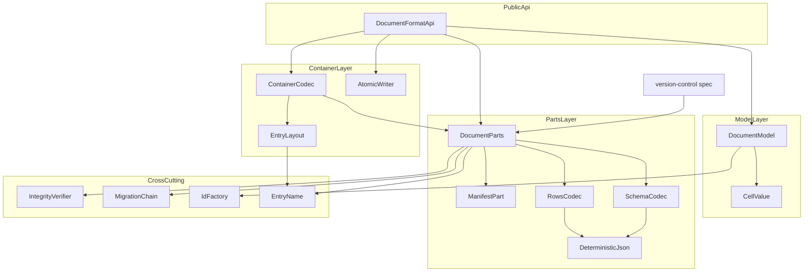
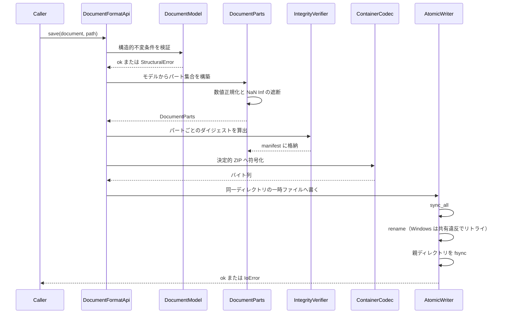
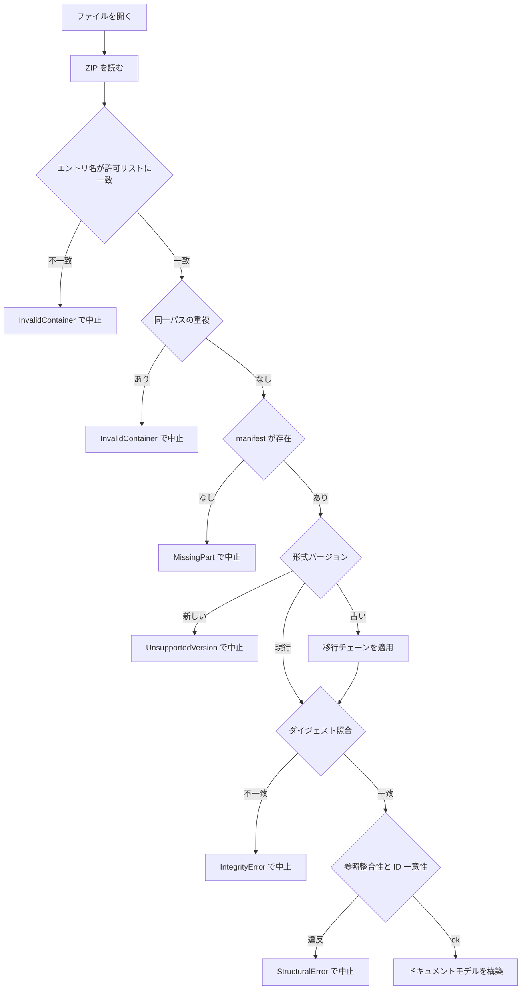
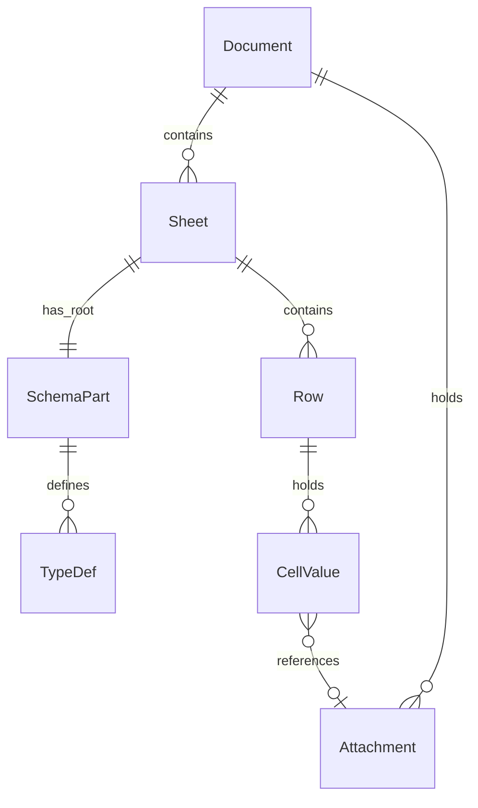
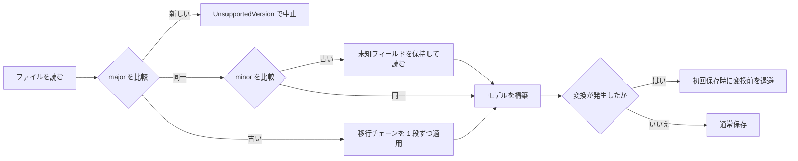

# Design Document: document-format

## Overview

**Purpose**: 本機能は、型付きの表形式データを「持ち運べる単一ファイル」として扱いたい個人・パワーユーザーに対し、ZIP コンテナに格納された JSON テキストというドキュメント形式と、それをメモリ上のドキュメントモデルへ双方向に変換する手段を提供する。

**Users**: jxcel の全機能がこの形式の上に乗る。直接の利用者はエンドユーザーではなく下流のスペック群（`schema-engine`、`macro-runtime`、`version-control`、`export-templates`、`form-web-server`）であり、エンドユーザーにはファイルの開閉と保存として現れる。

**Impact**: プロジェクト最初の 2 スペックのひとつであり、既存システムは存在しない。本設計が確立する `Model ↔ Parts ↔ Container` の 3 層と `DocumentParts` 公開契約は、以降のすべてのデータ系スペックの前提となる。

### Goals

- File → Sheet → ルートスキーマ + N 個のネスト型定義 → 行 という階層を、一意な識別子とともにメモリ上に構築・永続化する
- 同一内容が OS をまたいでバイト単位で同一の ZIP になり、1 行の変更が出力テキストの 1 行のみを変える
- 構造的破綻と内容の破損を読み込み時に検出し、部分的な結果を返さず、自動修復もしない
- 10 万行のドキュメントを 3 秒以内に開き、2 秒以内に保存する
- 展開済みエントリ集合を公開契約として提供し、`version-control` が git に何を保存するかを選べるようにする

### Non-Goals

- 値が型に適合するかの判断（`schema-engine` が所有）。本機能はスキーマを構造として保持・検証するのみ
- 変更履歴の記録、コミット、差分の計算と表示（`version-control` が所有）
- 遅延ロード、ページング、インデックス。10 万行を超える規模の性能保証
- 暗号化、アクセス制御、複数プロセスからの同時書き込み

## Boundary Commitments

### This Spec Owns

- **ドキュメントモデル**: `Document` / `Sheet` / `SchemaPart` / `Row` / `Attachment` の構造、それらの識別子体系（ULID および content-hash）、および構造的不変条件
- **セル値の wire 表現**: `CellValue` という閉じた列挙型。JSON 上でどう表現され、どう往復するか
- **論理エントリ集合**: `DocumentParts`（エントリ名 → バイト列 + ダイジェスト）。**これが `version-control` との唯一の受け渡し境界である**
- **コンテナ規約**: エントリ名の文法、レイアウト、圧縮方式、決定的 ZIP 出力の全パラメータ
- **完全性と構造整合性の検証**: BLAKE3 ダイジェスト、識別子の一意性と参照の実在性、エントリ名の許可リスト
- **フォーマットバージョンと移行**: バージョン表現、読み込み時のゲート、段階的移行チェーンの枠組み、未知フィールドの保持規則
- **原子的保存**: 保存が中断されても保存前のファイルが残ること

### Out of Boundary

- **型の意味論**: どの `CellValue` 変種をどの型に割り当てるか、値が型制約を満たすか、既定値、型強制。すべて `schema-engine` が所有する。本機能はスキーマ本体を**不透明なペイロード**として保持し、その内部を解釈しない
- **git に何を保存するか**: 本機能は `DocumentParts` を提供するのみ。ZIP を保存するか、エントリを個別に保存するか、clean/smudge フィルタを使うかは `version-control` の決定
- **差分の計算と表示**: 本機能は決定的出力を保証するが、差分そのものは扱わない
- **UI とエラーの提示**: 本機能はエラーを型付きの値として返す。文言と提示方法は呼び出し元が決める
- **添付の内容の解釈**: 添付は不透明なバイト列として扱い、解釈・変換・再圧縮しない
- **10 万行を超える規模への最適化**: 超過時は拒否せず保証対象外として通知するのみ

### Allowed Dependencies

- 外部 crate: `zip` 8.x、`serde` / `serde_json`、`tempfile`、`blake3`、`ulid`、`flate2`（`miniz_oxide` バックエンド固定）、`thiserror`
- **禁止**: `tauri` およびその推移的依存。本クレートは GUI を起動せずにテストできなければならない（`structure.md` の依存方向規則）
- **禁止**: 他の jxcel ドメインクレートへの依存。本クレートは依存グラフの根であり、上流を持たない
- **禁止**: `zip-extract` / `zip_next`（メンテナンス終了フォーク、`tech.md`）
- 下限固定: `zip` ≥ 2.3.0（実際には 8.x を採る）

### Revalidation Triggers

以下の変更は下流スペックの再検証を要する。

- `DocumentParts` の形（エントリ名の文法、ダイジェストの表現、集合の構成）の変更 → `version-control` が git に置くものが変わる
- `CellValue` の変種の追加・削除・意味変更 → `schema-engine` の型対応表、`export-templates` の書き出し変換が影響を受ける
- 行データエントリの形式（NDJSON）の変更 → 行エントリを直接読む経路（`export-templates`）が壊れる
- フォーマットの major バージョン増加 → 全下流が移行の影響を受ける
- 識別子体系（ULID / content-hash）の変更 → 差分の安定性と参照の意味論が変わる
- 起動時前提の変更（新たな外部バイナリやランタイムの要求）→ `app-shell` のバンドル構成が影響を受ける

## Architecture

### Architecture Pattern & Boundary Map

**選定パターン**: 階層化パイプライン（`Model ↔ Parts ↔ Container` の 2 段双方向変換）。

読み込みと書き出しを別々に設計せず、`DocumentParts` を中間表現とする対称な逆操作として構成する。これにより (a) `version-control` に ZIP 以外の選択肢を渡せる、(b) 検証を `Parts` 層に集約でき読み込み経路に散在しない、(c) 各層が単独でテスト可能になる。



**Architecture Integration**:
- **ドメイン境界**: `Parts` 層が本スペックの対外的な顔である。`version-control` は `Container` 層を経由せず `Parts` に直接接続する
- **依存方向**: `Ids / Value / EntryName → Model → Json → Parts → Container → Api`。各層は左方向にのみ依存する。逆流は実装レビューで誤りとして扱う。**唯一の例外は `model → json`**（`PreservedFields` を型として共有するため）であり、理由は `crates/document-format/src/model/sheet.rs` の doc と tasks.md の 4.8 の親裁定に記録されている（実装の裁定に追随して 2026-09-18 に本行へ反映した。`structure.md` の「層の鎖」にも同じ例外を記録した）
- **共有プリミティブ**: `EntryName` は Parts 層と Container 層の双方が使うため、Container ではなく最下層に置く。Parts が Container に依存する形にしてはならない
- **新規コンポーネントの根拠**: `Parts` 層は「git に ZIP を渡すとリポジトリが線形に肥大する」という調査結果への直接の対処であり、便宜的な抽象ではない
- **steering 準拠**: `structure.md` の「Rust ドメインクレートは Tauri に依存しない」「性能はドメイン側で守る」に従う。行ごとに境界を越える API を持たず、シート単位の一括操作のみを公開する

### Technology Stack

| Layer | Choice / Version | Role in Feature | Notes |
|-------|------------------|-----------------|-------|
| Data / Storage | `zip` 8.x | ZIP コンテナの読み書き | `FileOptions::DEFAULT` を使い `default()` は使わない |
| Data / Storage | `flate2`（`miniz_oxide` 固定） | エントリの圧縮 | `zlib` / `zlib-ng` feature を無効化。バイト安定性はゴールデンテストで担保 |
| Data / Storage | `serde` / `serde_json` | JSON 直列化 | 構造体のフィールド順で決定性を得る。`serde_json::Value` は内部表現に使わない |
| Data / Storage | `tempfile` | 原子的保存 | Windows では共有違反へのリトライを自前で追加 |
| Backend / Services | `blake3` | エントリごとの完全性ダイジェスト | 数十 MB で数ミリ秒 |
| Backend / Services | `ulid` | 行 / シート / 型定義の識別子 | 26 文字、時系列ソート可 |
| Backend / Services | `thiserror` | 型付きエラー | 判別可能な列挙型として公開 |

## File Structure Plan

### Directory Structure

```
crates/document-format/
├── Cargo.toml                    # miniz_oxide 固定、tauri 依存の禁止をコメントで明示
├── src/
│   ├── lib.rs                    # DocumentFormatApi: open / save / parts / set_cells / set_rows_values の公開面（set_cells は document-session、set_rows_values は data-grid の取り消しの O(n²) の是正で足した）
│   ├── error.rs                  # DocumentError: 判別可能なエラー列挙型
│   ├── ids.rs                    # IdFactory と各 ID 新型（ULID / content-hash）
│   ├── value.rs                  # CellValue の wire 表現、NaN/Inf 遮断、-0.0 正規化
│   ├── entry_name.rs             # EntryName 型と文法。Parts と Container の双方が使う共有プリミティブ
│   ├── model/
│   │   ├── mod.rs                # Document 集約ルートと不変条件
│   │   ├── sheet.rs              # Sheet、行の順序、行コレクション
│   │   ├── schema_part.rs        # 不透明スキーマペイロードとネスト型定義の参照
│   │   └── attachment.rs         # 添付レジストリと参照集計
│   ├── json/
│   │   ├── mod.rs
│   │   ├── ndjson.rs             # 1 行 1 オブジェクトの読み書き
│   │   └── determinism.rs        # キー順序規則、数値正規化、未知フィールド保持
│   ├── parts/
│   │   ├── mod.rs                # DocumentParts: 公開契約。Model との双方向変換
│   │   ├── manifest.rs           # manifest.json: パート索引、ダイジェスト、形式バージョン
│   │   ├── document_part.rs      # document.json: 安定メタデータとシート順序
│   │   ├── schema_codec.rs       # schemas/<sheet-id>.json の符号化
│   │   ├── rows_codec.rs         # sheets/<sheet-id>.jsonl の符号化
│   │   └── validate.rs           # StructuralValidator: 参照整合性と識別子一意性
│   ├── container/
│   │   ├── mod.rs                # ContainerCodec: Parts <-> ZIP
│   │   ├── layout.rs             # 復号時の許可リスト適用（EntryName 型そのものは entry_name.rs）
│   │   ├── writer.rs             # 決定的 ZIP 書き出し（全パラメータの明示的固定）
│   │   └── reader.rs             # ZIP 読み込みと許可リスト照合
│   ├── integrity.rs              # BLAKE3 ダイジェストの算出と照合
│   ├── migration/
│   │   ├── mod.rs                # バージョンゲートと段階的移行チェーン
│   │   └── steps.rs              # 移行ステップ（v1 のみのため初版では空）
│   └── atomic_save.rs            # 一時ファイル → sync_all → rename → 親 fsync、Windows リトライ
├── tests/
│   ├── determinism.rs            # 2 回保存のバイト一致、OS 間一致（CI マトリクス）
│   ├── roundtrip.rs              # Model -> Parts -> Container -> Parts -> Model の同一性
│   ├── row_granular_diff.rs      # 1 行変更で 1 テキスト行のみ変化
│   ├── corruption.rs             # ダイジェスト不一致、重複 ID、宙吊り参照、欠落パート
│   ├── malicious_archive.rs      # 許可リスト外エントリ、パス脱出、重複パス
│   ├── migration.rs              # 過去バージョンのゴールデン fixture の読み込み
│   ├── atomic_save.rs            # 保存中断で元ファイルが残ること
│   └── fixtures/
│       ├── golden/v1/            # 形式バージョンごとのゴールデンアーカイブ
│       └── bytes/                # 決定性検証用の期待バイト列
└── benches/
    └── large_document.rs         # Criterion: 10 万行の開く 3 秒 / 保存 2 秒
```

すべて新規作成。既存ファイルの変更は無い。

### Container Entry Layout

```
jxcel                          # Stored（無圧縮・先頭エントリ）。固定オフセットでの型判定用マーカー
manifest.json                  # 形式バージョン、パート索引、パートごとの BLAKE3 ダイジェスト
document.json                  # ドキュメント ID、シート順序、シートのメタデータ
schemas/<sheet-ulid>.json      # ルートスキーマ + ネスト型定義（不透明ペイロード）
sheets/<sheet-ulid>.jsonl      # 行データ。1 行 1 オブジェクトの NDJSON
attachments/<blake3-hex>.bin   # 添付。content-addressed 命名
macros.json                    # マクロのソース（**省略可能**。無い文書は「マクロが無い」とみなす）
```

`macros.json` は `macro-runtime` のタスク 1.2 が **7 形目**として追加した（**形**は `document-format`、**意味**は `macro-runtime` が所有し、本機能は不透明なペイロードとして扱う）。**省略可能**であり、**形式バージョンは `1.0` のまま**（決定は `macro-runtime/design.md` の Revalidation Triggers）。**本節は実装の許可リスト（`crates/document-format/src/entry_name.rs`）と一致していなければならない** — 実装の追随が本節に入っていなかったため 2026-09-18 に反映した（`DocumentParts` の形の変更は `version-control` の再検証トリガであり、発火済みである）。

`manifest.json` が唯一の権威ある索引である（ODF 方式）。OOXML の content-types と rels の二重帳簿は採らない。保存時刻のような揮発値を持つパートは存在しない（要件 3.6 が出力自体を禁じている）。

## System Flows

### 保存フロー



保存は「検証 → パート構築 → ダイジェスト → 符号化 → 原子的書き込み」の直列である。いずれかで失敗した場合、既存ファイルには一切触れていない（要件 5.6）。

### 読み込みフロー



**主要な判断**: 検証はすべてモデル構築の**前**に完了する。これにより部分的に構築されたモデルが呼び出し元に渡ることが構造的にありえない（要件 5.4）。エントリ名は正規化ではなく許可リストで判定する — 本形式は一次形式であり正当なエントリ名が完全に既知であるため、想定外を拒否する方が Unicode 類似文字や区切り文字の曖昧さまで同時に閉じられる。

## Requirements Traceability

| Requirement | Summary | Components | Interfaces | Flows |
|-------------|---------|------------|------------|-------|
| 1.1 | 0 個以上のシート | DocumentModel | `Document::sheets` | — |
| 1.2 | シートにルートスキーマ 1 つ | SchemaPart | `Sheet::root_schema` | — |
| 1.3 | ネスト型定義 N 個と識別子参照 | SchemaPart | `SchemaPart::type_defs` | — |
| 1.4 | シート / 行 / 型定義に一意な識別子 | IdFactory | `SheetId` `RowId` `TypeDefId` | — |
| 1.5 | 並び替えで行 ID を保持 | DocumentModel | `Sheet::reorder_rows` | — |
| 1.6 | 改名でシート ID を保持 | DocumentModel | `Sheet::rename` | — |
| 1.7 | 実在しない型定義参照の報告 | StructuralValidator | `DocumentError::DanglingTypeRef` | 読み込み |
| 2.1 | 標準 ZIP として展開可能 | ContainerCodec | `ContainerCodec::encode` | 保存 |
| 2.2 | メタ / スキーマ / 行を別エントリ | EntryLayout | エントリレイアウト表 | 保存 |
| 2.3 | シートごとに独立したエントリ | EntryLayout | `sheets/<id>.jsonl` | 保存 |
| 2.4 | JSON エントリは UTF-8 | DeterministicJson | `write_json` | 保存 |
| 2.5 | ルート外エントリの拒否 | EntryLayout | `EntryName::parse` 許可リスト | 読み込み |
| 2.6 | 同一パスの重複の拒否 | ContainerCodec | `ContainerCodec::decode` | 読み込み |
| 3.1 | 2 回保存でバイト一致 | ContainerWriter | `FileOptions` 全固定 | 保存 |
| 3.2 | OS をまたいでバイト一致 | ContainerWriter | host OS / permissions 固定 | 保存 |
| 3.3 | キー順序の固定 | DeterministicJson | 構造体フィールド順 | 保存 |
| 3.4 | 1 データ行 = 1 テキスト行 | RowsCodec | NDJSON | 保存 |
| 3.5 | 1 行変更 → 1 テキスト行のみ変化 | RowsCodec | NDJSON | 保存 |
| 3.6 | 時刻 / 環境 / 順序依存値の排除 | ContainerWriter, DeterministicJson | 揮発パート無し | 保存 |
| 4.1 | モデル構築とアクセス可能化 | DocumentFormatApi | `open` | 読み込み |
| 4.2 | 全識別子参照の実在性検証 | StructuralValidator | `validate_references` | 読み込み |
| 4.3 | 識別子重複の報告と中止 | StructuralValidator | `DocumentError::DuplicateId` | 読み込み |
| 4.4 | スキーマ欠落シートの報告 | StructuralValidator | `DocumentError::MissingSchema` | 読み込み |
| 4.5 | メタデータパート欠落の報告 | ManifestPart | `DocumentError::MissingPart` | 読み込み |
| 5.1 | 保存時にダイジェストを記録 | IntegrityVerifier | `digest_parts` | 保存 |
| 5.2 | 読み込み時にダイジェスト照合 | IntegrityVerifier | `verify_parts` | 読み込み |
| 5.3 | 不一致の報告と中止 | IntegrityVerifier | `DocumentError::IntegrityMismatch` | 読み込み |
| 5.4 | 部分構築モデルを返さない | DocumentFormatApi | 検証完了後に構築 | 読み込み |
| 5.5 | 自動修復 / 上書きの禁止 | DocumentFormatApi | 読み込み経路に書き込み無し | 読み込み |
| 5.6 | 保存中断で元ファイル保持 | AtomicWriter | `AtomicWriter::commit` | 保存 |
| 6.1 | 形式バージョンの記録 | ManifestPart | `FormatVersion` | 保存 |
| 6.2 | 古い形式の変換後に構築 | MigrationChain | `MigrationChain::apply` | 読み込み |
| 6.3 | 複数バージョン前からの変換 | MigrationChain | 段階適用 | 読み込み |
| 6.4 | 変換後の初回保存で退避を保持 | DocumentFormatApi | `save` の退避分岐 | 保存 |
| 6.5 | 新しい形式の拒否と報告 | MigrationChain | `DocumentError::UnsupportedVersion` | 読み込み |
| 7.1 | 任意のバイト列を添付として格納 | AttachmentRegistry | `Attachment` | 保存 |
| 7.2 | 添付に一意な識別子 | IdFactory | `AttachmentId`（BLAKE3） | 保存 |
| 7.3 | 行データからの参照 | AttachmentRegistry, CellValue | `CellValue::Attachment` | — |
| 7.4 | 実在しない添付参照の報告 | StructuralValidator | `DocumentError::DanglingAttachmentRef` | 読み込み |
| 7.5 | 添付の解釈 / 変換 / 再圧縮の禁止 | AttachmentRegistry | 不透明バイト列として保持 | 保存 |
| 7.6 | 未参照添付の保持と一覧 | AttachmentRegistry | `unreferenced_attachments` | — |
| 8.1 | 10 万行を 3 秒以内で開く | DocumentFormatApi | ベンチマーク | 読み込み |
| 8.2 | 10 万行を 2 秒以内で保存 | DocumentFormatApi | ベンチマーク | 保存 |
| 8.3 | 計測環境の規定 | benches | Criterion 設定 | — |
| 8.4 | 10 万行の保持保証 | DocumentModel | 全件オンメモリ | — |
| 8.5 | 超過時は拒否せず通知 | DocumentFormatApi | `OpenOutcome::beyond_supported_scale` | 読み込み |

## Components and Interfaces

| Component | Domain/Layer | Intent | Req Coverage | Key Dependencies (P0/P1) | Contracts |
|-----------|--------------|--------|--------------|--------------------------|-----------|
| DocumentFormatApi | Public API | 開く / 保存する / パートを取り出す | 4.1, 5.4, 5.5, 6.4, 8.1, 8.2, 8.5 | DocumentParts (P0), ContainerCodec (P0), AtomicWriter (P0) | Service |
| DocumentModel | Model | 集約ルートと構造的不変条件 | 1.1, 1.2, 1.5, 1.6, 8.4 | IdFactory (P0), CellValue (P0) | Service, State |
| CellValue | Model | セル値の wire 表現 | 3.6, 7.3 | — | State |
| DocumentParts | Parts | 論理エントリ集合。`version-control` との境界 | 2.2, 2.3 | RowsCodec (P0), SchemaCodec (P0), ManifestPart (P0) | Service |
| DocumentPart | Parts | ドキュメント識別子とシート順序の永続化 | 2.2, 3.6 | DeterministicJson (P0) | Service, State |
| SchemaPart | Model | ルートスキーマとネスト型定義の不透明な保持 | 1.2, 1.3 | IdFactory (P0) | State |
| RowsCodec | Parts | 行データの NDJSON 符号化 | 3.4, 3.5 | DeterministicJson (P0) | Service |
| SchemaCodec | Parts | スキーマパートの符号化 | 1.3, 2.2 | DeterministicJson (P0) | Service |
| ManifestPart | Parts | パート索引、ダイジェスト、形式バージョン | 4.5, 6.1 | IntegrityVerifier (P0) | State |
| DeterministicJson | Parts | キー順序と数値正規化 | 2.4, 3.3, 3.6 | — | Service |
| StructuralValidator | Parts | 参照整合性と識別子一意性 | 1.7, 4.2, 4.3, 4.4, 7.4 | — | Service |
| IntegrityVerifier | Cross-cutting | BLAKE3 ダイジェストの算出と照合 | 5.1, 5.2, 5.3 | — | Service |
| MigrationChain | Cross-cutting | バージョンゲートと段階的移行 | 6.2, 6.3, 6.5 | ManifestPart (P0) | Service |
| ContainerCodec | Container | Parts と ZIP の相互変換 | 2.1, 2.6, 3.1, 3.2 | EntryLayout (P0), zip 8.x (P0 External) | Service |
| EntryName | Cross-cutting | エントリ名の型と文法。Parts と Container の共有プリミティブ | 2.2, 2.3 | — | State |
| EntryLayout | Container | 復号時の許可リスト適用 | 2.5 | EntryName (P0) | Service |
| AtomicWriter | Container | 原子的なファイル置換 | 5.6 | tempfile (P0 External) | Service |
| IdFactory | Cross-cutting | ULID と content-hash による識別子 | 1.4, 7.2 | ulid (P1 External), blake3 (P0 External) | Service |
| AttachmentRegistry | Model | 添付の保持と参照集計 | 7.1, 7.5, 7.6 | IdFactory (P0) | Service, State |

### Public API Layer

#### DocumentFormatApi

| Field | Detail |
|-------|--------|
| Intent | ドキュメントの開閉と保存を単一の入口として提供する |
| Requirements | 4.1, 5.4, 5.5, 6.4, 8.1, 8.2, 8.5 |

**Responsibilities & Constraints**
- 読み込みは「検証完了 → モデル構築」の順を守る。部分的に構築されたモデルが外に出る経路を持たない
- 読み込み経路はいかなる書き込みも行わない（要件 5.5）
- 変換が発生した場合、初回保存時に変換前のファイルを退避として残す（要件 6.4）

**Dependencies**
- Outbound: DocumentParts — パート集合の構築と解体 (P0)
- Outbound: ContainerCodec — ZIP との相互変換 (P0)
- Outbound: AtomicWriter — 保存の原子性 (P0)

**Contracts**: Service [x] / API [ ] / Event [ ] / Batch [ ] / State [ ]

##### Service Interface

```rust
pub struct OpenOutcome {
    pub document: Document,
    /// 読み込み時に形式変換が適用された場合、変換前のバージョン
    pub migrated_from: Option<FormatVersion>,
    /// 行数が保証対象の 10 万行を超えていた場合に true（要件 8.5）
    pub beyond_supported_scale: bool,
}

pub trait DocumentFormatApi {
    /// ZIP コンテナを読み、検証し、ドキュメントモデルを構築する。
    /// 事前条件: path が読み取り可能であること。
    /// 事後条件: Ok の場合、返る Document は全検証を通過している。
    ///           Err の場合、部分的なモデルは返らず、path のファイルは変更されていない。
    fn open(&self, path: &Path) -> Result<OpenOutcome, DocumentError>;

    /// ドキュメントを決定的な ZIP として原子的に書き出す。
    /// 事前条件: document が構造的不変条件を満たすこと。
    /// 事後条件: Ok の場合、path は新しい内容を持つ。
    ///           Err の場合、path は保存前の内容のまま残る（要件 5.6）。
    /// 不変条件: 同一内容の document に対し、常に同一のバイト列を出力する。
    fn save(&self, document: &Document, path: &Path) -> Result<(), DocumentError>;

    /// ドキュメントを論理エントリ集合として取り出す（version-control 向け）。
    /// ZIP を経由しない。
    fn to_parts(&self, document: &Document) -> Result<DocumentParts, DocumentError>;

    /// 論理エントリ集合からドキュメントを復元する。
    /// to_parts の逆操作であり、同じ検証を適用する。
    fn from_parts(&self, parts: &DocumentParts) -> Result<Document, DocumentError>;
}
```

**Implementation Notes**
- Integration: `to_parts` / `from_parts` が `version-control` との唯一の接点である。`version-control` が `ContainerCodec` を直接呼ぶことは境界違反として扱う
- Validation: `open` と `from_parts` は同一の検証経路を通る。検証ロジックを 2 箇所に持たない
- Risks: `save` の退避（要件 6.4）がディスク容量を二重に消費する。退避の保持期間の方針は実装時に決める

### Parts Layer

#### DocumentParts

| Field | Detail |
|-------|--------|
| Intent | ドキュメントを論理エントリ集合として表現する。本スペックの対外的な境界 |
| Requirements | 2.2, 2.3 |

**Responsibilities & Constraints**
- エントリ名 → バイト列 + BLAKE3 ダイジェストの写像を保持する
- エントリの順序は決定的である（エントリ名のソート順。ファイルシステムの列挙順に依存しない）
- ZIP の知識を一切持たない。圧縮も知らない

**Dependencies**
- Outbound: RowsCodec, SchemaCodec, ManifestPart — 各パートの符号化 (P0)
- Inbound: ContainerCodec — ZIP への符号化元 (P0)
- Inbound: `version-control` スペック — git へ保存する単位として消費 (P0)

**Contracts**: Service [x] / API [ ] / Event [ ] / Batch [ ] / State [ ]

##### Service Interface

```rust
/// 論理エントリ 1 件。
pub struct Part {
    pub name: EntryName,
    pub bytes: Vec<u8>,
    pub digest: Blake3Digest,
}

/// エントリ名でソートされた決定的な集合。
pub struct DocumentParts {
    parts: Vec<Part>,
}

impl DocumentParts {
    /// エントリ名の昇順で反復する。順序は常に同一。
    pub fn iter(&self) -> impl Iterator<Item = &Part>;
    pub fn get(&self, name: &EntryName) -> Option<&Part>;
    pub fn format_version(&self) -> FormatVersion;
}
```
- Preconditions: 構築時にすべてのエントリ名が `EntryName` の文法を満たすこと
- Postconditions: `iter` の順序は同一内容に対して常に同一
- Invariants: すべての `Part` の `digest` が `bytes` と一致する

**Implementation Notes**
- Integration: この型の形が変わると `version-control` が git に置くものが変わる。Revalidation Trigger である
- Risks: `Vec<u8>` を全パート分保持するため、保存時にドキュメント全体のコピーが一時的にメモリ上に存在する。10 万行・全件オンメモリの前提では許容範囲だが、ベンチマークで実測する

#### DeterministicJson

| Field | Detail |
|-------|--------|
| Intent | JSON 出力の決定性を一手に引き受ける |
| Requirements | 2.4, 3.3, 3.6 |

**Responsibilities & Constraints**
- UTF-8 で出力する
- キー順序は構造体のフィールド宣言順に従う。`serde_json::Value` および `HashMap` を経由する経路を持たない
- スキーマ由来の動的な列集合は、スキーマが定める列順序で明示的に整列する
- 数値の正規化: `-0.0` は `0` として出力する。NaN と Infinity は `DocumentError::NonRepresentableNumber` として拒否し、無効な JSON を書かない
- 未知フィールドは破棄せず保持し、書き戻す（前方互換規則）

**Contracts**: Service [x] / API [ ] / Event [ ] / Batch [ ] / State [ ]

**Implementation Notes**
- Validation: NaN / Infinity の遮断は `serde_json` がエラーを返すのに任せず、事前に検出して型付きエラーに変換する。呼び出し元がどのセルが原因か分かる必要がある
- Risks: 動的な列集合の順序をスキーマ側に依存するため、`schema-engine` が列順序を安定して提供しない場合に決定性が壊れる。契約として明示する

#### RowsCodec

| Field | Detail |
|-------|--------|
| Intent | 行データを NDJSON として符号化する |
| Requirements | 3.4, 3.5 |

**Responsibilities & Constraints**
- 1 行 = 出力の 1 テキスト行。行末は `\n` に固定する（OS の改行規約に依存しない）
- 行の出力順はシートが保持する行順序に従う。並び替えは行 ID を変えない（要件 1.5）ため、並び替えの差分は行の移動として現れる

**Contracts**: Service [x] / API [ ] / Event [ ] / Batch [ ] / State [ ]

**Implementation Notes**
- Integration: 行エントリが単一の妥当な JSON ドキュメントではないことは意図した設計である。`export-templates` が行エントリを直接読む場合、NDJSON 対応が必要
- Risks: 極端に幅の広い行（列数が多い）では 1 行が非常に長くなり、行内の一部だけを変えた差分が視認しづらい。列単位の差分は `version-control` の構造的差分が担う

### Container Layer

#### ContainerCodec

| Field | Detail |
|-------|--------|
| Intent | 論理エントリ集合と ZIP コンテナを相互変換する |
| Requirements | 2.1, 2.6, 3.1, 3.2 |

**Responsibilities & Constraints**
- 書き出し時、決定性に関わるすべての ZIP パラメータを明示的に固定する。crate の既定値に依存しない
  - 更新日時: 固定値（`FileOptions::DEFAULT` を使い、`FileOptions::default()` は使わない）
  - unix permissions: 固定値
  - version made by のホスト OS: 固定値（ビルドプラットフォームを反映させない）
  - エントリ書き込み順: `DocumentParts` のソート済み順序
  - データディスクリプタ: 使わない（全件オンメモリでサイズは既知）
- 型マーカーエントリは `Stored` かつ先頭に置く。他のエントリは `Deflate`
- 読み込み時、同一パスの重複エントリを持つコンテナを拒否する（要件 2.6）

**Dependencies**
- Outbound: EntryLayout — エントリ名の検証 (P0)
- External: `zip` 8.x — ZIP の読み書き (P0)
- External: `flate2` / `miniz_oxide` — 圧縮 (P1)

**Contracts**: Service [x] / API [ ] / Event [ ] / Batch [ ] / State [ ]

##### Service Interface

```rust
pub trait ContainerCodec {
    /// 決定性: 同一の DocumentParts に対し常に同一のバイト列を返す。
    fn encode(&self, parts: &DocumentParts) -> Result<Vec<u8>, DocumentError>;

    /// 許可リスト照合と重複パス検出を行ってから復号する。
    fn decode(&self, bytes: &[u8]) -> Result<DocumentParts, DocumentError>;
}
```
- Invariants: `decode(encode(p)) == p`、かつ `encode` は参照透明である

**Implementation Notes**
- Integration: ZIP に関する知識はこのコンポーネントに閉じる。他のどのコンポーネントも `zip` crate を直接使わない
- Validation: 決定性はゴールデンファイルのバイト比較テストで守る。`flate2` / `miniz_oxide` のバージョン更新は決定性を壊す変更として扱い、テストが落ちた場合は形式のマイナーバージョンを上げるか固定を継続するかを判断する
- Risks: `miniz_oxide` のバージョン間バイト安定性は公開情報からは未検証。落ちる頻度が高い場合は全エントリ `Stored` へ退避する（サイズと引き換えに決定性を自明にする）

#### EntryLayout

| Field | Detail |
|-------|--------|
| Intent | エントリ名の文法を定義し、許可リストで不正なコンテナを拒否する |
| Requirements | 2.2, 2.3, 2.5 |

**Responsibilities & Constraints**
- 許可する名前は `jxcel` / `manifest.json` / `document.json` / `schemas/<ulid>.json` / `sheets/<ulid>.jsonl` / `attachments/<hex64>.bin` の 6 形のみ
- **`EntryName` 型と文法そのものは最下層（`entry_name.rs`）に置く。** Parts 層が `Part::name` として同じ型を使うため、Container 層に置くと Parts が Container に依存し、宣言した依存方向に反する。本コンポーネントは復号時にその文法を適用する側である
- **サニタイズではなく拒否する。** `enclosed_name()` による名前の正規化に依存しない
- 絶対パス、`..` 成分、ドライブレター、バックスラッシュ区切り、NUL を含む名前は、いずれも許可リストに一致しないため自動的に拒否される

**Contracts**: Service [x] / API [ ] / Event [ ] / Batch [ ] / State [ ]

**Implementation Notes**
- Validation: 許可リストは形式バージョンと同じ場所で管理する。形式拡張時に更新を忘れると正当なファイルを拒否するため
- Risks: `enclosed_name()` は名前文字列のサニタイズのみでシンボリックリンク経由の誘導を扱わない。許可リストはこの攻撃面も閉じるが、`zip` crate 側の展開ロジックを使う場合は 2.3.0 以上であることを併せて確認する

#### AtomicWriter

| Field | Detail |
|-------|--------|
| Intent | 保存が中断されても保存前のファイルを残す |
| Requirements | 5.6 |

**Responsibilities & Constraints**
- 一時ファイルは対象と同一ディレクトリに作る（同一ファイルシステムであることが rename の原子性の前提）
- `sync_all` → rename → 親ディレクトリの fsync（Unix）の順を守る
- Windows では共有違反に対してバックオフ付きでリトライする。アンチウイルス、検索インデクサ、自アプリの別インスタンスがハンドルを保持しうる

**Contracts**: Service [x] / API [ ] / Event [ ] / Batch [ ] / State [ ]

**Implementation Notes**
- Risks: `tempfile::NamedTempFile::persist()` は全プラットフォームでの原子性を保証しないと明記されている。Windows のリトライは任意の最適化ではなく必須の実装事項である
- Validation: 保存中断のテストは、書き込み後 rename 前にプロセスを落とす形で行う

### Cross-cutting

#### MigrationChain

| Field | Detail |
|-------|--------|
| Intent | 形式バージョンをゲートし、古い形式を現行へ段階的に変換する |
| Requirements | 6.2, 6.3, 6.5 |

**Responsibilities & Constraints**
- major.minor を持つ。major の不一致（新しい方向）は読み込みを中止する
- minor の増加は省略可能フィールドの追加のみに限る。未知フィールドは破棄せず保持して書き戻す
- 変換は v1→v2→v3 の順に 1 段ずつ適用する

**Contracts**: Service [x] / API [ ] / Event [ ] / Batch [ ] / State [ ]

**Implementation Notes**
- Integration: 初版は v1 のみのため移行ステップの実装は存在しない。枠組みのみを置く
- Validation: **過去バージョンごとのゴールデン fixture を CI に置く。** 移行チェーンの中間ステップが未保守のまま腐る失敗形態は先行事例（nbformat）で実際に起きており、fixture が唯一の防御である
- Risks: 未知フィールドを保持する領域をデータモデルに持つ必要があり、モデルが純粋な型付き構造体だけでは済まなくなる

#### IdFactory

| Field | Detail |
|-------|--------|
| Intent | 差分の安定性と可読性を両立する識別子を発行する |
| Requirements | 1.4, 7.2 |

**Responsibilities & Constraints**
- シート / 行 / ネスト型定義: ULID（26 文字、Crockford base32、時系列ソート可）
- 添付: BLAKE3 ダイジェストによる content-addressed 識別子
- 各 ID は別個の新型として定義し、取り違えを型で防ぐ

**Contracts**: Service [x] / API [ ] / Event [ ] / Batch [ ] / State [ ]

**Implementation Notes**
- Risks: 添付の内容が変わると識別子が変わり、参照側の更新が必要になる。これは「参照は内容を指す」という意図した意味論である。`schema-engine` の添付型がこの意味論を前提とすることを契約として伝える

## Data Models

### Domain Model

**集約ルート**: `Document`。すべての変更は `Document` を経由し、シート・行・添付は `Document` の外で独立に存在しない。

**不変条件**:
- ドキュメント内で `SheetId` / `RowId` / `TypeDefId` はそれぞれ一意である
- すべての `TypeDefId` 参照は同一シートの型定義集合に実在する
- すべての `AttachmentId` 参照は添付レジストリに実在する
- 各シートはちょうど 1 つのルートスキーマを持つ
- シートの改名と行の並び替えは識別子を変更しない



### Logical Data Model

**`CellValue`（wire 表現）**

セル値が JSON 上でとりうる形は閉じた集合である。`serde_json::Value` を内部表現に使わないのは、`5` と `5.0` の型ドリフトが「論理値は同じなのにバイトが違う」差分を生むためである。

| 変種 | JSON 表現 | 用途 |
|------|-----------|------|
| `Null` | `null` | 値なし |
| `Bool` | `true` / `false` | 真偽 |
| `Int` | 整数リテラル | 64 bit 整数。2^53 の壁を回避する |
| `Float` | 数値リテラル | f64。NaN / Inf は拒否、`-0.0` は `0` に正規化 |
| `Decimal` | 文字列 | 厳密な十進値。丸め誤差を許容できない列 |
| `Text` | 文字列 | 文字列 |
| `Nested` | オブジェクト / 配列 | ネストしたスキーマに対応する値 |
| `Attachment` | 文字列（BLAKE3 hex） | 添付への参照 |

**どの列がどの変種を使うかは `schema-engine` が決める。** 本スペックは変種の集合と JSON 上の表現、および往復の保証のみを所有する。

**参照整合性**:
- `CellValue::Attachment` → `AttachmentRegistry`: 実在しない参照は読み込み時に `DanglingAttachmentRef` として報告する（要件 7.4）
- 未参照の添付は削除しない。`unreferenced_attachments` で一覧できる（要件 7.6）
- 型定義参照 → 同一シートの型定義集合: 実在しない参照は `DanglingTypeRef`（要件 1.7）

**スキーマペイロードの不透明性**: `SchemaPart` の内容は本スペックにとって不透明である。本スペックが解釈するのは型定義の**識別子と参照構造**のみで、型の意味論には触れない。これにより `schema-engine` は本スペックを変更せずに型システムを進化させられる。

## Error Handling

### Error Strategy

すべてのエラーは判別可能な列挙型として返す。文言と提示方法は呼び出し元が決める（本スペックは UI を持たない）。**読み込みエラーは常に読み込み全体の中止であり、部分的な結果を返さない。**

### Error Categories and Responses

| カテゴリ | 変種 | 契機 | 応答 |
|---------|------|------|------|
| コンテナ不正 | `InvalidContainer { entry }` | 許可リスト外のエントリ名、重複パス | 中止。該当エントリ名を含める（2.5, 2.6） |
| パート欠落 | `MissingPart { name }` | manifest / document パートの不在 | 中止。不足パート名を含める（4.5） |
| 完全性 | `IntegrityMismatch { entry }` | BLAKE3 ダイジェストの不一致 | 中止。不一致エントリ名を含める（5.3） |
| 構造 | `DuplicateId { kind, id }` | 識別子の重複 | 中止。識別子と出現箇所を含める（4.3） |
| 構造 | `MissingSchema { sheet }` | シートデータに対応スキーマなし | 中止。シート識別子を含める（4.4） |
| 構造 | `DanglingTypeRef { from, to }` | 実在しない型定義参照 | 報告。参照元と参照先を含める（1.7） |
| 構造 | `DanglingAttachmentRef { from, id }` | 実在しない添付参照 | 報告。参照元と識別子を含める（7.4） |
| バージョン | `UnsupportedVersion { found, supported }` | 現行より新しい形式 | 中止。要求バージョンを含める（6.5） |
| 値 | `NonRepresentableNumber { location }` | NaN / Infinity の書き出し試行 | 保存を中止。該当位置を含める |
| 入出力 | `Io { source, retried }` | 読み書きの失敗、rename のリトライ枯渇 | 中止。既存ファイルは無変更（5.6） |

**自動修復の禁止**: 破損を検出した場合、読み込み経路は一切の書き込みを行わない（要件 5.5）。復旧手段は `version-control` の履歴からの復元であり、本スペックの責務ではない。

## Testing Strategy

### Unit Tests
- `DeterministicJson`: NaN / Infinity が `NonRepresentableNumber` として拒否されること、`-0.0` が `0` として出力されること、動的な列集合がスキーマの列順序で整列すること（3.3, 3.6）
- `EntryName::parse`: 6 つの許可形のみを受理し、絶対パス・`..`・ドライブレター・バックスラッシュ・NUL を含む名前を拒否すること（2.5）
- `IdFactory`: ULID が時系列にソートされること、添付 ID が内容の BLAKE3 と一致すること（1.4, 7.2）
- `DocumentModel`: 行の並び替えと シートの改名が識別子を変えないこと（1.5, 1.6）
- `MigrationChain`: 現行より新しい major を `UnsupportedVersion` で拒否すること、未知フィールドが往復で保持されること（6.5）

### Integration Tests
- **決定性**: 同一ドキュメントを 2 回保存してバイト一致すること。CI マトリクスで Linux / macOS / Windows の出力が一致すること（3.1, 3.2）
- **行粒度の差分**: 10 万行のうち 1 行のセルを変更して保存し、出力テキストの差分が 1 行のみであること（3.5）
- **往復**: `Model → Parts → Container → Parts → Model` で完全に同一のモデルが復元されること。`to_parts` / `from_parts` が ZIP を経由せずに同じ結果を与えること
- **破損検出**: ダイジェスト改竄、識別子重複、宙吊り型定義参照、宙吊り添付参照、manifest 欠落の各シナリオで、対応するエラー変種が返り、モデルが返らないこと（4.2〜4.5, 5.3, 5.4, 1.7, 7.4）
- **不正アーカイブ**: 許可リスト外のエントリ名、同一パスの重複エントリを持つ ZIP が拒否されること（2.5, 2.6）
- **原子的保存**: 一時ファイル書き込み後・rename 前にプロセスを落とし、元ファイルが保存前の内容のまま残ること（5.6）
- **移行**: 過去の形式バージョンごとのゴールデン fixture が現行へ変換されて読めること。変換後の初回保存で退避が残ること（6.2, 6.3, 6.4）
- **未参照添付**: どの行からも参照されない添付が削除されず `unreferenced_attachments` に現れること（7.6）
- **添付の不変性**: 添付のバイト列が往復で 1 バイトも変わらないこと（7.5）

### Performance Tests
- Criterion による 10 万行 × 30 列のドキュメントの `open` が 3 秒以内、`save` が 2 秒以内であること。SSD を搭載した 4 コア以上の環境で計測する（8.1, 8.2, 8.3）
- 10 万行を超えるドキュメントが拒否されず `beyond_supported_scale` が立つこと（8.5）
- ベンチマークを CI に置き、予算超過を機能追加と同時に検出する。本リポジトリは private であり、GitHub-hosted ランナーは 2 vCPU（macOS は 3 コア M1）と 8.3 の環境より弱い。CI はこの弱い環境で要件値そのものを判定する保守的な代理であり、ランナーが弱いことを理由に閾値を緩めない
- 保存の内訳（パート構築 / コンテナ化 / 原子的書き込み）も同じベンチで記録し、予算超過や回帰がどの段で起きたかを CI の記録から読めるようにする

## Performance & Scalability

**目標**: 10 万行 × 30 列で開く 3 秒 / 保存 2 秒（SSD、4 コア以上）。

**予算配分の想定**: 調査によれば、この規模（数十 MB の JSON）では `serde_json` の解析・直列化そのものは数百 ms に収まり、予算の大半は圧縮・展開、10 万個の中間割り当て、および後段処理に消える。したがって最初から SIMD 系の JSON パーサ（`simd-json` / `sonic-rs`）を採らず、素の `serde_json` で実装してベンチマークで測る。

**予算超過時の対処順序**: (1) 割り当ての削減、(2) 圧縮方式の見直し（`Stored` への切り替え。決定性も同時に自明になる）、(3) SIMD 系パーサの採用。この順序は、生態系の成熟度を捨てる判断を最後に回すためである。

**実施記録（2026-09-11）**: 初回の CI 計測で `save` が全ランナーで予算を超えた（ubuntu 2.83 秒 / macOS 2.49 秒 / windows 3.37 秒。`open` は 1.0〜1.3 秒で予算内）。内訳はコンテナ化が 6 割、パート構築が 3 割で、書き込みはほぼ 0 だった。上の順序で次の 2 手を打ち、`Stored` と SIMD パーサには進んでいない。
- (1) 行の符号化がセルごとにエラー用の位置文字列を組み立てていた（10 万行 × 30 列で 300 万回）のを、失敗時だけに改めた。パート構築 480 → 319 ms（ローカル）
- (2) の手前として、`Deflate` のまま圧縮レベルを 6 から 2 へ下げた。コンテナ化 883 → 103 ms、サイズ 7.2 → 9.3 MB（非圧縮 44.6 MB）。`Stored` はサイズが約 5 倍になるため、レベルで予算に届く限り採らない。レベルの比較表は `container/writer.rs` の `FIXED_COMPRESSION_LEVEL` にある

**規模の上限**: 10 万行は保証値であり上限ではない。超過したドキュメントは拒否せず、`beyond_supported_scale` で保証対象外であることを通知する（要件 8.5）。遅延ロードやページングは本スペックの非目標である。

## Security Considerations

本スペックのセキュリティ上の関心は、**外部から受け取った ZIP を安全に読むこと**の 1 点に集約される（個人利用前提のため、暗号化とアクセス制御は非目標）。

- **zip-slip**: エントリ名をサニタイズするのではなく、許可リストに一致しないコンテナを拒否する。本形式は一次形式であり正当なエントリ名は完全に既知であるため、この方針が採れる。サニタイズが扱わない Unicode 類似文字や区切り文字の曖昧さも同時に閉じる
- **`zip` crate のバージョン**: RUSTSEC-2025-0168（シンボリックリンク経由の展開先脱出）は 2.3.0 で修正済み。8.x を採るため影響しないが、`Cargo.lock` が推移的に 2.3.0 未満に固定されていないことを CI で確認する
- **リソース枯渇**: 展開後サイズが極端に大きいアーカイブ（zip bomb）に対し、展開前に manifest の宣言サイズと実際の展開量を照合する
- **`cargo audit`**: `tech.md` の方針に従い CI に組み込む

## Migration Strategy

初版は形式バージョン v1 のみであり、移行の実装は存在しない。枠組みのみを置く。



**検証チェックポイント**: 形式バージョンを追加するたびに、そのバージョンのゴールデン fixture を `tests/fixtures/golden/vN/` に追加する。移行チェーンの中間ステップが未保守のまま腐る失敗形態は先行事例で実際に起きており、fixture が唯一の防御である。

**ロールバックのトリガ**: 変換後の初回保存で退避を残すため、変換結果に問題があった場合はユーザーが退避から復旧できる。
