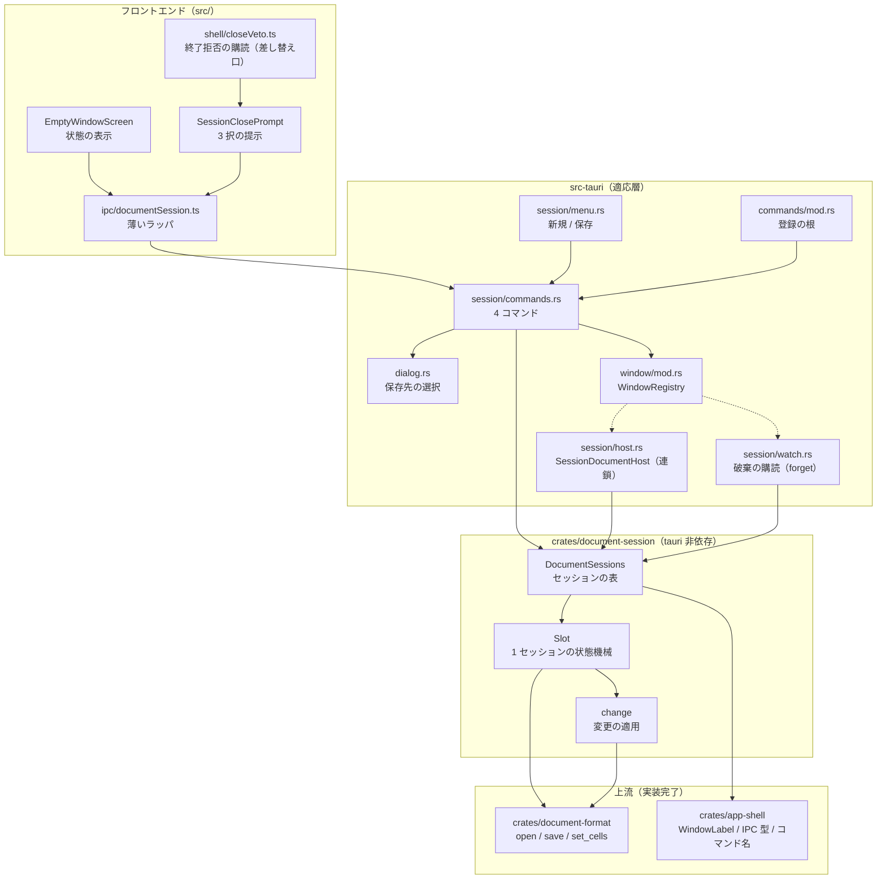
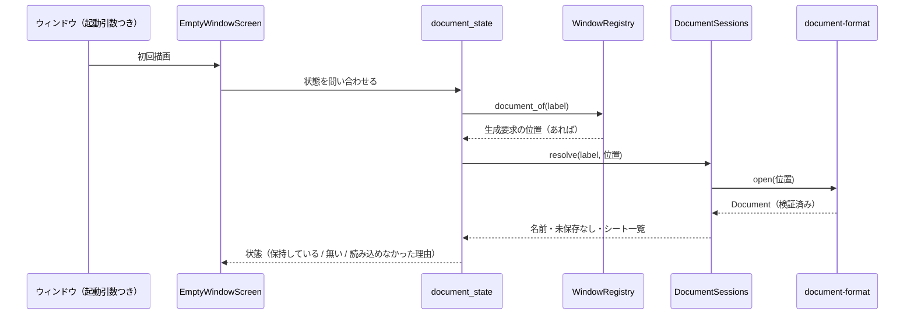
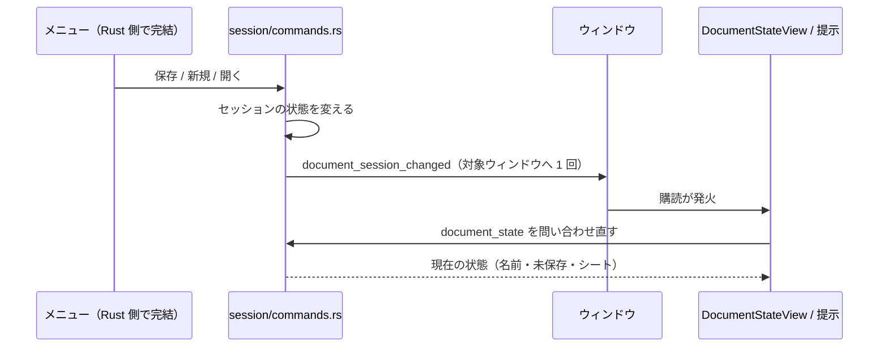
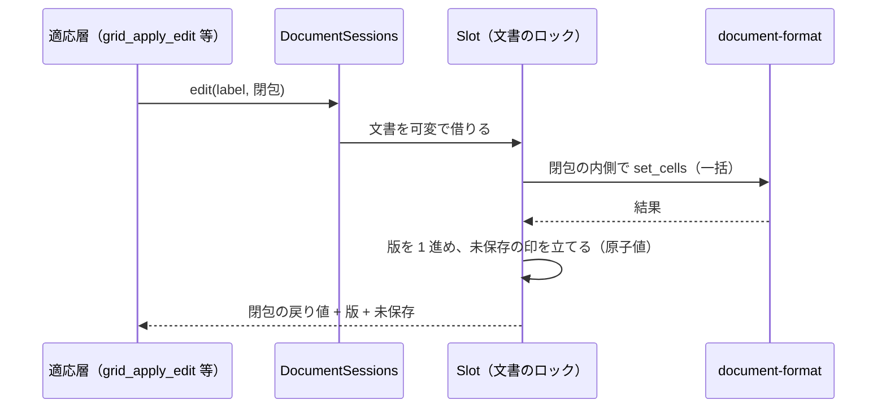
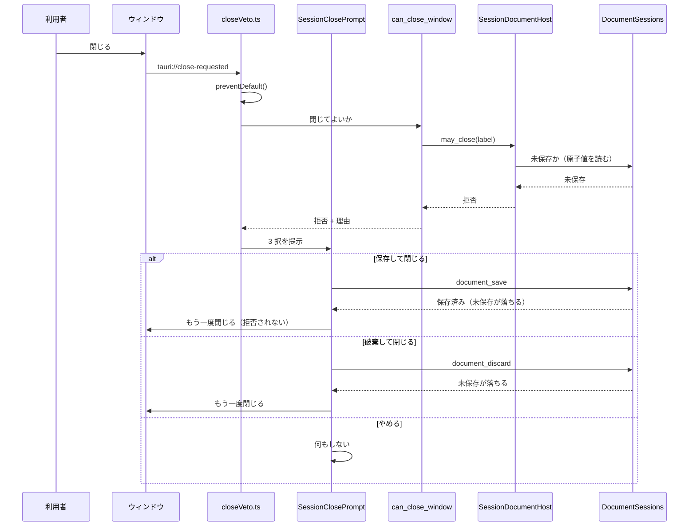
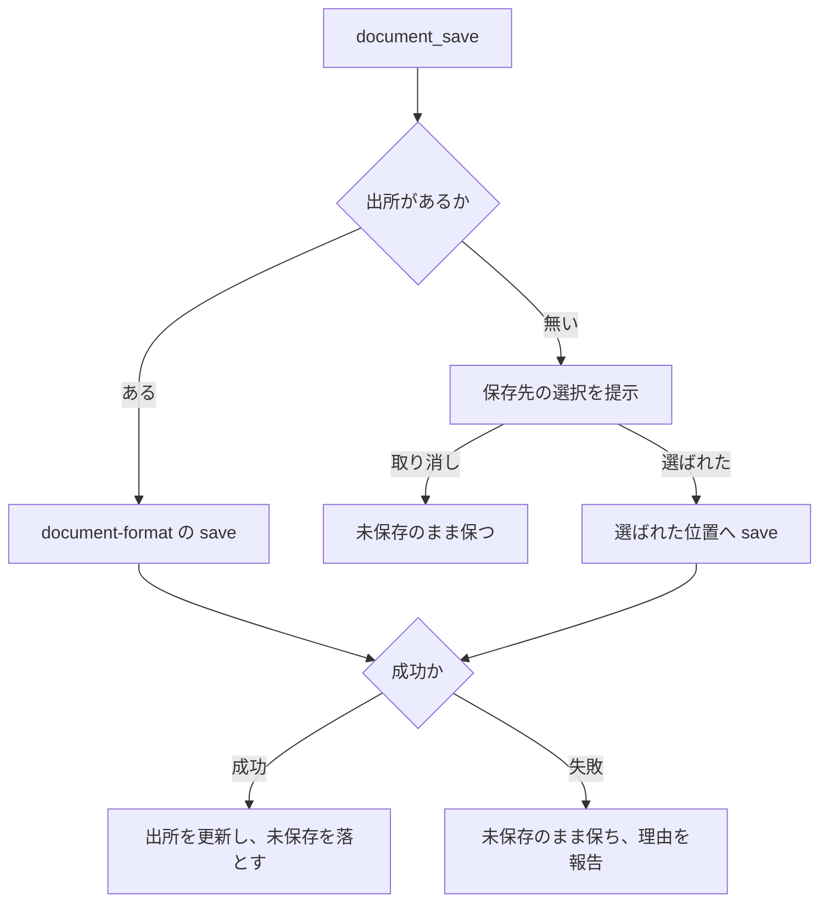
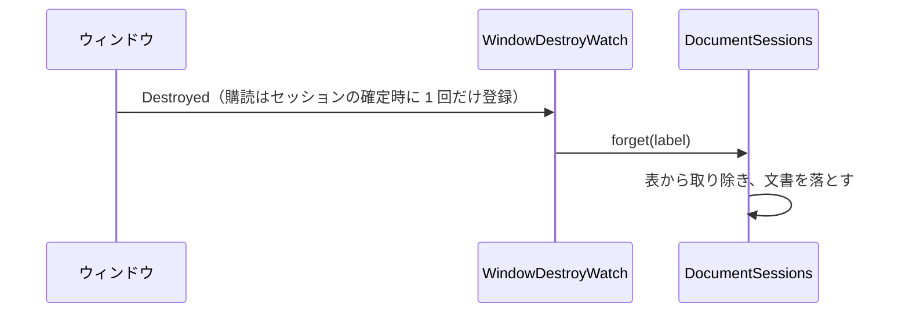
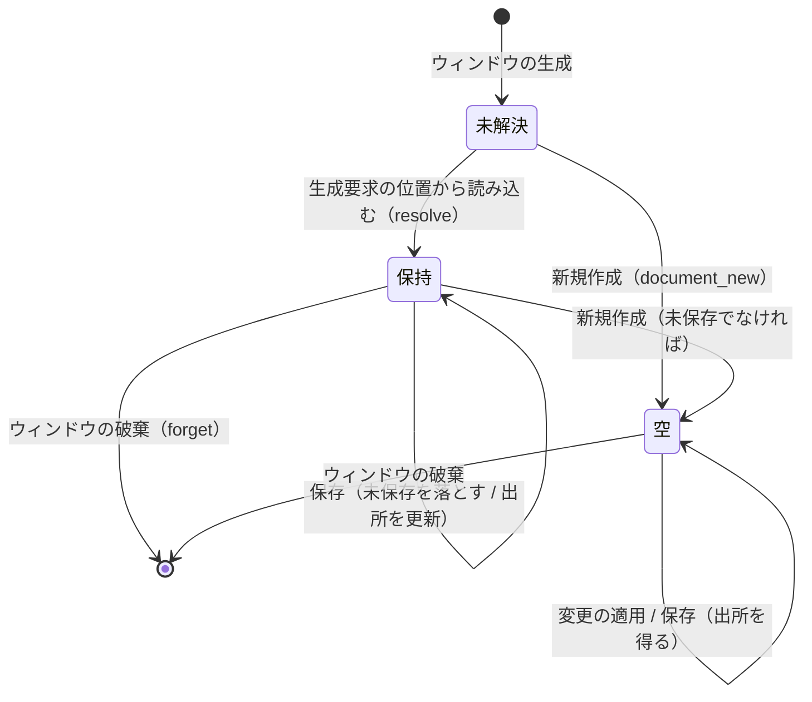

# Technical Design: document-session

## Overview

**Purpose**: 本機能は、**開いたドキュメントの寿命**と、**ドキュメントへの変更の唯一の経路**を所有する。`document-format` がファイルを読み書きする能力を持ち、`app-shell` がウィンドウとファイル選択を持つにもかかわらず、**開いた `Document` をメモリ上で保持する持ち主が存在しなかった**。本機能はその穴を埋め、`pick_document_file` の引き渡し先と `can_close_window` の答え手として初めて実在する。

**Users**: 複数のファイルを同時に開いて作業するユーザー、および下流スペック（`data-grid` / `schema-editor` / `macro-runtime` / `version-control`）。

**Impact**: 変更点は 5 つである。 (1) ウィンドウとドキュメントの対応が**セッションの表**として実在する。 (2) 変更が**1 つの経路**を通り、未保存が追跡される。 (3) ウィンドウを閉じる前に**選択肢つきの問い**が出る（現在は拒否を記録するだけで、閉じる手段が無い）。 (4) `document-format` に**一括のセル書き換え**が 1 つ増える（現在は 10 万行を跨ぐ変更が公開面に無い）。 (5) **ウィンドウの破棄でセッション（10 万行の文書）が手放される**（現在はウィンドウの寿命と文書の寿命を結ぶ者がいない）。

### Goals

- ウィンドウ 1 つにつきドキュメント 1 つを保持し、生成・読み込み・破棄の寿命を一意に定める
- ドキュメントへの読み取りと変更を単一の経路に閉じ、**10 万行を跨ぐ一括の変更**を 1 秒以内に適用する
- 未保存の変更を追跡し、閉じる前に「保存して閉じる / 破棄して閉じる / やめる」を提示する
- 保存の実行をファイル形式の側へ委譲し、時機と出所だけを決める（`version-control` が相乗りできる 1 経路）
- 予算を計測可能にし、判定を CI のゲートに載せ、3 OS の実測で裏付ける

### Non-Goals

- ファイル形式・決定的な出力・ファイルの構造・移行（`document-format` が所有）
- 値が型に適合するかの判断と型強制（`schema-engine` が所有）
- 編集の意味論・表示状態・取り消し履歴（`data-grid` が所有）
- スキーマの編集（`schema-editor`）、変更履歴と差分（`version-control`）、マクロの実行（`macro-runtime`）
- ウィンドウの生成・破棄・題名・メニューの位置（`app-shell` が所有）
- **アプリ全体の終了の可否**（`app-shell` の `request_exit` は掛け金を立てて無条件に終了する）
- 自動保存・クラッシュ復元・ウィンドウ間のドキュメントの移動

## Boundary Commitments

### This Spec Owns

- **ウィンドウとドキュメントの対応（セッションの表）**: 生成・保持・破棄、および「どのウィンドウに何が開いているか」の唯一の真実
- **保持する `Document` のメモリ上の所有**: 1 実体を保持し、読み取りと変更を閉包で貸す唯一の口
- **未保存の追跡**と、**変更の版**（下流が外部経路の変更を検出する材料）
- **保存の実行**: 時機・出所・保存先の選択の要求。形式とバイト列は委譲する
- **閉じてよいかの答え**と、未保存のときの**選択肢の提示**
- **新規ドキュメントの用意**（行も列も無いシート 1 つ、出所なし）
- **境界**（コマンド 4 本とその権限）、**メニュー項目 2 つ**（新規・保存）、**終了前の提示の結線**

### Out of Boundary

- ファイル形式・決定的な出力・構造・移行（`document-format`）。**行の削除と位置指定の挿入もここではない** — `data-grid` が足す（`data-grid/design.md:88-100`）
- 値の判定・検証・型強制（`schema-engine`）
- 編集の意味論・取り消し履歴・表示の状態・シートの描画（`data-grid`）
- スキーマの編集（`schema-editor`）、変更履歴と差分と自動コミット（`version-control`）、マクロの実行（`macro-runtime`）
- ウィンドウの生成・破棄・題名・メニューの位置・「開く…」項目（`app-shell`）
- **アプリ全体の終了の可否**（`app-shell`）。未保存のまま終了操作をすると変更は失われる（「残るリスク」に記載）
- 自動保存・クラッシュ復元・ウィンドウ間の移動

### Allowed Dependencies

- `document-format`（兄弟・上流）: `Document` / `CellValue` / `SheetId` / `RowId` / `DocumentError` と `DocumentFormatApi`（open / save）。**決定的出力の契約は不変**
- `app-shell`（兄弟・上流）: `WindowLabel`（ウィンドウ識別子の単一の定義）・コマンド名の源・`IpcResult`。**`app-shell` 側は本機能へ依存しない**（逆流させない。`crates/app-shell/Cargo.toml:17-18`）
- `src-tauri`（適応層）: `DocumentHostPort`（`host` / `install`）・`WindowRegistry::document_of`・`MenuRegistry`・`crate::dialog`
- **制約**:
  - `crates/document-session` は `tauri` に依存しない（`scripts/check-core-deps.sh` が引数なしで `crates/*/Cargo.toml` を全列挙して検査する）
  - `crates/document-session` が依存してよい兄弟は `document-format` と `app-shell` の 2 つだけ
  - 境界へ `i64` / `u64` を出さない（件数は `u32`）。**位置（`PathBuf`）を境界へ出さない**（名前はファイル名のみ）
  - `tauri-plugin-fs` / `-shell` / `-store` / `-dialog` を依存ツリーに入れない

### Revalidation Triggers

| 変更 | 再検証を要する相手 |
|---|---|
| **変更の適用の口の形**（閉包の署名・未保存の意味） | `data-grid`（6.1 の境界型 / 6.2・6.3 の適応層 / 群 8 / 9.2・9.3 が本スペックの完了を前提にしている。`data-grid/design.md` の Revalidation Trigger）、`schema-editor`、`macro-runtime` |
| **`document-format` への `set_cells` 追加** | `document-format` の決定性（変わるのは行の値だけであること）、`data-grid` が足す `remove_rows` / `insert_row_at` との重複 |
| **`DocumentHost` の契約**（app-shell） | app-shell の検証用宿主（`verification-triggers` の拒否の実測と引き渡しの記録） |
| **終了前の提示の差し替え口**（`src/shell/closeVeto.ts`） | app-shell 要件 2.6（拒否の提示） |
| **`window_document_state` の画面からの切り離し**（画面の判定を `document_state` へ移す。app-shell のコマンドは残す） | app-shell 要件 2.1 / 2.6 と、その記述（`src/shell/Layout.tsx` の理由付け・`src/features/empty/EmptyWindowScreen.tsx` の doc・app-shell の tasks 9.6） |
| **`document-format` の 3 ファイルを共有する実装順**（本スペックが `set_cells` を先に入れ、`data-grid` が後から行の削除と位置指定の挿入を足す） | `data-grid` の群 1（実装の後発側が再輸出と決定性テストを再確認する） |
| **保存の時機と経路** | `version-control`（保存に相乗りする） |
| **コマンド名・権限・生成物** | `scripts/check-command-acl.sh`、`src/ipc/bindings.ts`、`src-tauri/permissions/app.toml`、既存コマンドの利用側 |
| **アプリ全体の終了の扱い** | `app-shell`（終了の拒否可能性を設計する場合。本スペックは関与しない） |

## Architecture

### Existing Architecture Analysis

上流 3 クレートの実装事実（`research.md` の調査ログ）から、本設計が従う制約は次の 6 つである。

1. **変更は集約ルート `Document` の `&mut self` メソッドのみ**で、変更を表す型は存在しない。行の一括の値書き換えの公開口も無く、`set_row_values` の繰り返しは O(行数 × 変更数)
2. **`DocumentHost` は同期 2 メソッド**で、`may_close` はブロック禁止。現在の宿主は `host()` で取り出せる（差し替えの連鎖が可能）
3. **ウィンドウの生成要求は `WindowRegistry` に残るだけで、生成完了の拡張点が無い**。したがって起動時に指定されたドキュメントは、**読む側が最初のアクセスで解決**する
4. **`can_close_window` の答えは常に `Allow`** で、拒否の提示は実装されていない（`console.warn` のみ）
5. **境界型の `ts-rs` derive は `crates/app-shell/src/ipc/` の下だけ**。コマンド追加は 5 点セット（名前の定数 / ハンドラ / `command_root!` / 権限と集合 / 生成物）
6. **検証専用のコードは非既定 feature とビルド時定数で切り、配布物に残さない**。引き金は環境変数 1 系統、証拠は記録行、判定は `scripts/` の POSIX 検査器

### Architecture Pattern & Boundary Map



**Architecture Integration**:
- **Selected pattern**: `structure.md` の 2 層分解（Tauri 非依存のドメインコア + 薄い適応層）。`app-shell` が確立した形をそのまま写す
- **Domain/feature boundaries**: コアは「セッションの表」と「1 セッションの状態機械」と「変更の適用」の 3 つだけを持ち、Tauri も画面も知らない。適応層は型の写像・コマンド・メニュー・ダイアログの呼び出しだけを行う
- **Existing patterns preserved**: 層の鎖をモジュール冒頭に書く / 公開面は根の再輸出に集める / 誤り型は判別可能な列挙体で表示文言を持たない / 境界型は `crates/app-shell/src/ipc/` の下だけ / コマンドは 5 点セット / 検証専用は feature とビルド時定数 / 機械検査は `scripts/`
- **New components rationale**: セッションの表（ウィンドウ ↔ ドキュメントの対応を保持する者がいない）、変更の適用（一括を受けて未保存と版を記録する者がいない）、提示（拒否の答えに対して閉じる手段が無い）、保存先の選択（出所を持たないドキュメントを保存できない）、**破棄の購読**（ウィンドウの寿命と 10 万行の文書の寿命を結ぶ者がいない）
- **Steering compliance**: `crates/document-session` は `tauri` 非依存（`check-core-deps.sh`）、依存は一方向（`app-shell` は本機能へ依存しない）、性能はドメイン側で守る（一括は `edit` の 1 回の閉包）

### Technology Stack

| Layer | Choice / Version | Role in Feature | Notes |
|-------|------------------|-----------------|-------|
| Backend | Rust（新設 `crates/document-session`） | セッションの表・変更の適用・未保存の追跡・保存の指示 | `document-format` と `app-shell` にのみ依存。`tauri` 非依存を機械検査で固定 |
| Backend | `crates/document-format`（既存 + 1 メソッド） | 読み込み・書き出し・セル値の保持 | `Document::set_cells` を追加。**決定性の契約は不変** |
| Adapter | `src-tauri`（`session/` を新設） | `DocumentHost` の実装・4 コマンド・メニュー・保存先の選択 | 業務ロジックを置かない |
| Frontend | React + TypeScript（`src/ipc` / `src/shell` / `src/features/empty`） | 状態の表示と 3 択の提示 | 配色は `var(--jxcel-*)` のみ。画面の契約に従う |
| Verification | `scripts/check-document-session.sh` + `scripts/ci/<os>/` + `bench.yml` | 3 OS の実測と予算のゲート | 引き金は環境変数 1 系統、判定は POSIX sh |

## File Structure Plan

### Directory Structure

```
crates/document-session/            # 新設。Tauri 非依存のドメインコア
├── Cargo.toml                      # 依存は document-format と app-shell のみ。[lib] bench = false
├── benches/large_session.rs        # 開く・一括の適用・保存の計測（予算のゲート対象）
├── tests/common/mod.rs             # テストとベンチが共有する標本の生成器（10 万行 × 30 列）
└── src/
    ├── lib.rs                      # 鎖の最右。再輸出と DocumentSessionsApi / DocumentSessions
    ├── error.rs                    # SessionError / SaveReport（判別可能・文言なし）
    ├── state.rs                    # SessionState / Origin / SheetSummary / CloseAnswer / Edited
    ├── session.rs                  # Slot: 1 セッションの状態機械（解決・保持・保存・破棄）
    ├── change.rs                   # 変更の適用口（閉包・未保存の記録・版の更新）
    └── table.rs                    # ウィンドウ → Slot の表（ロックの規律・破棄）

src-tauri/src/session/              # 新設。適応層
├── mod.rs                          # install（宿主の連鎖設置とメニュー登録）
├── host.rs                         # DocumentHost の実装（セッション → inner の連鎖）
├── watch.rs                        # ウィンドウの破棄の購読（forget を呼ぶ）
├── commands.rs                     # 4 コマンドと保存先の選択の呼び出し
└── menu.rs                         # 「新規」「保存」の登録

crates/document-format/src/model/mod.rs   # 変更: Document::set_cells と CellWriteError
crates/document-format/src/model/sheet.rs # 変更: 一括書き換えの実体（O(行数 + 変更数)）
crates/document-format/src/lib.rs         # 変更: 再輸出
crates/app-shell/src/ipc/document.rs      # 新規: 境界型（ts-rs derive を置ける唯一の場所）
src/ipc/documentSession.ts                # 新規: 4 コマンドの薄いラッパ
src/shell/SessionClosePrompt.tsx          # 新規: 3 択の提示
src/features/empty/EmptyWindowScreen.tsx  # 変更: セッション状態の表示
scripts/check-document-session.sh         # 新規: 3 OS 共用の POSIX 検査器
scripts/ci/{linux,macos,windows}/verify-document-session.*  # 新規: OS 段の実体
```

### Modified Files

- `Cargo.toml`（ワークスペース根） — `members` に `crates/document-session` を追加
- `crates/document-format/src/model/mod.rs` — `Document::set_cells` と `CellWriteError` を追加（モデル局所の誤り型の規律に従う）
- `crates/document-format/src/model/sheet.rs` — 行の索引を 1 度だけ作る一括書き換えの実体を追加
- `crates/document-format/src/lib.rs` — `set_cells` と `CellWriteError` を根へ再輸出
- `crates/app-shell/src/ipc/document.rs`（新規） — `DocumentSummary` / `DocumentSheet` / `DocumentOrigin` / `DocumentSessionStatus` / 4 応答型 / 3 結果型
- `crates/app-shell/src/ipc/mod.rs` — 新モジュールの宣言・再輸出・`render_bindings` の宣言一覧への追加
- `crates/app-shell/src/ipc/error.rs` — `IpcError::Document { message }` を追加
- `crates/app-shell/src/ipc/command_names.rs` — コマンド名 4 本の定数と `COMMAND_NAMES` への追加
- `src-tauri/src/session/{mod,host,watch,commands,menu}.rs`（新規）
- `crates/document-session/tests/common/mod.rs`（新規） — テストとベンチが共有する標本の生成器（上流の公開 API だけを使う）
- `src-tauri/src/dialog.rs` — 保存先の選択（`pick_save_location`）。既存の親ウィンドウ指定の規律と、`gtk` / `rfd` の使い分けをそのまま写す
- `src-tauri/src/commands/mod.rs` — `command_root!` へ 4 行
- `src-tauri/src/lifecycle.rs` — `session::install` の呼び出し 1 行（`dialog::install` の直後）
- `src-tauri/permissions/app.toml` — 権限 4 件と `[[set]] app-shell` への所属
- `src/ipc/bindings.ts` — 生成物（`cargo run -p app-shell --bin generate-bindings`。手で編集しない）
- `src/ipc/documentSession.ts`（新規） — 4 コマンドの薄いラッパ（封筒を包み直さない）
- `src/shell/closeVeto.ts` — 拒否の提示の差し替え口を 1 つ追加（既定は現行の記録のみ）
- `src/main.tsx` — 提示の結線 1 行
- `src/features/empty/EmptyWindowScreen.tsx` — セッション状態（名前・未保存・シート）と読み込み失敗の提示。**関連付けの判定（`window_document_state` の呼び出し）を `document_state` へ置き換える**（同ファイルの doc も合わせる）
- `src/shell/Layout.tsx` — **提示をクロームに 1 点載せる**（提示は領域の外に置くという既存の規律に従う）。あわせて、関連付けの説明が事実に合わなくなるため記述を更新する（器の構造の他の部分と画面の契約は変えない）
- `src/ipc/client.ts` — **`describeIpcError` に新しい種別（`Document`）の分岐を足す**。この関数は `kind` を網羅して `assertNever` で新しい種別をコンパイルエラーにする設計であり、種別を足した時点で `npm run typecheck` が落ちる（**落ちること自体が既存設計の意図である**）
- `.github/workflows/ci.yml` — 3 OS の観測段 3 行（実体は `scripts/ci/` に置く）
- `.github/workflows/bench.yml` — `paths` に `crates/document-session/**`、計測の対象に `-p document-session`
- `scripts/check-bench-budget.sh` — 予算の判定 3 行と `BULK_BUDGET` の既定値（引数の追加）
- `.kiro/steering/{structure,verification}.md` と `.kiro/steering/roadmap.md` — 実装完了時に、確立した規約と進捗を記録

## System Flows

### 起動時に指定されたドキュメントの解決



読み込みは**最初のアクセスで 1 回だけ**起きる。既に確定したセッションに対して `resolve` は何もしない。読み込みに失敗した場合、セッションは作られず、理由が状態として返る（ウィンドウの状態は変わらない。要件 2.1）。

### 状態の変化の通知



**イベントは「変わった」ことだけを運び、状態そのものは運ばない**（状態の唯一の源は `document_state`）。これにより、メニュー経由の操作（フロントエンドを経由しない）でも表示が古いまま残らない。連続した操作での再問い合わせの回数は、検証で**呼び出しの形**として数える（速度を証拠にしない）。

### 変更の適用（下流からの一括を含む）



- **1 回の閉包が 1 回の適用**である。10 万行 × 30 列の全セル書き換えは 1 回の `set_cells` で運び、版は 1 だけ進む
- 未保存の印と版は**文書のロックの外**の原子値であるため、適用中でも閉じてよいかの問い合わせは待たない（要件 2.5 / 3.6）
- 読み取りは同じロックを共有する（適用中の読み取りは適用の完了を待ち、**適用済みの最新**を返す。要件 3.4）

### 終了前の問い



`allow` のときだけ `destroy()` する規律（`close()` は再発火するため使わない）は `closeVeto.ts` の既存の判断をそのまま保つ。

### 保存（出所がある場合と無い場合）



保存は `spawn_blocking` の上で行い、イベントループも非同期ランタイムのワーカーも塞がない（`dialog.rs` が確立した実行モデルと同じ）。**位置は応答に含めない**。

### ウィンドウの破棄



`forget` はそのウィンドウの文書と未保存の状態を落とすだけであり、他のウィンドウのセッションには触れない（要件 1.5）。保存は行わない（破棄の前に可否を問う経路は `can_close_window` が担う）。

## Requirements Traceability

| Requirement | Summary | Components | Interfaces | Flows |
|---|---|---|---|---|
| 1.1〜1.5 | ウィンドウ 1 つにつき 1 つ、生成・読み込み・破棄 | SessionTable, Slot, SessionDocumentHost, WindowDestroyWatch | `resolve` / `forget` / `DocumentHost::attach` | 起動時の解決 / ウィンドウの破棄 |
| 1.6, 1.7 | 名前・未保存・シート一覧の読み出し | Slot, DocumentCommands | `document_state` | 起動時の解決 |
| 1.8 | 保持していないウィンドウへの操作の失敗 | SessionTable, Slot | `SessionError::NoDocument` | — |
| 2.1〜2.4 | 読み込みの成否、差し替えの拒否、空ウィンドウ | Slot, DocumentCommands, SessionDocumentHost | `resolve` / `SessionError::{Read, UnsavedChanges, Busy}` | 起動時の解決 |
| 2.5 | 読み込み中でも閉じてよいかを待たせない | Slot（原子値）, SessionDocumentHost | `may_close` | 終了前の問い |
| 3.1〜3.4, 3.6, 3.7 | 単一の経路・最新の読み取り・一括・二乗で増えない | ChangeApply, SessionTable | `edit` / `read` / `set_cells` | 変更の適用 |
| 3.5 | 10 万行 × 30 列の一括適用が 1 秒以内 | ChangeApply, document-format | `set_cells` | 変更の適用 |
| 4.1〜4.6 | 未保存の追跡と、未保存でないときの許可 | Slot（原子値）, SessionDocumentHost | `edit` / `read` / `save` / `may_close` | 変更の適用 / 終了前の問い |
| 5.1〜5.8 | 保存の実行・出所・保存先の選択・失敗・決定性 | Slot, DocumentCommands, DialogGate | `document_save` / `save` / `save_to` / `pick_save_location` | 保存 |
| 6.1〜6.7 | 閉じる前の問いと 3 択 | SessionDocumentHost, SessionClosePrompt, closeVeto の差し替え口 | `may_close` / `document_save` / `document_discard` | 終了前の問い |
| 7.1〜7.4 | 新規ドキュメント | Slot, DocumentCommands, SessionMenu | `document_new` | — |
| 8.1〜8.3 | 予算のゲートと 3 OS の観測 | `benches/large_session.rs`, `check-bench-budget.sh`, `check-document-session.sh`, `scripts/ci/` | 引き金と記録行 | — |

## Components and Interfaces

| Component | Domain/Layer | Intent | Req Coverage | Key Dependencies (P0/P1) | Contracts |
|---|---|---|---|---|---|
| DocumentSessions | core | ウィンドウ → セッションの表と公開面 | 1, 2, 7 | SessionTable (P0), app-shell の `WindowLabel` (P0) | Service |
| SessionTable | core | 表のロック規律・遅延解決・破棄 | 1.1〜1.5, 1.8 | Slot (P0) | State |
| Slot | core | 1 セッションの状態機械（出所・文書・未保存・版） | 1.6, 1.7, 2.1〜2.5, 4, 5, 7 | document-format (P0) | Service, State |
| ChangeApply | core | 変更の適用口（閉包・未保存・版） | 3.1〜3.7, 4.1, 4.2 | Slot (P0), document-format (P0) | Service |
| `Document::set_cells` | document-format | 一括のセル書き換え（行の索引を 1 度作る） | 3.5, 3.7 | — | Batch |
| SessionDocumentHost | adapter | `DocumentHost` の連鎖実装 | 2.2, 2.5, 4.6, 6.1 | DocumentSessions (P0), inner の宿主 (P0) | Service |
| DocumentCommands | adapter | 4 コマンドと保存先の選択 | 1.6, 1.7, 5, 6.3, 6.5, 7 | DocumentSessions (P0), DialogGate (P0), WindowRegistry (P0) | API |
| DialogGate（保存先） | adapter | 保存先の選択（位置を境界へ出さない） | 5.2, 5.3 | `gtk` / `rfd` (P0) | Service |
| SessionMenu | adapter | 「新規」「保存」の登録 | 5.1, 7.1 | MenuRegistry (P0) | Event |
| WindowDestroyWatch | adapter | ウィンドウの破棄でセッションを手放す | 1.5 | DocumentSessions (P0) | Event |
| SessionClosePrompt | frontend | 3 択の提示（シェルのクロームに載せる） | 6.2〜6.7 | `ipc/documentSession.ts` (P0) | State |
| セッション状態の通知 | adapter → frontend | 状態が変わったことを 1 種のイベントで伝える | 1.6, 4.3 | 生成物のイベント名 (P0) | Event |
| closeVeto の差し替え口 | frontend | 拒否の提示を注入する | 6.2 | — | Event |
| DocumentStateView（空ウィンドウ画面） | frontend | 状態の表示 | 1.6, 1.7, 2.1 | `ipc/documentSession.ts` (P0) | State |
| 境界型（`ipc/document.rs`） | app-shell | 境界を越える型の単一の源 | 1.6, 1.7, 7.1 | ts-rs (P0) | API |

### core（`crates/document-session`）

層の鎖: `error / state → session → change → table → api`。各層は左だけを参照する。公開面は `lib.rs` の再輸出に集め、下流は根の名前だけを使う。

#### Slot

| Field | Detail |
|-------|--------|
| Intent | 1 つのセッション。出所・保持する文書・未保存・変更の版を持つ |
| Requirements | 1.6, 1.7, 2.1〜2.5, 4.1〜4.5, 5.1〜5.8, 7.1, 7.2 |

**Responsibilities & Constraints**
- **文書の実体を 1 つだけ持つ**（複製しない）。読み取りと変更は同じロックの下で貸す
- 未保存（`AtomicBool`）と変更の版（`AtomicU64`）は**ロックの外**に置く。**待たずに読める**ことが閉じてよいかの答えの前提である
- 出所は `Origin::New`（新規）か `Origin::File(PathBuf)` のいずれか。`Origin::New` の保存は保存先の選択を要する
- 適用中は文書のロックを保持する。**閉包の内側からセッションを呼び返してはならない**（再入禁止。doc に明記する）

**Dependencies**
- Outbound: `document-format` — 読み込みと書き出し、`Document` の変更メソッド (P0)

**Contracts**: Service [x] / State [x]

##### Service Interface
```rust
/// 1 つのセッション。文書のロックの内側でだけ可変に貸す。
pub(crate) struct Slot {
    inner: Mutex<Inner>,          // 出所と文書（解決済みのときだけ Some）
    unsaved: AtomicBool,          // ロックの外（待たずに読む）
    revision: AtomicU64,          // 変更の版（文書が入れ替わるか適用されたときに 1 進む）
}

pub(crate) enum Inner {
    /// まだ解決していない（ウィンドウの生成要求を読むのは呼び出し元の責任）。
    Unresolved,
    /// 解決済み。出所と文書を 1 対で持つ。
    Resolved { origin: Origin, document: Box<Document> },
    /// 読み込みに失敗したことを覚えている（理由つき）。**覚えないと、同じ位置への読み込みを
    /// 問い合わせのたびに試みることになる**（起動時の読み込みは画面の問い合わせが引き金）。
    /// 利用者が別の位置を選び直したときは `attach` がここから読み直す。
    Unavailable { reason: String },
}
```
- Preconditions: 変更の適用は `Resolved` のときだけ可能
- Postconditions: `edit` のあと `revision` はちょうど 1 進み、`unsaved` は真になる
- Invariants: 読み取りと `state` は `revision` と `unsaved` を変えない
- Invariants: **未保存と版の更新は、文書のロックを保持したまま行う。** 判定（未保存か）と更新（文書の差し替え・印・版）を同じ臨界区間に入れる。でなければ「未保存でない」と判定した直後に別の経路が変更を適用し、その変更が差し替えで黙って失われる
- Invariants: **文書が入れ替わる操作（読み込みの完了・新規作成）でも版は 1 進む。** 版は「内容が変わりうる操作の回数」であり、下流は版の変化で「自分が見たあとに変わった」ことを知る（内容が入れ替わったのに版が据え置かれると、下流の窓が古い内容を表示し続ける）

#### DocumentSessions（公開面）

```rust
pub trait DocumentSessionsApi {
    /// ウィンドウの生成要求（あれば）を渡してセッションを確定させる。**冪等**。
    fn resolve(&self, window: &WindowLabel, requested: Option<&Path>) -> Result<(), SessionError>;
    /// **利用者が選んだ位置**をそのウィンドウへ読み込む（未保存なら `UnsavedChanges` を返して
    /// 拒否し、読み込みに失敗しても保持している文書を変えない）。起動時の解決と違い、
    /// **`Resolved` / `Unavailable` のどちらからでも読み直して出所を更新する**（利用者の
    /// 明示の操作であるため、覚えている失敗を繰り返さない）。
    fn attach(&self, window: &WindowLabel, location: &Path) -> Result<(), SessionError>;
    /// 保持している文書を読む。**未解決なら `NoDocument`**（セッションを作るのは適応層の 3 つの入口だけ）。
    fn read<R>(&self, window: &WindowLabel, f: &mut dyn FnMut(&Document) -> R) -> Result<R, SessionError>;
    /// 変更を適用する。閉包の戻り値・版・未保存を返す。
    fn edit<R>(&self, window: &WindowLabel, f: &mut dyn FnMut(&mut Document) -> R) -> Result<Edited<R>, SessionError>;
    fn state(&self, window: &WindowLabel) -> SessionState;
    /// 出所へ保存する。出所が無ければ `SaveReport::NeedsLocation`。
    fn save(&self, window: &WindowLabel) -> Result<SaveReport, SessionError>;
    /// 選ばれた位置へ保存し、以後の出所にする。
    fn save_to(&self, window: &WindowLabel, location: &Path) -> Result<SaveReport, SessionError>;
    /// 未保存の印を落とす（保存しない。利用者の明示の指示による）。
    fn discard(&self, window: &WindowLabel) -> Result<(), SessionError>;
    /// 空のドキュメントを用意する（未保存の変更があれば拒否する）。
    fn create(&self, window: &WindowLabel) -> Result<(), SessionError>;
    /// 閉じてよいか。**ブロックしない。**
    fn may_close(&self, window: &WindowLabel) -> CloseAnswer;
    /// 破棄されたウィンドウのセッションを忘れる。
    fn forget(&self, window: &WindowLabel);
}
```
- Preconditions: **セッションを作るのは `resolve(label, Some(path))`（起動時に指定された位置）と、適応層の `attach` / `create` の経路だけである。**`edit` / `read` / `save` / `save_to` / `discard` は未解決のウィンドウに対して `NoDocument` を返す（コアは `WindowRegistry` を知らないため、生成要求を読めるのは呼び出し元だけである）。この一意性が、破棄の購読を伴わないセッションが生まれる経路を塞ぐ
- Postconditions: `may_close` は他の操作が進行中でも即座に返る
- Invariants: 1 つの `WindowLabel` に対して `Slot` は高々 1 つ（表の値は `Arc<Slot>`）

##### 型（コア）

```rust
pub enum SessionError {
    /// 別の操作が進行中（読み込みと作成は待たない）。
    Busy,
    /// そのウィンドウにドキュメントが無い。
    NoDocument,
    /// 未保存の変更があるため、読み込み・作成を受け付けない。
    UnsavedChanges,
    /// 読み込みに失敗した（形式の側の理由を運ぶ）。
    Read { source: DocumentError },
}

pub enum SaveReport {
    Saved { location: PathBuf },
    /// 出所が無い。保存先の選択を要する（適応層が提示し、`save_to` を呼ぶ）。
    NeedsLocation,
    /// 利用者が取り消した。**誤りではない。**
    Cancelled,
    /// 書き出しに失敗した。未保存の印は保たれる。
    Failed { source: DocumentError },
}

pub enum SessionState {
    Absent,
    Open { name: String, origin: Origin, unsaved: bool, sheets: Vec<SheetSummary> },
    Unavailable { reason: String },
}

pub struct Edited<R> { pub value: R, pub revision: u64, pub unsaved: bool }

/// シート 1 枚の要約（識別子は上流の型のまま。文字列化は境界型の担当）。
pub struct SheetSummary { pub id: SheetId, pub name: String, pub columns: usize, pub rows: usize }

pub enum CloseAnswer { Allow, Deny }
```
- `SessionError` / `SaveReport` / `SessionState` はいずれも**表示用の文言を持たない**（文言は適応層が組み立てる）。`Unavailable { reason }` の理由だけは、形式の側の誤りを利用者へ伝えるために適応層が写した文字列である

**Implementation Notes**
- Integration: 適応層が `Arc<DocumentSessions>` を 1 実体だけ保持する。`DocumentSessions` は `Send + Sync`（テストでコンパイル時に表明する）
- Validation: `SessionError` は文脈のみを運び、表示用の文言を持たない。文言は適応層が組み立てる
- Risks: 閉包の内側で再入するとデッドロックする（`Mutex` の再入は不可）。doc と実装のテストで固定する

#### ChangeApply

| Field | Detail |
|-------|--------|
| Intent | 変更の適用の唯一の口。閉包で貸し、適用の記録を残す |
| Requirements | 3.1〜3.7, 4.1, 4.2 |

**Responsibilities & Constraints**
- **変更の語彙を持たない。**閉包が何をするかは要求側の所有である
- 閉包の前に文書を可変で借り、閉包のあとに版を 1 進めて未保存の印を立てる。**閉包が失敗を返しても印は立てる**（文書が変更されている可能性を否定できないため、保守側に倒す）
- 一括は閉包の内側で 1 回の `set_cells` として運ぶ。**行数の二乗で増えない**ことは `document-format` の実装と予算のゲートが担保する

**Implementation Notes**
- Integration: `read` は同じロックを共有する。適用中に到着した読み取りは適用の完了を待ち、**適用済みの最新**を返す
- Validation: 未保存の印は「適用を要求した」ことの記録である。**値が同じでも印は立つ**（取り消しが空振りした場合を含む）。印を立てない経路は読み取りと状態の取得だけである
- Risks: 適用が長時間に及ぶと、同じウィンドウの読み取りが待つ。**他のウィンドウは待たない**（ロックはセッション単位）

#### `Document::set_cells`（`document-format` へ追加）

| Field | Detail |
|-------|--------|
| Intent | 10 万行を跨ぐ一括のセル書き換え |
| Requirements | 3.5, 3.7 |

##### Batch / Job Contract
- Trigger: `DocumentSessions::edit` の閉包の内側（下流が直接呼んでもよい）
- Input / validation: `&[(RowId, usize, CellValue)]`。シート・行・列（`Sheet::columns` の並びに対する添字）を**事前検査で 1 パス**検証し、1 つでも不正なら**どのセルも変更しない**
- Output / destination: 保持する `Document` の行の値。**行の集合・並び・識別子は変えない**
- Idempotency & recovery: 同じ入力の再適用は同じ結果（置換であり加算ではない）

```rust
// crates/document-format/src/model/mod.rs へ追加
pub fn set_cells(&mut self, sheet: SheetId, cells: &[(RowId, usize, CellValue)]) -> Result<(), CellWriteError>;

// モデル局所の誤り型（UnknownRow / ReorderError と同じ規律）
pub enum CellWriteError {
    UnknownSheet { sheet: SheetId },
    UnknownRow { row: RowId },
    UnknownColumn { column: usize, columns: usize },
}
```
- 実装は行の索引を 1 度だけ作り（O(行数)）、変更ごとに O(1) で引く（合計 O(行数 + 変更数)）
- 書き込みが行の現在の値数より後ろに及ぶ場合、間を `CellValue::Null` で埋める
- 行の値数と列数の一致は**保存時の門**（`RowsCodec::encode`）が担う。本メソッドは判定しない（`document-format` の既存規約）

### adapter（`src-tauri/src/session/`）

#### 既存の関連付け（`window_document_state`）との関係

app-shell は既に `window_document_state` を持ち、「そのウィンドウがドキュメントの位置を指定して作られたか」を返す。**これは生成要求の記録であり、`attach` でも新規作成でも更新されない**（`window/association.rs`）。したがって次の 2 つは別の問いである。

- `window_document_state`（app-shell）: **生成要求**に関連付けがあるか。位置の中身は読まない
- `document_state`（本スペック）: **今**そのウィンドウがドキュメントを保持しているか、未保存か、どのシートがあるか

**開いているドキュメントの真実はセッションであり**、画面は `document_state` だけを見る。したがって空ウィンドウ画面の関連付け判定（`EmptyWindowScreen.tsx`）は `document_state` へ**置き換える**（ファイル選択の直後と新規作成の直後に「関連付けなし」と「保持している」が同居する矛盾を残さない）。app-shell の `window_document_state` のコマンド自体は app-shell の成果物であり**削除しない** — 廃止する場合は app-shell 側の変更として扱う（Revalidation Triggers）。

#### WindowDestroyWatch

**Responsibilities & Constraints**
- セッションを**作る適応層の経路**（`resolve` / `attach` / 作成）で、そのウィンドウの**破棄の通知を購読**し、`forget` を呼ぶ。購読は `WebviewWindow::on_window_event`（tauri 2.11.5 の `webview_window.rs:1524`）をウィンドウ単位で使う
- 手順は「**ラベルでウィンドウを引き、購読を登録してから、表へセッションを挿入する**」。ウィンドウを引けない場合は何も作らない（保持したまま相手を失わない）。**登録を先に行う**ので、挿入後に登録が残らない状態を作らない
- **「ウィンドウ 1 つにつき 1 回」は適応層側の登録済みラベルの集合で持つ**（コアの `Slot` は登録を知らない）。`resolve` は冪等であり、読み込みに失敗したあとの再試行でも購読を二重に登録しない
- **`on_window_event` は戻り値を持たない**ため、登録の失敗は検出できない。したがって「取得と登録の間に破棄された」場合に備え、**ウィンドウの不在を見つけたら先に `forget` する掃除の経路**を併せて持つ（`document_state` など適応層の入口で、ラベルのウィンドウが引けないときは表から取り除く）
- **app-shell の破棄通知（`window::on_window_event`）には触れない。**あちらはメニューの更新とレジストリの掃除を担っており、本スペックはその隣に自分の購読を足すだけである（app-shell の変更を要しない）
- Rust の購読は基盤の「JS リスナの存在による自動拒否」（`closeVeto.ts` の doc）に影響しない（基盤が見るのは JS のリスナ登録だけである）

**Implementation Notes**
- Integration: 購読の登録はセッションを作る 3 つの入口（`resolve` / `attach` / 作成）と同じ場所に 1 つだけ置く
- Validation: 破棄のあとに同じラベルの状態が「保持していない」へ戻り、**他のウィンドウの文書と未保存の状態が変わらない**ことを統合テストで示す。**掃除の経路**（ウィンドウが引けないときに表から落ちる）も別途テストで示す
- Risks: 購読を登録したウィンドウが取得と登録の間に破棄された場合、その通知は失われる。上の掃除の経路が受け皿である（次の入口で必ず落ちる）

#### SessionDocumentHost

**Responsibilities & Constraints**
- app-shell の `DocumentHost` を実装し、**現在の宿主を内側に持つ**（連鎖）。`may_close` は「セッションが未保存なら拒否、そうでなければ内側へ委ねる」。`attach` は「セッションへ読み込む（未保存なら失敗）→ 成功したら内側へも渡す」
- 未解決のウィンドウの `may_close` は**解決を試みない**（読み込みは秒単位かかるうえ、まだ何も変更されていない）。したがって常に `Allow` を返し、内側へ委ねる
- 設置は `DocumentHostPort::host()` で現在の宿主を取り出してから `install` する。これにより `verification-triggers` の検証用宿主（拒否の実測と引き渡しの記録）が保存される

**Implementation Notes**
- Integration: `lifecycle::run` の `dialog::install(handle)` の直後に `session::install(handle)` を呼ぶ 1 行を足す
- Validation: 連鎖の順序（セッション → 内側）を単体テストで固定する。**拒否の理由の文言はここで組み立てる**（`ports.rs` の「見せ方を決めるのは仲介」に従う）
- Risks: 内側の宿主が将来 3 つ目のメソッドを得た場合、連鎖の写像も更新が要る（`DocumentHost` の変更を Revalidation Trigger に挙げている）

#### DocumentCommands（4 コマンド）

| Command | Request | Response | 経路 | 変更の適用 |
|---------|---------|----------|------|-----------|
| `document_state` | なし（`WebviewWindow` を注入） | `DocumentStateResponse` | 封筒 | `resolve`（生成要求を `WindowRegistry` から読む） |
| `document_save` | なし | `DocumentSaveResponse` | 封筒 | `save` / `save_to`（出所が無ければ保存先を提示） |
| `document_new` | なし | `DocumentNewResponse` | 封筒 | `create` |
| `document_discard` | なし | `DocumentDiscardResponse` | 封筒 | `discard` |

- 呼び出し元ウィンドウは**注入された `WebviewWindow` から取る**（ペイロードで受け取らない。`ipc-contract.md`）
- `document_save` は `async fn` とし、保存と保存先の提示を `spawn_blocking` に載せる
- 失敗の載せ方: **ドメインの失敗（読み込めない・未保存で拒否・書き出せない）は封筒の成功腕**に載せ、経路レベルの失敗だけを `IpcError::Document` で運ぶ
- 5 点セット（名前の定数と `COMMAND_NAMES` / ハンドラ / `command_root!` / 権限と集合 / 生成物）を揃える

#### SessionMenu

- 「新規」（非 macOS `Ctrl+N` / macOS `Cmd+N`）と「保存」（`Ctrl+S` / `Cmd+S`）を `MenuRegistry` に登録する。所有者は `document-session`
- 活性化の対象ウィンドウの解決とイベントループを塞がない実行モデルは `dialog.rs` の実装をそのまま写す（`spawn_blocking`）
- ショートカットの競合は登録時に報告され、黙って片方を捨てない

#### DialogGate（保存先の選択）

```rust
// src-tauri/src/dialog.rs へ追加
pub enum SaveLocation {
    Chosen(PathBuf),
    Cancelled,
    Unavailable(String),   // Linux のメインスレッド依頼の失敗等
}
pub fn pick_save_location(window: &WebviewWindow, suggested_name: &str) -> SaveLocation;
```
- Linux は `gtk::FileChooserAction::Save` に `set_current_name`、Windows / macOS は `rfd::FileDialog::new().set_file_name(..).save_file()`
- **親ウィンドウを必ず指定する**。`tauri-plugin-dialog` も `tauri-plugin-fs` も依存に入れない（`check-forbidden-plugins.sh`）
- 提案名は「無題」または既存のファイル名を使い、拡張子は document-format の形式に合わせた既定を与える

### frontend

#### SessionClosePrompt

- **チャネルは既存の型を写す**: `closeVeto.ts` の差し替え口が受け取った拒否を、シェルのモジュール局所のストア（購読関数 + 取得関数）へ置き、`Layout` が `useSyncExternalStore` で読む。`theme.ts` / `diagnostics/requests.ts` と**同じ形**であり、2 つ目の React ルートは切らない（例外隔離と配色の契約から外れるため）
- **`Layout.tsx` に 1 点だけ載せる**: 提示は**シェルのクローム**（領域の外）に置く。画面（`ShellRegion` の中）には置かない — 画面の契約（`ScreenProps` だけを受け、自前のレイアウトを持たない）に触れないためである
- 拒否の理由と 3 択を提示する。**配色は器が与える `var(--jxcel-*)` の 10 本のみ**を参照する（独自の色を持たない）
- 「保存して閉じる」は `document_save` を呼び、`Saved` のときだけ**もう一度閉じる**（`close()` で再発火させ、拒否されなければ `destroy()` される既存の経路に戻す）。`Cancelled` / `Failed` は提示を残したまま理由を示す
- 「破棄して閉じる」は `document_discard` を呼んでから同じく閉じ直す
- 「やめる」は何もしない
- 観測用の属性（`data-testid`）を与え、3 OS の段とローカルの実測で読み取れるようにする

#### セッション状態の通知（フロントエンドが古い状態を持たないため）

メニューからの「開く…」「新規」「保存」は **Rust 側で完結**し、フロントエンドは結果を知らない。したがって状態が変わったことを**イベント 1 つ**で伝える。

- 名前は `DOCUMENT_SESSION_CHANGED_EVENT = "document_session_changed"` として `crates/app-shell/src/ipc/` に置き、**生成物に定数として出す**（`SETTINGS_CHANGED_EVENT` と同じ扱い。綴りを手で書かない）
- 適応層が、セッションの状態を変えた操作（読み込み・新規作成・保存・破棄の印・ウィンドウの破棄）のあとに**対象ウィンドウへ 1 回**送る
- フロントエンドは購読して**状態を問い合わせ直す**（イベントは状態そのものを運ばない。状態の唯一の源は `document_state`）。粒度は `settings_changed` と同じ「1 種」であり、種別ごとのイベントは作らない
- 検証では**速度ではなく呼び出しの形**を見る（連続操作で再問い合わせが何回起きたかを数える。`verification.md`）

#### DocumentStateView（既存の空ウィンドウ画面へ追加）

- `document_state` の結果を表示する: ドキュメントの名前、**未保存の有無**、シートの一覧（名前と行数）。読み込めなかった場合は理由を提示する（既存の `ResultLine` の形を再利用する）
- **起動時に指定されたドキュメントの読み込みは、この表示の問い合わせが引き金になる**（遅延解決）。したがってこの画面を残す限り、起動経路の読み込みは必ず 1 回起きる
- 表示は上の**通知を購読して問い合わせ直す**（メニュー経由の保存・新規・開くを取りこぼさない）
- 既存の「既存ファイルを開く…」導線と `pick_document_file` の扱いは変えない（`Attached` / `Cancelled` / `Rejected` の区別を保つ）

## Data Models

### Domain Model



- **集約**: 1 つのセッションが 1 つの `Document` を排他的に所有する。`Document` の寿命はウィンドウの寿命に一致し、`forget` で終わる
- **不変条件**: 1 ウィンドウ 1 ドキュメント。出所は `New` か `File`。未保存は「適用を要求した」ことの記録であり、保存の成功と明示の破棄だけが落とす
- **版**: 文書が入れ替わるか変更が適用されたときに 1 進む単調増加の `u64`（読み込みの完了・新規作成・変更の適用）。**内容の同一性を表すものではない**（内容が変わりうる操作の回数である）。下流が「自分が見たあとに変わった」ことを知る最小の材料であり、**検証では一括の適用が 1 回で起きたことの証拠**として使う

### Logical Data Model

| 概念 | 型 | 備考 |
|---|---|---|
| 出所 | `Origin::{New, File(PathBuf)}` | `New` の保存は保存先の選択を要する |
| 未保存 | `AtomicBool` | ロックの外。`may_close` が待たずに読む |
| 変更の版 | `AtomicU64` | ロックの外。**文書が入れ替わるか変更が適用されたときに 1 進む** |
| 文書 | `Box<Document>` | `document-format` の集約ルート。1 実体 |
| 状態の写し | `SessionState` | `Absent` / `Open { name, origin, unsaved, sheets }` / `Unavailable { reason }` |
| 一括の変更 | `&[(RowId, usize, CellValue)]` | セルの位置と値。行の索引を 1 度作って適用 |

### Data Contracts & Integration

境界を越える型は `crates/app-shell/src/ipc/document.rs` に置き、`ts-rs` の derive はそこだけで使う。**文字列と `u32` 以下だけで構成し、他のドメインクレートを参照しない**（識別子は文字列、位置は出さない）。

```rust
pub struct DocumentSummary {
    pub name: String,                 // ファイル名のみ。新規は空文字
    pub origin: DocumentOrigin,       // "file" | "new"
    pub unsaved: bool,
    pub sheets: Vec<DocumentSheet>,
}
pub struct DocumentSheet { pub id: String, pub name: String, pub columns: u32, pub rows: u32 }

pub enum DocumentSessionStatus {
    Absent,                                   // ドキュメントを持たない
    Open(DocumentSummary),                    // 保持している
    Unavailable { reason: String },            // 読み込めなかった（理由）
}
pub struct DocumentStateResponse { pub context: WindowContext, pub status: DocumentSessionStatus }
pub struct DocumentSaveResponse  { pub context: WindowContext, pub status: DocumentSessionStatus, pub outcome: DocumentSaveOutcome }
pub struct DocumentNewResponse   { pub context: WindowContext, pub status: DocumentSessionStatus, pub outcome: DocumentNewOutcome }
pub struct DocumentDiscardResponse { pub context: WindowContext, pub status: DocumentSessionStatus }

pub enum DocumentSaveOutcome { Saved, Cancelled, Failed { reason: String } }
pub enum DocumentNewOutcome  { Created, Refused { reason: String } }
```

**イベント**（`render_bindings` が定数として生成物へ出す。綴りを手で書かない）:

| イベント | 送り先 | いつ | 購読側のすること |
|---|---|---|---|
| `DOCUMENT_SESSION_CHANGED_EVENT = "document_session_changed"` | 状態を変えたウィンドウ | 読み込み・新規作成・保存・破棄の印・ウィンドウの破棄のあとに 1 回 | `document_state` を問い合わせ直す（**イベントは状態を運ばない**。状態の唯一の源は `document_state`） |

## Error Handling

### Error Strategy

誤りを 3 つに分ける（`structure.md` の規約）。

1. **形式の側の誤り**（`DocumentError`）: 読み込みの失敗は `SessionError::Read` が運び、書き出しの失敗は `SaveReport::Failed` が運ぶ（いずれも**文言は適応層が組み立てる**）
2. **セッションの状態の誤り**（`SessionError` の残り）: 保持していない（`NoDocument`）、別の操作が進行中（`Busy`）、未保存があるため差し替えできない（`UnsavedChanges`）。**処理を止める**種類である
3. **利用者の取り消し**: 誤りではない。`DocumentSaveOutcome::Cancelled` として**封筒の成功腕**に載せる（app-shell の `DocumentPickOutcome::Cancelled` と同じ判断）

### Error Categories and Responses

| 状況 | コアの応答 | 境界の応答 | 利用者に見えるもの |
|---|---|---|---|
| 読み込めない（起動時） | `SessionError::Read` | 状態 `Unavailable { reason }` | 空ウィンドウ画面に理由 |
| 読み込めない（選択時） | `SessionError::Read` | `pick_document_file` の `Rejected { reason }` | 既存の結果行に理由 |
| 未保存のまま差し替え | `SessionError::UnsavedChanges` | `Rejected { reason }` | 「未保存の変更があるため開けない」 |
| 別の操作が進行中 | `SessionError::Busy` | `Rejected { reason }` / `Failed { reason }` | 「処理中である」 |
| 保持していない窓への操作 | `SessionError::NoDocument` | 状態 `Absent`（保存は `Failed`） | 保存メニューが何もしない |
| 書き出せない | `SaveReport::Failed { source }` | `DocumentSaveOutcome::Failed { reason }` | 提示に理由が残る（未保存は保たれる） |
| 保存先の選択の取り消し | `SaveReport::Cancelled` | `DocumentSaveOutcome::Cancelled` | 未保存のまま（提示が残る） |
| 経路レベルの失敗 | — | `IpcError::Document { message }` | 封筒の失敗として扱う |

## Testing Strategy

### Unit Tests（`crates/document-session`、GUI 不要）

1. **セッションの表**: 2 つのウィンドウが互いに影響しない（一方の変更・保存・破棄が他方の未保存と文書を変えない）。`forget` のあとは `Absent` に戻る
2. **状態機械**: 未解決 → 読み込み → 保持。読み込み失敗で状態が変わらない。未保存があると差し替えと新規作成が拒否される
3. **未保存と版**: `edit` のあと未保存が真で版がちょうど 1 進む。`read` と `state` では変わらない。保存の成功と `discard` で未保存が落ちる
4. **閉じてよいかの答え**: 未保存なら拒否、保存後と破棄後は許可。**適用の進行中でも待たない**（別スレッドで長い適用を走らせ、その間に答えが返ることを観測する）
5. **保存の結果**: 出所なしは `NeedsLocation`、取り消しは `Cancelled`、書き出し失敗は `Failed` で未保存が保たれる。`save_to` が以後の出所になる
6. **決定性**: 同じ内容の保存のバイト列が、形式の側へ直接書き出したバイト列と一致する
7. **境界型の整合**: 生成物（`bindings.ts`）のドリフト検査とフロントエンドの型検査（既存の 2 段）

### Integration Tests（上流との接続）

1. `set_cells` が行の索引を 1 度だけ作り、**変更しない行と列の値を変えない**（同じ入力の再適用が同じ結果）
2. 事前検査で不正を検出したとき、**どのセルも変更されない**（部分適用なし）
3. 10 万行の一括の適用が**1 回の `edit`** で完結し、版が 1 だけ進む（一括が 1 操作として扱われたことの観測）
4. 適用 → 保存 → 開き直しで行の値が一致する（往復）
5. 連鎖した宿主: 未保存のウィンドウの `may_close` が拒否を返し、内側の宿主（検証用の拒否）も保たれる。`attach` がセッションと内側の双方へ届く
6. ウィンドウの生成要求から読んだ位置でセッションが確定し、**2 回目のアクセスで読み込みが起きない**（呼び出しの形の観測）
7. ウィンドウの破棄の購読が `forget` を呼び、同じラベルの状態が「保持していない」へ戻る。**他のウィンドウの文書と未保存が変わらない**
8. **状態を変えた操作のあとにイベントがちょうど 1 回送られ**、購読側が問い合わせ直す（連続した操作で回数を数える。速度は根拠にしない）。読み取りだけではイベントが送られない

### Benchmarks（予算のゲート）

- `large_session/open_and_hold_100k_rows_x_30_columns`（予算 3 秒。形式の側の予算を写す）
- `large_session/save_100k_rows_x_30_columns`（予算 2 秒）
- `large_session/apply_bulk_edit_100k_rows_x_30_columns`（予算 1 秒。**本スペックの新しい予算**）
- 判定は `scripts/check-bench-budget.sh` が行い、**計測が無ければ `2` を返して落ちる**（fail-closed）。**計測を入れるタスクがゲートを結線する**
- **`set_cells` が行数の二乗で増えないことは、このゲートが担保する。**単体テストの中に時間の閾値を置かない

### E2E / 3 OS の観測

- 検査器: `scripts/check-document-session.sh`（POSIX sh、3 OS 共用）。段の実体は `scripts/ci/{linux,macos,windows}/`
- 引き金（非既定 feature の下）: `JXCEL_VERIFICATION_SESSION=open,edit,<行数>,save`。起動時に、生成要求の位置から読み込み → **1 回の `edit` で `<行数>` 行を書き換え** → 保存 → 状態と閉じてよいかの答えを記録する
- 要求する記録行: 引き金を読んだ 1 行 / 読み込みの 1 行（行数つき）/ 適用の 1 行（**版と行数**）/ 保存の 1 行（バイト数）/ 閉じてよいかの答えの行
- 判定は**各実行の直前に取った行数より後ろだけ**を数え、起動の形跡を先に確かめる（空振りで緑にしない）
- 保存されたファイルの**バイト数が元と異なる**こと（変更が実際に保存へ届いた）と、同じ入力の 2 回目の保存が**同一バイト列**であること（決定性が壊れていない）を要求する
- **負の対照**: 配布物（既定のビルド）では引き金が読まれず、検査器が非 0 で落ちることを要求する

### 変異実験（実装が先に在るタスクの拘束力）

- 検証専用のタスク（実装済みの振る舞いを確かめるだけのタスク）では、**1 箇所だけ壊して新規テストが落ちること**を示し、元に戻したことを `md5` と `git diff` で示す（`verification.md`）
- 対象とする 1 箇所: 未保存の印を立てる行、`set_cells` の索引構築、読み込みの解決の 2 回目を防ぐ分岐、連鎖の順序

### 実測できないもの（未確認として明示する）

- **提示（3 択）の見え方の macOS / Windows での観測**。Linux の実画面で確かめ、他の 2 つは CI のビルドと起動までに留める（要件 8.3）
- macOS / Windows の保存先の選択の見え方と、コード署名・バンドラによる書き換え（`verification.md` の「ローカルで閉じられないもの」）

## Performance & Scalability

- **予算**: 読み込み 3 秒 / 保存 2 秒（形式の側の要件を写す）/ **一括の適用 1 秒**（10 万行 × 30 列。本スペックの要件）
- **計測の場所**: `benches/large_session.rs`（criterion）。標本の生成器は `tests/common/` に置き、ベンチから相対パスで取り込む（`schema-engine` の形を写す）
- **判定**: `scripts/check-bench-budget.sh` に 3 行を追加し、`BULK_BUDGET` の既定値を要件値として持たせる（CI は引数なしで呼ぶ）。`bench.yml` の `paths` と `-p` の一覧へ `document-session` を足す
- **スケーラビリティの性質**: 適用の計算量は行数と変更数に比例する（行の索引を 1 度作る）。**複製を作らない**（1 セッション 1 実体を保持して貸す）。保存は形式の側の 1 パスに委ね、本機能は追加の直列化を持たない

## Risks & Mitigations

- **アプリ全体の終了では未保存が問われない**（`lifecycle.rs:2117-2121` の `request_exit` が無条件に終了する） — 本スペックの責務の外とし、Revalidation Trigger に明記する。解消には `app-shell` の終了経路を拒否可能にする設計変更が要る
- **`src/shell/closeVeto.ts` は app-shell のファイル** — 差し替え口の追加だけに留め、既定の振る舞い（記録のみ）を変えない。app-shell 要件 2.6 の再確認を Revalidation Trigger に挙げる
- **提示の見え方が 2 OS で未確認** — 未確認として明示する（要件 8.3）
- **`document-format` の決定性** — 変わるのは行の値だけである。既存の決定性テストと本スペックの統合テストの双方で示す
- **`data-grid` との衝突** — 本スペックは行の集合を変える入口を足さない。`data-grid` の design 確定時に `set_cells` の形を再確認する
- **標本の生成器の写し**（3 つ目、`data-grid` で 4 つ目） — 補助クレートへ集約する案はスペック横断の変更になるため採らず、リスクとして記録する
- **閉包の再入によるデッドロック** — `edit` / `read` の doc に再入禁止を明記し、実装のテストで固定する
