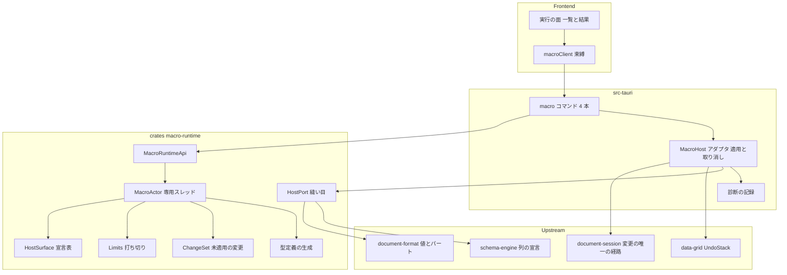

# Design Document

## Overview

**Purpose**: 利用者が書いた TypeScript / JavaScript を、**そのウィンドウが開いているドキュメントに対して**実行する。マクロはドキュメントと一緒に保存され、実行の入口はメニューに 1 つあり、結果（戻り値・出力・変更）は 1 つの面に出る。実行は隔離され、時間とメモリの上限で打ち切られ、**アプリを巻き込まない**。

**Users**: jxcel の利用者（個人・パワーユーザー）。手作業の代わりに集計・加工・定型の書き出しをマクロに任せる。後続の `formula-engine`（再計算）・`macro-stdlib`（標準ライブラリ）・`macro-editor-lsp`（エディタ）・`custom-types`（ユーザー定義型）は、**本スペックの実行基盤とホスト API をそのまま使う**。

**Impact**: 本スペックは「計算はマクロに統合する」という製品の中核判断を成立させる最初の実装である。ドメインクレート `crates/macro-runtime` を新設し、`crates/document-format` へマクロのパートを 1 形足し、`src-tauri` に実行のアダプタ（変更の適用と取り消しの 1 対化）を、フロントエンドに実行の面を足す。

### Goals

- TypeScript / JavaScript のマクロが、ドキュメントを型付きで読み書きして走る
- 実行の失敗（構文誤り・例外・能力の拒否・上限）が、**アプリとドキュメントを壊さない**
- マクロの変更が画面の編集と同じ経路を通り、**実行 1 回が取り消し 1 回**で戻る
- 10 万行規模の一括処理が実用の時間で終わり、その予算が実起動で判定される
- マクロへ公開する API の型定義が生成され、後続のエディタが補完に使える

### Non-Goals

- 標準マクロライブラリの中身（`macro-stdlib`）
- マクロの編集面・補完・診断（`macro-editor-lsp`）
- セルへの数式の入力と依存グラフによる再計算（`formula-engine`）
- ユーザー定義型への応用（`custom-types`）
- 敵対的なコードに対する強固なセキュリティ境界（個人利用を前提とした**事故防止**の水準）
- 複数のマクロの同時実行・実行のキューイング（1 ウィンドウにつき同時に 1 つ）

## Boundary Commitments

### This Spec Owns

- **マクロの記録の意味**: 名前・種別（TypeScript / JavaScript）・ソース・能力の宣言の解釈と検証
- **実行の実体**: 隔離された実行（専用スレッドが所有する実行基盤）、ソースの変換、ホスト API の登録、値の写像、出力の取り込み、失敗とスタック位置の表現
- **実行の統制**: 時間とメモリの上限、打ち切り、打ち切り後の状態（ドキュメントを変えないこと）
- **ホスト API の宣言表**: API の名前・型・**必要とする能力**の唯一の源（登録・門・型定義の 3 つがここを読む）
- **変更の集約の形**: マクロの書き込みを未適用の変更集合として集める型と、読みの重ね合わせの規則
- **マクロ向け型定義**（`types/`）の生成と、その乖離の機械検出
- **実行の入口と結果の提示**（メニュー項目 1 つ、実行の面、一覧の提示）

### Out of Boundary

- **マクロのパートの形式**: エントリ名・マニフェスト索引・符号化の決定性は `document-format` が所有する。本スペックは「名前・種別・ソースの並び」という**形を要求する**だけで、形式そのものを所有しない
- **変更の適用経路と履歴の所有者**: 変更は `document-session` の唯一の経路を通り、取り消し履歴はウィンドウの保持（`data-grid::history::UndoStack`）が所有する。本スペックは**適用と 1 対化をアダプタで行う**（エンジンは変更集合を返すだけ）
- **値の正否の判定**: 型強制と違反の判定は `schema-engine` が持つ。本スペックは判定規則を持たない
- **画面の編集・取り消しの入口・違反の提示**: `data-grid` が所有する（本スペックは変更をその経路へ渡すだけ）
- **マクロを書く編集面**: `macro-editor-lsp` が所有する（本スペックは保存と実行を持つ）
- **標準ライブラリ・数式・型の拡張点**: 各スペックが所有する（本スペックは基盤を提供するのみ）
- **capability の許可の永続化**: アプリ設定の保存は `app-shell` が持つ（本スペックは上限の値の要求元）

### Allowed Dependencies

- **Upstream（クレート）**: `document-format`（値と識別子の型）、`schema-engine`（列の宣言と型情報）
- **Upstream（スペック）**: `app-shell`（コマンド・メニュー・設定・診断の記録・検証の引き金）、`document-session`（変更の唯一の経路。**アダプタ層でのみ**）、`data-grid`（`UndoStack` と `EditCommand`。**アダプタ層でのみ**）
- **外部**: `deno_core`（実行基盤）、`deno_ast`（TypeScript の変換）、`serde_v8`（値の写像）、`ts-rs`（型定義の生成）
- **依存の向きの制約**: `crates/macro-runtime` は `tauri` に依存しない。**`data-grid` / `document-session` にも依存しない**（変更の適用はアダプタの仕事）。フロントエンド → `src-tauri` → ドメインクレートの向きを逆流させない

### Revalidation Triggers

- **`document-format` のパートを 1 形足したとき**: 符号化の決定性・マニフェスト索引・形式版のゲート・フィクスチャ（`window_protocol_fixture` を含む）を `document-format` が再検証する。**形式版を進めるかは `document-format` が決める**（本スペックは「古いビルドで開いたときにどうなるか」を所有しない）
  - **決定（タスク 1.2 の実装時）: 形式版は進めない（`1.0` のまま）**。理由は 3 点。(1) `macros.json` を**省略可能なパート**とし、マクロを 1 件も持たない文書では書かないため、そのような文書の出力はパートの追加前と**バイト単位で同一**であり、既存のゴールデン fixture・固定バイト列（`crates/document-format/tests/fixtures/bytes/golden_container.zip` と `v1/anchored.jxcel`）・`window_protocol_fixture` を 1 つも動かさない。(2) 版を進めても読む側の観測は変わらない: ゲートは major しか見ないため minor を上げても差が現れず、major を上げるなら既存の 1.0 のファイルを読むための移行段（1.0 → 2.0）と新バージョンのゴールデン fixture が要る（形式側の作業であり、本スペックの範囲外。移行段を伴わない major の引き上げは既存文書を読めなくする）。(3) この形を知らない実装は `macros.json` を許可リスト外のエントリ名として**拒否**する（許可リストは完全一致照合であり、黙って読み飛ばす経路が無い）ため、古いビルドで開いたときに**静かに壊れる**ことはない（拒否の理由にエントリ名が現れる）。記録は `crates/document-format/src/entry_name.rs`（許可リストの節）と `src/parts/macros_part.rs` / `src/parts/document_parts.rs`（省略可能なパートの節）にある
- **`data-grid` の `UndoStack` / `EditCommand` の形が変わったとき**: アダプタの写し（変更集合 → `EditCommand`）と、`UndoLabel::MacroRun` の 1 対の積み方が影響を受ける
- **`document-session` の `edit` の閉包の形が変わったとき**: 変更の適用の単位（1 回の `edit` で全部適用する前提）が影響を受ける
- **ホスト API の宣言表を変えたとき**: `types/` の生成物・ドリフト検査・`macro-editor-lsp` の補完の入力が影響を受ける
- **実行基盤の依存（`deno_core` / `deno_ast`）を更新したとき**: 打ち切り・上限・変換・値の写像の実測をやり直す

## Architecture

### Existing Architecture Analysis

- ドメインクレートは `tauri` を知らない（`structure.md`「ドメインクレートの内部構造」）。層を一方向に並べ、各層の `mod.rs` 冒頭に鎖を書く
- ウィンドウ 1 つにつきセッション 1 つ。変更は `document-session` の `edit` だけを通る（同じ Guard の内側で未保存と版を記録する）
- 取り消し履歴はウィンドウの保持（`src-tauri` の `SheetEntry`）が `data-grid` の `UndoStack` として所有し、`push` が唯一の登録口である。`UndoLabel::MacroRun` は本スペックのために予約済み
- IPC の境界型は `crates/app-shell/src/ipc` だけが定義し、生成物 `src/ipc/bindings.ts` をドリフト検査が固定する
- 検証専用の入口は環境変数 1 系統 + 非既定 feature + Vite の `define` の 3 点で閉じ、判定は POSIX の検査器が行い、**3 OS 共通の読み口は診断の記録**である

### Architecture Pattern & Boundary Map



### 決定の一覧（本文と `research.md` が番号で参照する）

| 番号 | 決定 | 本文の在り処 |
|---|---|---|
| 決定 1 | 実行ごとに isolate を作る（使い回さない） | 「Architecture Integration」の Selected pattern / `research.md`「Decision 1」 |
| 決定 2 | 変更は実行の間に集約し、終わってから 1 回で適用する | `research.md`「Decision 2」/ 上の「実行の流れ」の差分適用の規則 |
| 決定 3 | エンジンは `data-grid` に依存しない（適用はアダプタの仕事） | 「Allowed Dependencies」の依存の向きの制約 / `research.md`「Decision 3」 |
| 決定 4 | マクロの形は `document-format`、意味は `macro-runtime` | 「Out of Boundary」のマクロのパートの形式 / `research.md`「Decision 4」 |
| 決定 5 | ホスト API の宣言表を唯一の源にする | 「Components and Interfaces」の `HostSurface` / `research.md`「Decision 5」 |
| 決定 6 | 能力はマクロのソース先頭の宣言で決める | 「Security Considerations」/ `research.md`「Decision 6」 |

**Architecture Integration**:

- **Selected pattern**: 専用スレッドの actor（V8 isolate の current-thread 制約を満たす唯一の形）+ 縫い目（`HostPort` trait）によるホストの注入。エンジンはホストを知らず、アダプタが実装する
- **Domain/feature boundaries**: 実行の実体と統制（エンジン）／変更の適用と履歴（アダプタ）／形式（`document-format`）／判定（`schema-engine`）を分ける。**エンジンは `data-grid` と `document-session` を依存に持たない**
- **Existing patterns preserved**: ドメインクレートの層の鎖と根の再輸出、境界型の単一の源（`app-shell` の IPC）、`UndoStack::push` の唯一の口、検証の 3 点閉じ
- **New components rationale**: `MacroActor`（isolate の owner）、`HostSurface`（宣言の単一の源）、`HostPort`（ホストの縫い目）、`ChangeSet`（トランザクション境界）、`Limits`（打ち切り）、型定義の生成器。いずれも要件のいずれかが直接要求する
- **Steering compliance**: `tech.md`「Known Risks」1 の確定形（専用スレッド + current-thread ランタイム、`resolve` を使わない、`#[op2]` を `async fn` に、状態は型で受ける）、`structure.md`「マクロ向け型定義は手書きしない」、`verification.md`「判定は要件値で、実起動で」

### Technology Stack

| Layer | Choice / Version | Role in Feature | Notes |
|---|---|---|---|
| Backend / Services | Rust（workspace の既存版） | エンジンとアダプタ | `crates/macro-runtime` は `tauri` 非依存 |
| Runtime | `deno_core` 0.412（`v8` 150.4） | 実行基盤（組み込み） | 実行ごとに isolate を作る（決定 1） |
| Transpile | `deno_ast` 0.53.3（`transpiling`） | TypeScript → JavaScript | `ModuleLoader::load` の中で行う。ソースマップを付けて位置を復元 |
| Value mapping | `serde_v8`（`deno_core` 同梱） | 値の往復 | 範囲の読みは借用で渡す |
| Frontend | React 19 + 既存のシェル | 実行の面（一覧・結果） | `data-grid` と同じ登録簿の契約に従う |
| Types | `ts-rs`（既存） | `types/macro-host.d.ts` の生成 | `src/ipc/bindings.ts` と同じ運用（生成物を追跡 + ドリフト検査） |

## File Structure Plan

### Directory Structure

```
crates/macro-runtime/
├── Cargo.toml
├── benches/
│   └── bulk.rs                 # 10 万行の読み+集計 / 1 万行の書き換えの計測（要件 11）
└── src/
    ├── lib.rs                  # 層の鎖の宣言と公開面の再輸出
    ├── error.rs                # MacroError（判別可能な列挙。表示の文言を持たない）
    ├── source/
    │   ├── mod.rs              # 層: マクロの記録とソースの解釈
    │   ├── record.rs           # MacroRecord / MacroKind / 名前の規則 / パートの往復
    │   └── capability.rs       # ソース先頭の宣言の解析（能力の集合）
    ├── surface/
    │   ├── mod.rs              # 層: ホスト API の宣言（所有者はここだけ）
    │   ├── declaration.rs      # 宣言表（名前・引数・戻り値の型・必要とする能力）
    │   └── gate.rs             # 能力の門（宣言と突き合わせて拒否する）
    ├── host/
    │   ├── mod.rs              # 層: ホストの縫い目（読み・書き・出力・能力の口）
    │   ├── value.rs            # schema の値 ⇄ JavaScript の値の写像
    │   ├── changes.rs          # ChangeSet / Change（未適用の変更）
    │   └── overlay.rs          # 読みの重ね合わせ（自分の書き込みを読む）
    ├── engine/
    │   ├── mod.rs              # 層: 実行の実体（actor と isolate の寿命）
    │   ├── actor.rs            # 専用スレッド・mpsc/oneshot・実行の直列化
    │   ├── isolate.rs          # JsRuntime の生成・op の登録・console・ソースマップ
    │   ├── transpile.rs        # deno_ast の ModuleLoader（TS → JS + ソースマップ）
    │   ├── limits.rs           # 時間とメモリの上限・打ち切り・種類の記録
    │   └── outcome.rs          # RunOutcome / MacroFailure / フレーム
    ├── types.rs                # .d.ts を組み立てる（宣言表 + ts-rs の型）
    └── api.rs                  # MacroRuntimeApi（外から見える唯一の面）
└── tests/                      # 結合検査（偽のホスト・ドキュメントの往復・打ち切り）

crates/document-format/src/
├── entry_name.rs               # 変更: エントリ名に 1 形（macros.json）を足す
└── parts/macros_part.rs        # 新規: マクロの記録の並び（形だけ。意味は持たない）

src-tauri/src/
├── commands/macro.rs           # 新規: コマンド 4 本（一覧・保存・削除・実行）
├── macro_host.rs               # 新規: HostPort の実装（読み・変更の集約・能力・出力）
├── macro_apply.rs              # 新規: ChangeSet → EditCommand の写しと 1 対の履歴の積み方
└── menu.rs                     # 変更: 実行の導線を 1 項目足す

crates/app-shell/src/ipc/mod.rs # 変更: 境界型（実行の要求・結果・一覧）と設定の 2 鍵
src/features/macro/             # 新規: 実行の面（一覧・結果・失敗の提示）と束縛
types/macro-host.d.ts           # 新規（生成物）: マクロ向けの型定義

scripts/check-macro-run.sh      # 新規: 3 OS 共通の検査器（記録を読んで要件値で判定）
scripts/ci/{linux,macos,windows}/verify-macro-run.{sh,ps1}  # 新規: 既存マトリクスへ 1 段
```

### Component → File の対応

| Component | File |
|---|---|
| `MacroRuntimeApi` | `crates/macro-runtime/src/api.rs` |
| `MacroActor` | `crates/macro-runtime/src/engine/actor.rs` |
| isolate（生成・op の登録・console） | `crates/macro-runtime/src/engine/isolate.rs` |
| `Transpiler` | `crates/macro-runtime/src/engine/transpile.rs` |
| `Limits`（打ち切り） | `crates/macro-runtime/src/engine/limits.rs` |
| `RunOutcome` / `MacroFailure` | `crates/macro-runtime/src/engine/outcome.rs` |
| `SourceRecord`（名前・種別・ソース） | `crates/macro-runtime/src/source/record.rs` |
| `CapabilitySet`（宣言の解析） | `crates/macro-runtime/src/source/capability.rs` |
| `HostSurface`（宣言表） | `crates/macro-runtime/src/surface/declaration.rs` |
| 能力の門 | `crates/macro-runtime/src/surface/gate.rs` |
| `HostPort`（縫い目） | `crates/macro-runtime/src/host/mod.rs` |
| 値の写像 | `crates/macro-runtime/src/host/value.rs` |
| `ChangeSet` / 重ね合わせ | `crates/macro-runtime/src/host/changes.rs`, `crates/macro-runtime/src/host/overlay.rs` |
| 型定義の組み立て | `crates/macro-runtime/src/types.rs`（生成物は `types/macro-host.d.ts`） |
| `MacroHost`（アダプタ） | `src-tauri/src/macro_host.rs` |
| `macro_apply`（適用と履歴） | `src-tauri/src/macro_apply.rs` |
| macro コマンド 4 本 | `src-tauri/src/commands/macro.rs` |
| 実行の面（一覧・結果） | `src/features/macro/` |
| 記録の 1 行 | `src-tauri/src/macro_host.rs`（`macro_run` の記録） |
| マクロのパート（上流の変更） | `crates/document-format/src/parts/macros_part.rs` |

### Modified Files

- `crates/document-format/src/entry_name.rs` / `src/model/` / `parts/document_parts.rs` / `manifest` の索引 — マクロのパートを 1 形足し、**`Document` にマクロの並びの読み書き口**を足す（`to_parts` / `from_parts` / 検証を追随させる。形だけを持ち、意味は持たない。決定 4）
- `crates/document-format/tests/*`（決定性・往復・フィクスチャ） — 新パートを追随させる
- `src-tauri/src/commands/mod.rs` — `macro_*` を `command_root!` へ登録
- `src-tauri/permissions/app.toml` — 4 本の許可
- `crates/app-shell/src/ipc/command_names.rs` / `mod.rs` — 名前と境界型、設定の 2 鍵
- `src/ipc/bindings.ts` — 再生成（生成器が唯一の入口）
- `crates/app-shell/src/settings/mod.rs` — `macro.time_limit_ms` / `macro.memory_limit_bytes`
- `scripts/check-menu-shortcut.sh` と `scripts/ci/macos/verify-menu-shortcuts.sh` — メニュー項目数の期待を追随（**越える境界**である。`structure.md` の横断規則）
- `.github/workflows/ci.yml` — 既存の test ジョブに段を 1 つ（新しいジョブを作らない）
- `scripts/check-bench-budget.sh` / `.github/workflows/bench.yml` — 要件 11 の予算を判定器へ追加

## System Flows

### 実行の流れ（成功・失敗・打ち切り）

```mermaid
sequenceDiagram
    participant UI as 実行の面
    participant Cmd as macro_run
    participant Host as MacroHost
    participant Actor as MacroActor
    participant Port as HostPort
    participant Doc as document-session
    UI->>Cmd: 実行を要求 マクロ名
    Cmd->>Host: 記録からソースと宣言を読む
    Host->>Actor: RunRequest ソース 種別 上限 宣言
    Actor->>Actor: isolate を作る 変換して実行
    Actor->>Port: 読みの要求 シート 範囲
    Port->>Doc: 文書を読む
    Actor->>Actor: 書き込みを ChangeSet へ積む
    Actor->>Port: 出力を渡す
    alt 成功
        Actor-->>Host: RunOutcome ran 値 出力 変更
        Host->>Doc: 1 回の edit で変更集合を適用
        Host->>Host: UndoLabel MacroRun の 1 対を積む
    else 失敗または打ち切り
        Actor-->>Host: RunOutcome failed または aborted
        Note over Host,Doc: ドキュメントへは何も適用しない
    end
    Host-->>UI: 結果（値・出力・失敗・変更の件数）
```

差分適用の規則:

- 変更の適用は**実行が成功で終わったときだけ**、`document-session::edit` の閉包 1 回の中で行う（要件 6.3 / 7.3）
- 履歴へ積むのは `UndoLabel::MacroRun` の**1 対だけ**（要件 7.1）。逆命令は適用した命令の並びから組む（`HistoryCommand::Composite` の形。`data-grid` の既存の合成と同じ）
- 1 ウィンドウにつき同時に走る実行は 1 つ。実行中の要求は「実行中である」として断る（要件 2.2 の裏返し。UI を止めないため）

## Requirements Traceability

| Requirement | Summary | Components | Interfaces | Flows |
|---|---|---|---|---|
| 1.1, 1.2, 1.3, 1.4, 1.5, 1.6, 1.7 | マクロをドキュメントに保存する | `SourceRecord`, `document-format` の新パート, `macro_store` / `macro_delete` / `macro_list` | `MacroRecord`, `MacroStorePort` | 保存と一覧 |
| 2.1, 2.2, 2.3, 2.4, 2.5, 2.6, 2.7 | マクロを実行する（入口と結果） | `MacroRuntimeApi`, `MacroActor`, 実行の面, `macro_run`, 記録 | `RunRequest`, `RunOutcome`, `OutputLine` | 実行の流れ |
| 3.1, 3.2, 3.3, 3.4, 3.5 | TypeScript と JavaScript を書ける | `Transpiler`, `SourceRecord` | `TranspileOutcome`, `MacroFailure` | 実行の流れ |
| 4.1, 4.2, 4.3, 4.4, 4.5, 4.6 | 型付きのホスト API でドキュメントを読む | `HostSurface`, `HostPort`, `value.rs`, `types.rs` | `HostReadPort`, `ColumnTypeInfo` | 読みの往復 |
| 5.1, 5.2, 5.3, 5.4, 5.5 | 変更は画面と同じ経路で適用する | `ChangeSet`, `macro_apply`, `MacroHost` | `Change`, `ChangeSet` | 実行の流れ |
| 6.1, 6.2, 6.3, 6.4, 6.5 | 実行を打ち切る（時間とメモリ） | `Limits`, `MacroActor`, `isolate.rs`, 設定の 2 鍵 | `Limits`, `RunOutcome.aborted` | 実行の流れ |
| 7.1, 7.2, 7.3, 7.4 | 実行 1 回の変更を 1 回の取り消しで戻す | `macro_apply`, `ChangeSet`, `MacroHost` | `ChangeSet`, `UndoLabel::MacroRun` | 実行の流れ |
| 8.1, 8.2, 8.3, 8.4, 8.5 | 能力の宣言と拒否 | `capability.rs`, `gate.rs`, `HostSurface`, 実行の面 | `CapabilitySet`, `Capability` | 能力の門 |
| 9.1, 9.2, 9.3, 9.4 | 失敗の提示（理由と位置） | `outcome.rs`, `isolate.rs`, `transpile.rs`, 実行の面 | `MacroFailure`, `Frame` | 実行の流れ |
| 10.1, 10.2, 10.3 | ホスト API の型定義を公開する | `types.rs`, `HostSurface`, 生成器と生成物 `types/macro-host.d.ts` | `TypeSurface` | 生成とドリフト検査 |
| 11.1, 11.2, 11.3 | 一括処理の性能 | `HostPort` の範囲の読み, `value.rs`, `benches/bulk.rs`, 検査器と予算の判定器 | `HostReadPort.read_rows` | 予算の判定 |

## Components and Interfaces

| Component | Domain/Layer | Intent | Req Coverage | Key Dependencies (P0/P1) | Contracts |
|---|---|---|---|---|---|
| `MacroRuntimeApi` | Engine (api) | 一覧・保存・削除・実行の唯一の面 | 1.1–1.7, 2.1, 2.3, 2.5, 3.1–3.5, 6.1–6.5, 7.1, 9.1–9.4 | `MacroActor` (P0), `SourceRecord` (P0) | Service |
| `MacroActor` | Engine (engine) | isolate の所有・実行の直列化・打ち切り | 2.2, 2.4, 6.1, 6.2, 6.3, 6.4 | `isolate` (P0), `Limits` (P0) | Service, State |
| `SourceRecord` | Engine (source) | マクロの記録の意味と検証 | 1.1, 1.2, 1.4, 1.5, 1.6, 1.7, 3.2, 3.3 | `document-format` の新パート (P0) | Service |
| `CapabilitySet` / `gate` | Engine (source, surface) | 宣言の解析と門 | 8.1, 8.2, 8.3, 8.4, 8.5 | `HostSurface` (P0) | Service |
| `HostSurface` | Engine (surface) | 宣言表（登録・門・型の唯一の源） | 4.1–4.6, 5.3, 8.1, 8.4, 10.1, 10.2, 10.3 | `ts-rs` (P1) | Service |
| `HostPort` | Engine (host) | ホストの縫い目（読み・書き・出力・能力） | 4.1, 4.2, 4.3, 4.4, 4.5, 5.1, 5.3, 5.4, 8.1 | `document-format` (P0), `schema-engine` (P0) | Service |
| `ChangeSet` / `overlay` | Engine (host) | 未適用の変更と読みの重ね合わせ | 5.1, 5.2, 5.5, 6.3, 7.1, 7.3 | `HostPort` (P0) | State |
| `Transpiler` | Engine (engine) | TS → JS とソースマップ | 3.1, 3.2, 3.3, 3.4, 3.5, 9.1 | `deno_ast` (P0) | Service |
| `Limits` | Engine (engine) | 時間・メモリの上限と打ち切り | 6.1, 6.2, 6.4, 6.5 | `v8` の isolate (P0) | State |
| `types.rs` | Engine (types) | `.d.ts` の組み立て | 10.1, 10.2, 10.3 | `HostSurface` (P0), `ts-rs` (P0) | Service |
| `MacroHost`（アダプタ） | src-tauri | `HostPort` の実装（文書・能力・出力） | 4.1–4.4, 5.1, 5.4, 8.1, 8.3 | `document-session` (P0), `schema-engine` (P0) | Service |
| `macro_apply`（アダプタ） | src-tauri | 変更集合の適用と 1 対の履歴 | 5.1, 5.2, 5.3, 7.1, 7.2, 7.3, 7.4 | `data-grid` の `EditCommand` (P0), `UndoStack` (P0) | Service |
| 実行の面（フロント） | Frontend | 一覧・実行・結果・失敗の提示 | 2.1, 2.3, 2.5, 2.7, 8.2, 9.1, 9.2, 9.3 | `macroClient` (P0) | API |
| 記録（`macro_run` の 1 行） | src-tauri | 実行 1 回の事実を診断へ残す | 2.6 | `app-shell` の記録 (P0) | Event |

### Engine（`crates/macro-runtime`）

#### MacroRuntimeApi

| Field | Detail |
|---|---|
| Intent | マクロの記録の意味と実行を、外から見える 1 つの面にまとめる |
| Requirements | 1.1, 1.2, 1.3, 1.4, 1.5, 1.6, 1.7, 2.1, 2.3, 2.5, 3.1, 3.2, 3.3, 3.4, 3.5, 6.1, 6.2, 6.3, 6.4, 6.5, 7.1, 9.1, 9.2, 9.3, 9.4 |

**Responsibilities & Constraints**

- マクロの記録（名前・種別・ソース）の**検証と正規化**を持ち、パートの形（`document-format`）とは分ける
- 実行の要求を受けて actor へ渡し、結果を返す。**ドキュメントへは触らない**（読みは `HostPort`、書きは `ChangeSet`）
- 実行は 1 つずつ。実行中の要求は `MacroError::Busy` で断る

**Dependencies**

- Inbound: `src-tauri` の `macro_*` コマンド — 一覧・保存・削除・実行（P0）
- Outbound: `document-format` — 値と識別子の型（P0）。`schema-engine` — 列の宣言（P0）
- External: `deno_core` / `deno_ast` / `serde_v8`（いずれも `engine` 層の内側。P0）

**Contracts**: Service [x] / API [ ] / Event [ ] / Batch [ ] / State [ ]

##### Service Interface

```rust
/// マクロの記録（ドキュメントの中身と、実行に渡す材料の両方の形）。
pub struct MacroRecord {
    pub name: MacroName,
    pub kind: MacroKind,          // TypeScript | JavaScript
    pub source: String,           // 保存されたままのソース（整形しない）
}

pub struct RunRequest {
    pub record: MacroRecord,
    pub limits: Limits,           // 時間（既定 30 秒）とメモリ（既定 512 MB）
    pub window: WindowLabel,      // どのウィンドウのドキュメントか（アダプタが解決して渡す）
}

pub enum RunOutcome {
    Ran {
        value: String,            // 戻り値の提示用の表現（オブジェクトは JSON）
        output: Vec<OutputLine>,  // console の出力（順序を保つ）
        changes: ChangeSummary,   // 種別ごとの件数（要件 5.5）
        elapsed_ms: u64,
    },
    Failed { failure: MacroFailure },
    Aborted { limit: LimitKind, elapsed_ms: u64, failure: MacroFailure },
}

impl MacroRuntimeApi for MacroRuntime {
    fn list(&self, records: &[MacroRecord]) -> Vec<MacroSummary>;
    fn validate(&self, record: &MacroRecord) -> Result<CapabilitySet, MacroError>;
    fn run(&self, request: RunRequest) -> Result<RunOutcome, MacroError>;
}
```

- **Preconditions**: `record.source` は保存されたバイト列のまま（整形しない）。`limits` は設定から解決済み
- **Postconditions**: `Ran` のときだけ `changes` が空でない可能性がある。`Failed` / `Aborted` のとき `changes` は**適用されていない**（アダプタが適用しない）
- **Invariants**: 実行の間、isolate は 1 つの専用スレッドを離れない。実行が終われば isolate は破棄される

**Implementation Notes**

- Integration: アダプタは `list` / `validate` をコマンドの同期の腕で、`run` を非同期の腕で呼ぶ
- Validation: `validate` はソースの解釈（種別の一致・能力宣言の綴り）だけを行い、**型検査はしない**（要件 3.2）
- Risks: 実行時間の計測は打ち切りと競合しないよう、actor の内側で測る

#### MacroActor / isolate / limits

| Field | Detail |
|---|---|
| Intent | isolate を所有し、実行を直列化し、上限で打ち切る |
| Requirements | 2.2, 2.4, 6.1, 6.2, 6.3, 6.4 |

**Responsibilities & Constraints**

- 専用 OS スレッドが current-thread の tokio ランタイムを 1 つ回し、その上で実行ごとに `JsRuntime` を作る（決定 1）
- 要求は mpsc + oneshot で直列化する。**isolate はスレッドを離れない**
- 打ち切りは 2 つの口から同じ終了経路へ合流する: (a) 時間の上限を刻むタイマーが `thread_safe_handle().terminate_execution()` を呼ぶ、(b) メモリの上限は `create_params` の `heap_limits` + `add_near_heap_limit_callback` の中で terminate する。**種類（時間 / メモリ）は `AtomicU8` に記録**して outcome に載せる
- 実行の前に `cancel_terminate_execution()` を必ず呼ぶ（前回の打ち切りを持ち越さない）

**Dependencies**

- Inbound: `MacroRuntimeApi` — 実行の要求（P0）
- Outbound: `HostPort` — 読みの要求と出力の受け渡し（P0）
- External: `deno_core`（`RuntimeOptions::create_params` / `module_loader` / `run_event_loop` / `v8_isolate`）、`v8`（`terminate_execution` / `heap_limits`）（P0）

**Contracts**: Service [x] / State [x]

##### State Management

- State model: `MacroActor { requests: mpsc::Sender<Request>, running: Arc<AtomicBool> }`。スレッド内の状態は `JsRuntime` と `Limits` だけである
- Persistence & consistency: 実行の状態は永続化しない。実行の**記録**は診断へ 1 行
- Concurrency strategy: 1 実行ずつ。2 つ目の要求は `MacroError::Busy` で断る

**Implementation Notes**

- Integration: `execute_script` → `run_event_loop(Default::default())` → Promise の状態を読む（`resolve` は使わない。`tech.md` の実測）
- Validation: 「時間の上限で打ち切られる」「メモリの上限で打ち切られる」「打ち切りの後も同じスレッドで次の実行ができる」を結合検査で固定する
- Risks: callback はランタイム文脈を要する（current-thread ランタイムの上で作る）。callback を付け忘れると V8 がプロセスを abort させるため、**isolate の生成は 1 箇所（`isolate.rs`）に閉じる**

#### Transpiler

| Field | Detail |
|---|---|
| Intent | TypeScript のソースを実行できる形へ変換し、位置を保存する |
| Requirements | 3.1, 3.2, 3.3, 3.4, 3.5, 9.1, 9.3 |

**Responsibilities & Constraints**

- `ModuleLoader::load` の中で変換する（`extension_transpiler` は拡張専用である）。変換結果へ `sourceMappingURL` を付け、`deno_core` の `SourceMapper` に**原位置への写し**を行わせる
- 種別が JavaScript のソースは変換しない（要件 3.3）
- 構文誤りは `deno_ast` の位置（行・列）をそのまま `MacroFailure` のフレームへ入れる（要件 3.4）
- 解決できない取り込みは**名前を挙げて**失敗させる（要件 3.5）

**Contracts**: Service [x]

##### Service Interface

```rust
pub trait TranspilePort {
    fn transpile(&self, record: &MacroRecord) -> Result<Transpiled, MacroError>;
}

pub struct Transpiled {
    pub code: String,            // 変換後の JavaScript（末尾に sourceMappingURL）
    pub source_map: Option<String>,
    pub module_name: String,     // 例: "macro:在庫集計.ts"
}
```

**Implementation Notes**

- Integration: 変換は実行の直前に 1 回。`ModuleLoader` は `macro:` の scheme だけを解決し、それ以外は解決しない（標準ライブラリの取り込みは `macro-stdlib` が後で足す）
- Validation: 「型注釈の誤りでは止まらない」「構文誤りは行・列つきで返る」「例外のフレームが TS の位置を指す」
- Risks: `deno_ast` の変換の対象外（型検査）を混同しない

#### HostSurface / HostPort / ChangeSet

| Field | Detail |
|---|---|
| Intent | マクロへ公開する API の単一の源と、その実装の縫い目 |
| Requirements | 4.1, 4.2, 4.3, 4.4, 4.5, 4.6, 5.1, 5.2, 5.3, 5.4, 5.5, 8.1, 8.4, 10.1, 10.2, 10.3 |

**Responsibilities & Constraints**

- 宣言表が「名前・引数・戻り値の型・必要とする能力」を持ち、**ops の登録・能力の門・型定義の生成**がそこだけを読む（決定 5）
- `HostPort` はトレイトであり、アダプタが実装する。エンジンは文書を知らない
- **読みは重ね合わせを見る**（自分の書き込みを読める）。行の追加は**適用まで識別子を持たない**ため、追加した行の中身は `insert` に渡した値としてのみ扱う（後から読むことはできない。要件 5.4 の「存在しない行を指した」ときの理由に含める）

**Dependencies**

- Inbound: `MacroActor` — op からの呼び出し（P0）
- Outbound: `document-format`（`CellValue` / `SheetId` / `RowId`）、`schema-engine`（列の宣言）（P0）
- External: `serde_v8`（値の往復）（P0）

**Contracts**: Service [x] / State [x]

##### Service Interface

```rust
pub trait HostPort {
    /// シートの一覧（名前・行数）と列の宣言（型情報を含む）。
    fn sheets(&self) -> Result<Vec<SheetInfo>, HostError>;
    fn columns(&self, sheet: SheetId) -> Result<Vec<ColumnTypeInfo>, HostError>;
    /// 行の範囲の読み。**1 回の呼び出しで範囲を返す**（要件 4.4）。重ね合わせを含む。
    fn read_rows(&self, sheet: SheetId, span: RowSpan) -> Result<RowPage, HostError>;
    /// 自分の書き込みを読むための重ね合わせ（`read_rows` の内側で使う）。
    fn overlay(&self) -> &ChangeSet;
    /// 変更の集約。
    fn stage(&self, change: Change) -> Result<(), HostError>;
    /// 出力（console）。
    fn emit(&self, line: OutputLine);
    /// 能力を要する口（宣言が無ければ `gate` が呼び出し前に拒む）。
    fn file_read(&self, path: &str) -> Result<String, HostError>;
    fn file_write(&self, path: &str, text: &str) -> Result<(), HostError>;
    fn net_fetch(&self, url: &str) -> Result<String, HostError>;
}

pub enum Change {
    SetCells { sheet: SheetId, writes: Vec<(RowId, ColumnIndex, CellValue)> },
    InsertRows { sheet: SheetId, values: Vec<Vec<CellValue>> },
    RemoveRows { sheet: SheetId, rows: Vec<RowId> },
    DuplicateRows { sheet: SheetId, rows: Vec<RowId> },
}
```

- **Preconditions**: `stage` に渡す行の識別子は**既に存在する行**である（追加した行を指せない）
- **Postconditions**: `stage` は適用しない（集約だけ）。`ChangeSet` は実行の終わりまで保持される
- **Invariants**: 同じセルへの複数の書き込みは**後ろのものが残る**。`overlay` は常に `ChangeSet` と一致する

##### State Management

- State model: `ChangeSet { sets: BTreeMap<(SheetId, RowId, ColumnIndex), CellValue>, inserts: Vec<...>, removes: ..., duplicates: ... }`。**適用の順序**（追加 → 値 → 削除）を保つ
- Persistence & consistency: 実行が失敗すれば捨てる（適用しない）。成功すればアダプタが 1 回で適用する

**Implementation Notes**

- Integration: op は同期の腕（`Deno.core.ops.*`）で呼ばれ、範囲の読みは借用で渡す（要件 11）
- Validation: 「宣言にある API はすべて呼べる／宣言に無い API は呼べない」「書いたセルを読むと書いた値が返る」「同じセルへ 2 回書くと最後の値が残る」
- Risks: 範囲の読みの写像でコピーが増えないよう、`#[buffer]` の借用経路を実測で確かめる

#### types.rs（型定義の生成）

| Field | Detail |
|---|---|
| Intent | マクロ向けの `.d.ts` を宣言表と Rust の型から組み立てる |
| Requirements | 10.1, 10.2, 10.3 |

**Responsibilities & Constraints**

- 宣言表の各 API を**関数の宣言**として書き、引数と戻り値の型は `ts-rs` の生成物（`TS::decl`）から取る
- 生成物は `types/macro-host.d.ts` として追跡し、**生成器の出力とのバイト一致**をドリフト検査で固定する（`src/ipc/bindings.ts` と同じ運用）
- 能力を要する API は宣言の**コメントに能力名を書く**（補完で見える。要件 8.2 の提示と一致させる）

**Contracts**: Service [x]

**Implementation Notes**

- Integration: 生成器は `cargo run -p macro-runtime --bin generate-macro-types`。`macro-editor-lsp` はこのファイルを読む
- Validation: 宣言表の全 API が `.d.ts` に現れること、宣言と実装が一致すること
- Risks: 型の無い API を足すと生成が失敗する（意図した性質）

### Adapter（`src-tauri`）

#### MacroHost / macro_apply

| Field | Detail |
|---|---|
| Intent | エンジンの縫い目を文書と履歴へ繋ぎ、変更を 1 回で適用する |
| Requirements | 4.1, 4.2, 4.3, 4.4, 5.1, 5.2, 5.3, 5.4, 7.1, 7.2, 7.3, 7.4 |

**Responsibilities & Constraints**

- `HostPort` を `document-session` の読みと `schema-engine` の列の宣言で実装する
- 変更の適用は `document-session::edit` の**閉包 1 回**の中で行い、`data-grid` の `EditCommand` へ写す。履歴へは `UndoLabel::MacroRun` の**1 対**を積む
- 適用の前に**シートの照合**を行う（`Composite` の既存の規律に従う。1 つでも食い違えば何も書かない）
- 記録（要件 2.6）: 実行 1 回につき `macro_run` の 1 行（マクロ名・種別・成否・打ち切りの種類・変更の件数・所要）

**Contracts**: Service [x]

##### Service Interface

```rust
/// 変更集合を 1 回の edit と 1 つの履歴の対にする（要件 5.1, 7.1）。
pub fn apply_macro_changes(
    window: &WindowLabel,
    changes: &ChangeSet,
) -> Result<ChangeSummary, MacroApplyError>;
```

- **Preconditions**: 実行が成功で終わっている（`Ran`）
- **Postconditions**: 変更が 1 回の `edit` で適用され、取り消し 1 回で全部戻る
- **Invariants**: 適用が失敗したとき、ドキュメントは**変更前のまま**（`edit` の閉包の中で拒否する）

**Implementation Notes**

- Integration: `SheetEntry` のロックの下で `edit` を呼ぶ（`document-session` の規律に従う）
- Validation: 「マクロの変更が 1 回の取り消しで戻る」「適用の失敗でドキュメントが変わらない」
- Risks: `data-grid` の `EditCommand` の形が変わると写しが壊れる（Revalidation Triggers）

### Frontend（`src/features/macro`）

#### 実行の面

| Field | Detail |
| --- | --- |
| Intent | マクロの一覧・実行・結果・失敗の提示 |
| Requirements | 2.1, 2.3, 2.5, 2.7, 8.2, 9.1, 9.2, 9.3 |

**Responsibilities & Constraints**

- **一覧は開いた時点で出す**（名前・種別・解釈できなかった理由。要件 1.3 / 1.4）。実行の入口は**メニューの 1 項目**（「マクロを実行」）であり、押すとその一覧から選ばせ、選ばれたマクロの**宣言されている能力**を実行の前に示す（要件 8.2）
- 結果の面は 1 つであり、戻り値・出力・変更の件数・失敗（理由とフレーム）を同じ場所に出す
- 実行中は面が「実行中」を示し、**表の操作は止めない**（要件 2.2）
- 実行できるマクロが 1 つも無ければ、メニューの項目は無効である（要件 2.7）

**Contracts**: API [x]

##### Implementation Notes

- Integration: `macroClient` が `macro_list` / `macro_store` / `macro_delete` / `macro_run` を呼ぶ。実行の面は `data-grid` と同じ登録簿の契約でシェルに載る
- Validation: 実起動の観測（検査器）で「メニュー → 一覧 → 実行 → 結果」を通す
- Risks: 実行の面が表の描画を妨げないこと（実行中もフレームが落ちないこと）を 9.2 の段と同じ形で観測する

## Data Models

### Domain Model

- **MacroRecord**（値オブジェクト）: 名前・種別・ソース。**不変**であり、保存は置き換えである（要件 1.6）
- **CapabilitySet**（値オブジェクト）: 宣言された能力の集合（`file.read` / `file.write` / `net`）。ソースから導出され、保存はしない（宣言はソースの一部である）
- **RunOutcome**（結果）: `Ran` / `Failed` / `Aborted` の 3 値。**打ち切りは失敗の一種ではなく別の値**である（要件 6.1 / 6.2 の提示が失敗と異なるため）
- **ChangeSet**（集約）: 未適用の変更。実行の 1 つのトランザクション境界であり、適用されると消える
- **不変条件**:
  - マクロのソースは保存と読み込みの間で変わらない（要件 1.5）
  - 打ち切り・失敗のとき、`ChangeSet` は適用されない（要件 6.3 / 7.3）
  - 1 つのセルへの複数の書き込みは後ろが残る

### Logical Data Model

**ドキュメントの中の形**（`document-format` が所有する形に、本スペックが意味を与える）:

| パート | 内容 | 所有者 |
|---|---|---|
| `macros.json` | マクロの記録の並び（名前・種別・ソース） | 形は `document-format`、意味は `macro-runtime`（決定 4） |

- 並びの順序は**保存された順**であり、一覧の提示順に使う
- 名前は一意である（同じ名前の保存は置き換え。要件 1.6）
- ソースはテキストのまま保持する（整形しない。要件 1.5）
- **wire 形（タスク 1.2 の実装で確定）**: `{"macros":[{"name":<文字列>,"kind":"typescript"|"javascript","source":<文字列>}]}`。キー順はこの順、`kind` は 2 つのテキストのいずれか（未知のテキストは拒否）、`source` は JSON 文字列としてのみエスケープする。**パートは省略可能**であり、マクロを 1 件も持たない文書では `macros.json` を書かない（形式版を進めない判断と対。`crates/document-format/src/parts/macros_part.rs`）。一意性の検査は上流では行わない（下流の規則。タスク 1.6）

### Data Contracts & Integration

**IPC の境界型**（`crates/app-shell/src/ipc` が定義し、`src/ipc/bindings.ts` へ生成する）:

| コマンド | 要求 | 応答 |
|---|---|---|
| `macro_list` | なし（呼び出し元のウィンドウ） | マクロの要約の並び（名前・種別・能力の宣言・**解釈できなかった理由**。要件 1.4: 解釈できないマクロも一覧に残し、理由を添える） |
| `macro_store` | 名前・種別・ソース | 保存後の要約 |
| `macro_delete` | 名前 | 削除後の要約の並び |
| `macro_run` | 名前（と上限） | `RunOutcome` の境界形（値・出力・変更の件数・失敗の種別とフレーム） |

- 上限は境界型に載せない（**設定から適応層が解決する**。要件 6.5）
- 値と出力の文言は**境界を越えない**（表示用の文字列は境界の型にしない。生の値は `CellValue` の形で運ぶ）

## Error Handling

### Error Strategy

失敗は**4 つの層**で捕まえ、それぞれ異なる提示にする。**どの層の失敗でもドキュメントは変わらない**（変更は成功のときだけ適用する）。

| 層 | 例 | 提示 | ドキュメント |
|---|---|---|---|
| ソースの解釈 | 種別と構文の不一致、能力宣言の誤り | マクロの名前と理由（実行しない） | 不変 |
| 変換 | TypeScript の構文誤り | 行・列つきの理由 | 不変 |
| 実行 | 例外、ホスト API の拒否（能力・存在しない行） | 理由とフレーム（TS の原位置） | 不変 |
| 統制 | 時間の上限、メモリの上限 | **打ち切り**として理由つきで提示（失敗とは別） | 不変 |

### Error Categories and Responses

**User Errors**（利用者が直せる）: 構文誤り → 行・列と理由。能力の宣言漏れ → 拒んだ能力の名前（要件 8.3）。存在しない行・列 → その位置とマクロのソース位置（要件 5.4）。スキーマの書き換え → 読み取り専用である理由（要件 4.5）

**System Errors**（実行基盤）: 変換の失敗（`deno_ast` の内部失敗）→ 実行できない理由。isolate の生成失敗 → 実行できない理由（アプリは生かす）。打ち切りの後始末の失敗 → 記録に残し、次の実行は新しい isolate で行う

**Business Logic Errors**（実行の意味論）: 実行中の重複要求 → 「実行中である」。マクロが 1 つも無い → 実行の入口を出さない（要件 2.7）

### Monitoring

- 実行 1 回につき診断の記録へ 1 行: `macro_run: マクロ名 / 種別 / 結果（成功・失敗・打ち切り）/ 打ち切りの種類 / 変更の件数 / 所要 ms`。**ソースと値は記録へ出さない**（要件 8.3 の通信内容保護と同じ規律）
- 3 OS の検査器はこの 1 行を読んで判定する（`data-grid` の 9.2 が確立した形）

## Testing Strategy

### Unit Tests（エンジンの中の純粋な部分）

1. `source::record` — 名前の規則・種別とソースの往復（**バイト一致**。要件 1.5）・同じ名前の置き換え（要件 1.6）
2. `source::capability` — 宣言の解析（綴りの揺れ・重複・未知の能力。要件 8.3 / 8.4）
3. `host::changes` — 同じセルへの複数書き込みで最後が残る・変更の順序（追加 → 値 → 削除）・`ChangeSummary` の件数（要件 5.5）
4. `host::value` — `CellValue` の全変種（入れ子・ANY・添付・値なし）の JS 値との往復（要件 4.2 / 4.3）
5. `engine::outcome` — `MacroFailure` のフレーム（TS の原位置）と 3 値の写像（要件 9.1 / 9.3）
6. `surface::declaration` — 宣言と実装の一致（宣言にある op が登録されている）、**能力の欄が全項目にある**（要件 8.1 / 10.1）

### Integration Tests（エンジンとアダプタの継ぎ目）

1. 偽のホストで「範囲を 1 回読む → 集計 → 値を書く」を通し、`RunOutcome` と `ChangeSet` を固定する（要件 4.4 / 5.1）
2. 打ち切り: 無限ループ（時間）と大量確保（メモリ）の双方で、種類つきの `Aborted` が返り、**同じ actor で次の実行が成功する**（要件 6.1 / 6.2 / 6.4）
3. 実行の隔離: 連続 2 回の実行でグローバルが共有されない（決定 1 の追試）
4. アダプタ: マクロの変更を適用して**1 回の取り消しで戻る**こと、適用が失敗したときドキュメントが変わらないこと（要件 7.1 / 7.2 / 7.3）
5. アダプタ: 文書から読んだマクロを実行し、変更が `document-session` の版を進めること（応答の世代と未保存の印）

### E2E / UI Tests（実起動の観測）

1. `scripts/check-macro-run.sh`（3 OS 共通）: 検証用のビルドを実起動し、メニューからマクロを実行して、**記録の 1 行**（成功・変更の件数）と**表の変化**を読む（要件 2.1 / 2.3 / 5.5）
2. 失敗の観測: 例外を投げるマクロを実行し、理由とフレームが面に出て**ドキュメントが変わらない**こと（要件 9.1 / 9.2）
3. 打ち切りの観測: 終わらないマクロを実行し、打ち切りの提示が出て**アプリが操作できること**（要件 6.1 / 6.4）
4. 能力の観測: 宣言の無いマクロがファイルを読もうとして拒否され、**拒んだ能力の名前が出る**こと（要件 8.3）
5. 保存の往復: 実行の面から保存 → 保存 → 開き直しで、同じ名前と同じソースが現れること（要件 1.2 / 1.3）

### Performance / Load

1. `benches/bulk.rs`: 10 万行 × 30 列の全行読み + 集計が **10 秒以内**（要件 11.1）
2. 同: 1 万行の書き換えが **5 秒以内**（要件 11.2）
3. 実起動の観測: 10 万行のマクロの実行中に**表の操作が止まらない**こと（要件 2.2）
4. 判定は `scripts/check-bench-budget.sh` の要件値で行う（計測が無ければ失敗側に倒す）

## Security Considerations

- **事故防止の水準**（`product.md`「Explicitly Not」）。敵対的なコードに対する保証はしない
- 能力の門は**宣言表 + ソースの宣言**の 2 つで決まる。**既定は拒否**であり、「能力の欄が無い API」を許さない（欄が無いことは「能力不要」ではなく**書き忘れ**としてテストが落ちる）
- 記録にソースと値を出さない（要件 8.3 の精神。`data-grid` のクリップボードの扱いと同じ規律）
- 実行ファイルとメモリの増加（+68 MB / +24 MB）を `tech.md` に記録し、配布物の検証段で観測する

## Performance & Scalability

- **10 万行の読みは 1 回の往復**で行う（行ごとの呼び出しを要求しない。要件 4.4 / 11.3）。範囲の読みは借用で渡し、コピーを 1 回に抑える
- 実行ごとの isolate 生成（5.5 ms / +24 MB）は予算に対して無視できる。**JIT の温まりを持ち越さない代償を 10 秒の予算が吸収する**ことを実測で確かめる
- 実行中の表の描画は止めない（実行は別スレッド。要件 2.2）

## Open Questions / Risks

1. **`document-format` の形式版**: マクロのパートを足したとき、形式版を進めるか（古いビルドで開けないことを許容するか）は `document-format` が決める。本スペックは「保存して開き直すと同じソースで現れる」ことだけを要求する
2. **範囲の読みの大きさ**: 10 万行 × 30 列の全行を 1 つの JS 配列として渡すと、V8 側のヒープを圧迫する（上限 512 MB）。実装時に「範囲を分けて読む」誘導（ページの既定幅）と、`#[buffer]` の借用の実測が要る
3. **能力 `net` の実装**: HTTP クライアント（`reqwest` は依存グラフに既にある）をアダプタ側に置く。エンジンは門だけを持つ
4. **`macro-editor-lsp` との型定義の共有**: `types/macro-host.d.ts` の生成物を LSP がどう読むかは同スペックが決める（本スペックは生成と乖離の検出までを持つ）
