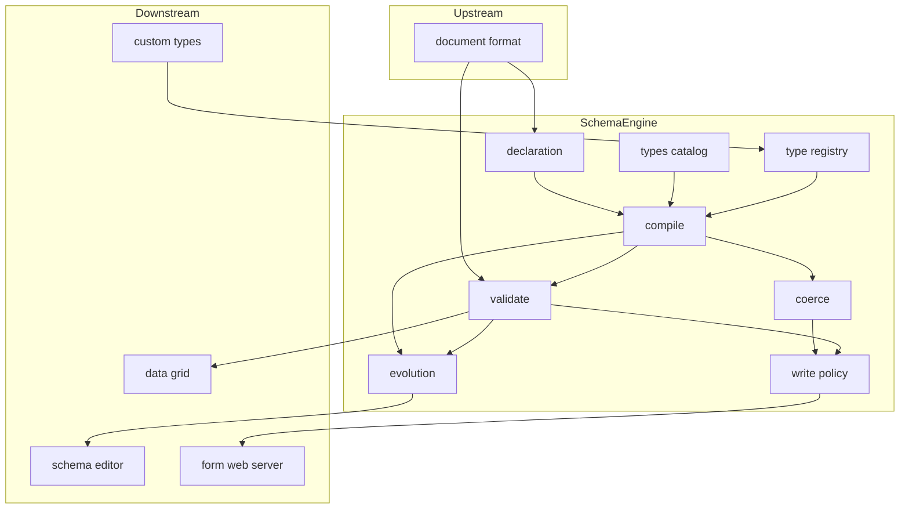
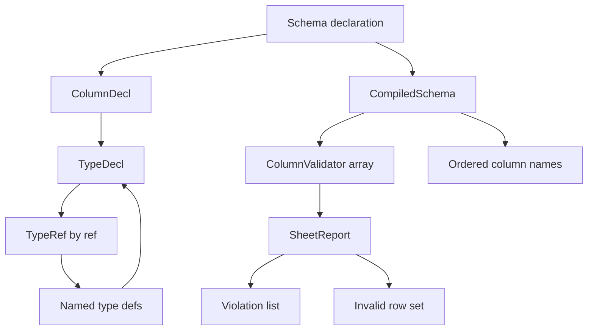
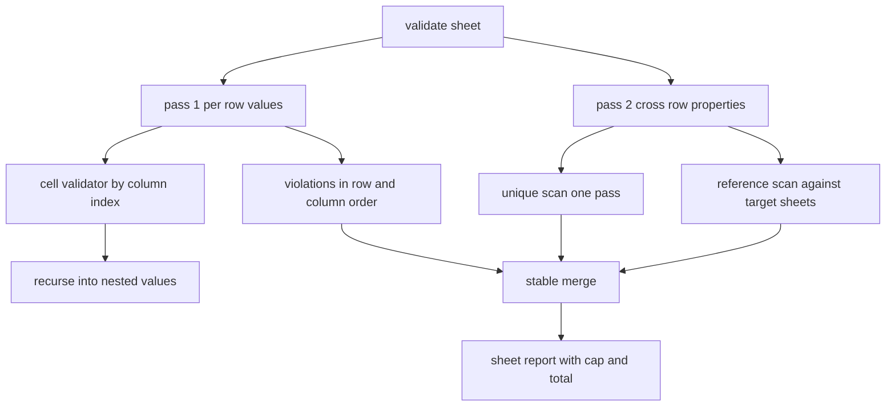
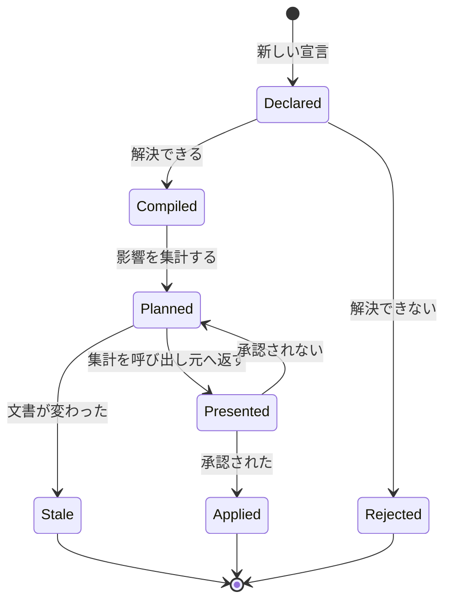
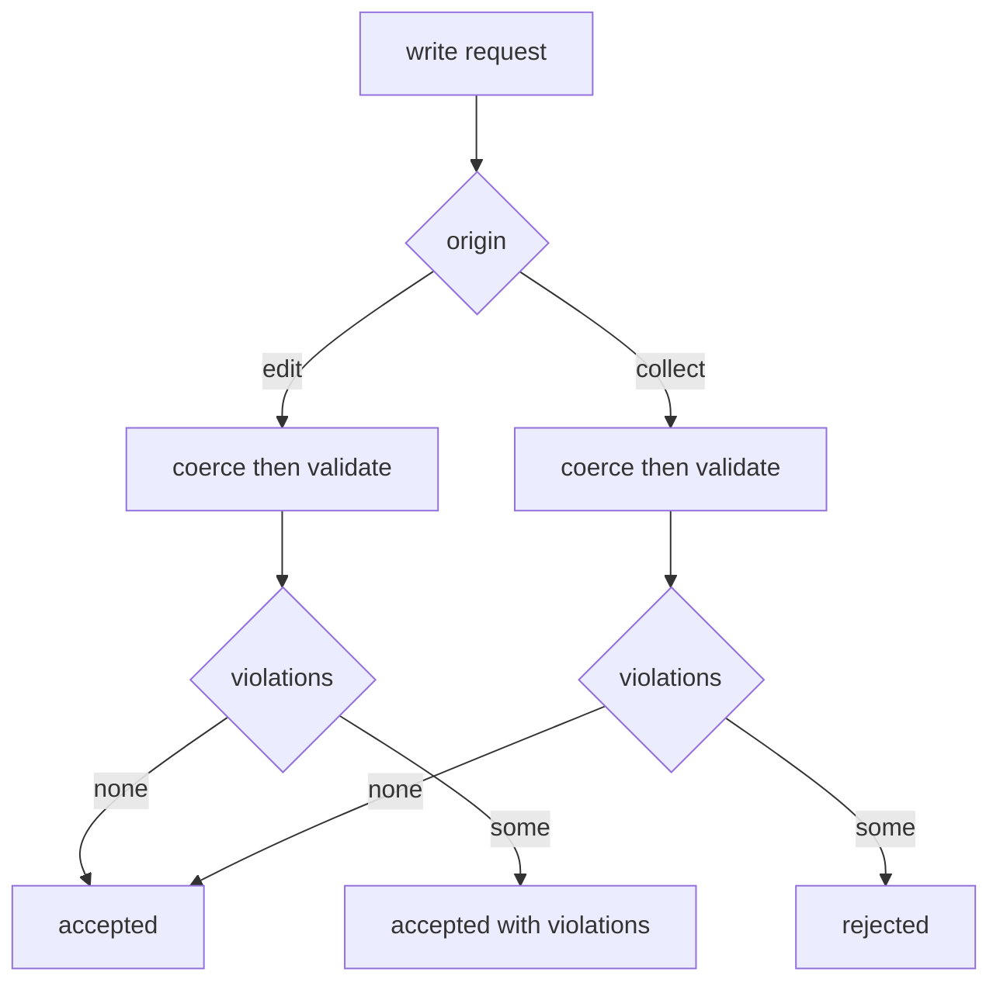

# Technical Design Document

## Overview

**Purpose**: 本機能はシートのスキーマに意味を与える。列がどの型を持つか、どの値が適合するか、適合しない値をどう扱うか、スキーマを変えたとき既存データがどうなるかを決める唯一の場所である。

**Users**: データを型付きの表として育てるエンドユーザーが直接の受益者であり、実装上の利用者はグリッド編集・スキーマ編集 UI・マクロランタイム・フォーム配信・エクスポートの各機能である。これらはすべて本機能が返す判定を通じて型を扱い、独自の型判定を持たない。

**Impact**: ドキュメント形式はスキーマ・ペイロードを不透明なバイト列として保持し、行を列名キーのフラットなオブジェクトとして往復させる。本機能はその不透明部分の中身を定義し、列の集合と並び順をドキュメント形式へ供給する側になる。ドキュメント形式のコードは変更しない。

### Goals

- シートのルートスキーマから、列の集合・並び順・各列の型と制約を一意に決定する
- 10 万行 × 30 列の全件検証を 1 秒以内で完了し、違反を位置と理由つきで報告する
- 違反する値を拒否せず表現できるようにしつつ、収集経路では受け入れないという判定を 1 か所で所有する
- スキーマ変更の影響を適用前に集計し、承認後の適用が集計と一致することを保証する
- ユーザー定義型の拡張点を、組込型と同一の一括経路の上に定義する

### Non-Goals

- スキーマを編集する画面と、その変更操作の提示（`schema-editor` が所有）
- セルの表示書式とセルエディタの選択（`data-grid` が所有）
- 数式・計算列・再計算（`formula-engine` が所有）
- ユーザー定義型の実装そのもの（`custom-types` が所有。本機能は拡張インターフェースのみ）
- スキーマと行データのファイルへの格納・決定的な出力・形式バージョンの移行（`document-format` が所有）
- 検証の実行タイミングの決定（ファイルを開いた直後に走らせるかどうかは呼び出し元が決める）

## Boundary Commitments

### This Spec Owns

- **スキーマ・ペイロードの中身の意味**: `document-format` が不透明として保持する `root` と各型定義 `definition` の内部表現、その文法、その解釈
- **型カタログ**: 組込型の集合と、各型が受け入れる値の範囲（`CellValue` の 8 変種の上への写像）
- **列の集合と並び順**: ルートスキーマから決定し、行データを永続化する呼び出し元へ供給する
- **検証と違反の表現**: 位置（シート・行・列・入れ子の内側）と理由、順序の決定性、件数の上限
- **型強制の規則**: どの入力をどの型へ変換するか、変換しない条件
- **書き込み経路の分類と判定**: 編集経路と収集経路の定義、および経路ごとの受け入れ可否の判定
- **スキーマ変更の影響集計と適用**: 変更の抽出、影響の集計、適用の原子性
- **シート間参照の実在判定**: 参照先の行・シートが存在するかの一括判定
- **型の拡張インターフェース**: 登録・解決・一括経路上での呼び出し規約

### Out of Boundary

- **スキーマ・ペイロードの永続化とエンベロープ**: `{ "root": …, "types": [ … ] }` という外側の形、決定的なバイト出力、未知フィールドの保持は `document-format` が所有する。本機能は `root` と `definition` の**中身**だけを読み書きする
- **`$ref` の構造的な健全性の保証**: 永続化されたスキーマに対する「参照先の型定義が実在するか」の検査は `document-format` が読み込み時に行う。本機能は**未永続のスキーマ宣言**に対して同じ判定をコンパイル時に行う（二重実装ではなく、検査の時点が違う）
- **添付の実在**: 列が添付参照であることは宣言できるが、添付が存在するかは `document-format` が所有する
- **違反の提示**: 違反をどう画面に出すか、どのセルに印を付けるかは呼び出し元が決める
- **収集経路での拒否の実行**: 本機能は「受け入れられない」と判定するのみで、送信を止める処理は `form-web-server` が行う
- **行の追加・削除・並べ替えそのもの**: ドキュメントモデルの操作は `document-format` の公開経路を使う

### Allowed Dependencies

- `document-format`（同一ワークスペースのドメインクレート）— `Document` / `Sheet` / `Row` / `CellValue` / `SchemaPart` / 各識別子型を読み書きに使う
- `serde` / `serde_json` — スキーマ宣言テキストの解析と生成。ただし**汎用 JSON 値型（`serde_json::Value`）を内部表現にしない**（`document-format` の規約に合わせる）
- **`tauri` への依存は禁止**（`structure.md` のドメインクレート規則。CI の検査対象）
- 拡張型の実装（`custom-types`）への依存は**禁止**。依存の向きは `custom-types` → `schema-engine` の一方向

### Revalidation Triggers

以下が変わったら、下流のスペックは結線を確認し直すこと。

- **スキーマ宣言の文法**（型の `kind` の集合、制約キーの名前と意味）— 既存ファイルの読み替えが必要になる
- **`Violation` / `ViolationReason` の形**— `data-grid` の印の表示と `schema-editor` の影響プレビューが直接依存する
- **`CustomType` トレイトのシグネチャ、特に一括メソッド**— `custom-types` の実装が追随する必要がある
- **列の並び順を供給する契約**— `document-format` の行データのキー順が変わり、既存ファイルとのバイト一致が壊れる
- **書き込み経路の分類**（どの経路を編集とし、どれを収集とするか）— `form-web-server` と `macro-runtime` の受け入れ方針が変わる
- **検証の一括経路の形**— 10 万行の性能予算に直結する

## Architecture

### Existing Architecture Analysis

`document-format` は実装済みであり、本機能はその上に**追加のクレートとして載る**。読み替えるべき既存の事実は 4 つである。

| 既存の事実 | 出典 | 本設計への含意 |
|---|---|---|
| スキーマ・ペイロードは不透明。エンベロープ `{ "root": …, "types": [ { "id", "definition" } ] }` と `{"$ref": …}` の**出現**だけが解釈される | `model::SchemaPart` | 宣言の文法は本機能が自由に決めてよいが、**型定義の参照は `$ref` オブジェクトで表さなければならない**（そうしないと参照が構造として追跡されない） |
| 行は**位置づけされた値の列**。`Row::values() -> &[CellValue]` が `Sheet::columns() -> &[String]` と同じ順序で並ぶ | `model::sheet` | 検証はハッシュ探索なしの**添字アクセス**で回せる。これが 1 秒予算の前提になる |
| セル値は閉じた 8 変種。`Decimal` は文字列のまま逐語で往復する | `value::CellValue` | 10 進数の検査は**文字列上の桁勘定**で済み、任意精度演算のライブラリを必要としない |
| 列名の中身に制約はなく、`$` 始まりは書き出し側が二重化して退避する | `parts::rows_codec` | 列名の妥当性（空でない・重複しない）は本機能が決める |

**依存の向き**: `document-format → schema-engine → （data-grid / schema-editor / macro-runtime / export-templates / form-builder）`。逆流は許容しない。`custom-types` は `schema-engine` に依存する側であり、本機能は `custom-types` を知らない。

### Architecture Pattern & Boundary Map

選定パターンは **「宣言（データ）とコンパイル済み計画（実行）の分離」** である。スキーマ宣言はシリアライズ可能な純粋なデータであり、検証・強制はその宣言を一度だけ落とし込んだ計画の上で走る。10 万行の全件検証で宣言を毎行たどることは、この分離がなければ避けられない。



**Architecture Integration**:

- **Selected pattern**: 宣言 → コンパイル → 実行の 3 段。宣言は人間が読めるテキスト、計画は列添字で引ける配列、実行は割り当てを伴わない走査
- **Domain boundaries**: 型の**意味**は `types` が、型の**表記**は `declaration` が、型の**適用**は `compile` 以降が所有する。3 者が混ざると型を 1 つ足すたびに全体に触ることになる
- **Existing patterns preserved**: 層ごとの一方向依存とそれを各 `mod.rs` の冒頭に明記する規約、`thiserror` による文脈のみを載せた誤り型、識別子の newtype、`serde_json::Value` を内部表現にしない規約
- **New components rationale**: `registry` は拡張点の所有者を本機能に固定するために独立させる（`structure.md` の「拡張点は所有者と実装者を分ける」）。`evolution` は `document-format` の `migration`（形式バージョンの移行）と**語が衝突するため別名にした**
- **Steering compliance**: `tauri` に依存しない。10 万行を跨ぐ処理は一括経路として公開し、行ごとに境界を越えさせない。`ts_rs` の導出は行わない（`ipc-contract.md` により `crates/app-shell/src/ipc/` 配下のみ）

### 内部の依存の向き

```
error / types → declaration → registry → compile → { coerce, validate } → write → evolution → api
```

各層の `mod.rs` の冒頭にこの鎖を書き、左の層だけを参照する。`document-format` の `Ids / Value / EntryName → Model → Json → Parts → Container → Api` と同じ規約である。

## File Structure Plan

### Directory Structure

```
crates/schema-engine/
├── Cargo.toml                    # 依存方針コメント + document-format への path 依存
├── benches/
│   └── large_sheet.rs            # 10 万行 x 30 列の全件検証（criterion, harness = false）
├── src/
│   ├── lib.rs                    # 公開面の再輸出と SchemaEngineApi
│   ├── error.rs                  # SchemaError: 宣言を拒否する理由（違反とは別物）
│   ├── types/
│   │   ├── mod.rs                # TypeKind の集合と CellValue 8 変種への写像
│   │   ├── decimal.rs            # 10 進数の文字列上の桁検査と正準化
│   │   ├── datetime.rs           # 日時の厳密な解釈と正準表記
│   │   └── text.rs               # 長さと書式（パターン）の検査
│   ├── declaration/
│   │   ├── mod.rs                # Schema / ColumnDecl / FieldDecl / TypeDecl / Constraints
│   │   └── codec.rs              # 不透明ペイロードの文法の解析と生成（$ref を含む）
│   ├── registry/
│   │   └── mod.rs                # CustomType トレイトと TypeRegistry
│   ├── compile/
│   │   ├── mod.rs                # CompiledSchema。列名と並び順の供給元
│   │   ├── resolve.rs            # $ref の解決と、値が存在しえない循環の検出
│   │   └── plan.rs               # 列添字 → 検証器の配列への落とし込み
│   ├── coerce/
│   │   └── mod.rs                # 安全な変換の規則表と Coercion の記録
│   ├── validate/
│   │   ├── mod.rs                # 一括検証の入口（シート全体 / 列指定）
│   │   ├── cell.rs               # 1 セルの判定（入れ子の再帰を含む）
│   │   ├── unique.rs             # 一意制約の 1 パス判定
│   │   ├── refs.rs               # シート間参照の一括実在判定
│   │   └── report.rs             # Violation / ViolationReason / 上限と総件数
│   ├── write.rs                  # WriteOrigin の分類と経路ごとの判定
│   └── evolution/
│       ├── mod.rs                # スキーマ変更の入口（計画 → 適用）
│       ├── diff.rs               # 旧宣言と新宣言から変更を抽出する
│       ├── impact.rs             # 影響の集計。既存データを変更しない
│       └── apply.rs              # 計画の適用。可謬な処理をここに残さない
└── tests/
    ├── common/mod.rs             # 10 万行の生成など、テストとベンチで共有する道具
    ├── declaration_codec.rs      # 宣言テキストの往復と決定性
    ├── validation.rs             # 違反の位置・理由・順序・上限
    ├── coercion.rs               # 変換する / しないの境目
    ├── evolution.rs              # 影響集計と適用の一致、原子性
    ├── references.rs             # 壊れた参照とシート削除
    └── custom_types.rs           # 拡張型の一括経路と失敗の隔離
```

### コンポーネントとファイルの対応

| Component | File |
|---|---|
| SchemaEngineApi | `src/lib.rs` |
| SchemaError | `src/error.rs` |
| TypeCatalog | `src/types/mod.rs` |
| DecimalDigits | `src/types/decimal.rs` |
| TemporalValue | `src/types/datetime.rs` |
| TextConstraints | `src/types/text.rs` |
| SchemaDeclaration | `src/declaration/mod.rs` |
| DeclarationCodec | `src/declaration/codec.rs` |
| TypeRegistry | `src/registry/mod.rs` |
| SchemaCompiler | `src/compile/mod.rs`, `src/compile/resolve.rs` |
| ColumnValidator | `src/compile/plan.rs` |
| SheetValidator | `src/validate/mod.rs` |
| CellValidator | `src/validate/cell.rs` |
| UniqueScan | `src/validate/unique.rs` |
| ReferenceScan | `src/validate/refs.rs` |
| ViolationReport | `src/validate/report.rs` |
| Coercer | `src/coerce/mod.rs` |
| WritePolicy | `src/write.rs` |
| SchemaEvolution | `src/evolution/mod.rs`, `src/evolution/diff.rs`, `src/evolution/impact.rs`, `src/evolution/apply.rs` |

各ファイルは責務を 1 つだけ持つ。`types/` は「値がその型か」だけを知り、`declaration/` は「それをどう書くか」だけを知り、`validate/` は「どこで違反したか」だけを知る。

### Modified Files

- `Cargo.toml`（ワークスペース根）— `members` に `crates/schema-engine` を追加する。あわせて冒頭の依存方針コメントを是正する: 現在の文面は「ドメインクレートは他のドメインクレートに依存しない」と読めるが、`document-format` は依存グラフの根であり下流はこれに依存してよい（`crates/document-format/Cargo.toml` の注記が正典）
- `.github/workflows/ci.yml` — `bash scripts/check-core-deps.sh schema-engine` の段を足す。この検査器は引数でパッケージ名を取る汎用のもので、現在 `app-shell` にしか掛かっていない
- `scripts/check-bench-budget.sh` — 検証予算（1 秒）の判定を足す。現在の相対パスは `large_document/...` に固定されている
- `.github/workflows/bench.yml` — `paths` フィルタが `crates/document-format/**` のみ、実行が `cargo bench -p document-format` に固定されているため、両方を拡張する

### Technology Stack

| Layer | Choice / Version | Role in Feature | Notes |
|-------|------------------|-----------------|-------|
| ドメイン（上流） | `document-format`（同一ワークスペース、path 依存） | `Document` / `Sheet` / `Row` / `CellValue` / 識別子型 / 不透明スキーマの保持 | 依存グラフの根。本機能は変更しない |
| 宣言の解析 | `serde` 1.0 + `serde_json` 1.0（`float_roundtrip`, `raw_value`） | スキーマ宣言テキストの解析と正準出力 | 既にワークスペースにある。**`serde_json::Value` を内部表現にしない** |
| 誤り型 | `thiserror` 2.0 | `SchemaError` の導出 | 既にワークスペースにある |
| 日時 | `jiff` 0.2（tzdb を同梱する feature を有効にしない） | 日付・civil 日時・オフセット付き瞬時の厳密な解釈と正準表記 | 曖昧な入力・オフセットの矛盾・`Z` 付き日付を**既定で拒否**する。要件 7.3 がそのまま満たせる |
| 書式 | `regex` 1.13 | 文字列列のパターン制約 | **有限オートマトンで線形時間**。後方参照と先読みは非対応で、使うとコンパイル時に落ちる（ReDoS が原理的に起きない） |
| ベンチ | `criterion` 0.8（dev） | 全件検証の予算をゲートにする | `[lib] bench = false` と併記する |

**採らなかったもの**（詳細は `research.md`）:

- **10 進数のライブラリ**（`rust_decimal` / `bigdecimal` / `fastnum`）— 採らない。いずれも出力時に何かを正規化する（先頭の 0、`+`、指数形）ため、`Decimal` が**逐語で往復する**という `document-format` の契約を壊す。桁数の検査と正準化は ASCII の 1 パス走査で足りる。順序比較は宣言された scale に揃えた桁の比較で足りる。任意精度演算が必要になった時点で `rust_decimal` を入れる（precision を 28 桁までに制限することが条件）
- **`rayon`** — 当面採らない。列挙体でディスパッチする検証器なら 1 セルあたり数十 ns 程度であり、300 万セルは単一スレッドで 0.2 秒前後に収まる見込みである。予算を超えたときの手段として残す（`par_chunks` で行の塊に分ける。Tauri の webview と競合しないよう専用のスレッドプールを作ること）
- **JSON Schema の実装**（`jsonschema` / `boon` / `valico`）— 採らない。`jsonschema` は「一度組み立てて何度も使う」形自体は正しいが、本機能は JSON Schema を採用しないため語彙が合わず、`fancy-regex`（後方参照あり）を含む 20 個近い依存を連れてくる。`valico` は無保守
- **`rustc-hash`** — 当面採らない。一意制約の判定は 1 列あたり 10 万件のハッシュで、標準のハッシャでも予算内に収まる

## Data Models

### Domain Model



**不変条件**:

- `CompiledSchema` の `columns` と `validators` は**常に同じ長さで同じ添字**である。`Row::values()` もこの添字で並ぶ
- 違反は**保持されない**。常に宣言と値から導出される。ドキュメントに「不正フラグ」を書き込む場所は作らない
- 宣言が解決できない列（未知の `kind`、未登録の拡張型）はスキーマ全体を破棄させない。その列だけが**使用不能**になる

### スキーマ宣言の文法（本機能が所有する。`document-format` から見れば不透明）

ルートスキーマ（`root` の中身）:

```json
{
  "columns": [
    { "name": "品番", "type": { "kind": "text", "maxLength": 32 }, "required": true, "unique": true },
    { "name": "数量", "type": { "kind": "int", "min": 0 }, "default": 0 },
    { "name": "単価", "type": { "kind": "decimal", "precision": 12, "scale": 2 } },
    { "name": "納品日", "type": { "kind": "date" } },
    { "name": "仕入先", "type": { "kind": "ref", "sheet": "01K4ANRRG004HMASW9NF6YY091" } },
    { "name": "属性", "type": { "$ref": "01K4ANRRG004HMASW9NF6YY092" } },
    { "name": "備考", "type": { "kind": "any" } }
  ]
}
```

名前付き型定義（各 `definition` の中身）:

```json
{ "kind": "object", "fields": [ { "name": "色", "type": { "kind": "enum", "choices": ["赤", "青"] }, "required": true } ] }
```

**文法の規則**:

- 型は**常にオブジェクト**であり、`kind` を持つか `$ref` を持つかのいずれかである。両方を持つ、またはどちらも持たないものは宣言の誤りとする
- 型定義への参照は必ず `{"$ref": "<TypeDefId>"}` と書く。これは `document-format` が**構造として追跡できる唯一の形**であり、他の書き方をすると参照が追跡対象から外れる
- 値の制約（範囲・長さ・書式・桁・選択肢）は**型の側**に、存在と同一性の制約（`required` / `unique` / `default`）は**列およびフィールドの側**に置く。「どんな値が正しいか」と「その列が何を要求するか」を混ぜない
- `default` は**セル値と同一の wire 形**で書く（`document-format` の `value` が定める形。`{"$t":"text","v":"…"}` の脱出口を含む）。既定値の表現をもう 1 つ作らない
- 本機能が出力するテキストは**キーを宣言順に固定**し（`name` → `type` → `required` → `unique` → `default` → `description`）、余分な空白を含めない。`document-format` はこのペイロードを**逐語のバイト列として保持する**ため、正準形の責任は本機能にある（要件 1.4）。エンベロープ側のキー整列規則とは意図的に別であり、差分の読みやすさを優先している

### 組込型カタログと `CellValue` への写像

| `kind` | 受け入れる `CellValue` | パラメータ |
|---|---|---|
| `int` | `Int` | `min`, `max` |
| `float` | `Float` | `min`, `max` |
| `decimal` | `Decimal` | `precision`, `scale`, `min`, `max` |
| `text` | `Text` | `minLength`, `maxLength`, `pattern` |
| `bool` | `Bool` | — |
| `date` | `Text`（`YYYY-MM-DD`） | `min`, `max` |
| `datetime` | `Text`（civil またはオフセット付き） | `offset`（`forbidden` / `required`）, `min`, `max` |
| `enum` | `Text` | `choices` |
| `ref` | `Text`（行識別子） | `sheet` |
| `attachment` | `Attachment` | — |
| `object` | `Nested`（オブジェクト） | `fields` |
| `array` | `Nested`（配列） | `items`, `minItems`, `maxItems` |
| `any` | 8 変種すべて | — |
| `custom` | 拡張型の実装が決める | `type`（拡張型の識別子）とその任意のパラメータ |

`Null` はどの型でも「値なし」を表し、受理されるかは列の `required` が決める（型の側では決めない）。

**タイムゾーンの扱いは 2 値に限る**。IANA のタイムゾーン注釈付きの値（`jiff` の `Zoned`）は初版では扱わない。扱うにはタイムゾーンデータベースを実行ファイルへ同梱することになり、単一実行ファイルのサイズに直接効くためである。`offset: "required"` のオフセット付き瞬時があれば、台帳用途の要求は満たせる。

### 検証結果の表現

```rust
pub struct SheetReport {
    sheet: SheetId,
    violations: Vec<Violation>,   // 上限まで
    total_violations: usize,      // 上限を超えても数え続けた総数
    invalid_rows: Vec<RowId>,     // 行の並び順で昇順。違反のある行だけ
}

pub struct Violation {
    row: Option<RowId>,           // 列そのものの問題では None
    column: ColumnIndex,
    column_name: Box<str>,
    path: ValuePath,              // 入れ子の内側の位置。空ならセル直下
    reason: ViolationReason,
}
```

`ValuePath` は `Field(Box<str>)` と `Index(usize)` の並びである。`ViolationReason` は文脈のみを持つ列挙体であり、表示用の文字列を含まない（`document-format` の `DocumentError` と同じ規約）。

**順序の決定性**（要件 5.5）: 値の違反は行の並び順 → 列添字 → `path` の順で出る。一意制約の違反は全行を走査したあとに出るため、最後に同じ基準で**安定併合**する。この 2 段で入力が同じなら出力の並びが常に一致する。

**上限の存在理由**（要件 5.6）: 10 万行 × 30 列がすべて違反しうる。`ViolationReason` は実際の値を複製して持つため、上限がなければ報告そのものが予算と記憶域を食う。総数だけは上限を超えても数え続ける。

## Components and Interfaces

| Component | Domain/Layer | Intent | Req Coverage | Key Dependencies (P0/P1) | Contracts |
|-----------|--------------|--------|--------------|--------------------------|-----------|
| SchemaEngineApi | Public API | 公開面。コンパイル / 検証 / 書き込み判定 / 変更 | 1.2, 4.3, 5.7, 10.4 | SchemaCompiler (P0), SheetValidator (P0) | Service |
| SchemaDeclaration | Declaration | 宣言のデータ構造（列・フィールド・型・制約） | 1.3, 3.1, 3.2, 3.3, 4.1, 4.2, 4.5, 4.6 | — | State |
| DeclarationCodec | Declaration | 宣言テキストの解析と正準出力 | 1.4, 1.5, 1.6, 1.7, 4.8 | SchemaDeclaration (P0), serde_json (P0 External) | Service |
| TypeCatalog | Types | 組込型の集合と `CellValue` への写像 | 2.1, 2.2, 2.5, 2.7, 9.1 | CellValue (P0) | Service |
| DecimalDigits | Types | 10 進数の桁検査・正準化・順序 | 2.3 | — | Service |
| TemporalValue | Types | 日時の厳密な解釈と正準表記 | 2.4, 7.3 | jiff (P0 External) | Service |
| TextConstraints | Types | 長さと書式の検査 | 4.5 | regex (P0 External) | Service |
| TypeRegistry | Registry | 拡張型の登録・解決・呼び出し規約 | 11.1, 11.2, 11.3, 11.4, 11.6 | TypeCatalog (P1) | Service, State |
| SchemaCompiler | Compile | 宣言 → 列添字で引ける計画。列名と並び順の供給元 | 1.1, 1.2, 1.8, 3.5, 3.6, 4.8, 10.5, 11.7 | SchemaDeclaration (P0), TypeRegistry (P0) | Service, State |
| ColumnValidator | Compile | 列 1 本分の検証器。閉じた列挙体 | 2.7, 10.1, 10.6 | TypeCatalog (P0) | State |
| SheetValidator | Validate | シート全体 / 列指定の一括検証 | 5.4, 5.7, 10.1, 10.2, 10.3, 10.4, 10.5, 10.6 | ColumnValidator (P0), UniqueScan (P0), ReferenceScan (P0) | Service, Batch |
| CellValidator | Validate | 1 セルの判定と入れ子の再帰 | 2.6, 3.4, 4.3, 4.4, 11.5 | ColumnValidator (P0) | Service |
| UniqueScan | Validate | 一意制約の 1 パス判定 | 4.6, 4.7 | — | Service |
| ReferenceScan | Validate | シート間参照の一括実在判定 | 9.2, 9.3, 9.4, 9.5, 9.6 | Document (P0) | Service, Batch |
| ViolationReport | Validate | 違反の表現・順序・上限 | 5.1, 5.2, 5.3, 5.5, 5.6 | — | State |
| Coercer | Coerce | 安全な変換の規則表 | 7.1, 7.2, 7.4, 7.5, 7.6 | TypeCatalog (P0), TemporalValue (P0) | Service |
| WritePolicy | Write | 経路の分類と経路ごとの受け入れ判定 | 6.1, 6.2, 6.3, 6.4, 6.5, 6.6 | Coercer (P0), CellValidator (P0) | Service |
| SchemaEvolution | Evolution | 変更の抽出・影響集計・原子的な適用 | 8.1, 8.2, 8.3, 8.4, 8.5, 8.6, 8.7, 8.8 | SchemaCompiler (P0), Coercer (P0) | Service, Batch |
| SchemaError | Cross-cutting | 宣言を拒否する理由。違反とは別の型 | 1.5, 1.6, 1.7, 3.5, 3.6, 4.8, 11.4 | thiserror (P0 External) | State |

**「誤り」と「違反」を型で分ける**のが本設計の一貫した方針である。`SchemaError` は**宣言が壊れている**ことを表し、コンパイルを失敗させる。`Violation` は**値が宣言に合わない**ことを表し、処理を止めない。この 2 つを 1 つの型にすると、「1 件の不正な値でシート全体が開けない」という振る舞いが型の上で表現できてしまう。

### Public API Layer

#### SchemaEngineApi

| Field | Detail |
|-------|--------|
| Intent | 本クレートの唯一の入口。他クレートは下位モジュールを直接触らない |
| Requirements | 1.2, 4.3, 5.7, 10.4 |

**Responsibilities & Constraints**
- コンパイル済みスキーマの生成と、その上での検証・書き込み判定・変更の提供
- **検証を走らせる時機は決めない**。「ファイルを開いたとき」の引き金は呼び出し元が持つ（要件 5.7 は、その操作が存在し予算内で終わることを保証する）
- 状態を持たない。`CompiledSchema` と `TypeRegistry` は呼び出し元が保持する

**Dependencies**
- Inbound: `data-grid` / `schema-editor` / `macro-runtime` / `form-web-server` / `export-templates` — 型の判定 (P0)
- Outbound: SchemaCompiler — 計画の生成 (P0); SheetValidator — 一括検証 (P0)
- External: `document-format` — モデルと値 (P0)

**Contracts**: Service [x]

##### Service Interface

```rust
pub trait SchemaEngineApi {
    /// シートのルートスキーマと型定義を解決し、列添字で引ける計画へ落とす。
    fn compile(&self, sheet: &Sheet, registry: &TypeRegistry)
        -> Result<CompiledSchema, SchemaError>;

    /// 行データを永続化する呼び出し元へ渡す列名（並び順そのもの）。
    fn columns<'a>(&self, schema: &'a CompiledSchema) -> &'a [String];

    /// シート全体の一括検証。行ごとの呼び出しを要しない。
    fn validate_sheet(
        &self, doc: &Document, sheet: SheetId,
        schema: &CompiledSchema, options: &ValidationOptions,
    ) -> SheetReport;

    /// 指定した列だけの再検証（スキーマの一部変更後に使う）。
    fn validate_columns(
        &self, doc: &Document, sheet: SheetId, schema: &CompiledSchema,
        columns: &[ColumnIndex], options: &ValidationOptions,
    ) -> SheetReport;

    /// 1 行分の書き込みに対する経路ごとの判定。強制も含む。
    fn validate_write(
        &self, origin: WriteOrigin, schema: &CompiledSchema, values: Vec<CellValue>,
    ) -> WriteVerdict;

    /// 行を追加するときの初期値の列。既定値が宣言されていない列は値なしになる。
    /// 行の追加そのものは `document-format` の経路で行い、本関数は値だけを供給する（要件 4.3）。
    fn default_row(&self, schema: &CompiledSchema) -> Vec<CellValue>;

    /// スキーマ変更の影響を集計する。ドキュメントは変更しない。
    fn plan_change(
        &self, doc: &Document, sheet: SheetId,
        to: &SchemaDeclaration, registry: &TypeRegistry,
    ) -> Result<ChangePlan, SchemaError>;

    /// 計画を適用する。可謬な処理は計画側に済ませてある。
    fn apply_change(&self, doc: &mut Document, plan: ChangePlan)
        -> Result<AppliedChange, StalePlan>;
}
```

- Preconditions: `schema` は同じ `sheet` から `compile` したものであること
- Postconditions: `validate_*` はドキュメントを変更しない。`plan_change` もドキュメントを変更しない
- Invariants: 同じ入力に対して `SheetReport` の違反集合と順序が常に一致する

### Compile Layer

#### SchemaCompiler

| Field | Detail |
|-------|--------|
| Intent | 宣言を一度だけ解決し、以後の実行から宣言の走査を排除する |
| Requirements | 1.1, 1.2, 1.8, 3.5, 3.6, 4.8, 10.5, 11.7 |

**Responsibilities & Constraints**
- 列の集合と**並び順の決定**（要件 1.1）と、その供給（要件 1.2）。並び順は宣言の `columns` 配列の順そのものである
- `$ref` の解決（要件 3.5）と、**値が有限の大きさで存在しえない循環**の検出（要件 3.6）。必須かつ非配列の自己参照だけが該当し、`required: false` や配列を経由する再帰は正当な宣言として通す
- 列を 1 本も宣言していないルートスキーマを、列 0 本のシートとして受理する（要件 1.8。新規シートの初期状態がこれにあたる）
- 解決できない型を**列単位の使用不能**に落とす（要件 11.7）
- **既定値の適合検査のうち、型が解決されて初めて判定できる分を受け持つ**（要件 4.8）。層の鎖は `declaration → registry → compile` であり、`DeclarationCodec` は型定義参照の先も拡張型も見られない。組込種別が直接書かれた列の既定値は `DeclarationCodec` が、識別子参照の先と拡張型の既定値は本コンポーネントが検査する

**解決できない型の扱い**（本設計の一般化）

| 事象 | 扱い | 理由 |
|---|---|---|
| `$ref` の参照先が実在しない | **宣言ごと拒否**（`SchemaError`） | 宣言が構造的に壊れている。`document-format` も読み込み時に同じ判定を行う（要件 3.5） |
| 値が存在しえない循環参照 | **宣言ごと拒否**（`SchemaError`） | 同上（要件 3.6） |
| 未知の `kind` | **その列だけ使用不能** | 将来の版が足した型を古い版が読んだ場合であり、他の列は正しく読める |
| 拡張型が未登録 | **その列だけ使用不能** | 登録されれば解決しうる。スキーマを破棄しない（要件 11.7） |

使用不能な列の値はすべて `ViolationReason::UnusableColumn` になり、シートは開ける。

**Dependencies**
- Inbound: SchemaEngineApi (P0)
- Outbound: DeclarationCodec — 宣言の取り出し (P0); TypeRegistry — 拡張型の解決 (P0)

**Contracts**: Service [x] / State [x]

##### State Management
- `CompiledSchema` は不変。スキーマが変われば作り直す
- 保持するもの: 列名の配列、同じ添字の検証器の配列、一意制約を持つ列の添字、参照列と参照先シートの組、使用不能な列の一覧
- `regex` は**コンパイル時に一度だけ**構築する。パターンの生文字列長・`size_limit`・`nest_limit` に上限を設け、超えるものは宣言の誤りとする（利用者が書いたパターンで実行時間が跳ねないようにする）

#### ColumnValidator

| Field | Detail |
|-------|--------|
| Intent | 列 1 本分の判定を、分岐予測の効く閉じた列挙体として持つ |
| Requirements | 2.7, 10.1, 10.6 |

**Responsibilities & Constraints**
- **`Box<dyn Fn>` を使わない。**列挙体の直接マッチにする。10 万行 × 30 列の走査では、動的ディスパッチは実測で数倍の差になる形である
- 拡張型だけは実装を保持する必要があるため `Custom { imp: Arc<dyn CustomType> }` の 1 変種に閉じ込める。**一括メソッドがあるため、行ごとの動的ディスパッチにはならない**（要件 10.6, 11.6）
- 検証器はパラメータを**インラインで**持つ（範囲・桁・選択肢・コンパイル済みパターン）。走査中に間接参照を増やさない

**Implementation Notes**
- Integration: `Row::values()` と同じ添字で並ぶため、検証は `zip` の 1 走査になる
- Validation: 値の実際の変種と検証器の種類が食い違ったら `TypeMismatch`。これが最も多い経路なので最初に判定する
- Risks: 型を 1 つ足すたびに列挙体が伸びる。拡張型の経路があるため、業務固有の型でこれを伸ばす必要はない

### Validate Layer

#### SheetValidator

| Field | Detail |
|-------|--------|
| Intent | 10 万行を 1 回の呼び出しで検証し、予算内に収める |
| Requirements | 5.4, 5.7, 10.1, 10.2, 10.3, 10.4, 10.5, 10.6 |

**Responsibilities & Constraints**
- **一括経路であること**（要件 10.4、`structure.md` の「性能はドメイン側で守る」）。行ごとに境界を越える API を公開しない
- 走査は 2 段。第 1 段が行ごとの値の判定（`CellValidator`）、第 2 段が跨る性質の判定（`UniqueScan` と `ReferenceScan`）。最後に安定併合して順序を決める
- 列指定の再検証を提供する（要件 10.5）。スキーマの一部が変わったときに全列を舐め直さない

**行を跨ぐ性質は一括経路にだけ置く**（本設計の一般化）

一意性と参照の実在は、1 セルだけを見ても判定できない。したがって:

- `validate_write`（1 行の書き込み）は**値それ自体に閉じた性質**（型・範囲・長さ・書式・桁・必須・入れ子）だけを判定する
- 一意性（要件 4.7）と参照の実在（要件 9.2）は `validate_sheet` / `validate_columns` で判定する。編集直後に重複を知りたい呼び出し元は、その列だけを `validate_columns` で舐め直す（1 列 10 万件で 10 ミリ秒程度）

この線引きにより、書き込みのたびに 10 万行分の索引を持ち回る必要がなくなる。要件 10.2 の 16 ミリ秒も、これがあって初めて素直に満たせる。

**Dependencies**
- Inbound: SchemaEngineApi (P0)
- Outbound: CellValidator (P0), UniqueScan (P0), ReferenceScan (P0), ViolationReport (P0)

**Contracts**: Service [x] / Batch [x]

##### Batch Contract
- Trigger: 呼び出し元が決める（ファイルを開いた直後、スキーマ変更後、マクロの一括書き込み後）
- Input: `&Document` + `SheetId` + `&CompiledSchema` + `&ValidationOptions`（違反の上限）
- Output: `SheetReport`（上限までの違反、総件数、違反のある行の一覧）
- Idempotency & recovery: 読み取り専用。何度呼んでも同じ結果になる

### Write Layer

#### WritePolicy

| Field | Detail |
|-------|--------|
| Intent | 経路ごとの受け入れ方針を 1 か所に固定する |
| Requirements | 6.1, 6.2, 6.3, 6.4, 6.5, 6.6 |

**Responsibilities & Constraints**
- 経路の分類を**本機能が所有する**（要件 6.3）。画面上の入力とマクロからの書き込みが編集経路、フォームからの送信が収集経路である
- 編集経路では違反を報告したうえで**保持できる値を返す**（要件 6.1）。収集経路では受け入れられないという判定を返す（要件 6.2）
- **拒否の実行はしない。**送信を止めるのは `form-web-server` の仕事である

**違反する値をどこに置くか**（本設計の要）

違反する値のための特別な格納先は作らない。`CellValue` の 8 変種は任意の入力を表現でき、`document-format` はそれを逐語で往復させる。数値列に打たれた `"abc"` は `Text("abc")` として保存され、読み戻され、検証のたびに違反として報告される（要件 6.6）。**違反は保持されず、常に導出される**。この決定により、保存を妨げない（要件 6.5）ことと、違反の位置をいつでも取得できる（要件 6.4）ことが同じ仕組みで成立する。

##### Service Interface

```rust
pub enum WriteOrigin {
    /// 画面上の入力とマクロからの書き込み。
    Edit,
    /// フォームからの送信。
    Collect,
}

pub enum WriteVerdict {
    /// 全値が適合した。`values` には強制後の値が入る。
    Accepted { values: Vec<CellValue>, coercions: Vec<Coercion> },
    /// 編集経路。違反はあるが保持できる値を返す。
    AcceptedWithViolations {
        values: Vec<CellValue>, coercions: Vec<Coercion>, violations: Vec<Violation>,
    },
    /// 収集経路。受け入れられない。
    Rejected { violations: Vec<Violation> },
}
```

- Preconditions: `values` の長さが `CompiledSchema` の列数と一致すること
- Postconditions: `Edit` は決して `Rejected` を返さない。`Collect` は決して `AcceptedWithViolations` を返さない
- Invariants: `values` の長さは入力と出力で変わらない

### Coerce Layer

#### Coercer

| Field | Detail |
|-------|--------|
| Intent | 情報が失われない変換だけを、環境に依らず行う |
| Requirements | 7.1, 7.2, 7.4, 7.5, 7.6 |

**変換の規則表**（要件 7.5 が求める一意な規則）

| 入力の変種 | 列の型 | 変換 | 根拠 |
|---|---|---|---|
| `Text` | `int` | 10 進整数の文法に厳密一致すれば `Int` | 一意に解釈できる（要件 7.1） |
| `Text` | `float` | 10 進小数の文法に厳密一致すれば `Float` | 同上 |
| `Text` | `decimal` | 文法に一致し、桁が `precision` / `scale` に収まれば `Decimal`（**文字列は逐語のまま**） | 同上 |
| `Text` | `bool` | `true` / `false` のみ | 同上。`1` / `0` / `はい` は解釈しない |
| `Text` | `date` / `datetime` | 正準表記に厳密一致すればそのまま | 書式の推測をしない（要件 7.3） |
| `Int` | `float` | 値が `f64` で厳密に表せる範囲なら `Float` | 範囲外は情報が失われる（要件 7.2） |
| `Int` | `decimal` | `scale` に収まれば `Decimal` | 桁が足りなければ失われる |
| `Float` | `decimal` | **変換しない** | 2 進小数を 10 進へ移す時点で桁が決まらない |
| `Float` | `int` | **変換しない** | 小数部の切り捨ては情報が失われる |
| `Decimal` | `int` / `float` | **変換しない** | 同上 |
| 任意 | `any` | 変換しない（要件 2.6） | `any` は解釈しない |
| 任意 | `custom` | 拡張型の実装に委ねる | 規則は実装が持つ |

**変換しないもの**: 地域設定や実行環境で結果が変わる解釈（桁区切りのある数値、`2026/09/12` のような書式、曜日名、和暦、タイムゾーン名の略号）はすべて違反とする（要件 7.3）。`jiff` は既定でこれらを拒否するため、規則の実装と道具の既定が一致している。

##### Service Interface

```rust
pub enum Coercion {
    /// 変換していない。
    Unchanged,
    /// 変換した。変換前の値を持つ（要件 7.4）。
    Converted { from: CellValue },
}
```

### Evolution Layer

#### SchemaEvolution

| Field | Detail |
|-------|--------|
| Intent | 変更の代償を適用前に見せ、適用は必ず提示どおりにする |
| Requirements | 8.1, 8.2, 8.3, 8.4, 8.5, 8.6, 8.7, 8.8 |

**Responsibilities & Constraints**
- `document-format` の `migration`（形式バージョンの移行）とは**別物**である。名前の衝突を避けるため本層は `evolution` と呼ぶ
- 扱う変更は列の追加・削除・改名・型の変更・制約の変更（要件 8.1）。**改名は削除と追加の組ではない**。改名として抽出できたときは既存の値を運ぶ（要件 8.7）
- 列の追加では既存の全行に既定値を、既定値がなければ値なしを与える（要件 8.8）。これは `document-format` の「1 シート内の全行は同一のキー列」という不変条件を保つためにも必要である

**原子性の作り方**（要件 8.6）

可謬な処理を**すべて計画側に寄せる**。`plan_change` が新しい列名の配列と全行分の新しい値を計算しきり、`apply_change` は計算済みの値を書き戻すだけにする。書き戻しに使う `document-format` の経路は未知のシート・行でのみ失敗するため、計画時に識別子を確かめておけば適用は失敗しえない。「途中で失敗して半端に適用された状態」が構造上作れなくなる。

**計画の陳腐化**（要件 8.5 を守るための追加の判定）

集計と適用の間にドキュメントが変われば、適用結果は提示と一致しない。`ChangePlan` は作成時のシートの**行識別子の並びと列名のダイジェスト**を持ち、適用時に照合する。食い違えば `StalePlan` を返して何も変更しない。

##### Service Interface

```rust
pub struct ChangeImpact {
    /// 変換される行数。
    pub converted_rows: usize,
    /// 違反になる行数。
    pub violating_rows: usize,
    /// 値が失われる行数。
    pub losing_rows: usize,
    /// 値が失われる位置（要件 8.3）。
    pub losses: Vec<ValueLoss>,
}

pub struct ValueLoss { pub row: RowId, pub column: Box<str> }
```

- Preconditions: `to` は解決可能な宣言であること（解決できなければ `SchemaError`）
- Postconditions: `plan_change` はドキュメントを変更しない（要件 8.4）
- Invariants: 同じ計画を適用した結果は、計画が返した `ChangeImpact` と一致する（要件 8.5）

### Registry Layer

#### TypeRegistry

| Field | Detail |
|-------|--------|
| Intent | 拡張点の所有権を本機能に固定し、組込型と同じ一括経路に載せる |
| Requirements | 11.1, 11.2, 11.3, 11.4, 11.6 |

**Responsibilities & Constraints**
- 識別子の重複を登録時に拒否する（要件 11.4）
- 拡張型の失敗を**その値の違反に閉じ込め**、シート全体の検証を止めない（要件 11.5）
- 組込型と同一の違反の形で報告する（要件 11.3）。`ViolationReason::CustomRejected` は理由の文字列を運ぶだけで、別系統の報告経路を作らない

**一括の継ぎ目**（`roadmap.md` が「両者で整合させること」と名指ししている箇所）

拡張型の実装は `custom-types` にあり、その実体は JS である。10 万行でセルごとに JS 境界を越えると予算に収まらない。そこで**トレイトに一括メソッドを置き、既定実装を単純な繰り返しにする**。実装側は 1 列分をまとめて渡す形に上書きでき、境界を越える回数が列ごとに 1 回で済む。この既定実装があるため、単純な拡張型は 1 件用のメソッドだけ書けばよい。

##### Service Interface

```rust
pub trait CustomType: Send + Sync {
    fn id(&self) -> &CustomTypeId;

    /// 1 件の判定。
    fn validate(&self, value: &CellValue) -> Result<CustomVerdict, CustomTypeFailure>;

    /// 1 列分の一括判定。既定実装は `validate` の繰り返し。
    /// 境界を越える実装はこれを上書きし、呼び出しを 1 回にまとめる。
    fn validate_batch(
        &self, values: &[CellValue], out: &mut dyn FnMut(usize, CustomVerdict),
    ) -> Result<(), CustomTypeFailure> {
        for (i, v) in values.iter().enumerate() { out(i, self.validate(v)?); }
        Ok(())
    }

    /// 一意制約の比較に使う正準形。既定は値そのもの。
    fn canonicalize(&self, value: &CellValue) -> Result<CellValue, CustomTypeFailure> {
        Ok(value.clone())
    }
}
```

- Preconditions: 実装は panic しないこと。応答しない可能性のある実装（JS 呼び出しなど）は**実装側で打ち切って `Err` を返す**
- Postconditions: `Err` はその値の違反になり、走査は次の値へ進む（要件 11.5）
- Invariants: `validate_batch` の既定実装と上書き実装は同じ結果を返さなければならない

## System Flows

### 一括検証の 2 段構成



第 1 段は列添字で引いた検証器を値に当てるだけで、割り当てを行わない。第 2 段だけが行を跨ぐ索引を作る。併合が安定であることが、順序の決定性（要件 5.5）の根拠である。

### スキーマ変更の流れ



`Planned` から `Applied` までの間、ドキュメントは一切変更されない（要件 8.4）。可謬な処理は `Planned` までに終わっているため、`Applied` への遷移は失敗しない（要件 8.6）。

### 書き込み経路の判定



強制と検証の順序は両経路で同じである。違うのは違反があったときの扱いだけであり、この分岐が要件 6 の全体を担う。

## Requirements Traceability

| Requirement | Summary | Components | Interfaces | Flows |
|-------------|---------|------------|------------|-------|
| 1.1, 1.2 | 列の集合と並び順を決め、永続化する呼び出し元へ供給する | SchemaCompiler, SchemaEngineApi | `compile`, `columns` | — |
| 1.3 | 名前・型・説明を宣言できる | SchemaDeclaration | `ColumnDecl` | — |
| 1.4 | 同一内容が同一テキストになる | DeclarationCodec | 正準出力の規則 | — |
| 1.5, 1.6, 1.7 | 列名の重複・空・解釈不能を宣言ごと拒否する | DeclarationCodec, SchemaError | `SchemaError` | — |
| 1.8 | 列 0 本のルートスキーマを受理する | SchemaCompiler | `compile` | — |
| 2.1, 2.2 | 組込型の集合と受け入れ範囲を定める | TypeCatalog | 型カタログ表 | — |
| 2.3 | 10 進数の有効桁数と小数点以下の桁数 | DecimalDigits | 桁検査 | — |
| 2.4 | 日時の時刻の有無とタイムゾーンの扱い | TemporalValue | `offset` の 2 値 | — |
| 2.5, 2.6 | ANY はすべてを受理し、強制しない | TypeCatalog, Coercer | 変換の規則表 | 書き込み経路の判定 |
| 2.7 | 適合または違反のいずれかを返す | ColumnValidator, TypeCatalog | `ColumnValidator` | 一括検証 |
| 3.1, 3.2 | 入れ子の宣言と、その内側の型・制約 | SchemaDeclaration | `TypeDecl` | — |
| 3.3 | 名前付き型定義と識別子による参照 | SchemaDeclaration, DeclarationCodec | `$ref` | — |
| 3.4 | 入れ子の内側の位置を特定して報告する | CellValidator, ViolationReport | `ValuePath` | 一括検証 |
| 3.5, 3.6 | 実在しない参照と、値が存在しえない循環を拒否する | SchemaCompiler, SchemaError | `resolve` | — |
| 4.1, 4.2 | 値なしの可否と既定値を宣言できる | SchemaDeclaration | `ColumnDecl` | — |
| 4.3 | 与えられていない列に既定値を適用する | SchemaEngineApi, SchemaEvolution | `default_row`, `apply_change` | スキーマ変更 |
| 4.4 | 必須の列の値なしを違反として報告する | CellValidator | `ViolationReason` | 一括検証 |
| 4.5 | 範囲・長さ・書式・選択肢を宣言できる | SchemaDeclaration, TextConstraints, DecimalDigits | 制約の宣言 | — |
| 4.6, 4.7 | 一意制約と、重複する全行の報告 | UniqueScan | `UniqueScan` | 一括検証 |
| 4.8 | 型や制約に適合しない既定値を宣言ごと拒否する | DeclarationCodec, SchemaCompiler, SchemaError | `SchemaError` | — |
| 5.1, 5.2 | 位置と理由、期待と実際 | ViolationReport | `Violation` | — |
| 5.3 | 行内の違反を打ち切らない | CellValidator | `validate_row` | 一括検証 |
| 5.4 | 違反のある行とない行を区別する | SheetValidator, ViolationReport | `SheetReport` | 一括検証 |
| 5.5 | 違反集合と順序の決定性 | SheetValidator, ViolationReport | 安定併合 | 一括検証 |
| 5.6 | 上限までの違反と総件数 | ViolationReport | `ValidationOptions` | 一括検証 |
| 5.7 | 開いたときに全行の結果が取得できる | SchemaEngineApi, SheetValidator | `validate_sheet` | 一括検証 |
| 6.1 | 編集経路は保持を妨げない | WritePolicy | `WriteVerdict` | 書き込み経路の判定 |
| 6.2 | 収集経路は受け入れられないと判定する | WritePolicy | `WriteVerdict` | 書き込み経路の判定 |
| 6.3 | 経路の分類を所有する | WritePolicy | `WriteOrigin` | 書き込み経路の判定 |
| 6.4 | 違反の位置と理由をいつでも取得できる | WritePolicy, SheetValidator | `validate_sheet` | 一括検証 |
| 6.5 | 違反があっても保存を妨げない | WritePolicy | 違反を保持しない設計 | — |
| 6.6 | 違反する値が保存と再読込で保たれる | WritePolicy | `CellValue` の逐語往復 | — |
| 7.1 | 一意に解釈できる入力を変換する | Coercer | 変換の規則表 | 書き込み経路の判定 |
| 7.2 | 情報が失われる変換は違反にする | Coercer | 変換の規則表 | 書き込み経路の判定 |
| 7.3 | 環境で変わる解釈は行わない | Coercer, TemporalValue | `jiff` の既定 | — |
| 7.4 | 変換したことと変換前の値を返す | Coercer | `Coercion` | 書き込み経路の判定 |
| 7.5, 7.6 | 規則が一意で、結果が決定的である | Coercer | 変換の規則表 | — |
| 8.1 | 追加・削除・改名・型変更・制約変更を扱う | SchemaEvolution | `diff` | スキーマ変更 |
| 8.2, 8.3 | 影響の集計と、値が失われる位置 | SchemaEvolution | `ChangeImpact` | スキーマ変更 |
| 8.4 | 承認前は既存データを変更しない | SchemaEvolution | `plan_change` | スキーマ変更 |
| 8.5 | 適用結果が集計と一致する | SchemaEvolution | `ChangePlan`, `StalePlan` | スキーマ変更 |
| 8.6 | 途中失敗で半端な状態を残さない | SchemaEvolution | 可謬処理を計画側へ寄せる | スキーマ変更 |
| 8.7 | 改名は既存の値を運ぶ | SchemaEvolution | `diff` | スキーマ変更 |
| 8.8 | 追加は全行に既定値または値なしを与える | SchemaEvolution | `apply_change` | スキーマ変更 |
| 9.1 | 特定シートの行を指す参照型 | TypeCatalog | `ref` | — |
| 9.2, 9.3 | 実在の判定と、壊れた参照の報告 | ReferenceScan | `ReferenceScan` | 一括検証 |
| 9.4 | 参照されている行の削除を妨げない | ReferenceScan | 削除に介入しない | — |
| 9.5 | 参照先シートの削除で全参照を違反にする | ReferenceScan | `ReferenceScan` | 一括検証 |
| 9.6 | 参照の判定を一括で行う | ReferenceScan | `Batch` 契約 | 一括検証 |
| 10.1, 10.3 | 10 万行 x 30 列を 1 秒以内 | SheetValidator, ColumnValidator | `validate_sheet` | 一括検証 |
| 10.2 | 1 セルを 16 ミリ秒以内 | SheetValidator, WritePolicy | `validate_write` | 書き込み経路の判定 |
| 10.4 | 一括経路として提供する | SheetValidator, SchemaEngineApi | `Batch` 契約 | 一括検証 |
| 10.5 | 影響を受ける列だけ再検証する | SheetValidator, SchemaCompiler | `validate_columns` | 一括検証 |
| 10.6 | 1 シート 10 万行を検証できる | SheetValidator, ColumnValidator | `validate_sheet` | 一括検証 |
| 11.1, 11.2 | 拡張インターフェースと、その型の指定 | TypeRegistry | `CustomType` | — |
| 11.3 | 組込型と同一の形式で違反を報告する | TypeRegistry, ViolationReport | `ViolationReason` | 一括検証 |
| 11.4 | 識別子の重複を拒否する | TypeRegistry, SchemaError | `register` | — |
| 11.5 | 失敗を値の違反に閉じ込め、走査を止めない | CellValidator, TypeRegistry | `CustomTypeFailure` | 一括検証 |
| 11.6 | 組込型と同一の一括経路で行う | TypeRegistry, ColumnValidator | `validate_batch` | 一括検証 |
| 11.7 | 未登録の型はスキーマを破棄しない | SchemaCompiler | 使用不能な列 | — |

## Error Handling

### Error Strategy

**2 つの型に分ける。**`SchemaError` は宣言が壊れていることを表し、コンパイルを止める。`Violation` は値が宣言に合わないことを表し、何も止めない。どちらも文脈だけを持ち、表示用の文章を持たない（`document-format` の `DocumentError` と同じ規約。表示は呼び出し元が組み立てる）。

### Error Categories and Responses

| 分類 | 型 | 例 | 応答 |
|---|---|---|---|
| 宣言の誤り | `SchemaError` | 列名の重複・空、解釈できない構造、実在しない `$ref`、値が存在しえない循環、型に合わない既定値、識別子が重複する拡張型の登録、上限を超えるパターン | コンパイルを失敗させる。呼び出し元は宣言を直すまで進めない |
| 値の違反 | `Violation` | 型の不一致、範囲外、長さ超過、書式不一致、必須の欠落、重複、壊れた参照、桁超過、使用不能な列、拡張型の拒否と失敗 | 報告するだけ。編集経路では保持され、収集経路では受け入れられない |
| 計画の陳腐化 | `StalePlan` | 集計後にドキュメントが変わった | 何も変更せず返す。呼び出し元は集計からやり直す |

`SchemaError` の変種は `document-format` の `DocumentError` に倣い、構造体変種で位置（列名・`$ref` の参照元と参照先・型定義の識別子）と理由を運ぶ。位置は検証済みの newtype ではなく文字列で持ち、不正な入力をそのまま記録できるようにする。

### Monitoring

本機能はログを出さない（ドメインクレートであり、出力先を知らない）。観測は呼び出し元が `SheetReport` の総件数と所要時間を記録することで行う。

## Testing Strategy

### Unit Tests
- `DecimalDigits`: 宣言された `precision` / `scale` に対する桁勘定が、先頭の 0・符号・指数形・空の小数部を含む入力で正しいこと。正準化しても**保存される文字列は変わらない**こと
- `TemporalValue`: `2026/09/12`、曜日名つき、タイムゾーン略号、`Z` 付きの日付、オフセットと注釈が矛盾する値を**すべて拒否**すること（要件 7.3）
- `Coercer`: 規則表の各行が表どおりに動くこと。特に `Float` → `decimal` と `Float` → `int` が変換されないこと（要件 7.2）
- `SchemaCompiler`: 必須かつ非配列の自己参照を拒否し、`required: false` を経由する再帰と配列を経由する再帰を通すこと（要件 3.6）
- `ColumnValidator`: 未知の `kind` と未登録の拡張型が、スキーマを破棄せず当該列だけを使用不能にすること（要件 11.7）

### Integration Tests
- `declaration_codec.rs`: 宣言 → テキスト → 宣言の往復で内容が一致し、**同一内容が常に同一バイト列**になること（要件 1.4）。`document-format` の `SchemaPart` に載せて保存・再読込しても壊れないこと
- `validation.rs`: 1 行に複数の違反があるとき全件出ること（要件 5.3）、順序が入力に対して常に一定であること（要件 5.5）、上限を超えたとき総件数だけ増え続けること（要件 5.6）
- `evolution.rs`: 集計が示した変換行数・違反行数・失われる行が適用結果と一致すること（要件 8.5）。改名が値を運ぶこと（要件 8.7）。集計と適用の間にドキュメントを変えたら `StalePlan` になり**何も変わっていない**こと
- `references.rs`: 参照先の行を消しても削除が通り（要件 9.4）、その参照が壊れたものとして報告されること（要件 9.3）。参照先シートを消したとき、その列の全値が違反になること（要件 9.5）
- `custom_types.rs`: 一括メソッドを上書きした拡張型と、既定実装のままの拡張型が**同じ結果**を返すこと。片方の拡張型が `Err` を返してもシート全体の検証が完走すること（要件 11.5）
- 違反する値を含むドキュメントを保存して読み直し、**値が入力どおりに保たれる**こと（要件 6.6）。`document-format` の往復経路に載せて確かめる

### Performance
- `benches/large_sheet.rs`: 10 万行 × 30 列の全件検証（要件 10.1）。列の構成は現実に寄せ、10 進数・日時・書式つき文字列・参照・入れ子を含める
- 1 セルの書き込み判定（要件 10.2）。16 ミリ秒は一括経路に比べて桁違いに緩いが、拡張型を含む列で跳ねないことを確かめる意味がある
- 一意制約を持つ列 1 本の再検証（要件 10.5 の経路）。編集直後の重複検出がこの経路で成立することの裏付けになる
- 予算は**要件値のまま** `scripts/check-bench-budget.sh` のゲートに載せる。CI ランナーは要件が定める環境より弱い保守的な代理であり、閾値は緩めない（`.kiro/steering/verification.md`）

## Performance & Scalability

| 指標 | 目標 | 根拠 |
|---|---|---|
| 全件検証 | 10 万行 × 30 列で 1 秒以内 | ドキュメント形式の「3 秒以内に開く」の内側に収める（要件 10.1, 10.3） |
| 1 セルの判定 | 16 ミリ秒以内 | 1 フレーム。入力の手応えを損なわない（要件 10.2） |
| 1 セルあたりの予算 | 約 330 ナノ秒 | 300 万セル ÷ 1 秒 |

**予算の内訳の見込み**: 列挙体の直接マッチによる型判定と範囲検査は 1 セルあたり数十ナノ秒で収まる。実際の費用は 10 進数と日時の文字列解析、および書式のパターン照合に集中する。平均 50 ナノ秒前後なら単一スレッドで 0.2 秒前後に着地し、予算に対して 5 倍程度の余裕がある。

**余裕がなくなったときの手段**（この順に検討する）:

1. 検証器の並びを列ごとに詰め、パターン照合を持つ列を後段へ回す
2. 行の塊を `rayon` の `par_chunks` で分ける。**Tauri の webview と競合しないよう専用のスレッドプールを作る**こと、および行数の閾値を設けて小さなシートで並列化の費用を払わないこと
3. 一意制約のハッシュを `rustc-hash` に替える

いずれも公開インターフェースを変えずに入れられる。一括経路を最初から公開しているのはこのためである。

## Risks

| リスク | 影響 | 対処 |
|---|---|---|
| 拡張型が JS 境界を越えるため 10 万行で予算を超える | 要件 10.1 が拡張型を含むシートで満たせない | トレイトの一括メソッドを最初から置く。`custom-types` 側の設計で上書きを必須とする。ベンチに拡張型を含む列を入れて早期に測る |
| 宣言の文法が後から変わる | 既存ファイルが読めなくなる | 未知の `kind` を列単位の使用不能に落とす仕組みを最初から入れる。`document-format` の未知フィールド保持がエンベロープ側を守る |
| 日時の扱いを 2 値に限ったことが後で狭すぎると分かる | タイムゾーン注釈つきの値を扱えない | 宣言の `offset` は文字列の列挙であり、3 値目を足せる。ただしタイムゾーンデータベースの同梱は実行ファイルのサイズに直接効くため、必要になった時点で判断する |
| `Decimal` の順序比較を自前で書く | 桁揃えの実装を誤ると範囲制約が壊れる | 比較は宣言された `scale` に揃えた正準形の上でのみ行う。境界値のテストを単体で持つ |
| ベンチの予算ゲートが `document-format` 固定 | 新しい予算が CI で守られない | `scripts/check-bench-budget.sh` と `.github/workflows/bench.yml` の拡張を実装タスクに明示的に含める |
| `check-core-deps.sh` が `app-shell` にしか掛かっていない | `tauri` 非依存が本クレートで検査されない | CI に `schema-engine` の段を足す。これも実装タスクに含める |
